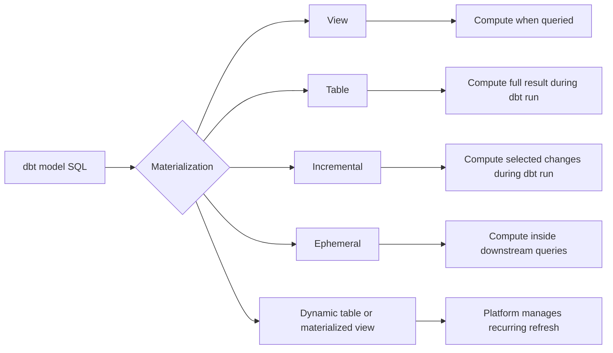
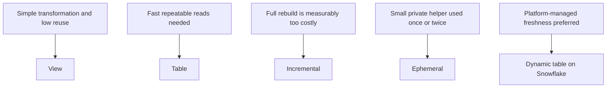

# Materializations

> A materialization determines how dbt represents and refreshes a model in the data platform, moving compute between build time, query time, downstream models, and platform-managed refresh.

## Executive Summary

- **What it is:** A materialization is the build strategy dbt applies to a model's SQL, such as creating a view, rebuilding a table, updating a table incrementally, inlining a CTE, or deploying a platform-managed object.
- **Why it matters:** The same transformation logic can have very different freshness, cost, query performance, recovery, and governance characteristics depending on its materialization.
- **Mental model:** **The model defines what the data should be; the materialization defines where the result lives, when it is computed, and who refreshes it.**
- **Best used when:** Every dbt model needs an explicit or inherited build strategy aligned with its transformation complexity, consumption pattern, freshness requirement, data volume, and operational controls.
- **Avoid or reconsider when:** A materialization is chosen by habit, copied across an entire layer without workload evidence, or adds more state and operational complexity than the use case needs.

## What It Can Do

- Persist model results as a `view`, `table`, or incrementally maintained table.
- Inline lightweight reusable logic into downstream models with `ephemeral`.
- Delegate recurring refresh to a supported platform-managed object.
- Move compute between dbt build time and consumer query time.
- Improve downstream latency by precomputing expensive, frequently reused transformations.
- Reduce build time by processing only new or changed data.
- Set materialization defaults by project path while allowing model-specific overrides.
- Support custom materializations when built-in strategies do not meet a controlled platform need.

## What It Cannot Do

- Make inefficient SQL efficient by itself.
- Guarantee freshness; tables and incremental models are only as current as their latest successful run.
- Guarantee incremental correctness for late, updated, deleted, or restated records.
- Remove the need for tests, reconciliation, monitoring, ownership, and recovery procedures.
- Make a platform-managed refresh free or guarantee that a freshness target will always be met.
- Make every database feature portable across adapters.
- Replace a deliberate modeling and layer design.
- Prevent consumers from depending on an internal model that should not be a public interface.

## Core Concepts

| Concept | Meaning | Why it matters |
|---|---|---|
| Materialization | Strategy used to build or represent a dbt model | Determines object type, refresh behavior, and where compute is paid |
| Model SQL | Declarative transformation that returns a dataset | Can often remain unchanged while the materialization changes |
| `view` | Database view recreated when dbt deploys the model | Defers transformation compute until a consumer queries it |
| `table` | Physical table fully rebuilt by dbt | Pays full build cost to provide predictable read performance |
| `incremental` | Physical table updated with a selected subset of source data | Reduces build work but introduces state and correctness responsibilities |
| `ephemeral` | No database object; dbt injects the model as a CTE into dependent models | Reuses lightweight private logic without adding a relation |
| `materialized_view` | Database-managed persisted view supported by some adapters | Delegates recurring refresh to the platform |
| `dynamic_table` | Snowflake-specific dbt materialization for a Snowflake Dynamic Table | Snowflake manages refresh toward a configured target lag |
| Build-time compute | Work performed by dbt when the model runs | Drives batch duration and transformation-warehouse cost |
| Query-time compute | Work performed when a consumer reads a view or inlined logic | Drives dashboard latency and repeated consumer cost |
| State | Previously built target data used by later runs | Makes incremental processing efficient but recovery-sensitive |
| Full refresh | Drop and rebuild an object from the complete model query | Restores consistency after some logic, schema, or historical changes |
| Adapter behavior | Platform-specific implementation and supported configuration | The same materialization name may not have identical behavior everywhere |

## How It Works (Simple Flow)

1. A developer writes a dbt model as a SQL query, usually using `ref()` or `source()` for dependencies.
2. The model inherits a materialization from project configuration or overrides it locally.
3. dbt compiles the model and resolves the dependency graph.
4. The adapter executes the platform-specific materialization logic.
5. dbt creates, replaces, updates, or inlines the model according to the selected strategy.
6. Tests and downstream models operate on the resulting relation or compiled CTE.
7. Scheduled dbt runs refresh tables and incremental models; views need dbt only when their definitions change.
8. Platform-managed objects such as Snowflake Dynamic Tables refresh independently after dbt deploys their definitions and configuration.

## Visuals



Materializations mainly move compute and refresh responsibility:



## Readable Snippets

### Configure a model directly

```sql
{{ config(materialized='table') }}

select
    customer_id,
    sum(amount) as lifetime_value
from {{ ref('stg_payments') }}
group by customer_id
```

The transformation answers **what** the dataset should contain. Changing only the config changes **how** dbt builds it.

### Configure a folder default

```yaml
models:
  banking_analytics:
    staging:
      +materialized: view
    marts:
      +materialized: table
```

Folder defaults create a useful baseline, but expensive or unusually large models should still be evaluated individually.

### Incremental model

```sql
{{ config(
    materialized='incremental',
    unique_key='payment_id',
    incremental_strategy='merge'
) }}

select *
from {{ ref('stg_payments') }}


where updated_at >= (
    select dateadd(day, -3, max(updated_at))
    from {{ this }}
)

```

The lookback can capture some late updates, but its length and the `unique_key` must match the source's real arrival and correction behavior.

### Snowflake Dynamic Table

```sql
{{ config(
    materialized='dynamic_table',
    target_lag='30 minutes',
    snowflake_warehouse='DBT_REFRESH_WH'
) }}

select
    account_id,
    sum(amount) as current_balance
from {{ ref('stg_account_transactions') }}
group by account_id
```

dbt deploys the definition and Snowflake manages recurring refresh. A target lag expresses a desired staleness bound, not a guaranteed refresh interval.

## Consultant Talking Points

- **Client question this answers:** "Should this dbt model be a view, table, incremental model, ephemeral helper, or Snowflake Dynamic Table?"
- **Trade-offs to mention:** Views favor simplicity and current upstream visibility; tables favor fast, predictable reads; incremental models favor efficient builds; ephemeral models favor a clean namespace; Dynamic Tables favor platform-managed freshness.
- **Risk or governance angle:** Important business logic should normally remain visible, testable, documented, and recoverable. Incremental state, failed refreshes, stale tables, full-refresh permissions, and consumer contracts need explicit controls.
- **Cost/performance angle:** Views and ephemeral models can repeat compute across consumers; tables can overpay for full rebuilds; incremental models reduce scanned data but add engineering overhead; Dynamic Tables shift refresh decisions and cost into Snowflake.

A useful client message is: **materialization does not remove compute; it decides when, where, how often, and under whose control that compute happens.**

### View

- Best for lightweight staging transformations, low-use models, and early development.
- Stores the query definition rather than the result rows.
- Reflects current upstream data when queried, but repeated complex queries may be slow and expensive.
- Deep view-on-view chains can make performance and debugging unpredictable.

### Table

- Best for frequently queried marts, reused expensive transformations, and outputs needing predictable read performance.
- Rebuilds the full result during a dbt run.
- Provides a clean reconstruction path but may create a large build window and unnecessary compute.
- Remains stale if the scheduled build is late or fails.

### Incremental

- Best for large event, transaction, or fact datasets when only a small portion changes per run.
- Reduces processing by filtering input and applying an adapter-supported update strategy.
- Introduces state: the result depends on current inputs and prior successful target contents.
- Requires explicit handling of unique keys, late arrivals, corrections, deletions, schema changes, backfills, and full refreshes.

### Ephemeral

- Best for lightweight private logic used by one or two downstream models.
- Produces no directly queryable relation; dbt injects it as a CTE into dependent models.
- Can reduce warehouse clutter but duplicate compute and produce large compiled queries.
- Does not support model contracts and is a weak choice for governed business interfaces.

### Materialized View and Snowflake Dynamic Table

- A generic `materialized_view` delegates recurring refresh to a supporting data platform.
- `dbt-snowflake` does not support the generic materialized-view materialization; it uses `dynamic_table`.
- Dynamic Tables suit declarative transformations where Snowflake should maintain a target lag.
- SQL and dependency restrictions, warehouse use, refresh failures, reinitialization, and full-refresh behavior must be assessed.
- A native Snowflake materialized view is primarily a query-acceleration object and is not the same dbt modeling choice as a Dynamic Table.

## Common Pitfalls

- Leaving every model as the default `view` and discovering that dashboards repeatedly execute long view chains.
- Making every mart a `table` without measuring whether full rebuild cost and duration are justified.
- Choosing `incremental` because a table sounds large, before proving that a full rebuild misses a cost or time objective.
- Treating `unique_key` as a tested database constraint rather than configuration used by an incremental strategy.
- Filtering incremental input too narrowly and silently missing late-arriving corrections or backdated transactions.
- Changing incremental logic without deciding whether historical rows require a full refresh or backfill.
- Hiding important reusable business logic in ephemeral models that cannot be queried, contracted, or inspected independently.
- Assuming a Dynamic Table's target lag is a guaranteed refresh schedule.
- Assuming Snowflake's native materialized views and dbt's generic `materialized_view` are interchangeable.
- Applying one materialization to an entire architectural layer without considering model-specific reuse, volume, freshness, and recovery requirements.
- Optimizing build duration while ignoring downstream query cost, or optimizing dashboard speed while ignoring transformation cost.
- Failing to monitor both the last successful dbt build and platform-managed refresh status.

## When to Recommend What (Decision Table)

| Situation | Recommend | Why | Watch-outs |
|---|---|---|---|
| Lightweight renaming, casting, or source cleanup | `view` | Simple, low storage duplication, and current upstream visibility | Avoid expensive view chains and repeated scans |
| Frequently queried dashboard or governed mart | `table` | Fast and predictable consumer reads | Full rebuild duration, staleness, storage, and failed jobs |
| Expensive intermediate reused by many downstream models | Usually `table` | Computes shared logic once per build | Confirm reuse justifies full persistence |
| Very large event or transaction fact with a small change set | `incremental` | Reduces build time and scanned data | Late data, corrections, deletes, keys, backfills, and reconciliation |
| Small private helper used by one or two models | `ephemeral` | Reuses logic without creating a warehouse object | Compiled-query size, duplicated compute, weak discoverability, no contracts |
| Snowflake should maintain a freshness target | Evaluate `dynamic_table` | Delegates recurring refresh and incremental maintenance | SQL limitations, refresh mode, target-lag behavior, warehouse cost, full refresh |
| Small table that rebuilds quickly | `table` rather than incremental | Simpler and easier to reason about | Reassess only when measured build cost becomes material |
| Important regulated output | Usually `table`, or controlled `incremental` when scale requires it | Visible, testable relation with defined publication and recovery | Evidence, reconciliation, freshness, change control, and reproducibility |
| Logic changes frequently during early development | Start with `view` or `table` | Keeps iteration and recovery straightforward | Do not optimize prematurely |

## Related Topics

- [[02 dbt/04 Incremental Processing and Performance/Incremental Processing and Performance Overview|Incremental Processing and Performance Overview]]
- [[02 dbt/04 Incremental Processing and Performance/31 Incremental Models and Unique Keys|Incremental Models and Unique Keys]]
- [[02 dbt/04 Incremental Processing and Performance/35 Snapshots vs Incremental Models vs Dynamic Tables|Snapshots vs Incremental Models vs Dynamic Tables]]
- [[01 Snowflake/04 Data Engineering/25 dbt on Snowflake|dbt on Snowflake]]

## Related Decision Notes

- [[80 Comparisons and Decision Notes/Decision Notes/dbt/Decisions - Choosing a dbt Materialization and Refresh Pattern|Decisions - Choosing a dbt Materialization and Refresh Pattern]]
- [[80 Comparisons and Decision Notes/Comparisons/Snowflake/Comparison - Materialized Views vs Dynamic Tables|Comparison - Materialized Views vs Dynamic Tables]]

## Questions

- Which models currently incur the most build compute and which incur the most consumer-query compute?
- What freshness, recovery time, and historical correction requirements apply to each important model?
- Can the client reliably identify new and changed rows, including late-arriving and deleted records?
- Which models are governed public interfaces and which are private implementation details?
- Would Snowflake-managed refresh simplify operations enough to justify Dynamic Table constraints and cost?

## Sources To Revisit

- [dbt Developer Hub - Materializations](https://docs.getdbt.com/docs/build/materializations)
- [dbt Developer Hub - Materializations best practices](https://docs.getdbt.com/best-practices/materializations/3-configuring-materializations)
- [dbt Developer Hub - Configure incremental models](https://docs.getdbt.com/docs/build/incremental-models)
- [dbt Developer Hub - Snowflake configurations](https://docs.getdbt.com/reference/resource-configs/snowflake-configs)
- [Snowflake Documentation - Dynamic Tables](https://docs.snowflake.com/en/user-guide/dynamic-tables-about)
