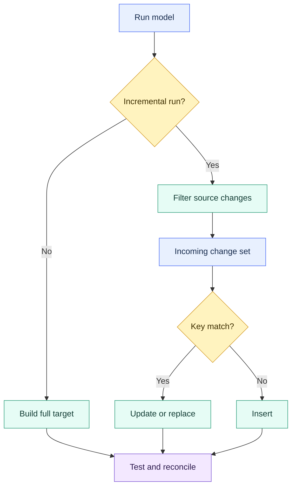
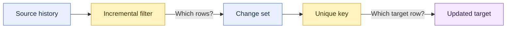

# Incremental Models and Unique Keys

> [!abstract] Mental model
> The filter chooses which rows to reconsider; the unique key tells dbt where those rows belong in the target.

## Executive Summary

- **What it is:** An incremental model is a persisted table that dbt builds fully on its first run and updates from a filtered subset of source data on later runs.
- **Why it matters:** Processing only new and changed rows can materially reduce build duration and Snowflake compute on large facts, events, transactions, and other frequently changing datasets.
- **Mental model:** **The incremental filter decides which source rows to reconsider; the `unique_key` decides which target row each incoming row belongs to.**
- **Best used when:** Full rebuild cost or duration is unacceptable, the change set is small relative to history, changes can be identified reliably, and the team can operate backfills and reconciliation.
- **Avoid or reconsider when:** Full rebuilds remain cheap, the source has no trustworthy change signal or row grain, late corrections are unpredictable, or stateful processing adds more risk than value.

## What It Can Do

- Build the complete result on the first run and process only a selected change set later.
- Insert new records and, with a compatible strategy and `unique_key`, update existing records.
- Reprocess an overlapping lookback window without intentionally appending duplicate business records.
- Reduce upstream scanning, transformation work, build duration, and compute cost.
- Support single-column and composite unique keys that represent the model grain.
- Rebuild all history with `--full-refresh` when logic, schema, or stored state requires it.
- Control top-level schema-change behavior with `on_schema_change`.
- Limit some target-table scanning with advanced adapter-specific configurations such as `incremental_predicates`.

## What It Cannot Do

- Discover the correct incremental filter, lookback window, or grain automatically.
- Enforce that a configured `unique_key` is actually unique or non-null.
- Process a changed record that the incremental filter did not select.
- Detect or propagate hard deletes automatically in every design.
- Guarantee that a timestamp is complete, correctly updated, or safe as a change signal.
- Backfill historical rows automatically after business logic or a newly added column changes.
- Preserve historical versions merely because the model is incremental.
- Replace data tests, control totals, reconciliation, observability, backfill procedures, or full-refresh testing.

## Core Concepts

| Concept | Meaning | Why it matters |
|---|---|---|
| Incremental model | Table updated from a selected subset instead of rebuilt fully each run | Reduces routine processing but introduces dependency on prior state |
| Initial build | First execution when the target does not exist | Runs the model without the incremental-only filter and builds all selected history |
| Incremental run | Later execution against an existing incremental table | Applies the incremental branch and combines incoming rows with the target |
| `is_incremental()` | Macro that is true when the target exists as a table, the model is incremental, and `--full-refresh` is absent | Allows one model to contain valid full-build and incremental logic |
| `{{ this }}` | Reference to the current model's target relation | Commonly used to derive a high-water mark from existing target data |
| Incremental filter | SQL condition selecting rows to process on an incremental run | Defines the completeness boundary for routine processing |
| Change signal | Timestamp, sequence, batch, CDC metadata, or other field identifying new or changed records | An unreliable signal silently produces stale target rows |
| High-water mark | Greatest previously processed timestamp or sequence | Simple starting point, but often needs overlap for ties and late data |
| Lookback window | Deliberate overlap with previously processed data | Recaptures some late or corrected records |
| Model grain | What one output row represents | Determines the correct unique key |
| `unique_key` | Column or column list used to match incoming and existing records | Enables update/replace behavior rather than blind append |
| Incremental strategy | Adapter-specific method such as `merge`, `append`, or `delete+insert` | Determines the exact behavior when rows match or do not match |
| Stateful processing | Result depends on existing target contents as well as current source data | Makes recovery and historical consistency operational concerns |
| Idempotence | Reprocessing the same input converges on the same target state | Essential for safe retries and overlapping lookback windows |
| Full refresh | Drop and rebuild the target from the model's full query | Repairs or reapplies logic when incremental updates are insufficient |

## How It Works (Simple Flow)

1. dbt compiles the model and evaluates whether `is_incremental()` is true.
2. On the first run or a full refresh, dbt executes the unfiltered model query and builds the complete target table.
3. On a later incremental run, the model applies its change filter, ideally as early as practical in the query.
4. dbt creates or derives the incoming change set.
5. The configured incremental strategy compares incoming rows with the existing target.
6. If a `unique_key` matches, a compatible strategy updates or replaces the target row; unmatched keys are inserted.
7. Tests and reconciliation check key integrity, completeness, and business totals.
8. Backfills or full refreshes repair history when changes fall outside the normal window or transformation logic changes.

## Visuals



The filter and key solve different problems:



## Readable Snippets

### Typical Snowflake merge pattern

```sql
{{ config(
    materialized='incremental',
    unique_key='transaction_id',
    incremental_strategy='merge'
) }}

select
    transaction_id,
    account_id,
    amount,
    status,
    updated_at
from {{ ref('stg_transactions') }}


where updated_at >= (
    select coalesce(
        dateadd(day, -3, max(updated_at)),
        '1900-01-01'::timestamp
    )
    from {{ this }}
)

```

The three-day lookback deliberately reconsiders recent records. `transaction_id` allows matching records to be updated instead of appended as duplicates.

### Why `created_at` can miss corrections

```sql
-- Risky for mutable records:
where created_at > (select max(created_at) from {{ this }})
```

A transaction created three months ago but corrected today retains its old `created_at`. Unless the source supplies a trustworthy `updated_at`, CDC marker, sequence, or batch identifier, the correction will not enter the incremental change set.

### Composite grain

For a daily account balance with one row per account per date:

```sql
{{ config(
    materialized='incremental',
    unique_key=['account_id', 'balance_date'],
    incremental_strategy='merge'
) }}
```

Use a list of columns rather than concatenating an expression. Each component should be non-null.

### Test the claimed grain

```yaml
models:
  - name: fct_transactions
    columns:
      - name: transaction_id
        data_tests:
          - unique
          - not_null
```

The configuration tells dbt how to match rows; the tests provide evidence that the key has the claimed properties.

### Full rebuild

```bash
dbt run --full-refresh --select fct_transactions
```

Add a trailing `+` only when downstream models should also be selected, and assess the resulting compute, run window, and publication impact before production use.

### Schema-change control

```sql
{{ config(
    materialized='incremental',
    unique_key='transaction_id',
    on_schema_change='fail'
) }}
```

`on_schema_change` can fail, ignore, append new columns, or synchronize top-level columns depending on configuration. It does not populate historical values for a new column.

## Consultant Talking Points

- **Client question this answers:** "How can we process a large changing dataset efficiently without silently missing or duplicating records?"
- **Trade-offs to mention:** Incremental processing reduces routine work but introduces state, source-change assumptions, lookback design, strategy behavior, and recovery procedures.
- **Risk or governance angle:** For material finance or regulated outputs, define the row grain, authoritative change signal, late-arrival tolerance, delete handling, reconciliation controls, backfill approval, and evidence retained after corrections.
- **Cost/performance angle:** Filter source data early, measure change-set and target scan sizes, and optimize only after proving that full rebuild cost or duration is material. A wide lookback improves capture but increases compute.

A useful client message is: **a correct `unique_key` cannot repair an incomplete incremental filter; it only matches rows that entered the change set.**

### Choosing the key

The `unique_key` must represent the output model's grain, not merely copy a convenient source identifier.

| Model grain | Possible `unique_key` |
|---|---|
| One row per transaction | `transaction_id` |
| One row per account per day | `['account_id', 'balance_date']` |
| One row per customer | `customer_id` |
| One row per currency per month | `['currency_code', 'month_start']` |

If joins or aggregations change the grain, reassess the key. A source primary key can become duplicated after a one-to-many join or irrelevant after aggregation.

### Current-state versus history

An incremental model does not inherently preserve versions. With merge-style update behavior, an old target row is normally replaced by the incoming version. Use explicit effective-dated logic, events, CDC history, snapshots, or another historical pattern when consumers need prior states.

### Finance correction example

A payment may move through:

```text
authorized -> posted -> reversed
```

A controlled design could use:

- `payment_id` as the unique key.
- A reliable source `updated_at` or CDC sequence as the change signal.
- A lookback window covering expected late corrections.
- Unique and non-null tests on `payment_id`.
- Reconciliation to source row counts and monetary control totals.
- A documented targeted-backfill and full-refresh procedure.

The key matches an incoming reversal to the existing payment. It does not make the reversal appear in the change set.

## Common Pitfalls

- Treating `unique_key` as an enforced database uniqueness constraint.
- Selecting a key that does not match the model's output grain.
- Allowing nulls in a single or composite key, causing rows not to match.
- Sending multiple incoming rows with the same key into a `merge`, which may fail or be ambiguous.
- Assuming that adding a key cleans duplicates already present in the target.
- Using `created_at` for mutable records and missing later updates.
- Using `>` at a high-water mark without considering timestamp ties or failed partial processing.
- Choosing a lookback shorter than the real late-arrival or correction period.
- Using an overlapping lookback without a matching strategy and key, causing repeated appends.
- Ignoring hard deletes because disappeared source rows never enter the change set.
- Changing business logic without backfilling historical target rows.
- Assuming `on_schema_change` populates new columns for historical records.
- Never testing full-refresh duration, permissions, downstream impact, or recovery steps.
- Optimizing the incoming source scan while allowing the merge to scan an unnecessarily large target.
- Accepting a successful run as proof of completeness without reconciliation.

## When to Recommend What (Decision Table)

| Situation | Recommend | Why | Watch-outs |
|---|---|---|---|
| Small or moderate table rebuilds within cost and time objectives | Keep a normal `table` materialization | Simpler, stateless, and easy to reproduce | Reassess when measured volume or duration becomes material |
| Large append-only event stream with immutable rows | Incremental append or another appropriate strategy | New records can be identified efficiently | Duplicate delivery, replay, and ordering still need controls |
| Large mutable dataset with reliable key and change timestamp | Incremental model with merge-style strategy | Processes inserts and updates without full rebuilds | Late records, null or duplicate keys, deletes, and target scan cost |
| Late changes have a known bounded delay | Incremental model with an overlapping lookback | Reprocesses the risk window | Measure compute and make the key-based update idempotent |
| Late changes are unpredictable or unbounded | Incremental plus reconciliation and scheduled replay, or reconsider full rebuild | A fixed lookback alone cannot guarantee completeness | Define detection, replay scope, ownership, and SLA |
| Source supplies reliable CDC | Incrementally process the CDC stream | Captures explicit inserts, updates, and possibly deletes | Ordering, duplicate CDC events, tombstones, and retention |
| No trustworthy change signal | Prefer full rebuild or first create a reliable ingestion/control pattern | Avoids silent missed changes | A guessed timestamp is not a control |
| Source overwrites current state and prior versions are required | Snapshot or explicit history pattern | Incremental current-state merge does not preserve old versions | Snapshot cadence may miss intermediate states |
| Regulated or finance output | Incremental only with tested grain, reconciliation, and controlled recovery | Scale may justify it, but correctness must remain demonstrable | Restatements, period reopening, approvals, evidence, and publication impact |

## Related Topics

- [[02 dbt/04 Incremental Processing and Performance/Incremental Processing and Performance Overview|Incremental Processing and Performance Overview]]
- [[02 dbt/04 Incremental Processing and Performance/30 Materializations|Materializations]]
- [[02 dbt/04 Incremental Processing and Performance/32 Incremental Strategies|Incremental Strategies]]
- [[02 dbt/04 Incremental Processing and Performance/39 Full Refreshes Backfills and Replay|Full Refreshes, Backfills, and Replay]]
- [[02 dbt/02 Modeling Patterns and Layering/19 Late-arriving Data Corrections and Restatements|Late-arriving Data, Corrections, and Restatements]]

## Related Decision Notes

- [[80 Comparisons and Decision Notes/Decision Notes/dbt/Decisions - Choosing a dbt Incremental Strategy on Snowflake|Decisions - Choosing a dbt Incremental Strategy on Snowflake]]
- [[80 Comparisons and Decision Notes/Comparisons/dbt/Comparison - Snapshots vs Incremental Models|Comparison - Snapshots vs Incremental Models]]
- [[80 Comparisons and Decision Notes/Decision Notes/dbt/Decisions - Choosing a Data History and Restatement Pattern|Decisions - Choosing a Data History and Restatement Pattern]]

## Questions

- What exactly does one row represent after every join and aggregation?
- Which column or metadata signal proves that a source record was inserted, updated, or deleted?
- How late can records and corrections arrive, and how is that bound evidenced?
- Can key columns be null or duplicated in either the incoming set or existing target?
- Must the model preserve old versions or only the latest accepted state?
- How will missed records be detected and which keys or periods can be replayed?
- When does a logic or schema change require a targeted backfill or full refresh?
- What downstream models and published reports must be rebuilt after a correction?

## Sources To Revisit

- [dbt Developer Hub - Configure incremental models](https://docs.getdbt.com/docs/build/incremental-models)
- [dbt Developer Hub - `unique_key`](https://docs.getdbt.com/reference/resource-configs/unique_key)
- [dbt Developer Hub - About incremental strategy](https://docs.getdbt.com/docs/build/incremental-strategy)
- [dbt Developer Hub - `is_incremental()`](https://docs.getdbt.com/docs/build/incremental-models#understand-the-is_incremental-macro)
- [dbt Developer Hub - `on_schema_change`](https://docs.getdbt.com/docs/build/incremental-models#what-if-the-columns-of-my-incremental-model-change)
