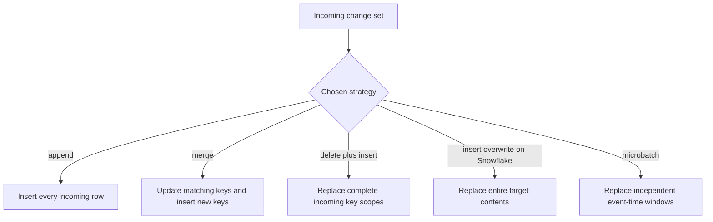
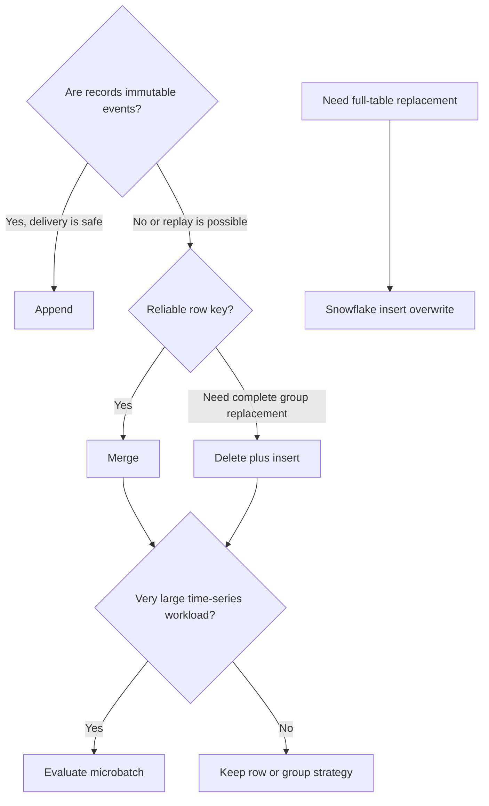

# Incremental Strategies

> An incremental strategy determines how dbt combines an incoming change set with an existing target table; on Snowflake the choice affects matching, replacement scope, scan cost, history, and recovery.

## Executive Summary

- **What it is:** The `incremental_strategy` configuration selects the adapter-specific SQL dbt uses to add, update, delete, or replace data in an incremental model.
- **Why it matters:** The same incoming rows produce different target contents under `append`, `merge`, `delete+insert`, `insert_overwrite`, and `microbatch`.
- **Mental model:** **The incremental filter decides which rows enter the batch; the `unique_key` decides which rows match; the strategy decides what dbt does with them.**
- **Best used when:** The team has defined the source change pattern, target grain, key reliability, delete behavior, replacement scope, recovery method, and performance objective.
- **Avoid or reconsider when:** A strategy is chosen from its name alone, adapter behavior has not been verified, or full rebuilds remain simpler and sufficiently efficient.

## What It Can Do

- Append selected records without examining existing rows.
- Insert new keyed records and update matching records with `merge`.
- Replace complete key groups with `delete+insert`.
- Overwrite an entire Snowflake target table without using normal row-level matching.
- Split large time-series workloads into independently replaceable microbatches.
- Limit updated columns in supported merge implementations.
- Reduce target-table matching scans with carefully designed incremental predicates.
- Support adapter-specific and, when justified, custom incremental strategies.

## What It Cannot Do

- Correct an incomplete incoming change set.
- Make a nullable, duplicated, or incorrectly grained key reliable.
- Preserve SCD Type 2 history automatically.
- Capture source history that was overwritten before dbt observed or received it.
- Make hard deletes visible unless the source or model represents them.
- Give `insert_overwrite` identical semantics across data platforms.
- Guarantee that a target-scan predicate cannot hide a legitimate match.
- Replace uniqueness tests, reconciliation, late-arrival controls, and replay procedures.

## Core Concepts

| Concept | Meaning | Why it matters |
|---|---|---|
| Incoming change set | Rows returned by the model during an incremental run | Every strategy operates only on the data it receives |
| Existing target | Previously built incremental table | Strategies differ in how they inspect and modify this state |
| `incremental_strategy` | Config selecting the adapter implementation | Strategy names are portable only where the adapter supports equivalent behavior |
| `append` | Insert all incoming rows without matching | Cheapest pattern but provides no duplicate or update protection |
| `merge` | Match on a key, update matches, and insert nonmatches | Default Snowflake strategy for current-state inserts and updates |
| `delete+insert` | Delete target rows for incoming key scopes, then insert the incoming rows | Replaces complete rows or groups and avoids nondeterministic merge matching |
| `insert_overwrite` | Overwrite operation whose scope is adapter-specific | On Snowflake it replaces the entire table, not selected partitions |
| `microbatch` | Process and replace bounded `event_time` windows as separate batches | Improves replay and resilience for large time-series workloads |
| `unique_key` | Key or key list used by strategies that match or replace records | Can identify one row or, deliberately, a complete replacement group |
| `merge_update_columns` | Columns a merge is allowed to update | Preserves other target values while applying selected changes |
| `merge_exclude_columns` | Columns a merge must not update | Useful for immutable creation metadata |
| `incremental_predicates` | Extra predicates limiting the existing target data considered | Can reduce scan cost but also restrict the correctness boundary |
| Immutable change event | Permanent row recording one occurrence; later changes create new rows | Supports efficient event-history ingestion without overwriting prior facts |
| Current-state row | One mutable row describing the latest accepted state of an entity | Normally maintained with merge-like Type 1 behavior |
| Replacement completeness | Incoming batch contains every row required for each replaced scope | Essential for `delete+insert`, microbatch, and overwrite patterns |

## How It Works (Simple Flow)

1. The model's incremental filter selects new, changed, replayed, or time-bounded source rows.
2. dbt stages or derives that incoming change set using Snowflake adapter behavior.
3. The configured strategy determines whether the target is appended to, matched, key-replaced, fully overwritten, or processed by time batch.
4. Strategies using a `unique_key` compare the incoming and existing key scopes.
5. dbt executes the generated Snowflake DML and leaves unrelated target rows intact unless the selected strategy intentionally replaces them.
6. Data tests validate key integrity and expected grain.
7. Reconciliation checks counts, amounts, status populations, and replaced-scope completeness.
8. Query history and run artifacts inform tuning, replay, or a strategy change.

## Visuals



The decision begins with source behavior and replacement grain:



## Readable Snippets

Assume the existing target contains:

| transaction_id | status | amount |
|---|---|---:|
| `T100` | pending | 500 |
| `T101` | completed | 200 |

The incoming change set contains:

| transaction_id | status | amount |
|---|---|---:|
| `T100` | completed | 500 |
| `T102` | pending | 300 |

### Append

```sql
{{ config(
    materialized='incremental',
    incremental_strategy='append'
) }}
```

Conceptually:

```sql
insert into target
select * from incoming_change_set
```

The target retains the old T100 and adds the new T100. This is correct only when each row is meant to be a distinct immutable event or version.

### Merge

```sql
{{ config(
    materialized='incremental',
    incremental_strategy='merge',
    unique_key='transaction_id'
) }}
```

Conceptually:

```sql
merge into target as old
using incoming_change_set as new
    on old.transaction_id = new.transaction_id
when matched then update
when not matched then insert
```

T100 becomes completed, T101 remains, and T102 is inserted. The old pending state is overwritten.

Limit updates to selected columns when appropriate:

```sql
{{ config(
    materialized='incremental',
    incremental_strategy='merge',
    unique_key='transaction_id',
    merge_update_columns=['status', 'amount', 'updated_at']
) }}
```

Or preserve immutable creation metadata:

```sql
merge_exclude_columns=['created_at']
```

### Delete and insert

```sql
{{ config(
    materialized='incremental',
    incremental_strategy='delete+insert',
    unique_key='business_date',
    tmp_relation_type='table'
) }}
```

Conceptually:

```sql
delete from target
where business_date in (
    select business_date from incoming_change_set
);

insert into target
select * from incoming_change_set;
```

This can replace all rows for an affected business date. The incoming change set must contain the complete recalculated date; a partial date would delete good rows and reinsert only the partial subset.

On Snowflake, `delete+insert` with a `unique_key` requires a temporary table rather than the adapter's default temporary view.

### Snowflake insert overwrite

```sql
{{ config(
    materialized='incremental',
    incremental_strategy='insert_overwrite',
    overwrite_columns=['transaction_id', 'status', 'amount']
) }}
```

On Snowflake, this replaces the entire table contents. It does not overwrite only affected date partitions. The model query must return the complete desired target.

### Microbatch

```sql
{{ config(
    materialized='incremental',
    incremental_strategy='microbatch',
    event_time='event_timestamp',
    begin='2025-01-01',
    batch_size='day',
    lookback=3,
    full_refresh=false
) }}

select *
from {{ ref('stg_transaction_events') }}
```

dbt divides the time range into separate queries and replaces each bounded batch. On Snowflake, dbt currently uses `delete+insert` to implement microbatch replacement.

### Source filter versus target predicate

Filter incoming source work in the model:

```sql

where updated_at >= dateadd(day, -3, current_date)

```

Optionally limit the existing target scan:

```sql
{{ config(
    materialized='incremental',
    incremental_strategy='merge',
    unique_key='transaction_id',
    incremental_predicates=[
        "DBT_INTERNAL_DEST.transaction_date >= dateadd(day, -7, current_date)"
    ]
) }}
```

The source filter decides which rows arrive. The target predicate decides where dbt searches for matches. If an old transaction arrives for correction but its target row falls outside the seven-day target predicate, dbt may not find the match and may insert a duplicate.

## Consultant Talking Points

- **Client question this answers:** "When dbt finds new or changed rows, should it append, update, replace a key group, replace the whole table, or process time windows?"
- **Trade-offs to mention:** Simpler strategies make stronger delivery assumptions; matching and replacement strategies improve correction handling but scan or rewrite more data and require reliable scope definitions.
- **Risk or governance angle:** Document whether rows are immutable events, mutable current state, complete replacement groups, or published versions. Define duplicate, delete, late-arrival, replay, and failure behavior before selecting the strategy.
- **Cost/performance angle:** `append` avoids target matching; `merge` may scan a large target; `delete+insert` rewrites key scopes; Snowflake `insert_overwrite` rewrites the complete table; microbatch trades multiple bounded queries for manageable replay and possible parallelism.

A useful client message is: **the fastest strategy is unsafe when its assumptions about immutability, key uniqueness, or replacement completeness are false.**

### Strategy comparison on Snowflake

| Strategy | Updates matches | Removes existing rows | Typical key use | Best fit | Main risk |
|---|---:|---:|---|---|---|
| `append` | No | No | Not used for matching | Immutable, safely delivered events | Duplicates and missed corrections |
| `merge` | Yes | No, when absent from input | Unique row grain | Current-state inserts and updates | Nondeterministic matches and target scan cost |
| `delete+insert` | Replaces | Yes, for incoming key scopes | Row or complete group scope | Complete period/key replacement | Partial incoming scope causes data loss |
| `insert_overwrite` | Replaces all | Yes, entire table | Not required | Intentional full-table replacement | Mistaken partition assumption destroys retained history |
| `microbatch` | Replaces batches | Yes, within processed time windows | `event_time` batch boundary | Large time-series processing and replay | Wrong time semantics or unfiltered parents |

### History, SCD2, and immutable change events

No built-in incremental strategy is inherently SCD Type 2.

- `merge` on an entity key normally behaves like SCD Type 1: it overwrites the current row.
- `append` looks history-like because it adds rows, but it does not manage `valid_from`, `valid_to`, current-row flags, change detection, or deduplication.
- `delete+insert` replaces rows or groups; it does not create versions.
- dbt snapshots are the purpose-built SCD2-like feature when a current-state source overwrites prior values.

An immutable change event is a permanent record that one occurrence happened. Later changes create new events rather than modifying old ones:

| event_id | transaction_id | event_type | event_time |
|---|---|---|---|
| `E001` | `T100` | created | 09:00 |
| `E002` | `T100` | pending | 09:05 |
| `E003` | `T100` | completed | 10:30 |
| `E004` | `T100` | reversed | 11:15 |

A robust history-ingestion model can use `merge` with `event_id` as the key. This permits a lookback and safe redelivery while preserving multiple T100 events because the grain is one row per event, not one row per transaction.

```sql
{{ config(
    materialized='incremental',
    incremental_strategy='merge',
    unique_key='event_id'
) }}
```

Derive validity intervals downstream when needed:

```sql
select
    transaction_id,
    event_type as status,
    event_time as valid_from,
    lead(event_time) over (
        partition by transaction_id
        order by event_time, event_id
    ) as valid_to
from {{ ref('int_transaction_status_events') }}
```

If the source only exposes the current T100 row and overwrites pending with completed, no incremental strategy can recover the disappeared pending state. Use CDC, a source audit/event table, or a dbt snapshot. A snapshot records states dbt observes and may miss intermediate changes between runs.

For incremental ingestion, distinguish:

- **Event time:** when the business event happened.
- **Load time or CDC sequence:** when the warehouse received or ordered the change.

Late events can have old event times. A trustworthy load timestamp or CDC offset is often safer for discovering new arrivals, while event time remains essential for business ordering and time-bounded modeling.

## Common Pitfalls

- Using `append` for mutable records and assuming a `unique_key` will deduplicate them.
- Using `merge` with duplicated or null incoming keys and receiving nondeterministic results or failures.
- Assuming merge removes target records that disappeared from the source.
- Selecting `delete+insert` without proving that every incoming replacement scope is complete.
- Treating a group key such as `business_date` as a row-unique key without documenting its replacement semantics.
- Using Snowflake `insert_overwrite` while believing only recent partitions will be replaced.
- Combining a narrow incremental filter with Snowflake `insert_overwrite` and replacing full history with only recent rows.
- Restricting the target scan with `incremental_predicates` and hiding legitimate old matches.
- Preserving event history with `transaction_id` as the merge key, thereby overwriting prior events.
- Calling append-only rows SCD2 without validity intervals, change detection, deduplication, and a current-row rule.
- Filtering event ingestion only on `event_time` and missing late-arriving events.
- Using microbatch without `event_time` on large direct parents, causing a full parent scan for each batch.
- Choosing a custom strategy before proving that built-in patterns and clearer modeling cannot meet the requirement.
- Comparing strategy cost without measuring source scans, target scans, rewritten data, warehouse size, and retry behavior.

## When to Recommend What (Decision Table)

| Situation | Recommend | Why | Watch-outs |
|---|---|---|---|
| Immutable, append-only events with safe delivery | `append` | Lowest matching overhead | Redelivery, duplicates, correction semantics, and hard deletes |
| Immutable events can be replayed or delivered late | `merge` on stable `event_id` | Keeps event history while making retries idempotent | Event ID must remain unique and stable |
| Mutable current-state rows with reliable unique key | `merge` | Updates matches and inserts new entities | Source change filter, nulls, duplicates, deletes, target scans |
| Complete business dates or key groups are recalculated | `delete+insert` on the replacement scope | Predictably replaces all rows in each affected scope | Prove completeness before deletion and use required Snowflake temp relation |
| Snowflake target must be replaced completely without a drop/create workflow | `insert_overwrite` | Intentionally replaces all contents | It is not partition overwrite; model query must be complete |
| Very large time-series data with replayable time windows | `microbatch` | Independent batches support targeted backfill, retry, and potential parallelism | Reliable UTC `event_time`, parent filtering, batch size, lookback, and full-refresh policy |
| Current-state source overwrites values but history is required | dbt snapshot or CDC, not an incremental strategy alone | Creates or consumes versions rather than overwriting history | Snapshot observation cadence and CDC ordering/retention |
| Source already provides SCD2 or event versions | Incrementally load using the version/event key | Preserves supplied history efficiently | Validate overlaps, gaps, version ordering, and late arrivals |
| Large merge target has a provably bounded match window | Consider `incremental_predicates` | Reduces target scanning | Exceptions outside the window can become duplicates |
| Full rebuild remains cheap and predictable | Use `table` instead of incremental complexity | Easier reproducibility and recovery | Reassess when measured cost or duration becomes material |

## Related Topics

- [[02 dbt/04 Incremental Processing and Performance/Incremental Processing and Performance Overview|Incremental Processing and Performance Overview]]
- [[02 dbt/04 Incremental Processing and Performance/31 Incremental Models and Unique Keys|Incremental Models and Unique Keys]]
- [[02 dbt/04 Incremental Processing and Performance/33 Microbatch Incremental Models|Microbatch Incremental Models]]
- [[02 dbt/04 Incremental Processing and Performance/34 Parallel Microbatch Execution|Parallel Microbatch Execution]]
- [[02 dbt/04 Incremental Processing and Performance/39 Full Refreshes Backfills and Replay|Full Refreshes, Backfills, and Replay]]

## Related Decision Notes

- [[80 Comparisons and Decision Notes/Decision Notes/dbt/Decisions - Choosing a dbt Incremental Strategy on Snowflake|Decisions - Choosing a dbt Incremental Strategy on Snowflake]]
- [[80 Comparisons and Decision Notes/Comparisons/dbt/Comparison - Snapshots vs Incremental Models|Comparison - Snapshots vs Incremental Models]]
- [[80 Comparisons and Decision Notes/Decision Notes/dbt/Decisions - Choosing a Data History and Restatement Pattern|Decisions - Choosing a Data History and Restatement Pattern]]

## Questions

- Are incoming rows immutable events, mutable current state, CDC changes, or complete period replacements?
- Is the source delivery exactly once, at least once, replayable, or subject to late arrival?
- Does the key identify one target row, one immutable event, or a complete replacement group?
- Must missing source records delete target records, and how are deletions represented?
- Is prior state required, and does the source already preserve every version?
- Can each `delete+insert` or microbatch scope be proven complete before replacement?
- How much source and target data does each candidate strategy scan or rewrite?
- What happens if a run fails after some batches or replacement scopes complete?

## Sources To Revisit

- [dbt Developer Hub - About incremental strategy](https://docs.getdbt.com/docs/build/incremental-strategy)
- [dbt Developer Hub - Configure incremental models](https://docs.getdbt.com/docs/build/incremental-models)
- [dbt Developer Hub - Snowflake configurations](https://docs.getdbt.com/reference/resource-configs/snowflake-configs)
- [dbt Developer Hub - Microbatch incremental models](https://docs.getdbt.com/docs/build/incremental-microbatch)
- [dbt Developer Hub - Snapshots](https://docs.getdbt.com/docs/build/snapshots)
- [Snowflake Documentation - MERGE](https://docs.snowflake.com/en/sql-reference/sql/merge)
