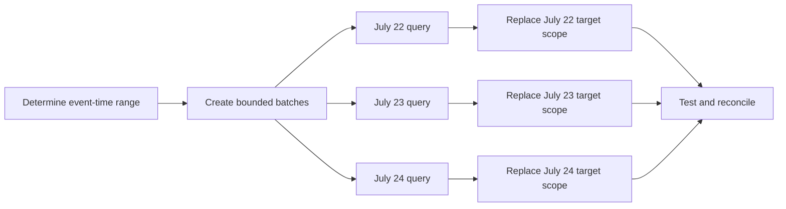
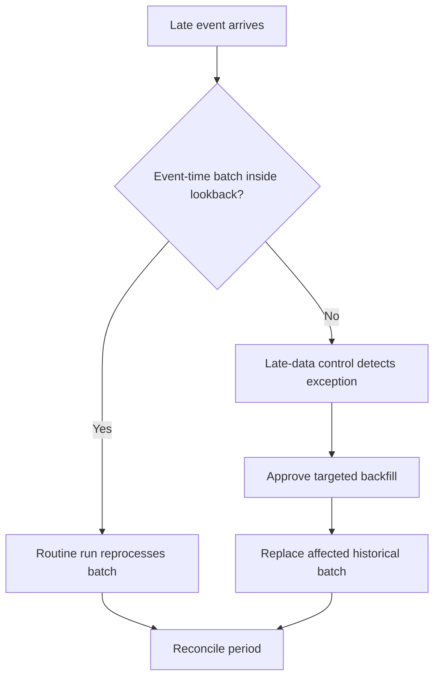

# Microbatch Incremental Models

> Microbatch divides a large time-series model into bounded, independently replaceable event-time windows so dbt can run, retry, backfill, and potentially parallelize them separately.

## Executive Summary

- **What it is:** `microbatch` is an incremental strategy that uses a configured `event_time` and `batch_size` to generate one query per bounded time window.
- **Why it matters:** Large time-series models become easier to operate when failures, late data, and historical corrections can be handled as explicit batches instead of one large query or custom high-water-mark logic.
- **Mental model:** **A traditional incremental model processes one change set; microbatch turns the timeline into independently replaceable processing units.**
- **Best used when:** Data is large, naturally time-oriented, has a trustworthy event time, and can be reconstructed completely within bounded windows.
- **Avoid or reconsider when:** The table is small, changes are not time-oriented, parent scans repeat excessive work, or every batch depends heavily on earlier periods.

## What It Can Do

- Split initial builds, routine runs, and backfills into hourly, daily, monthly, or yearly queries.
- Automatically time-filter direct `ref()` and `source()` parents that declare `event_time`.
- Reprocess a configurable number of previous batches to capture bounded late arrivals.
- Replace each batch idempotently so rerunning the same window converges on the same target contents.
- Retry failed batches without rerunning all successful batches.
- Backfill explicit historical ranges with event-time start and end parameters.
- Run eligible independent batches concurrently.
- Reduce the need for hand-written `is_incremental()` and high-water-mark logic.

## What It Cannot Do

- Choose the correct business timestamp, batch size, lookback, or starting date.
- Capture late events outside the configured lookback without detection and targeted replay.
- Make an incomplete source window safe to replace.
- Automatically filter large parents that lack `event_time`.
- Make current-state dimension joins historically correct during backfills.
- Guarantee that cumulative, sessionized, or other cross-batch calculations are independent.
- Preserve SCD Type 2 history merely because time windows are processed.
- Eliminate warehouse cost; multiple bounded queries can repeat scans and increase concurrency.
- Recover source history that is no longer available.

## Core Concepts

| Concept | Meaning | Why it matters |
|---|---|---|
| Microbatch | Incremental strategy that executes one query per bounded event-time window | Makes time ranges independent units of processing and recovery |
| `event_time` | Column defining when a row belongs in the timeline | Determines filtering, replacement scope, backfill meaning, and late-arrival behavior |
| `begin` | Configured start of history for initial and relevant rebuild processing | An unnecessarily early date can create thousands of batches |
| `batch_size` | Window granularity: `hour`, `day`, `month`, or `year` | Balances query size, count, retry scope, and business boundaries |
| Half-open interval | Batch includes its lower boundary and excludes its upper boundary | Prevents a boundary record from belonging to two batches |
| `lookback` | Number of prior batches reprocessed during a routine run | Captures bounded late data at additional compute cost |
| Batch replacement | Existing target scope for a batch is replaced with the batch query result | Requires the source query to return the complete desired window |
| Idempotent batch | Reprocessing the same inputs produces the same target contents | Enables safe retry and targeted replay |
| Parent auto-filtering | dbt injects batch predicates into direct parents with `event_time` configured | Avoids repeatedly scanning complete time-series parents |
| Unfiltered parent | Parent without an `event_time` configuration | May be appropriate for a small dimension but is scanned for every batch |
| Targeted backfill | Explicit event-time range selected for historical reprocessing | Replays corrections without rebuilding unrelated history |
| Partial retry | Reprocessing only failed batches | Improves recovery for long multi-batch runs |
| `concurrent_batches` | Override controlling whether eligible batches run concurrently | Changes wall time, concurrency, dependency behavior, and Snowflake cost |
| Cross-batch dependency | A batch calculation depends on data or state from another window | Can break independence and parallel execution |

## How It Works (Simple Flow)

1. Configure the model with `incremental_strategy='microbatch'`, `event_time`, `begin`, and `batch_size`.
2. Declare `event_time` on direct upstream models or sources that should be filtered.
3. dbt determines which windows are required for the initial build, routine lookback, retry, or requested backfill.
4. dbt compiles one model query per batch and injects the matching time predicates into eligible parents.
5. Each query returns the complete desired output for one bounded window.
6. The adapter replaces that target batch; on Snowflake, dbt currently uses `delete+insert`.
7. Successful batches remain complete while failed batches can be retried independently.
8. Tests and reconciliation validate each period, and targeted backfills repair late or corrected history.

## Visuals



Late arrivals either fall inside the routine lookback or require explicit replay:



## Readable Snippets

### Configure the time-series parent

```yaml
models:
  - name: stg_trade_events
    config:
      event_time: trade_timestamp
```

### Define the microbatch model

```sql
{{ config(
    materialized='incremental',
    incremental_strategy='microbatch',
    event_time='trade_timestamp',
    begin='2025-01-01',
    batch_size='day',
    lookback=2,
    full_refresh=false
) }}

select
    trade_id,
    account_id,
    instrument_id,
    trade_timestamp,
    quantity,
    price
from {{ ref('stg_trade_events') }}
```

The model does not need a hand-written `is_incremental()` condition. dbt injects the appropriate filter into parents that declare `event_time`.

Conceptually, the July 24 parent input becomes:

```sql
select *
from stg_trade_events
where trade_timestamp >= '2026-07-24 00:00:00'
  and trade_timestamp <  '2026-07-25 00:00:00'
```

The half-open interval assigns midnight exactly once.

### Routine lookback

With:

```sql
batch_size='day',
lookback=2
```

a July 24 run processes the current batch plus two previous batches:

```text
July 22
July 23
July 24
```

Every batch is replaced from its complete query result. A longer lookback captures more bounded late arrivals but reprocesses more data on every run.

### Targeted backfill

```bash
dbt run \
  --select fct_trade_events \
  --event-time-start "2026-07-20" \
  --event-time-end "2026-07-21"
```

Specify both event-time boundaries. dbt divides the requested range according to `batch_size` and processes the batches independently.

### Retry failed batches

```bash
dbt retry
```

Successful batches do not need to be rebuilt merely because another batch failed.

### Parent filtering behavior

```sql
select
    trades.trade_id,
    trades.trade_timestamp,
    accounts.segment
from {{ ref('stg_trade_events') }} as trades
left join {{ ref('dim_accounts') }} as accounts
    on trades.account_id = accounts.account_id
```

If `stg_trade_events` declares `event_time`, it is time-filtered for each batch. If `dim_accounts` does not, dbt scans it for every batch. This may be deliberate for a small current-state dimension, but historical backfills then use the dimension values available at backfill time unless the join is explicitly point-in-time aware.

## Consultant Talking Points

- **Client question this answers:** "How can we process and replay a very large time-series model without running one enormous incremental query?"
- **Trade-offs to mention:** Smaller batches improve failure isolation and replay precision but create more queries, more replacement operations, and potentially repeated parent scans.
- **Risk or governance angle:** Define the authoritative time semantics, UTC conversion, late-arrival policy, batch-completeness control, backfill approval, closed-period handling, and downstream republication requirements.
- **Cost/performance angle:** Measure bytes scanned per parent per batch, number of batches, warehouse startup and concurrency, replacement cost, lookback overlap, and whether parallel execution reduces wall time without unacceptable credit use.

A useful client message is: **microbatch makes time windows easier to operate; it does not make the chosen time semantics or batch contents correct.**

### Microbatch versus traditional incremental

| Dimension | Traditional incremental | Microbatch |
|---|---|---|
| Definition of new data | Custom `is_incremental()` SQL | Configured `event_time` windows |
| Queries per run | Usually one | One per selected batch |
| Replacement scope | Rows or key groups | Complete time windows |
| Late-arrival handling | Custom lookback filter | `lookback` number of batches |
| Backfill | Custom variables or filters | Event-time start and end |
| Failure recovery | Usually rerun the model | Retry failed batches |
| Parallelism | Model is one execution unit | Independent batches may run concurrently |
| Best fit | General inserts and updates | Large, reconstructable time-series windows |

### Snowflake behavior

On Snowflake, dbt currently uses `delete+insert` for each microbatch. A row-level `unique_key` is not required for this adapter behavior because the event-time batch is the replacement scope.

This implies:

- The query must return all rows that should exist in the processed batch.
- Rows missing from the replacement result are removed from that target batch.
- Source availability and batch-completeness controls matter as much as query performance.
- A partially loaded source window can replace a previously complete target window with incomplete data.

### Event time, load time, and late arrivals

For a trade, possible timestamps include:

| Timestamp | Meaning | Microbatch implication |
|---|---|---|
| `trade_timestamp` | When the trade occurred | Batches align with trading activity and business-date reconciliation |
| `booking_timestamp` | When the trade entered the booking system | Batches align with operational booking |
| `loaded_at` | When Snowflake received the row | Batches align with arrival, not necessarily the trading period |
| `settlement_timestamp` | When settlement should or did occur | Useful only when settlement is the intended processing grain |

A trade occurring July 20 but arriving July 24 belongs to July 20 when batching by `trade_timestamp`. If the routine run processes only July 22-24, the trade needs detection and a July 20 backfill.

Microbatch currently assumes supplied `event_time`, `begin`, and command boundary values are UTC. Business-day cutoffs and daylight-saving rules must be normalized explicitly.

### Batch independence

Good candidates return a complete result using data within one time window. Be cautious with:

- Running and cumulative balances.
- Sessions that cross midnight.
- Window functions needing earlier periods.
- Corrections that propagate into later calculated periods.
- Current-state dimensions used in historical backfills.
- Models that read or depend on prior target state.

For a running balance, consider microbatching immutable movements and calculating balances in a controlled downstream model rather than pretending each balance batch is independent.

## Common Pitfalls

- Choosing `event_time` because it is available rather than because it matches the business and recovery requirement.
- Setting `begin` years earlier than needed and unexpectedly generating thousands of first-run queries.
- Choosing an hourly batch for modest data and paying excessive query and DML overhead.
- Choosing a batch larger than the operational window and losing useful failure isolation.
- Assuming `lookback` guarantees completeness for events arriving outside the window.
- Failing to detect and backfill late events beyond the normal lookback.
- Omitting `event_time` on a large direct parent, causing a full parent scan for every batch.
- Joining current-state dimensions during historical replay and silently restating old periods with current attributes.
- Returning partial source data for a batch that Snowflake then completely replaces.
- Adding manual `is_incremental()` filters that conflict with dbt's automatic batch filtering.
- Treating business-local midnight as UTC midnight without explicit conversion.
- Running cumulative or cross-period logic as if batches were independent.
- Enabling parallel batches without testing warehouse concurrency, credit consumption, and dependency safety.
- Using global `--full-refresh` casually instead of controlled targeted backfills.
- Reprocessing closed finance periods without approval, reconciliation, and downstream communication.

## When to Recommend What (Decision Table)

| Situation | Recommend | Why | Watch-outs |
|---|---|---|---|
| Very large immutable trade or event history | Microbatch by reliable business event time | Bounded processing, replay, retry, and possible parallelism | Late arrivals, business-time boundaries, and complete source retention |
| Intraday feed with strict recovery windows | Hourly microbatch | Isolates failure and replay to smaller periods | Query count, cross-hour events, and warehouse concurrency |
| Daily prices, positions, or risk snapshots | Daily microbatch when each day is reconstructable | Natural operational and reconciliation grain | Corrections to closed dates and current-dimension joins |
| Accounting-period transformation with complete period inputs | Monthly microbatch | Aligns replay with governed period scope | Large batches and period-reopening controls |
| Late arrivals have a measured bounded delay | Set lookback from observed lateness | Routinely reprocesses likely affected batches | Monitor exceptions beyond the bound |
| Late arrivals are unbounded | Pair microbatch with detection and targeted backfill | Fixed lookback alone is insufficient | Ownership, SLA, approval, and downstream replay |
| Large time-series parent plus small current dimension | Filter event parent and allow dimension full scan deliberately | Keeps model simple when dimension scan is immaterial | Historical restatement and repeated scan cost |
| Large parents cannot be time-filtered | Reconsider microbatch or redesign parents | Each batch may repeat a full scan | Test compiled SQL and query history before rollout |
| Calculation depends on previous periods | Prefer sequential controlled processing or another design | Batch independence is weak | Downstream propagation and replay scope |
| Straightforward keyed merge already meets objectives | Keep normal incremental merge | Lower operational complexity | Reassess only when replay, failure isolation, or scale becomes material |

## Related Topics

- [[02 dbt/04 Incremental Processing and Performance/Incremental Processing and Performance Overview|Incremental Processing and Performance Overview]]
- [[02 dbt/04 Incremental Processing and Performance/31 Incremental Models and Unique Keys|Incremental Models and Unique Keys]]
- [[02 dbt/04 Incremental Processing and Performance/32 Incremental Strategies|Incremental Strategies]]
- [[02 dbt/04 Incremental Processing and Performance/34 Parallel Microbatch Execution|Parallel Microbatch Execution]]
- [[02 dbt/04 Incremental Processing and Performance/39 Full Refreshes Backfills and Replay|Full Refreshes, Backfills, and Replay]]

## Related Decision Notes

- [[80 Comparisons and Decision Notes/Decision Notes/dbt/Decisions - Choosing a Data History and Restatement Pattern|Decisions - Choosing a Data History and Restatement Pattern]]

## Questions

- Which timestamp defines the business period, and which timestamp proves warehouse arrival?
- Can the source reproduce every row for an old batch when it is replaced?
- How late do records arrive in practice, and how will exceptions beyond the lookback be detected?
- Which direct parents will dbt filter and which will be scanned in full per batch?
- Do calculations depend on previous batches or current-state dimensions?
- What batch size balances query overhead, failure isolation, and warehouse performance?
- Who approves backfills into closed, published, or regulated periods?
- Which downstream models and reports must replay after a historical correction?

## Sources To Revisit

- [dbt Developer Hub - Microbatch incremental models](https://docs.getdbt.com/docs/build/incremental-microbatch)
- [dbt Developer Hub - Parallel microbatch execution](https://docs.getdbt.com/docs/build/parallel-batch-execution)
- [dbt Developer Hub - About incremental strategy](https://docs.getdbt.com/docs/build/incremental-strategy)
- [dbt Developer Hub - `event_time`](https://docs.getdbt.com/reference/resource-configs/event-time)
- [dbt Developer Hub - `lookback`](https://docs.getdbt.com/reference/resource-configs/lookback)
