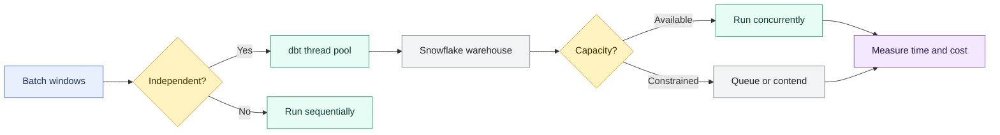
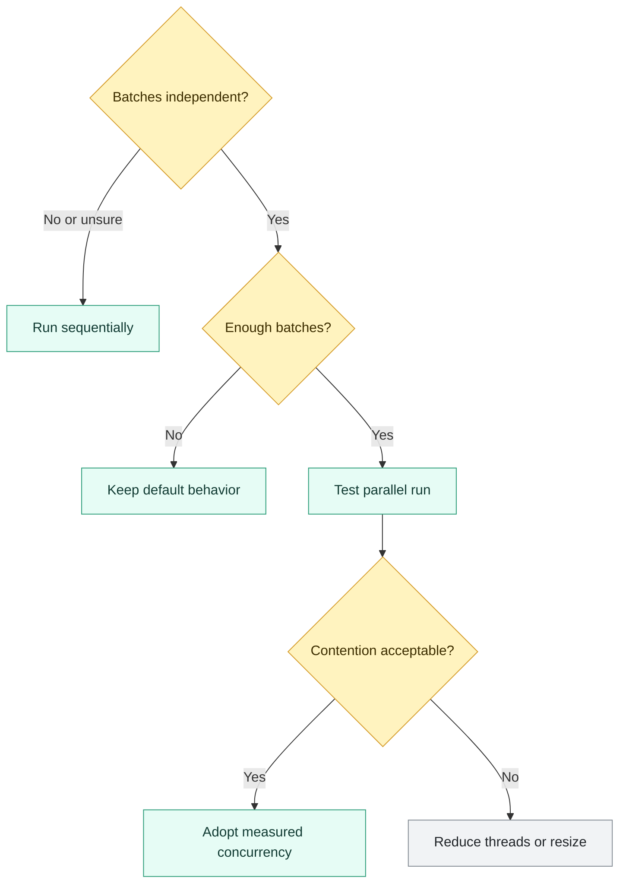

# Parallel Microbatch Execution

> [!abstract] Mental model
> Parallel microbatch runs independent time windows together—but only correctness and capacity turn concurrency into speed.

## Executive Summary

- **What it is:** An execution mode in which dbt processes eligible microbatch windows at the same time instead of strictly one after another.
- **Why it matters:** Long initial builds and historical backfills can finish faster when independent batches use available dbt threads and Snowflake capacity concurrently.
- **Mental model:** **Microbatch defines the units of work; parallel execution changes how many of those units run at once.**
- **Best used when:** Batches are order-independent, a run contains enough eligible windows, and Snowflake can execute the submitted concurrency without harmful queueing or contention.
- **Avoid or reconsider when:** Calculations depend on prior batches, the run has few eligible windows, or increased concurrency degrades performance, cost, or other workloads.

## What It Can Do

- Run eligible middle batches concurrently on supported adapters such as Snowflake.
- Reduce wall-clock time for large microbatch builds and backfills.
- Use dbt's normal thread pool to control the maximum submitted task concurrency.
- Auto-detect likely batch independence in most models.
- Allow an explicit `concurrent_batches` override when the team has stronger knowledge than the heuristic.
- Preserve batch-level retry and failure isolation.
- Improve utilization of warehouse capacity that would otherwise remain idle.
- Support deliberate sequential execution when batch ordering is part of correctness.

## What It Cannot Do

- Make order-dependent calculations safe to parallelize.
- Parallelize more tasks than the available dbt threads allow.
- Guarantee that Snowflake will execute every submitted query immediately.
- Prevent concurrent queries from sharing resources, slowing down, spilling, or queueing.
- Guarantee lower credit consumption merely because wall-clock time falls.
- Prove independence simply because the model does not reference `{{ this }}`.
- Parallelize the first or last microbatch under current dbt eligibility rules.
- Replace measurement of queue time, execution time, spill, cluster use, and credits.

## Core Concepts

| Concept | Meaning | Why it matters |
|---|---|---|
| Parallel execution | Multiple batch queries run at the same time | Can shorten total duration when batches and compute capacity are independent |
| Sequential execution | One batch completes before the next begins | Preserves required order and limits concurrent resource demand |
| Batch independence | A batch result does not depend on another batch's execution or completion order | Core correctness requirement for concurrency |
| Auto-detection | dbt decides whether eligible batches should run concurrently | Avoids manual configuration for typical independent models |
| `{{ this }}` heuristic | Reference to the model's existing target causes dbt to select sequential execution by default | Often signals cumulative or prior-state logic |
| `concurrent_batches` | Override setting `true` for parallel or `false` for sequential behavior | Should reflect proven model semantics, not a desire for speed alone |
| Eligibility | Current adapter and batch-position requirements for parallel execution | Snowflake and BigQuery are supported; first and last batches are excluded |
| dbt thread | Worker slot available to execute a model or batch task | Limits how many batch queries dbt can submit concurrently |
| Warehouse concurrency | Snowflake's ability to execute simultaneous queries | Submitted dbt concurrency may execute, share resources, or queue |
| Scale up | Increase warehouse size for more compute per cluster/query | Best suited to slow individual batch queries |
| Scale out | Add clusters through a multi-cluster warehouse | Best suited to many concurrent queries and queueing |
| Wall-clock time | Elapsed time from start to completion | Main performance objective of parallel execution |
| Query queueing | Submitted queries wait for warehouse capacity | Indicates dbt concurrency exceeds available execution capacity |
| Workload isolation | Dedicated or separate warehouse for a workload | Protects BI and other pipelines and clarifies cost attribution |

## How It Works (Simple Flow)

1. dbt determines the microbatch windows required for a routine run, retry, initial build, or backfill.
2. It checks adapter and batch-position eligibility; current behavior excludes the first and last batches.
3. Unless overridden, dbt inspects the model for `{{ this }}` as a signal of cross-batch dependency.
4. Eligible independent batches enter the dbt task queue.
5. Available dbt threads submit batch queries concurrently.
6. Snowflake executes them immediately, shares warehouse resources, or queues excess work according to capacity.
7. Successful batches remain available while failed batches retain their batch-level recovery path.
8. Query history, warehouse load, run duration, reconciliation, and credits determine whether concurrency should be increased, reduced, or disabled.

## Visuals



Correctness determines whether parallelism is allowed:



## Readable Snippets

### Allow dbt to auto-detect

```sql
{{ config(
    materialized='incremental',
    incremental_strategy='microbatch',
    event_time='trade_timestamp',
    begin='2025-01-01',
    batch_size='day'
) }}

select *
from {{ ref('stg_trade_events') }}
```

This is the preferred starting point. If the model does not invoke `{{ this }}` and other eligibility conditions are satisfied, dbt can parallelize eligible batches.

### Explicitly request parallel batches

```sql
{{ config(
    materialized='incremental',
    incremental_strategy='microbatch',
    event_time='trade_timestamp',
    begin='2025-01-01',
    batch_size='day',
    concurrent_batches=true
) }}

select *
from {{ ref('stg_trade_events') }}
```

Use the override only after proving that execution order cannot change the result.

### Force sequential execution

```sql
{{ config(
    materialized='incremental',
    incremental_strategy='microbatch',
    event_time='balance_date',
    begin='2025-01-01',
    batch_size='day',
    concurrent_batches=false
) }}
```

Sequential execution is appropriate when a closing balance, cumulative metric, or other batch depends on a prior batch.

### Configure dbt thread capacity

```yaml
my_snowflake_target:
  type: snowflake
  threads: 4
```

With twelve eligible batch tasks and four available threads, dbt can submit at most four at once, subject to other DAG work using the same pool.

### Independent daily aggregation

```sql
select
    trade_date,
    count(*) as trade_count,
    sum(notional_amount) as total_notional
from {{ ref('stg_trade_events') }}
group by trade_date
```

Each daily result can be calculated from its own time-filtered input, making it a strong parallel candidate.

### Order-dependent calculation

```sql
select
    balance_date,
    daily_movement
      + (
          select max(closing_balance)
          from {{ this }}
        ) as closing_balance
from {{ ref('daily_account_movements') }}
```

The target reference signals that the current batch may depend on previously written state. dbt runs such batches sequentially by default.

## Consultant Talking Points

- **Client question this answers:** "Can these microbatch windows run at the same time, and will that make the Snowflake job faster or merely more expensive?"
- **Trade-offs to mention:** Parallelism lowers elapsed time only when batch logic is independent and Snowflake has useful concurrent capacity; sequential execution preserves order and limits resource pressure.
- **Risk or governance angle:** Publication must wait for the complete required batch set, not merely most successful windows. Finance backfills need period approval, reconciliation, retry evidence, and downstream republication controls.
- **Cost/performance angle:** Tune batch size, dbt threads, warehouse size, cluster count, and workload isolation as one system. Measure query queue time, execution time, spill, clusters, credits, and impact on unrelated users.

A useful client message is: **dbt threads determine how much work is submitted; the Snowflake warehouse determines how that work actually runs.**

### Eligibility and auto-detection

Current dbt documentation states:

- Parallel microbatch execution is supported on Snowflake and BigQuery.
- A batch is eligible only when it is neither the first nor the last batch.
- dbt normally inspects whether the model invokes `{{ this }}`.
- A detected target reference results in sequential execution.
- Without the reference, dbt may parallelize eligible batches.
- `concurrent_batches` can override automatic detection while underlying eligibility requirements remain.

Absence of `{{ this }}` is not complete proof of independence. Upstream mutable state, cross-period windows, external operations, and business sequencing may still make results order-sensitive.

### Example execution shape

For twelve daily batches with four threads:

```text
First batch: serial boundary
Middle batches: eligible for parallel waves of up to four
Last batch: serial boundary
```

Actual concurrency can be lower because other models use the thread pool or because Snowflake queues submitted queries. A routine lookback containing only a few batches may gain little because the first and last are not parallelized.

### Snowflake scale up versus scale out

| Symptom | Likely issue | First direction to evaluate |
|---|---|---|
| One batch is slow and not queued | Per-query compute or SQL | Tune query/model or scale warehouse size up |
| Many individually reasonable batches queue | Concurrency capacity | Reduce threads, isolate workload, or evaluate multi-cluster scale-out |
| Batches execute together but all slow down | Resource contention | Reduce concurrency or increase suitable capacity |
| Parallel backfill disrupts dashboards | Noisy-neighbor workload | Use separate transformation and BI warehouses |
| Extra clusters reduce queueing but spend rises | Scale-out cost | Cap clusters, tune scaling policy, and validate business value |

A larger warehouse generally gives more resources to individual queries. A multi-cluster warehouse is designed primarily for concurrency and queueing. Multi-cluster Snowflake warehouses require an eligible edition and can consume more credits when additional clusters run.

### Runtime versus cost

Four five-minute batches do not guarantee a five-minute parallel job:

```text
Ideal: sufficient capacity, roughly one concurrent wave
Contended: each query slows while sharing compute
Queued: dbt submits concurrency that Snowflake cannot execute
Scaled out: more clusters improve throughput but increase active compute
```

Credit outcomes can improve, remain similar, or worsen. Snowflake billing depends on warehouse size, number of running clusters, and runtime, not simply the sum of query durations.

### Finance and operational controls

For a multi-period trade or valuation backfill:

- Record every required event-time batch.
- Do not publish until the complete required range succeeds.
- Reconcile counts, amounts, and period control totals.
- Retain failed, cancelled, successful, and retried batch evidence.
- Rebuild dependent outputs affected by corrected periods.
- Protect shared BI and operational workloads from exceptional concurrency.

## Common Pitfalls

- Setting `concurrent_batches=true` before proving sequential correctness.
- Treating absence of `{{ this }}` as proof of business independence.
- Parallelizing cumulative balances, running totals, or state carried between periods.
- Raising dbt threads and assuming Snowflake execution capacity rises with them.
- Increasing warehouse size when the actual bottleneck is concurrent query queueing.
- Adding multi-cluster capacity when one poorly designed batch query is the bottleneck.
- Measuring only wall-clock time and ignoring credits, spill, and impact on other workloads.
- Testing with a large backfill but not checking normal lookback runs where few batches are eligible.
- Running backfills on a warehouse shared with dashboards or material operational jobs.
- Allowing successful partial batch sets to trigger downstream publication.
- Forgetting that other dbt models compete for the same thread pool.
- Overriding to sequential everywhere and leaving significant safe backfill performance unused.
- Ignoring failed and cancelled batch status during retry.
- Changing batch size, thread count, and warehouse configuration simultaneously, making results difficult to attribute.

## When to Recommend What (Decision Table)

| Situation | Recommend | Why | Watch-outs |
|---|---|---|---|
| Independent event or trade aggregations across many windows | Allow auto-detection, then validate parallel performance | Batches can use multiple threads without ordering risk | Parent scans, warehouse capacity, and complete-range publication |
| Large initial build or historical backfill | Controlled parallel execution | Many eligible middle batches can reduce wall time | Credit cap, queueing, first/last boundaries, and retry evidence |
| Cumulative balances or running positions | `concurrent_batches=false` | Correctness requires ordered state | Consider separating immutable movements from downstream balances |
| Model references `{{ this }}` | Keep automatic sequential behavior unless proven harmless | Target state often signals dependency | Document evidence before overriding |
| Individual batches are slow but not queued | Tune SQL and consider scaling up | More per-query compute may help | Larger warehouses burn credits faster |
| Individual batches are fast but queue | Reduce threads or evaluate isolation/scale-out | Bottleneck is concurrency, not query power | Multi-cluster edition and credit cost |
| Parallel queries slow one another | Reduce concurrency or add measured capacity | Avoids oversubscribing a single cluster | Compare total duration and credits |
| Only two or three batches run | Keep auto/sequential unless testing proves value | Few middle batches can be parallelized | Configuration complexity may outweigh savings |
| Shared BI and transformation warehouse | Separate workloads before aggressive parallelism | Prevents backfills from disrupting users | More warehouses require ownership and monitoring |
| Finance backfill across closed periods | Parallelize only with approval and complete-range controls | Speed can help recovery without weakening governance | Reconciliation, evidence, restatement, and downstream replay |

## Related Topics

- [[02 dbt/04 Incremental Processing and Performance/Incremental Processing and Performance Overview|Incremental Processing and Performance Overview]]
- [[02 dbt/04 Incremental Processing and Performance/33 Microbatch Incremental Models|Microbatch Incremental Models]]
- [[02 dbt/04 Incremental Processing and Performance/37 Threads Warehouse Sizing and Snowflake Cost|Threads, Warehouse Sizing, and Snowflake Cost]]
- [[02 dbt/04 Incremental Processing and Performance/38 Query Tuning Feedback Loop|Query Tuning Feedback Loop]]
- [[01 Snowflake/01 Core Architecture and Concepts/01 Virtual Warehouses|Virtual Warehouses]]
- [[01 Snowflake/02 Performance and Optimization/06 Query Profile|Query Profile]]

## Related Decision Notes

- [[80 Comparisons and Decision Notes/Comparisons/Snowflake/Comparison - Virtual Warehouse Size vs Multi-cluster|Comparison - Virtual Warehouse Size vs Multi-cluster]]
- [[80 Comparisons and Decision Notes/Decision Notes/Snowflake/Decisions - Choosing a Warehouse Strategy by Workload Type|Decisions - Choosing a Warehouse Strategy by Workload Type]]

## Questions

- Can each batch produce the same result regardless of execution and completion order?
- Does the model, directly or indirectly, depend on previous target state?
- How many batches are normally eligible after excluding first and last boundaries?
- How many dbt threads remain after other DAG work is scheduled?
- Are Snowflake queries slow because each query is heavy or because many queries queue?
- Would workload isolation, scale-up, scale-out, or fewer threads address the measured bottleneck?
- What credit and wall-clock change occurs under representative concurrency?
- What control prevents downstream publication before every required batch succeeds?

## Sources To Revisit

- [dbt Developer Hub - Parallel microbatch execution](https://docs.getdbt.com/docs/build/parallel-batch-execution)
- [dbt Developer Hub - Microbatch incremental models](https://docs.getdbt.com/docs/build/incremental-microbatch)
- [dbt Developer Hub - `concurrent_batches`](https://docs.getdbt.com/reference/resource-configs/concurrent_batches)
- [dbt Developer Hub - `threads`](https://docs.getdbt.com/docs/running-a-dbt-project/using-threads)
- [Snowflake Documentation - Warehouse considerations](https://docs.snowflake.com/en/user-guide/warehouses-considerations)
- [Snowflake Documentation - Multi-cluster warehouses](https://docs.snowflake.com/en/user-guide/warehouses-multicluster)
- [Snowflake Documentation - Reducing queues](https://docs.snowflake.com/en/user-guide/performance-query-warehouse-queue)
