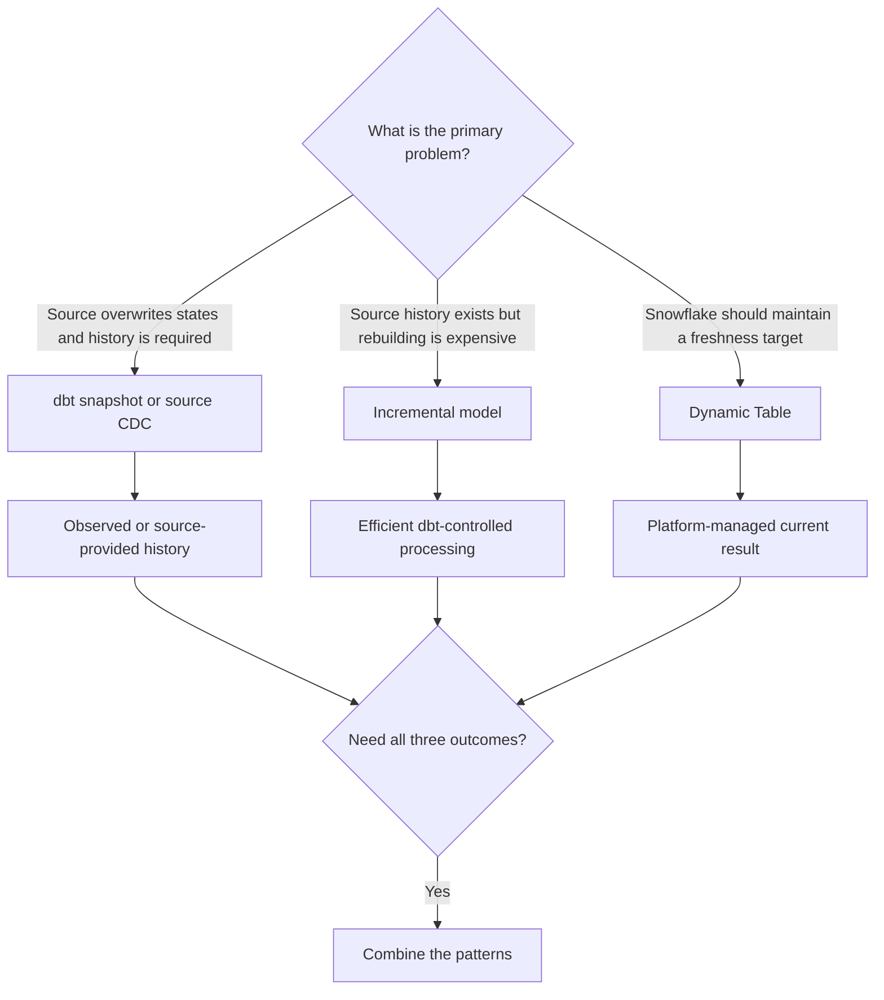
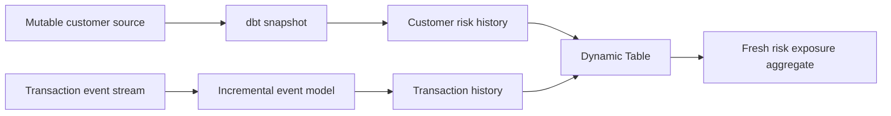

# Snapshots vs Incremental Models vs Dynamic Tables

> Snapshots preserve observed source history, incremental models optimize dbt-controlled processing, and Dynamic Tables delegate recurring freshness and refresh work to Snowflake.

## Executive Summary

- **What it is:** A comparison of three stateful data patterns that are often grouped together even though their primary purposes are history capture, efficient transformation, and platform-managed refresh.
- **Why it matters:** Choosing the wrong pattern can overwrite required history, miss source changes, create unnecessary orchestration, or cause expensive Snowflake refresh behavior.
- **Mental model:** **Snapshots manage observed history; incremental models manage dbt processing; Dynamic Tables manage Snowflake-driven freshness.**
- **Best used when:** The client has clarified source behavior, historical requirements, freshness language, replay controls, platform ownership, and acceptable cost.
- **Avoid or reconsider when:** The choice is based only on data volume or apparent similarity rather than the business question each pattern must answer.

## What It Can Do

- Preserve SCD2-style versions from a mutable current-state source with dbt snapshots.
- Incrementally load source-provided events, CDC, versions, and large facts.
- Maintain current-state tables efficiently with keyed incremental strategies.
- Preserve all immutable events incrementally when the model grain is one row per event.
- Let Snowflake maintain a declarative transformation toward a configured target lag.
- Combine the three patterns in one architecture when history, processing efficiency, and fresh derived outputs are all required.
- Make ownership of scheduling, refresh, replay, and monitoring explicit.
- Support consultant decisions across history completeness, freshness, cost, portability, and governance.

## What It Cannot Do

- Make snapshots capture source changes that occur and disappear between snapshot runs.
- Make incremental models preserve history unless the source and model SQL contain or create versions.
- Make Dynamic Tables preserve prior states automatically.
- Recover history that the source overwrote before any capture mechanism observed it.
- Guarantee that a Dynamic Table always meets target lag.
- Guarantee that a Dynamic Table refresh is incremental or inexpensive without checking query compatibility and refresh behavior.
- Replace immutable publication versions when the business must reconstruct an officially issued report.
- Remove the need for reconciliation, backfill, refresh monitoring, and ownership.

## Core Concepts

| Concept | Meaning | Why it matters |
|---|---|---|
| dbt snapshot | Batch process that records observed changes to mutable rows as SCD2-style versions | Creates history when the source exposes only current state |
| Snapshot observation cadence | How often `dbt snapshot` runs | Changes between runs may never be captured |
| Snapshot timestamp strategy | Detects change through a reliable source `updated_at` | Preferred because it is simpler and robust to source schema evolution |
| Snapshot check strategy | Compares configured source columns | Useful without reliable `updated_at`, but more sensitive to schema and column selection |
| Incremental model | Table updated from a selected change set rather than rebuilt fully | Reduces routine transformation work while retaining explicit dbt control |
| Incremental grain | What one target row represents | Determines whether updates overwrite current state or preserve events/versions |
| Immutable event | Permanent row recording one occurrence; later changes create new event rows | Supports durable history and incremental ingestion |
| Event-level key | Stable identifier such as `event_id` | Allows replay-safe merge without overwriting other events for the same entity |
| Dynamic Table | Snowflake object that materializes a `SELECT` result and refreshes it automatically | Delegates dependency tracking, scheduling, and refresh execution to Snowflake |
| Target lag | Desired maximum staleness relative to upstream data | Expresses a freshness objective, not a guaranteed fixed schedule |
| Refresh mode | Snowflake method for maintaining a Dynamic Table, such as incremental or full | Strongly affects compatibility, cost, and scalability |
| Refresh owner | dbt/orchestrator or Snowflake | Determines operational controls, alerts, backfills, and cost attribution |
| Observed history | States present when a snapshot executes | Not necessarily a complete audit log of every source transition |
| Source-provided history | Events, CDC, versions, or effective-dated rows already retained upstream | Usually better loaded incrementally than recreated by snapshotting |

## How It Works (Simple Flow)

1. Determine whether the source retains events/versions or overwrites a current-state row.
2. Define whether consumers need current truth, observed history, complete change history, or a fresh derived result.
3. If overwritten states must be preserved, schedule a snapshot or consume source CDC.
4. If the source already supplies the necessary history and full rebuilds are expensive, use an incremental model with the correct row grain.
5. If Snowflake should maintain a declarative current result, evaluate a Dynamic Table with target lag, warehouse, and refresh behavior.
6. Test keys, completeness, historical validity, freshness, and cost according to the selected pattern.
7. Use explicit backfills or reinitialization when corrections or logic changes require historical replay.
8. Combine patterns when one tool cannot satisfy history, processing, and freshness requirements alone.

## Visuals



A realistic combined architecture:



## Readable Snippets

### Snapshot a mutable current-state source

```yaml
snapshots:
  - name: transaction_status_snapshot
    relation: ref('stg_transactions')
    config:
      schema: snapshots
      unique_key: transaction_id
      strategy: timestamp
      updated_at: updated_at
      hard_deletes: new_record
```

If dbt observes T100 as pending and later as completed, it produces validity versions:

| transaction_id | status | dbt_valid_from | dbt_valid_to |
|---|---|---|---|
| `T100` | pending | 09:00 | 10:30 |
| `T100` | completed | 10:30 | null |

The snapshot cannot capture an intermediate state that appeared and disappeared between executions.

### Efficiently maintain current state

```sql
{{ config(
    materialized='incremental',
    incremental_strategy='merge',
    unique_key='transaction_id'
) }}

select *
from {{ ref('stg_transactions') }}


where updated_at >= (
    select dateadd(day, -3, max(updated_at))
    from {{ this }}
)

```

This normally overwrites T100's pending target row with completed. It is efficient current-state processing, not automatic history preservation.

### Preserve all immutable events incrementally

```sql
{{ config(
    materialized='incremental',
    incremental_strategy='merge',
    unique_key='event_id'
) }}

select
    event_id,
    transaction_id,
    event_type,
    event_time,
    loaded_at
from {{ ref('stg_transaction_events') }}


where loaded_at >= (
    select dateadd(day, -3, max(loaded_at))
    from {{ this }}
)

```

Example target history:

| event_id | transaction_id | event_type | event_time |
|---|---|---|---|
| `E001` | `T100` | created | 09:00 |
| `E002` | `T100` | pending | 09:05 |
| `E003` | `T100` | completed | 10:30 |
| `E004` | `T100` | reversed | 11:15 |

Use `event_id`, not `transaction_id`, as the key. `merge` makes replay and redelivery idempotent while preserving every distinct event. Use `append` only when exactly-once delivery and non-reprocessing are trustworthy. Evaluate microbatch when the event history is extremely large and complete event-time windows can be reconstructed.

For strict immutability, a repeated `event_id` must have the same payload. Quarantine conflicting duplicates rather than silently accepting an overwritten event.

### Deploy a Snowflake Dynamic Table through dbt

```sql
{{ config(
    materialized='dynamic_table',
    target_lag='10 minutes',
    snowflake_warehouse='DBT_REFRESH_WH'
) }}

select
    account_id,
    sum(amount) as current_balance
from {{ ref('stg_transactions') }}
group by account_id
```

dbt deploys the definition and Snowflake performs recurring refresh. A ten-minute target lag is a desired staleness bound, not a guaranteed ten-minute execution schedule.

## Consultant Talking Points

- **Client question this answers:** "Do we need to preserve overwritten history, efficiently process existing history, or let Snowflake maintain a fresh derived result?"
- **Trade-offs to mention:** Snapshots add observed versions, incremental models add explicit state and replay logic, and Dynamic Tables reduce orchestration while increasing Snowflake-specific behavior and platform-managed refresh.
- **Risk or governance angle:** Clarify whether history must be complete, observed, business-effective, or as-published. Define source key reliability, snapshot cadence, late-data controls, refresh monitoring, backfill approval, and publication evidence.
- **Cost/performance angle:** Snapshot cost comes from source comparison and history growth; incremental cost from change windows and target matching; Dynamic Table cost from target lag, change volume, assigned warehouse, and refresh mode.

A useful client message is: **these patterns are complementary; choose the one that owns the missing responsibility rather than asking which one is universally best.**

### Primary comparison

| Dimension | dbt snapshot | Incremental model | Snowflake Dynamic Table |
|---|---|---|---|
| Primary job | Create observed SCD2 history | Process new and changed data efficiently | Maintain a transformed result automatically |
| Typical source | Mutable current-state table | Events, CDC, facts, versions, or mutable rows | Tables, views, or other Dynamic Tables |
| Refresh owner | Scheduled dbt snapshot job | Scheduled dbt run/build job | Snowflake |
| Output history | Yes, observed versions | Only if SQL and grain preserve it | Only if source/query contains history |
| Main configuration | Key and change-detection strategy | Filter, key, and incremental strategy | Target lag and refresh warehouse |
| Freshness model | Snapshot execution cadence | dbt job cadence | Target lag |
| Backfill control | Cannot reconstruct unobserved states | Explicit dbt replay/full refresh | Snowflake-managed refresh and reinitialization constraints |
| Portability | dbt feature across adapters | dbt feature with adapter-specific strategy | Snowflake-specific |
| Main risk | Missed transitions between runs | Missed late or corrected data | Full-refresh cost, SQL limitations, or lag breach |

### T100 comparison

If the source overwrites T100 from pending to completed:

| Pattern | Typical result |
|---|---|
| Snapshot that observed both states | Pending and completed validity rows |
| Incremental merge keyed by `transaction_id` | One completed current-state row |
| Dynamic Table selecting current source | One completed current result |

If the source instead contains immutable pending and completed events, an event-grain incremental model or a Dynamic Table selecting those events can retain both because the source already preserved the history.

### Refresh and cost ownership

**Snapshot**

- Runs only when the dbt snapshot job executes.
- Compares mutable source state and grows with each observed version.
- Is normally appropriate at hourly or daily cadence; very frequent capture suggests CDC may be a better source pattern.

**Incremental model**

- Runs on dbt/orchestrator cadence.
- Gives explicit control over filters, keys, strategies, backfills, and full refresh.
- Requires the most engineering responsibility for late data and historical consistency.

**Dynamic Table**

- Refreshes under Snowflake control after dbt deploys the definition.
- Snowflake tracks dependencies and aims for the configured target lag.
- Native refresh can be incremental or full depending on supported logic and object configuration.
- Aggressive lag, high churn, or full refresh can materially increase compute.
- The dbt Snowflake materialization has platform-specific limitations and does not currently support model contracts.

### Finance and regulated data

None of the three automatically preserves what was officially published. If a regulatory or finance result must be reconstructed exactly as issued, retain immutable publication versions and a governed restatement process.

Use:

- Snapshots for observed mutable attributes such as customer risk rating.
- Incremental event or CDC models for complete transaction and correction history.
- Dynamic Tables for fresh derived results when retroactive recomputation is acceptable and monitored.
- Explicit publication tables for as-reported evidence.

## Common Pitfalls

- Using a snapshot when source CDC already provides more complete history.
- Calling a snapshot an audit log without validating cadence and missed intermediate states.
- Snapshotting a wide, volatile table without proving that every column needs history.
- Assuming an incremental model preserves history while merging on the entity key.
- Using `transaction_id` instead of `event_id` for immutable event history.
- Using append for events when the source can redeliver or a lookback reprocesses them.
- Filtering late event ingestion only by business `event_time` instead of a reliable arrival signal.
- Assuming a Dynamic Table creates SCD2 versions.
- Treating target lag as a fixed refresh schedule or guaranteed SLA.
- Deploying a Dynamic Table without checking refresh mode, actual lag, failures, and warehouse cost.
- Assuming all dbt model configurations and contracts apply equally to Dynamic Tables.
- Choosing Dynamic Tables for logic that forces frequent full refresh at large scale.
- Expecting a snapshot rebuild to recover states that were never observed.
- Overwriting officially published results instead of retaining immutable report versions.
- Treating the three patterns as mutually exclusive when a layered architecture needs more than one.

## When to Recommend What (Decision Table)

| Situation | Recommend | Why | Watch-outs |
|---|---|---|---|
| Mutable customer/account row overwrites prior values and observed history is sufficient | dbt snapshot | Creates SCD2-style versions from current state | Run cadence may miss intermediate changes |
| Every source change must be captured | Source CDC or immutable events, then incremental processing | Preserves a complete change stream when the source supplies it | Ordering, redelivery, retention, and payload immutability |
| Large immutable event history with replay/redelivery | Incremental `merge` on `event_id` | Preserves all events and makes retries idempotent | Validate stable event IDs and conflicting payloads |
| Immutable event source with guaranteed exactly-once delivery | Incremental `append` | Simplest and cheapest insertion path | A broken delivery guarantee creates duplicates |
| Extremely large replayable time-series events | Microbatch incremental model | Bounded retry, backfill, and batch replacement | Complete windows, event-time semantics, and late arrivals |
| Large mutable fact with reliable key and update signal | Incremental `merge` on entity/row key | Efficient current-state inserts and updates | Does not retain overwritten versions |
| Declarative Snowflake output should remain near current | Dynamic Table | Snowflake manages dependency refresh to target lag | Refresh mode, SQL support, lag, cost, and platform lock-in |
| Simple Dynamic Table pipeline with lazy intermediates | Use `target_lag='downstream'` where appropriate | Avoids refreshing intermediates independently | Validate end-to-end freshness and dependency behavior |
| Controlled historical restatement is required | Incremental/microbatch with explicit backfill and reconciliation | Gives clear replay scope and evidence | Closed-period approval and downstream republication |
| Official as-reported history is required | Immutable publication versions in addition to transformation pattern | Preserves what consumers actually received | Version identity, approval, retention, and supersession |

## Related Topics

- [[02 dbt/04 Incremental Processing and Performance/Incremental Processing and Performance Overview|Incremental Processing and Performance Overview]]
- [[02 dbt/01 Core Concepts and Project Structure/09 Snapshots and Historical Change Tracking|Snapshots and Historical Change Tracking]]
- [[02 dbt/04 Incremental Processing and Performance/31 Incremental Models and Unique Keys|Incremental Models and Unique Keys]]
- [[02 dbt/04 Incremental Processing and Performance/33 Microbatch Incremental Models|Microbatch Incremental Models]]
- [[01 Snowflake/04 Data Engineering/21 Dynamic Tables|Dynamic Tables]]
- [[01 Snowflake/04 Data Engineering/25 dbt on Snowflake|dbt on Snowflake]]

## Related Decision Notes

- [[80 Comparisons and Decision Notes/Comparisons/dbt/Comparison - Snapshots vs Incremental Models|Comparison - Snapshots vs Incremental Models]]
- [[80 Comparisons and Decision Notes/Decision Notes/dbt/Decisions - Choosing a Data History and Restatement Pattern|Decisions - Choosing a Data History and Restatement Pattern]]
- [[80 Comparisons and Decision Notes/Comparisons/Snowflake/Comparison - Streams and Tasks vs Dynamic Tables|Comparison - Streams and Tasks vs Dynamic Tables]]

## Questions

- Does the source preserve events or versions, or overwrite one current row?
- Must history be complete, merely observed, business-effective, or as-published?
- How frequently can relevant states change relative to snapshot cadence?
- Does the client need explicit dbt replay control or Snowflake-managed freshness?
- What source signal identifies late arrivals and corrections?
- Can Dynamic Table logic refresh incrementally, and what happens if it refreshes fully?
- What target lag is valuable enough to justify its recurring warehouse cost?
- Can more than one pattern be combined to separate history, processing, and serving concerns?

## Sources To Revisit

- [dbt Developer Hub - Snapshots](https://docs.getdbt.com/docs/build/snapshots)
- [dbt Developer Hub - Configure incremental models](https://docs.getdbt.com/docs/build/incremental-models)
- [dbt Developer Hub - Microbatch incremental models](https://docs.getdbt.com/docs/build/incremental-microbatch)
- [dbt Developer Hub - Snowflake configurations](https://docs.getdbt.com/reference/resource-configs/snowflake-configs)
- [Snowflake Documentation - Dynamic Tables](https://docs.snowflake.com/en/user-guide/dynamic-tables/overview)
- [Snowflake Documentation - Dynamic Table refresh modes](https://docs.snowflake.com/en/user-guide/dynamic-tables/refresh-modes)
