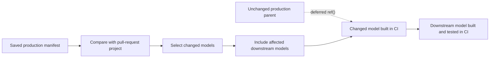
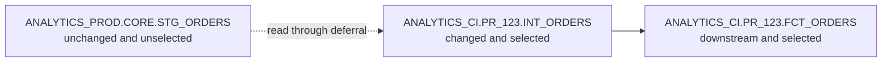

# Model Selection, State, and Deferral

> Selection chooses what to run, state identifies what changed, and deferral lets an isolated CI run reuse unchanged relations from another environment.

## Executive Summary

- **What it is:** A set of dbt capabilities for running a relevant part of the project instead of rebuilding the entire dependency graph.
- **Why it matters:** Large projects can validate pull requests faster and with less warehouse cost by building changed models and their affected descendants in CI.
- **Mental model:** **Selection chooses the work; state compares project versions; deferral borrows unbuilt parents.**
- **Best used when:** The project has reliable production artifacts, isolated CI schemas, controlled access to production inputs, and a clear policy for how much downstream impact to test.
- **Avoid or reconsider when:** Tests must be completely isolated from production data, artifacts are stale or incompatible, or the selected models need local target state that does not yet exist.

## What It Can Do

- Select models by name, path, tag, configuration, resource type, or graph relationship.
- Compare the current project with a previous dbt manifest to find new, modified, or unchanged nodes.
- Build changed models and their downstream dependants for pull-request validation.
- Resolve references to unchanged, unselected parent models in a production or staging environment.
- Reduce CI duration, warehouse usage, and temporary storage.
- Preview the selected scope before running it.
- Use one manifest for logical comparison and, when needed, another manifest for deferral.
- Combine deferral with zero-copy cloning on supported platforms to test incremental behavior more realistically.

## What It Cannot Do

- Detect newly arrived source rows; state compares project definitions and metadata, not warehouse data.
- Guarantee that a narrow CI selection catches every behavioral or data-quality problem.
- Defer `source()` references; deferral changes how qualifying `ref()` calls resolve.
- Defer ephemeral models because they have no persisted relation to borrow.
- Make cross-environment data tests logically valid.
- Reproduce the incremental branch of a changed model when its target table does not exist in CI.
- Eliminate the need for artifact retention, environment cleanup, least-privilege access, or full integration testing.
- Safely use a stale, overwritten, or incompatible manifest.

## Core Concepts

| Concept | Meaning | Why it matters |
|---|---|---|
| Node selection | Rules that choose which dbt resources execute | Controls validation scope, duration, and cost |
| Graph operator | `+` includes upstream parents or downstream children | Expands a selection according to dependency impact |
| State | Comparison between the current project and a saved prior manifest | Finds logical dbt changes rather than relying only on file diffs |
| `manifest.json` | dbt artifact describing nodes, dependencies, configurations, and relations | Provides the comparison baseline and deferred relation locations |
| `state:modified` | Selects resources whose dbt-relevant definition changed | Forms the core of Slim CI |
| Subselector | Narrows modification type, such as `.body`, `.configs`, `.relation`, `.macros`, or `.contract` | Helps explain why a node was selected |
| Deferral | Resolves eligible references to relations recorded in another manifest | Lets CI reuse unchanged upstream data without rebuilding it |
| `--favor-state` | Prefers the deferred relation even when a local relation exists | Avoids accidentally reading a stale local CI object |
| Slim CI | State-aware selection plus deferral, usually in an isolated PR schema | Validates the impact of code changes with less work |
| CI | Continuous Integration: an automated, temporary validation environment for a code change | Keeps pull-request checks separate from production writes |
| Clone | Creates local copies or zero-copy clones of existing relations where supported | Gives selected incremental models realistic target state |

## How It Works (Simple Flow)

1. A successful production job saves its `manifest.json` in a durable artifact location.
2. A pull-request job checks out the proposed code and compares it with that production manifest.
3. A state selector identifies new or modified models; graph operators add the downstream models that could be affected.
4. dbt builds the selected resources in a temporary CI database or schema.
5. When a selected model references an unchanged and unselected parent, deferral can point that `ref()` to the relation recorded in the production manifest.
6. Tests run across the resulting graph, which may now contain both CI-built and production-backed relations.
7. The team reviews the result, cleans up temporary objects, and deploys through the controlled production process.
8. A later successful production run publishes a new manifest to become the next comparison baseline.

## Visuals



A concrete environment example:



`CI` means **Continuous Integration**. It is shorthand for a temporary, isolated environment used to validate a pull request; it is not special dbt syntax.

## Readable Snippets

### Preview a selection

```bash
# One model
dbt ls --select "int_orders"

# The model and everything downstream
dbt ls --select "int_orders+"

# Everything upstream and the model
dbt ls --select "+int_orders"

# Other common selection methods
dbt ls --select "path:models/marts"
dbt ls --select "tag:finance"
dbt ls --select "config.materialized:incremental"
```

Use `dbt ls` before an expensive build because a downstream `+` can select much more of the graph than expected.

### Build modified models and their downstream impact

```bash
dbt build \
  --select "state:modified+" \
  --state ./prod-artifacts \
  --defer
```

This means:

- Compare the current project with `./prod-artifacts/manifest.json`.
- Select modified models and their downstream dependants.
- Build selected nodes in the current CI target.
- Let eligible references to unselected parents resolve through the saved manifest.

### Inspect why a resource changed

```bash
dbt ls --select "state:modified.body" --state ./prod-artifacts
dbt ls --select "state:modified.configs" --state ./prod-artifacts
dbt ls --select "state:modified.relation" --state ./prod-artifacts
dbt ls --select "state:modified.macros" --state ./prod-artifacts
dbt ls --select "state:modified.contract" --state ./prod-artifacts
```

The available subselectors help distinguish SQL changes from configuration, relation, macro, or contract changes.

### Separate comparison state from deferral state

```bash
dbt build \
  --select "state:modified+" \
  --state ./logical-prod-artifacts \
  --defer \
  --defer-state ./applied-prod-artifacts
```

Most teams compare and defer against the same successful production manifest. Separate paths are useful when the logical code baseline and the relations that are actually deployed differ.

### Prefer state over a stale local relation

```bash
dbt build \
  --select "state:modified+" \
  --state ./prod-artifacts \
  --defer \
  --favor-state
```

Without `--favor-state`, dbt normally uses an existing current-target relation before deferring. Clean temporary schemas or use this option deliberately so stale CI objects do not become accidental inputs.

### Changed incremental models need special care

If a selected incremental model does not already exist in CI, dbt performs an initial table build. That validates the model's full-build path, but may not exercise its incremental filter, merge logic, or target-state assumptions.

On Snowflake, a typical approach is:

```bash
dbt clone --state ./prod-artifacts

dbt build \
  --select "state:modified+" \
  --state ./prod-artifacts \
  --defer
```

Cloning can give the changed incremental model a realistic CI target before it runs. Deferral remains useful for unchanged parents that do not need local copies.

## Consultant Talking Points

- **Client question this answers:** "How can we test a dbt change without rebuilding the entire production project for every pull request?"
- **Trade-offs to mention:** Slim CI is faster and cheaper, but its graph may combine CI-built models with production-backed parents. A broader selection gives more confidence but increases duration and cost.
- **Risk or governance angle:** The CI identity should be able to read only approved production inputs, write only to temporary CI objects, and never modify production. Production masking, row-access policies, and sensitive-data rules still matter.
- **Cost/performance angle:** State-aware selection avoids unnecessary builds, while careless downstream expansion, large tests, clones, and abandoned PR schemas can still create material Snowflake cost.

A useful client explanation is: **dbt compares today's project map with the last approved map, rebuilds the changed route in a safe workspace, and borrows unchanged roads from production.**

### Selection, state, and deferral are separate decisions

| Question | Capability |
|---|---|
| Which resources should execute? | Selection |
| Which project resources changed? | State comparison |
| Where should an unbuilt parent `ref()` point? | Deferral |

State does not automatically imply deferral, and deferral does not decide which nodes are selected.

### State is not data freshness

`state:modified` detects changes such as SQL, configuration, contract, macro, or relation-definition changes. It does not inspect whether a source received new orders overnight.

Therefore:

- Use state selection for code-change validation.
- Use normal production schedules, source freshness checks, and incremental logic for new data.
- Do not replace the daily production build with `state:modified+` unless unchanged code genuinely requires no data processing.

### Deferral resolution

An eligible `ref()` normally defers when:

- The referenced node is not selected.
- Its relation does not exist in the current target.
- A state manifest identifies a usable relation in the deferred environment.

`--favor-state` changes the second rule by prioritizing the state relation even when a current-target relation exists. Ephemeral models cannot be deferred, and `source()` continues to resolve according to the current project's source definition.

### Artifact handling

- Preserve manifests only from successful, trusted deployments.
- Keep prior state outside the current run's `target/` directory.
- Do not point `--state` at the same location dbt will overwrite during parsing.
- Retain the code version, invocation context, and relevant run artifacts with the manifest.
- Keep the artifact schema version compatible with the dbt version running CI.

## Common Pitfalls

- Treating `state:modified` as a way to identify new warehouse data.
- Saving the comparison manifest inside the current `target/` path and overwriting it before comparison.
- Using a stale or unsuccessful production manifest as the approved baseline.
- Adding `+` downstream without previewing the scope, causing CI to build most of the project.
- Forgetting that a widely used macro change can mark many dependent resources as modified.
- Reading a stale relation from the CI schema instead of the intended deferred production relation.
- Running relationship tests across mixed CI and production data and interpreting the failures as model defects.
- Testing a row-limited CI model against a full production parent or child without aligning the sample.
- Assuming `source()` references are redirected by deferral.
- Expecting an ephemeral parent to defer even though no persisted relation exists.
- Testing a changed incremental model in an empty CI schema and assuming its incremental branch was validated.
- Giving the CI service account production write privileges.
- Allowing deferred reads to bypass approved masking, row-access, or data-residency controls.
- Leaving PR schemas and cloned objects behind without ownership, retention, or cleanup rules.

## When to Recommend What (Decision Table)

| Situation | Recommend | Why | Watch-outs |
|---|---|---|---|
| Small project with cheap full builds | Full CI build | Simplest and highest environment consistency | Cost and duration may grow with the project |
| Large project with trustworthy production artifacts | `state:modified+` with deferral | Tests changed code and downstream impact efficiently | Mixed-environment tests and artifact freshness |
| Need to understand the scope before execution | `dbt ls` with the final selector | Makes graph expansion visible without building | Preview with the same state inputs as the real run |
| CI contains stale objects from an earlier run | Clean the PR schema or use `--favor-state` deliberately | Prevents accidental use of old local relations | Do not hide a relation that should be rebuilt locally |
| Changed incremental model must exercise incremental logic | Clone its production target into CI, then run it | Preserves realistic target state for merge/filter behavior | Snowflake privileges, clone lifecycle, and sensitive data |
| Strictly isolated test data is required | Build or clone the required upstream graph into an approved test environment | Avoids production/CI mixing | More compute, storage, preparation, and test-data ownership |
| Daily production job must process newly arrived data | Normal production selection and incremental filters | Data freshness is not a state-comparison problem | Monitor freshness, late data, and failed runs |
| Logical baseline differs from deployed relations | Use `--state` and `--defer-state` separately | Separates change comparison from relation lookup | Document why the two baselines differ |
| Regulated or sensitive client | Slim CI with least-privilege CI identity and approved production reads | Retains efficiency within controlled boundaries | Masking, row access, audit evidence, cleanup, and segregation of duties |

## Related Topics

- [[02 dbt/04 Incremental Processing and Performance/Incremental Processing and Performance Overview|Incremental Processing and Performance Overview]]
- [[02 dbt/04 Incremental Processing and Performance/31 Incremental Models and Unique Keys|Incremental Models and Unique Keys]]
- [[02 dbt/05 Deployment CI CD and Operations/42 CI Jobs and Slim CI|CI Jobs and Slim CI]]
- [[02 dbt/05 Deployment CI CD and Operations/45 Artifacts Logs and Run Results|Artifacts, Logs, and Run Results]]

## Related Decision Notes

- [[80 Comparisons and Decision Notes/Decision Notes/dbt/Decisions - Choosing a dbt Environment and Credential Strategy|Decisions - Choosing a dbt Environment and Credential Strategy]]
- [[80 Comparisons and Decision Notes/Decision Notes/Cross-Tool/Decisions - Choosing a Snowflake DevOps and Deployment Pattern|Decisions - Choosing a Snowflake DevOps and Deployment Pattern]]

## Questions

- Which successful deployment supplies the trusted state manifest?
- How far downstream should CI build after a changed model?
- Can the CI role read the required production relations without writing to production?
- Could relationship tests compare differently sampled or mixed-environment data?
- Does a changed incremental model need a cloned target to exercise its incremental path?
- Should CI favor production state or an existing local relation?
- How are temporary CI schemas, clones, and artifacts retained and cleaned up?
- What process handles a macro change that affects a large part of the graph?

## Sources To Revisit

- [dbt Developer Hub - Node selection syntax](https://docs.getdbt.com/reference/node-selection/syntax)
- [dbt Developer Hub - Selection methods: state](https://docs.getdbt.com/reference/node-selection/methods#state)
- [dbt Developer Hub - Configure state selection](https://docs.getdbt.com/reference/node-selection/configure-state)
- [dbt Developer Hub - Defer to another environment](https://docs.getdbt.com/reference/node-selection/defer)
- [dbt Developer Hub - State comparison caveats](https://docs.getdbt.com/reference/node-selection/state-comparison-caveats)
- [dbt Developer Hub - dbt clone](https://docs.getdbt.com/reference/commands/clone)
