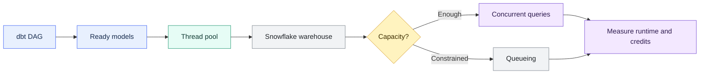
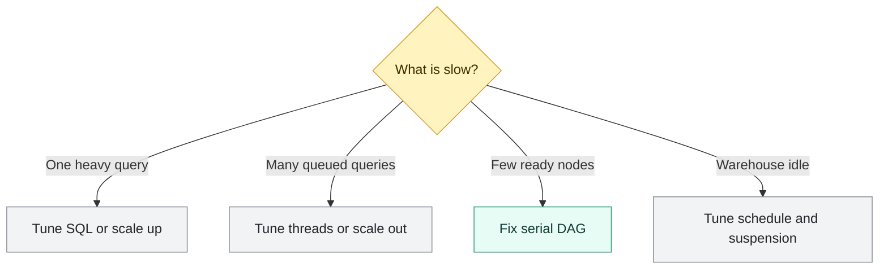

# Threads, Warehouse Sizing, and Snowflake Cost

> [!abstract] Mental model
> Threads control work in flight; warehouse design controls capacity; runtime and active clusters turn both into cost.

## Executive Summary

- **What it is:** The relationship between dbt model concurrency, Snowflake compute capacity, query queueing, runtime, and credit consumption.
- **Why it matters:** Too little concurrency can leave compute unused, while too much can create queueing, contention, BI disruption, and cost without improving the delivery window.
- **Mental model:** **Threads are delivery lanes into the factory; warehouse size is the power inside one factory; multi-cluster adds factories for concurrent demand.**
- **Best used when:** Thread count and warehouse configuration are tuned together from measured runs, with separate compute for materially different workloads.
- **Avoid or reconsider when:** The proposed solution is simply "add threads" or "make the warehouse bigger" without identifying whether the bottleneck is the dbt DAG, an individual query, concurrency, SQL design, or idle time.

## What It Can Do

- Run independent dbt models concurrently without violating dependency order.
- Shorten elapsed dbt runtime when the graph contains parallel paths and Snowflake has capacity.
- Give large queries more compute and memory by scaling a warehouse up.
- Serve more concurrent queries by scaling out with a multi-cluster warehouse.
- Isolate development, CI, production transformations, and BI workloads on separate warehouses.
- Attribute compute consumption more clearly by workload, team, job, or environment.
- Reduce idle cost with appropriate auto-suspend and auto-resume settings.
- Use query history, warehouse load, and metering data to tune from evidence.

## What It Cannot Do

- Make dependent dbt models run simultaneously.
- Guarantee that the configured number of threads will always be active.
- Make a poorly designed query efficient merely by adding threads.
- Guarantee that doubling warehouse size halves query runtime.
- Make multi-cluster accelerate one slow query; it primarily addresses concurrency and queueing.
- Prevent cost growth when more clusters, longer runtimes, or oversized compute are used.
- Remove the 60-second minimum charge each time warehouse compute is provisioned or resumed.
- Replace workload isolation, query tagging, resource monitors, budgets, ownership, and operational monitoring.

## Core Concepts

| Concept | Meaning | Why it matters |
|---|---|---|
| dbt DAG | Dependency graph that determines valid model order | Limits how much work can actually run in parallel |
| Thread | One available dbt execution path or warehouse connection | Sets the maximum concurrent work dbt may submit |
| Ready node | Model whose upstream dependencies have completed | Only ready nodes can use available threads |
| Warehouse size | Compute and memory available per Snowflake cluster | Primarily affects the performance of work inside each cluster |
| Scale up | Move to a larger warehouse size | Helps compute-heavy or memory-heavy individual queries |
| Scale out | Add warehouse clusters | Helps many concurrent queries that would otherwise queue |
| Query queueing | Time a query waits for warehouse capacity | Indicates concurrency pressure rather than SQL execution work |
| Resource contention | Concurrent queries compete for compute or memory | More threads can reduce rather than improve throughput |
| Credit rate | Credits consumed per running hour for a warehouse size and resource configuration | Larger sizes have a higher cost per second |
| Running time | Time warehouse compute remains active | A faster job can offset a higher credit rate, but only if it scales sufficiently |
| Auto-suspend | Suspends an inactive warehouse after a configured delay | Prevents idle warehouse credit consumption |
| Workload isolation | Separate warehouses for workloads such as dbt production and BI | Reduces noisy-neighbor impact and improves attribution |
| Query tag | Metadata attached to Snowflake queries | Connects usage and performance back to dbt jobs, models, and environments |

## How It Works (Simple Flow)

1. dbt builds a DAG from model dependencies and determines which nodes are ready.
2. Available threads submit ready models concurrently, up to the configured or managed limit.
3. Snowflake accepts those statements on the selected warehouse.
4. Warehouse size determines the compute and memory available inside each cluster.
5. If concurrent demand exceeds capacity, queries wait or compete for resources; adding still more threads provides little benefit.
6. Snowflake bills for provisioned warehouse compute according to size, active clusters, and continuous running time.
7. Query, load, and metering history reveal whether the constraint is graph shape, query execution, queueing, spill, or idle time.
8. The team changes one relevant lever, reruns a comparable workload, and keeps the configuration only when runtime, reliability, and cost improve together.

## Visuals



Choose the scaling direction from the bottleneck:



## Readable Snippets

### Configure threads for dbt Core

```yaml
# profiles.yml
upskill:
  target: prod
  outputs:
    prod:
      type: snowflake
      account: "{{ env_var('SNOWFLAKE_ACCOUNT') }}"
      user: "{{ env_var('SNOWFLAKE_USER') }}"
      database: ANALYTICS
      schema: DBT_PROD
      warehouse: DBT_PROD_WH
      role: DBT_PROD_ROLE
      threads: 4
```

Override the target setting for a measured run:

```bash
dbt build --threads 8
```

For traditional dbt Core execution, four threads is a sensible starting point, not a universal optimum. Test several values against the same representative selection and data volume.

### Fusion thread behavior

Fusion automatically manages connection parallelism for Snowflake using platform limits and backpressure. Current dbt guidance is generally to omit `threads` or use zero so Fusion can optimize dynamically:

```yaml
threads: 0
```

Set a positive value only when a maximum connection cap is needed, for example to protect a small warehouse or shared workload. Fusion threads represent warehouse connections, not local CPU threads; parallel parsing is separate.

### Cost relationship

For warehouse compute, the simplified relationship is:

```text
compute credits
≈ warehouse credit rate
× running seconds / 3,600
× active clusters
```

Apply Snowflake's provisioning rules as well: each warehouse resume has a 60-second minimum, and billing is per second after that while compute remains continuously active.

For standard Gen1 warehouses, each step up generally doubles both compute and the full-hour credit rate:

| Warehouse size | Example credits per full hour |
|---|---:|
| X-Small | 1 |
| Small | 2 |
| Medium | 4 |
| Large | 8 |
| X-Large | 16 |

Actual account pricing is the applicable credit rate multiplied by the contractual price per credit. Resource constraints, warehouse generation, cloud, region, edition, clusters, and other Snowflake services can affect the broader bill.

### Runtime-versus-rate example

| Configuration | Runtime | Simplified compute |
|---|---:|---:|
| Small at 2 credits/hour | 30 minutes | 1 credit |
| Medium at 4 credits/hour | 15 minutes | 1 credit |
| Medium at 4 credits/hour | 25 minutes | 1.67 credits |

The larger warehouse is cost-neutral only in the second row because it halves runtime. Larger is not automatically cheaper or more expensive; the scaling response determines the outcome.

### Configure an isolated transformation warehouse

```sql
create warehouse if not exists DBT_PROD_WH
    warehouse_size = 'SMALL'
    auto_suspend = 60
    auto_resume = true
    initially_suspended = true;
```

A 60-second auto-suspend can be appropriate for an isolated, intermittent transformation warehouse. For workloads with frequent short gaps, a longer setting may avoid repeated resumes, repeated minimum charges, and loss of useful cache.

### Inspect dbt query performance

```sql
select
    query_id,
    query_tag,
    warehouse_name,
    total_elapsed_time,
    execution_time,
    queued_overload_time,
    bytes_spilled_to_local_storage,
    bytes_spilled_to_remote_storage
from snowflake.account_usage.query_history
where start_time >= dateadd(day, -7, current_timestamp())
  and warehouse_name = 'DBT_PROD_WH'
order by total_elapsed_time desc;
```

Interpretation:

- High `queued_overload_time` suggests concurrency pressure.
- High execution time without queueing suggests query design, pruning, data volume, or per-query compute.
- Material remote spill suggests memory pressure or expensive intermediate results.
- Long dbt elapsed time with little Snowflake queueing may indicate serial dependencies or a small number of dominant models.

### Attribute warehouse credits

```sql
select
    warehouse_name,
    date_trunc('day', start_time) as usage_day,
    sum(credits_used_compute) as compute_credits
from snowflake.account_usage.warehouse_metering_history
where start_time >= dateadd(day, -30, current_timestamp())
group by 1, 2
order by 2 desc, 1;
```

Warehouse-level metering is much easier to interpret when production dbt, CI, development, and BI do not all share the same warehouse.

## Consultant Talking Points

- **Client question this answers:** "How do we make dbt finish within the batch window without buying more Snowflake compute than the workload needs?"
- **Trade-offs to mention:** More threads can improve parallelism or create contention; a larger warehouse can speed heavy queries or merely increase the burn rate; multi-cluster improves concurrency but can multiply cost.
- **Risk or governance angle:** Separate identities and warehouses make production transformations safer to operate and easier to attribute. Define who may resize compute, change auto-suspend, or override resource-monitor controls.
- **Cost/performance angle:** Optimize for reliable throughput and total credits, not only the fastest wall-clock time or smallest warehouse size.

A useful client message is: **find the queue before choosing the lever—dbt queue, Snowflake queue, or one slow SQL statement.**

### Threads and warehouse size solve different problems

| Question | Primary lever |
|---|---|
| How many independent dbt nodes may be submitted? | Threads |
| How much compute and memory does one cluster have? | Warehouse size |
| How many groups of concurrent queries can Snowflake serve? | Multi-cluster |
| How long does idle compute remain active? | Auto-suspend |
| Which workload pays for the credits? | Warehouse isolation and query tagging |

### Why more threads sometimes do nothing

Suppose the graph is:

```text
stg_orders ──┐
             ├── int_orders ── fct_orders
stg_payments ┘
```

At the start, only two models are ready. Even with 16 configured threads, dbt can use no more than two for those models. After both complete, the remaining path is serial.

Available parallelism is bounded by:

- The number of ready nodes in the DAG.
- The thread or connection limit.
- Snowflake's ability to execute concurrent statements.
- Job overlap and other workloads using the warehouse.

### Scale up versus scale out

**Scale up** from Small to Medium or Large when:

- One or a few individual transformations are compute-heavy.
- Queries spill because intermediate data exceeds available memory.
- A backfill must complete within an approved window.

First confirm that the SQL and physical design are sensible. Additional compute should not hide exploding joins, unnecessary full scans, or poor incremental filters.

**Scale out** with multi-cluster when:

- Many independent queries are queued for capacity.
- Several jobs or users create concurrency bursts.
- Workload isolation alone does not provide enough concurrency.

Multi-cluster is primarily a concurrency feature, not a way to make one query faster. Start with a small maximum cluster count and monitor actual cluster use and cost.

### Workload isolation pattern

```text
DBT_DEV_WH    -> developer runs
DBT_CI_WH     -> pull-request validation
DBT_PROD_WH   -> scheduled production transformations
BI_WH         -> dashboards and analyst queries
```

This prevents a highly threaded dbt build from queueing customer-facing dashboards. It also permits different warehouse sizes, auto-suspend settings, resource monitors, roles, and cost owners for each workload.

### Tuning feedback loop

Use a repeatable experiment:

1. Choose a representative dbt selection and data volume.
2. Record thread count, warehouse configuration, run duration, model timings, queueing, spill, and credits.
3. Identify the dominant bottleneck.
4. Change one lever: SQL, model materialization, selection, threads, size, clusters, or scheduling.
5. Run the same workload under comparable cache and concurrency conditions.
6. Compare both elapsed time and total credits.
7. Retain the change only when it improves the client's actual objective.

For example, a 40% faster run that doubles credits may be correct for a regulatory deadline, but poor for an unconstrained overnight pipeline.

## Common Pitfalls

- Assuming thread count equals the number of models that will always run simultaneously.
- Increasing threads on a mostly serial DAG.
- Setting high dbt concurrency on a small warehouse and creating queueing or spill.
- Sharing one warehouse between dbt and BI, then treating dashboard delays as a BI problem.
- Upsizing a warehouse without benchmarking whether runtime falls enough to offset the higher credit rate.
- Using multi-cluster to fix one slow query.
- Treating the smallest warehouse as automatically cheapest even when it runs much longer.
- Treating the fastest warehouse as automatically best without measuring credits.
- Setting auto-suspend shorter than the normal gaps between frequent queries and causing repeated resumes.
- Disabling auto-suspend on a large intermittent warehouse.
- Comparing tuning runs with different data volumes, cache state, selections, or competing workloads.
- Looking only at dbt wall-clock duration without inspecting Snowflake queueing and execution time.
- Ignoring local or remote spill as evidence of expensive intermediate results or memory pressure.
- Allowing developers or jobs to resize production warehouses without ownership or guardrails.
- Using resource monitors as precise cost attribution; they are guardrails, while metering and query tagging support analysis.
- Forgetting that parallel microbatch execution can add more ready work and therefore increase warehouse concurrency pressure.

## When to Recommend What (Decision Table)

| Situation | Recommend | Why | Watch-outs |
|---|---|---|---|
| New dbt Core workload with no measurements | Start with four threads and a modest isolated warehouse | Creates a safe baseline for experimentation | Not a permanent universal configuration |
| Fusion on Snowflake with no connection problem | Let Fusion manage parallelism dynamically | Uses platform limits and backpressure | Add a cap if warehouse or connection pressure appears |
| Independent models exist and warehouse has spare capacity | Increase threads gradually | Uses available DAG parallelism to shorten the run | Measure queueing, spill, other users, and credits |
| DAG is mostly serial | Optimize the critical path and heavy models | Threads cannot bypass dependencies | Review whether dependencies or materializations are necessary |
| One large model is slow and not queued | Tune SQL, pruning, grain, and materialization; then test scale-up | Targets per-query work and compute | Larger warehouses may not scale linearly |
| Many queries show overload queueing | Tune concurrency, isolate workloads, or consider multi-cluster | Addresses simultaneous demand | Cap clusters and monitor cost |
| BI slows during dbt builds | Separate BI and transformation warehouses | Removes noisy-neighbor contention | Govern each warehouse independently |
| Short, intermittent dbt jobs | Auto-resume plus appropriately short auto-suspend | Limits idle credit consumption | Each resume has a 60-second minimum |
| Frequent jobs separated by small gaps | Keep the warehouse warm through the normal gap | Avoids repeated resume minimums and cache loss | Measure idle cost against saved latency |
| Exceptional backfill has a fixed deadline | Temporarily scale the isolated warehouse and restore afterward | Buys compute for an approved time-bound need | Automate or verify the scale-down |
| Cost attribution is unclear | Isolate warehouses and standardize query tags | Connects credits to workload and ownership | Shared warehouses weaken model-level allocation |
| Regulated production transformations | Dedicated warehouse, least-privilege role, monitored configuration, and spending guardrails | Supports reliability, evidence, and separation of duties | Define override, alert, and emergency procedures |

## Related Topics

- [[02 dbt/04 Incremental Processing and Performance/Incremental Processing and Performance Overview|Incremental Processing and Performance Overview]]
- [[02 dbt/04 Incremental Processing and Performance/34 Parallel Microbatch Execution|Parallel Microbatch Execution]]
- [[02 dbt/04 Incremental Processing and Performance/38 Query Tuning Feedback Loop|Query Tuning Feedback Loop]]
- [[01 Snowflake/01 Core Architecture and Concepts/01 Virtual Warehouses|Virtual Warehouses]]
- [[01 Snowflake/06 Cost Management and Operations/44 Credit Consumption Model|Credit Consumption Model]]
- [[01 Snowflake/06 Cost Management and Operations/46 Warehouse Scheduling and Auto-suspend|Warehouse Scheduling and Auto-suspend]]

## Related Decision Notes

- [[80 Comparisons and Decision Notes/Decision Notes/Snowflake/Decisions - Choosing a Warehouse Strategy by Workload Type|Decisions - Choosing a Warehouse Strategy by Workload Type]]
- [[80 Comparisons and Decision Notes/Comparisons/Snowflake/Comparison - Virtual Warehouse Size vs Multi-cluster|Comparison - Virtual Warehouse Size vs Multi-cluster]]
- [[80 Comparisons and Decision Notes/Decision Notes/dbt/Decisions - Choosing a dbt Environment and Credential Strategy|Decisions - Choosing a dbt Environment and Credential Strategy]]

## Questions

- How much parallelism does the dbt DAG actually expose at its busiest stage?
- Is elapsed time spent in dbt dependency waiting, Snowflake queueing, or SQL execution?
- Which models dominate the critical path?
- Does a larger warehouse reduce runtime enough to offset its higher credit rate?
- Do queries spill locally or remotely?
- Are CI, development, production dbt, and BI competing on one warehouse?
- What batch deadline, freshness objective, or dashboard SLA justifies additional cost?
- How are exceptional resizing and multi-cluster overrides approved and reversed?
- Which query tags and metering views provide defensible cost attribution?

## Sources To Revisit

- [dbt Developer Hub - Using threads](https://docs.getdbt.com/docs/running-a-dbt-project/using-threads)
- [dbt Developer Hub - About profiles.yml](https://docs.getdbt.com/docs/local/profiles.yml)
- [Snowflake Documentation - Overview of warehouses](https://docs.snowflake.com/en/user-guide/warehouses-overview)
- [Snowflake Documentation - Warehouse considerations](https://docs.snowflake.com/en/user-guide/warehouses-considerations)
- [Snowflake Documentation - Multi-cluster warehouses](https://docs.snowflake.com/en/user-guide/warehouses-multicluster)
- [Snowflake Documentation - Understanding compute cost](https://docs.snowflake.com/en/user-guide/cost-understanding-compute)
- [Snowflake Documentation - Cost controls for warehouses](https://docs.snowflake.com/en/user-guide/cost-controlling-controls)
- [Snowflake Documentation - QUERY_HISTORY view](https://docs.snowflake.com/en/sql-reference/account-usage/query_history)
- [Snowflake Documentation - WAREHOUSE_METERING_HISTORY view](https://docs.snowflake.com/en/sql-reference/account-usage/warehouse_metering_history)
