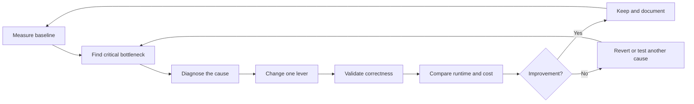

# Query Tuning Feedback Loop

> Measure where the time goes, fix the cause that owns that time, prove correctness, and compare runtime and credits before keeping the change.

## Executive Summary

- **What it is:** A repeatable method for improving dbt and Snowflake performance using evidence rather than isolated tuning tricks.
- **Why it matters:** The same slow dbt model can be caused by queueing, excessive scans, a many-to-many join, spill, target-side merge work, or insufficient compute; each requires a different response.
- **Mental model:** **Baseline → locate → diagnose → change one thing → validate → compare → keep or revert.**
- **Best used when:** A representative run, dbt artifacts, query tags, Snowflake Query History, and Query Profile are available.
- **Avoid or reconsider when:** Runs are not comparable or faster execution is accepted without proving data correctness and total cost.

## What It Can Do

- Find models on the dbt critical path rather than tuning whichever query looks interesting.
- Separate time spent waiting from time spent executing.
- Link dbt model timings to Snowflake queries.
- Identify poor pruning, exploding joins, expensive aggregation, spill, and merge overhead.
- Test whether changes to SQL, model shape, materialization, threads, or compute actually help.
- Establish repeatable performance baselines and regression evidence.

## What It Cannot Do

- Make non-comparable runs into valid experiments.
- Guarantee that the slowest model is the best optimization target.
- Make an incorrect grain or join safe by adding compute.
- Prove correctness from runtime metrics alone.
- Attribute shared-warehouse cost precisely without query tags and workload ownership.
- Turn one fast, cache-assisted run into a reliable production conclusion.

## Core Concepts

| Concept | Meaning | Why it matters |
|---|---|---|
| Baseline | Recorded behavior before a change | Provides something trustworthy to compare against |
| Critical path | Dependency chain controlling total dbt duration | Improving work outside it may not shorten the job |
| Queue time | Time waiting for compute, provisioning, or locks | Usually requires concurrency, scheduling, or warehouse action |
| Execution time | Time Snowflake actively processes the statement | Points toward SQL, data shape, physical design, or compute |
| Pruning | Avoiding irrelevant micro-partitions | Reduces data scanned and work performed |
| Exploding join | Join output greatly exceeds its inputs | Often indicates incorrect grain or many-to-many logic |
| Spill | Intermediate data moves from memory to local or remote storage | Signals memory pressure or excessive intermediate results |
| Query Profile | Operator-level view of where execution time is spent | Locates expensive scans, joins, aggregates, sorts, and writes |
| Controlled experiment | One meaningful change against a comparable baseline | Shows which action caused the result |

## How It Works (Simple Flow)

1. Define the objective: delivery window, reliability, credits, or consumer latency.
2. Record a representative baseline including selection, data volume, run type, threads, warehouse, timings, and credits.
3. Use `run_results.json` and the DAG to identify critical models and tests.
4. Correlate those nodes with Snowflake Query History and inspect the most expensive Query Profile operators.
5. Classify the bottleneck as queueing, scan/pruning, join explosion, aggregation/sort, spill, write/merge, or dbt graph shape.
6. Change one relevant lever and rerun a comparable workload.
7. Validate data correctness, then compare runtime, reliability, and credits; keep or revert the change.

## Visuals



## Readable Snippets

`run_results.json` records executed nodes, statuses, timing, thread IDs, compiled SQL, and relation names. Retain it with the corresponding manifest so model timing can be compared across runs.

Use bounded Snowflake history queries to locate relevant statements:

```sql
select
    query_id,
    query_tag,
    warehouse_name,
    total_elapsed_time,
    execution_time,
    queued_overload_time,
    transaction_blocked_time,
    bytes_scanned,
    partitions_scanned,
    partitions_total,
    bytes_spilled_to_local_storage,
    bytes_spilled_to_remote_storage
from snowflake.account_usage.query_history
where start_time >= dateadd(day, -7, current_timestamp())
  and warehouse_name = 'DBT_PROD_WH'
order by total_elapsed_time desc
limit 50;
```

Interpret the first strong signal:

| Observation | First investigation |
|---|---|
| High overload queue time | Threads, overlapping jobs, isolation, or multi-cluster |
| Most partitions scanned | Filters, incremental boundary, and pruning |
| Join output greatly exceeds inputs | Grain, uniqueness, and join conditions |
| Large aggregation or sort | Earlier filters, pre-aggregation, and model shape |
| Remote spill | Row explosion, query width, staging, or warehouse memory |
| Merge scans a large target | Unique key, target predicate, and incremental strategy |
| Few dbt nodes run concurrently | DAG dependencies and critical path |

## Consultant Talking Points

- **Client question this answers:** "Which change will improve this pipeline rather than merely move or hide its bottleneck?"
- **Trade-offs to mention:** Larger compute may meet a strict window but increase cost; more materialization can speed repeated work but add storage and orchestration; narrower incremental windows reduce work but can miss late data.
- **Risk or governance angle:** Performance changes must retain tests, reconciliation, historical completeness, and approved business grain. Keep evidence for material production changes.
- **Cost/performance angle:** Compare total credits and stable runtime percentiles, not only one wall-clock result.

Use this order of reasoning:

1. Confirm correctness and grain.
2. Fix unnecessary rows, columns, scans, joins, and repeated work.
3. Choose the appropriate materialization or incremental behavior.
4. Tune threads, scheduling, isolation, and warehouse capacity for the remaining workload.

Example: if a 12-minute query spends 10 minutes in the warehouse queue, SQL rewriting is not the first lever. If it spends 11 minutes executing an exploding join, adding threads will not fix the cause.

## Common Pitfalls

- Tuning the longest model without checking whether it controls the critical path.
- Upsizing the warehouse before reviewing an incorrect join or ineffective filter.
- Changing threads, warehouse size, SQL, and clustering in one experiment.
- Comparing a full refresh with an incremental run or different data volumes.
- Ignoring Snowflake result cache and competing workloads.
- Narrowing an incremental window without testing late-arriving records.
- Removing `distinct` or changing grain for speed without validating duplicates.
- Treating local or remote spill as only a warehouse-sizing problem.
- Using multi-cluster to accelerate one slow query.
- Declaring success from runtime while credits or downstream latency increase.

## When to Recommend What (Decision Table)

| Situation | Recommend | Why | Watch-outs |
|---|---|---|---|
| Query mostly waits in overload queue | Tune threads and scheduling; isolate workloads; evaluate multi-cluster | The main problem is concurrency | Multi-cluster can multiply credits |
| One query executes slowly with little queueing | Inspect Query Profile and optimize the dominant operator | Targets actual execution work | Keep data grain and semantics unchanged |
| Most source or target partitions are scanned | Improve filters, incremental boundaries, and pruning | Reduces work at its source | Include late data and corrections |
| Join creates excessive intermediate rows | Fix grain, uniqueness, or join condition | Often improves both correctness and performance | Reconcile matched and unmatched records |
| Query spills remotely after logical tuning | Test a larger warehouse | More memory may reduce spill | Prove runtime benefit against higher credit rate |
| Stable transformation is recalculated repeatedly | Materialize an intermediate result | Avoids repeated expensive computation | Storage, freshness, and dependency ownership |
| Performance varies between runs | Compare several like-for-like runs and query hashes | Separates trends from noise | Control cache, volume, and concurrency where possible |
| Regulated finance model changes | Add reconciliation and retained before/after evidence | Performance cannot weaken control quality | Define approval and rollback |

## Related Topics

- [[02 dbt/04 Incremental Processing and Performance/Incremental Processing and Performance Overview|Incremental Processing and Performance Overview]]
- [[02 dbt/04 Incremental Processing and Performance/31 Incremental Models and Unique Keys|Incremental Models and Unique Keys]]
- [[02 dbt/04 Incremental Processing and Performance/37 Threads Warehouse Sizing and Snowflake Cost|Threads, Warehouse Sizing, and Snowflake Cost]]
- [[01 Snowflake/02 Performance and Optimization/06 Query Profile|Query Profile]]

## Related Decision Notes

- [[80 Comparisons and Decision Notes/Decision Notes/Snowflake/Decisions - Choosing a Warehouse Strategy by Workload Type|Decisions - Choosing a Warehouse Strategy by Workload Type]]
- [[80 Comparisons and Decision Notes/Comparisons/Snowflake/Comparison - Bigger Warehouse vs Clustering|Comparison - Bigger Warehouse vs Clustering]]
- [[80 Comparisons and Decision Notes/Comparisons/Snowflake/Comparison - Virtual Warehouse Size vs Multi-cluster|Comparison - Virtual Warehouse Size vs Multi-cluster]]

## Questions

- What is the measurable objective and current baseline?
- Which dbt nodes control the critical path?
- Is time spent queueing, executing, spilling, blocking, or waiting on dependencies?
- Which single change is most likely to address that cause?
- How will correctness and late-arriving data be validated?
- Did the change improve normal runtime, reliability, and credits across comparable runs?

## Sources To Revisit

- [dbt Developer Hub - Run results JSON file](https://docs.getdbt.com/reference/artifacts/run-results-json)
- [Snowflake Documentation - Monitor query activity with Query History](https://docs.snowflake.com/en/user-guide/ui-snowsight-activity)
- [Snowflake Documentation - Using query insights](https://docs.snowflake.com/en/user-guide/query-insights)
- [Snowflake Documentation - Exploring execution times](https://docs.snowflake.com/en/user-guide/performance-query-exploring)
- [Snowflake Documentation - Queries too large to fit in memory](https://docs.snowflake.com/en/user-guide/performance-query-warehouse-memory)
