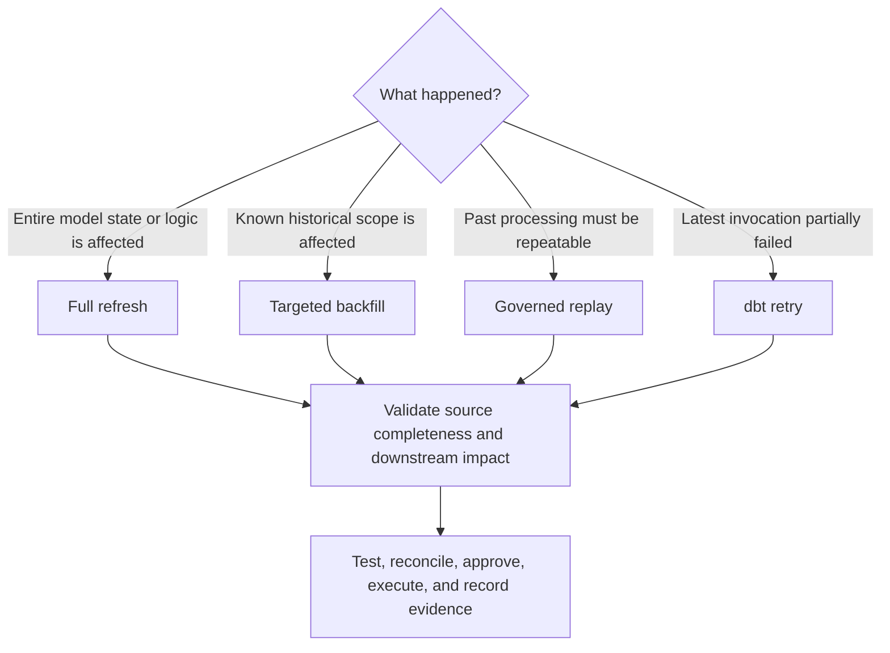
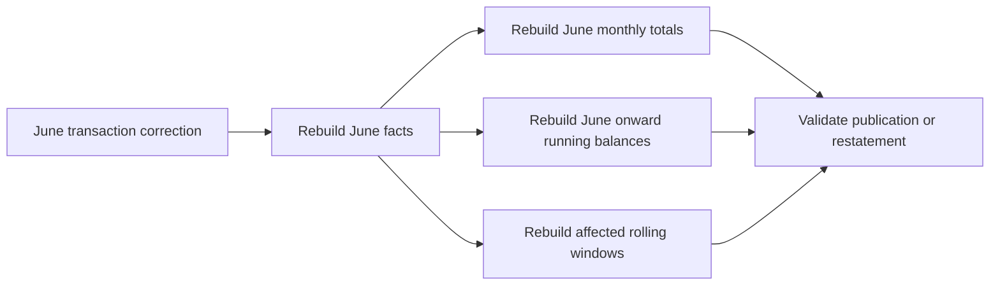

# Full Refreshes, Backfills, and Replay

> A full refresh rebuilds the whole selected model, a backfill repairs a bounded historical scope, and replay makes past processing safely repeatable.

## Executive Summary

- **What it is:** Three approaches for reconstructing or correcting dbt outputs after logic changes, missing data, failed processing, corruption, or recovery events.
- **Why it matters:** Choosing too broad a method wastes compute and increases operational risk; choosing too narrow a scope can leave downstream data inconsistent.
- **Mental model:** **Full refresh = everything; backfill = selected history; replay = repeatable historical execution.**
- **Best used when:** Source history, target grain, time boundaries, downstream impact, validation, rollback, cost, and approval are understood before execution.
- **Avoid or reconsider when:** The source no longer retains the required history, historical inputs are mutable and unversioned, or a closed reporting period cannot be silently restated.

## What It Can Do

- Rebuild an incremental model from all available source data.
- Repair missing or incorrect historical periods without rebuilding everything.
- Apply corrected business logic retroactively from a defined date.
- Reprocess independent microbatch windows and retry failed batches.
- Recover a corrupt incremental target when the source is reconstructable.
- Support deterministic and auditable recovery when inputs, code, keys, and parameters are retained.
- Reconcile corrected results before downstream publication.

## What It Cannot Do

- Recover source states or events that were overwritten before being captured.
- Make append-only writes replay-safe without keys, deduplication, or batch replacement.
- Guarantee that rebuilding one model repairs every downstream aggregate.
- Reproduce an original result from current mutable dimensions or reference data.
- Make `--full-refresh` inexpensive or low-risk for a very large model.
- Replace formal restatement controls for closed finance or regulatory periods.
- Turn `dbt retry` into a historical backfill; retry continues a failed invocation.

## Core Concepts

| Concept | Meaning | Why it matters |
|---|---|---|
| Full refresh | Complete reconstruction of a selected resource | Simplest recovery, but largest normal processing scope |
| Backfill | Reprocessing a bounded date, key, partition, or batch range | Limits cost and blast radius |
| Replay | Controlled rerun of past inputs and logic | Supports recovery, reproducibility, and auditability |
| Retry | Resume the prior dbt invocation from its failure point | Avoids rerunning nodes or batches that already succeeded |
| Idempotency | Repeating the same operation leaves the same correct final state | Prevents duplicates and inconsistent recovery |
| Correction scope | Rows or periods directly known to be wrong | Defines the input repair range |
| Impact scope | All downstream outputs affected by the correction | Can extend beyond the correction range |
| Event time | When the business event occurred | Common boundary for historical calculations |
| Load time | When the warehouse received the record | Often needed to find late-arriving records |
| As-of input | Version of data and logic valid at a chosen historical point | Required for true reproduction rather than current-state recalculation |

## How It Works (Simple Flow)

1. Identify why data must be reconstructed: logic change, missing source delivery, corruption, failed run, or disaster recovery.
2. Confirm that the necessary source history and reference data still exist.
3. Define correction boundaries using inclusive start, exclusive end, timezone, keys, and business-effective rules.
4. Trace downstream dependencies to determine the full impact scope.
5. Choose full refresh, targeted backfill, replay, or retry and estimate runtime, cost, contention, and publication impact.
6. Test against an isolated target or clone, then validate counts, keys, totals, boundaries, and downstream results.
7. Execute through an approved production process, reconcile again, publish or restate as required, and retain evidence and rollback details.

## Visuals



Correction scope can be smaller than impact scope:



## Readable Snippets

### Full-refresh one incremental model

```bash
dbt build --select fct_transactions --full-refresh
```

During this run, `is_incremental()` evaluates to false. The model SQL must therefore be valid when the target does not exist and must select all source history required for reconstruction.

Include descendants only when impact analysis shows they require rebuilding:

```bash
dbt build --select "fct_transactions+" --full-refresh
```

Preview the expanded scope with `dbt ls` because `+` can select a large part of the DAG.

### Protect a large model

```sql
{{ config(
    materialized='incremental',
    full_refresh=false
) }}
```

The resource-level `full_refresh` configuration overrides the command-line flag. Use this guardrail for models that require a separate approved reconstruction procedure.

### Parameterized backfill for a traditional incremental model

```sql



select
    transaction_id,
    event_time,
    amount,
    status
from {{ ref('stg_transactions') }}


where event_time >= '{{ backfill_start }}'
  and event_time <  '{{ backfill_end }}'

where loaded_at >= (
    select dateadd(day, -3, max(loaded_at))
    from {{ this }}
)

```

```bash
dbt build \
  --select fct_transactions \
  --vars '{"backfill_start": "2026-06-01", "backfill_end": "2026-07-01"}'
```

The target write must be idempotent. Use a validated `merge`, `delete+insert`, or complete batch replacement rather than uncontrolled append.

### Targeted microbatch backfill

```bash
dbt build \
  --select fct_transactions \
  --event-time-start "2026-06-01" \
  --event-time-end "2026-07-01"
```

Both boundaries are required and currently interpreted as UTC. dbt processes the interval as independent batches. Current guidance is generally to protect microbatch models with `full_refresh=false` and use bounded event-time backfills instead of casually rebuilding all history.

### Retry a failed invocation

```bash
dbt retry
```

`dbt retry` reads the prior `run_results.json` and re-executes from the failure point. For microbatch it can reprocess failed batches without rerunning successful ones. Use a deliberate backfill or replay when the prior successful result itself was wrong.

## Consultant Talking Points

- **Client question this answers:** "How do we correct historical data safely without rebuilding or republishing more than necessary?"
- **Trade-offs to mention:** Full refresh is simple but broad; backfill is efficient but needs precise boundaries and downstream analysis; replay offers strong recovery but requires versioned inputs, code, and idempotent design.
- **Risk or governance angle:** Record the reason, source version, code commit, parameters, approvals, affected outputs, reconciliation, publication decision, and rollback path. Closed-period changes may require a formal restatement.
- **Cost/performance angle:** Run large reconstructions on isolated compute, estimate source and target scans, bound parallelism, and restore temporary warehouse changes afterward.

### Full refresh versus backfill

| Dimension | Full refresh | Backfill |
|---|---|---|
| Processing scope | Entire selected model | Defined historical range |
| Implementation complexity | Usually lower | Usually higher |
| Compute and runtime | Potentially large | Normally bounded |
| Risk of broad downstream change | Higher | Lower if impact scope is correct |
| Best fit | Small model or globally affected logic | Large model with localized correction |

### Replay requires deterministic inputs

A repeated write can be idempotent while the result still changes because its inputs changed. True historical reproduction may require:

- Retained immutable events or source snapshots.
- Effective-dated joins rather than current dimension values.
- Versioned exchange rates, mappings, and reference data.
- The original code commit, configuration, variables, and timezone.
- Removal or controlled use of `current_timestamp()` and nondeterministic tie-breaking.

### Correction scope versus impact scope

| Model logic | Likely impact after correcting June |
|---|---|
| Independent daily total | Corrected days only |
| Monthly total | June |
| Seven-day rolling metric | Corrected days plus six later days |
| Running balance | Correction point through all future dates |
| Customer lifetime value | Affected customers and downstream aggregates |
| Published finance report | Governed restatement or versioned republication |

## Common Pitfalls

- Running `--full-refresh` on a huge model without estimating cost, duration, and downstream impact.
- Assuming full refresh restores history that no longer exists upstream.
- Forgetting that downstream models are not automatically rebuilt unless selected.
- Using event time when missing records are identifiable only by load time.
- Using an inclusive end boundary and processing midnight twice.
- Replaying append-only rows and creating duplicates.
- Rebuilding historical facts with current, unversioned dimension attributes.
- Correcting one month while ignoring later rolling, cumulative, or balance outputs.
- Running a large backfill on the warehouse serving BI dashboards.
- Treating a successful data test as sufficient reconciliation for financial totals.
- Using `dbt retry` when the completed data is logically wrong rather than operationally incomplete.
- Updating closed-period or published results without approval and evidence.

## When to Recommend What (Decision Table)

| Situation | Recommend | Why | Watch-outs |
|---|---|---|---|
| Small model with logic changed for all history | Full refresh | Simplest complete reconstruction | Source completeness and downstream rebuilds |
| Very large model with one incorrect month | Targeted backfill | Limits runtime and cost | Impact may extend beyond that month |
| Large time-series data with reliable event time | Microbatch backfill | Provides bounded, independent, idempotent batches | UTC boundaries and upstream `event_time` configuration |
| Latest dbt job partially failed | `dbt retry` | Continues from recorded failure state | Not suitable when successful results were wrong |
| Incremental target is broadly corrupted | Full refresh or controlled reconstruction | Restores a known consistent state | Cost, availability, grants, and rollback |
| Past reporting must be reproduced exactly | Governed replay with versioned inputs and code | Supports deterministic evidence | Mutable sources and nondeterministic logic |
| Source history was overwritten | Recover from CDC, snapshots, backup, or publication archive | dbt cannot reconstruct missing inputs | Confirm historical completeness first |
| Closed financial period is affected | Approved backfill plus formal restatement workflow | Preserves reporting governance | Communication, versioning, and audit evidence |
| Running balance changes historically | Backfill from correction point through affected future periods | Later balances depend on earlier state | Potentially large impact scope |
| Immutable events may be redelivered | Merge on event ID or replace complete batch | Makes replay idempotent | Quarantine conflicting payloads for one event ID |

## Related Topics

- [[02 dbt/04 Incremental Processing and Performance/Incremental Processing and Performance Overview|Incremental Processing and Performance Overview]]
- [[02 dbt/04 Incremental Processing and Performance/31 Incremental Models and Unique Keys|Incremental Models and Unique Keys]]
- [[02 dbt/04 Incremental Processing and Performance/33 Microbatch Incremental Models|Microbatch Incremental Models]]
- [[02 dbt/04 Incremental Processing and Performance/34 Parallel Microbatch Execution|Parallel Microbatch Execution]]
- [[02 dbt/04 Incremental Processing and Performance/37 Threads Warehouse Sizing and Snowflake Cost|Threads, Warehouse Sizing, and Snowflake Cost]]

## Related Decision Notes

- [[80 Comparisons and Decision Notes/Comparisons/dbt/Comparison - Full Refresh vs Backfill vs Replay|Comparison - Full Refresh vs Backfill vs Replay]]
- [[80 Comparisons and Decision Notes/Decision Notes/dbt/Decisions - Choosing a dbt Incremental Strategy on Snowflake|Decisions - Choosing a dbt Incremental Strategy on Snowflake]]
- [[80 Comparisons and Decision Notes/Decision Notes/dbt/Decisions - Choosing a Data History and Restatement Pattern|Decisions - Choosing a Data History and Restatement Pattern]]

## Questions

- Does the source retain all data required to reconstruct the target?
- Is the problem a failed invocation, bounded data defect, global logic change, or recovery event?
- Which timestamp and timezone define the correction boundary?
- Is the target write idempotent when the same scope runs twice?
- Does downstream impact extend beyond the corrected period?
- Which code and reference-data versions should the replay use?
- What reconciliation, approval, publication, and rollback controls are required?
- Which isolated warehouse and execution window keep the operation within budget and SLA?

## Sources To Revisit

- [dbt Developer Hub - Configure incremental models](https://docs.getdbt.com/docs/build/incremental-models)
- [dbt Developer Hub - `full_refresh` configuration](https://docs.getdbt.com/reference/resource-configs/full_refresh)
- [dbt Developer Hub - Microbatch incremental models and backfills](https://docs.getdbt.com/docs/build/incremental-microbatch)
- [dbt Developer Hub - `dbt retry`](https://docs.getdbt.com/reference/commands/retry)
- [dbt Developer Hub - Run results JSON file](https://docs.getdbt.com/reference/artifacts/run-results-json)
