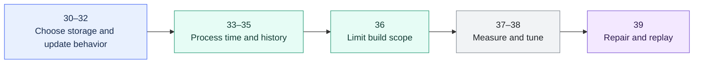

# Incremental Processing and Performance Overview

> How dbt models are materialized, selected, tuned, rebuilt, and operated efficiently on large Snowflake workloads.

> [!abstract] Chapter outcome
> You should be able to choose a processing pattern, control rebuild scope, and tune dbt concurrency and Snowflake compute with measurable cost and correctness controls.

## Topics

- [[02 dbt/04 Incremental Processing and Performance/30 Materializations|30 - Materializations]]
- [[02 dbt/04 Incremental Processing and Performance/31 Incremental Models and Unique Keys|31 - Incremental Models and Unique Keys]]
- [[02 dbt/04 Incremental Processing and Performance/32 Incremental Strategies|32 - Incremental Strategies]]
- [[02 dbt/04 Incremental Processing and Performance/33 Microbatch Incremental Models|33 - Microbatch Incremental Models]]
- [[02 dbt/04 Incremental Processing and Performance/34 Parallel Microbatch Execution|34 - Parallel Microbatch Execution]]
- [[02 dbt/04 Incremental Processing and Performance/35 Snapshots vs Incremental Models vs Dynamic Tables|35 - Snapshots vs Incremental Models vs Dynamic Tables]]
- [[02 dbt/04 Incremental Processing and Performance/36 Model Selection State and Deferral|36 - Model Selection, State, and Deferral]]
- [[02 dbt/04 Incremental Processing and Performance/37 Threads Warehouse Sizing and Snowflake Cost|37 - Threads, Warehouse Sizing, and Snowflake Cost]]
- [[02 dbt/04 Incremental Processing and Performance/38 Query Tuning Feedback Loop|38 - Query Tuning Feedback Loop]]
- [[02 dbt/04 Incremental Processing and Performance/39 Full Refreshes Backfills and Replay|39 - Full Refreshes, Backfills, and Replay]]

## Chapter Map

## Topic Summaries

| Topic | What it unlocks |
|---|---|
| [[02 dbt/04 Incremental Processing and Performance/30 Materializations\|30 - Materializations]] | Places compute and refresh ownership at build time, query time, or in the platform. |
| [[02 dbt/04 Incremental Processing and Performance/31 Incremental Models and Unique Keys\|31 - Incremental Models and Unique Keys]] | Separates change detection from target-row matching for reliable partial processing. |
| [[02 dbt/04 Incremental Processing and Performance/32 Incremental Strategies\|32 - Incremental Strategies]] | Chooses the correct replacement grain for append, merge, delete-and-insert, overwrite, or microbatch. |
| [[02 dbt/04 Incremental Processing and Performance/33 Microbatch Incremental Models\|33 - Microbatch Incremental Models]] | Divides large time-series workloads into bounded windows that can be retried or backfilled. |
| [[02 dbt/04 Incremental Processing and Performance/34 Parallel Microbatch Execution\|34 - Parallel Microbatch Execution]] | Uses safe batch independence and measured capacity to reduce wall-clock time. |
| [[02 dbt/04 Incremental Processing and Performance/35 Snapshots vs Incremental Models vs Dynamic Tables\|35 - Snapshots vs Incremental Models vs Dynamic Tables]] | Distinguishes history capture, processing efficiency, and platform-managed freshness. |
| [[02 dbt/04 Incremental Processing and Performance/36 Model Selection State and Deferral\|36 - Model Selection, State, and Deferral]] | Limits CI and production work to changed models and their real downstream impact. |
| [[02 dbt/04 Incremental Processing and Performance/37 Threads Warehouse Sizing and Snowflake Cost\|37 - Threads, Warehouse Sizing, and Snowflake Cost]] | Connects DAG concurrency, warehouse capacity, runtime, and credit consumption. |
| [[02 dbt/04 Incremental Processing and Performance/38 Query Tuning Feedback Loop\|38 - Query Tuning Feedback Loop]] | Turns performance tuning into an evidence-led cycle with correctness and cost checks. |
| [[02 dbt/04 Incremental Processing and Performance/39 Full Refreshes Backfills and Replay\|39 - Full Refreshes, Backfills, and Replay]] | Repairs the right historical scope while controlling downstream impact and audit evidence. |

## How To Use This Area

Follow the topics in order for a first pass. Later, use the table as a quick reference and jump directly to the decision or operating problem you need.

The global [[02 dbt/dbt Learning Map|dbt Learning Map]] links here, and each topic links back to this hub so Graph View stays readable.

## Related Areas

- [[02 dbt/dbt Learning Map|dbt Learning Map]]
- [[02 dbt/03 Testing Documentation and Data Quality/Testing Documentation and Data Quality Overview|Previous: Testing Documentation and Data Quality]]
- [[02 dbt/05 Deployment CI CD and Operations/Deployment CI CD and Operations Overview|Next: Deployment CI CD and Operations]]
