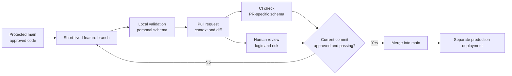
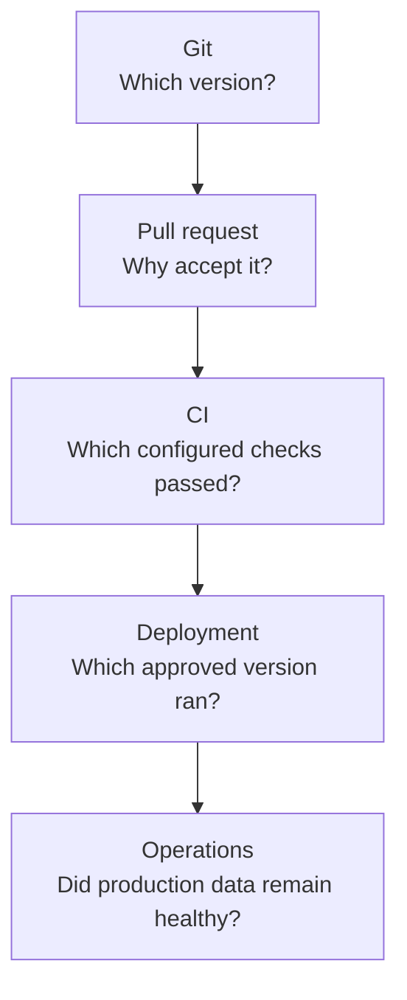

# Git Workflow and Pull Requests

> Git identifies the proposed version of a dbt project; a pull request provides the controlled doorway for reviewing, validating, and approving it before production deployment.

## Executive Summary

- **What it is:** A version-control workflow in which developers make dbt changes on short-lived branches, validate them through automated CI checks and human review, and merge approved changes into a protected main branch.
- **Why it matters:** dbt code defines shared data products. An apparently small SQL change can alter business definitions, break downstream models, expose sensitive data, or increase Snowflake cost.
- **Mental model:** **Git records the candidate version; the PR explains and reviews it; CI supplies automated evidence; deployment runs the approved version.**
- **Best used when:** Any dbt project has shared or production consumers. Use stronger ownership, review, and evidence requirements for finance, regulatory, security-sensitive, or high-blast-radius models.
- **Avoid or reconsider when:** Do not confuse branch-per-environment workflows, passing CI, or PR approval with proof that the data is correct. Very small experiments may begin with lighter controls, but production changes should not depend on direct edits to `main`.

## What It Can Do

- Keep an auditable history of dbt SQL, YAML, macros, tests, documentation, and configuration.
- Isolate one proposed change on a feature branch while `main` remains stable.
- Show an exact diff and retain the reason, discussion, review, and approval for a change.
- Trigger automated parsing, builds, tests, linting, contract checks, or project-governance checks.
- Require successful checks, reviews, and resolved conversations before code enters `main`.
- Connect a ticket, pull request, commit, deployment run, and production artifact into a traceable change record.
- Support rollback to a known code version, subject to the separate problem of restoring or rebuilding affected data.

## What It Cannot Do

- Prove that business logic is correct merely because the SQL compiles and configured tests pass.
- Create database isolation by itself; Git branches and Snowflake schemas are separate controls.
- Prove that the approved commit actually ran in production without deployment evidence.
- Prevent poor reviews, missing tests, inadequate CI coverage, or privileged administrators from bypassing controls.
- Roll back changed data merely by reverting code.
- Detect every downstream consumer outside dbt's known lineage.
- Replace production monitoring, reconciliation, incident response, or segregation of duties.

## Core Concepts

| Concept | Meaning | Why it matters |
|---|---|---|
| Repository | Version-controlled dbt project and supporting configuration | Durable source of truth for transformation code |
| `main` branch | Approved integration line, usually protected | Production deployment should resolve to an identifiable commit on this branch |
| Feature branch | Short-lived alternative history for one coherent change | Isolates work and keeps the review scope understandable |
| Commit | Named snapshot of related file changes | Creates traceable units of work and a deployable identifier |
| Pull request | Proposal to merge a source branch into a target branch | Central control point for context, review, CI evidence, and approval |
| Diff | Exact additions, removals, and modifications | Lets reviewers inspect what will change |
| Status check | Result reported by CI for a particular commit | Can block merging when required validation fails |
| Branch protection or ruleset | Git-provider policy applied to an important branch | Enforces reviews, checks, conversation resolution, and push restrictions |
| CI environment | Automated runtime that validates proposed code in an isolated target | Prevents PR validation from writing to shared production objects |
| Merge | Incorporates the approved change into `main` | Changes the shared code baseline but does not necessarily deploy it |
| Deployment | Executes an approved code version in the production runtime | Must remain traceable to the reviewed commit |
| `CODEOWNERS` | Rules that request owners when specified files change | Adds domain or control ownership for sensitive models |

## How It Works (Simple Flow)

1. A developer updates local `main` and creates a short-lived branch for one coherent change.
2. The developer changes dbt models, tests, documentation, or configuration and validates them in a personal schema.
3. Related files are committed, pushed, and presented in a pull request with the reason, impact, validation evidence, and operational considerations.
4. A PR event triggers CI using a dedicated identity, warehouse, and PR-specific schema.
5. CI parses and builds the configured scope, runs tests, and reports a status against the current commit.
6. A human reviewer evaluates business meaning, grain, joins, downstream impact, security, performance, and adequacy of the evidence.
7. Required checks and approvals allow the current commit to merge into protected `main`.
8. A separate deployment process runs that approved commit in production and preserves run evidence.

## Visuals



The controls answer different questions:



## Readable Snippets

### Basic developer workflow

```bash
git switch main
git pull
git switch -c feature/add-customer-segment

# Edit SQL, YAML, tests, and documentation.
dbt build --select customer_segment+

git add models/
git commit -m "Add customer segment to customer mart"
git push -u origin feature/add-customer-segment
```

Keep the branch focused. Do not hide a business-logic change inside unrelated formatting, package upgrades, renames, or cleanup.

### Managed CI in the dbt platform

Create the job from a dedicated CI deployment environment and begin with:

```bash
dbt build --select state:modified+
```

Recommended starting configuration:

| Setting | Starting recommendation |
|---|---|
| Git trigger | Pull requests targeting `main` |
| Environment | Dedicated CI environment connected to a staging or CI database |
| Deferral | Compare with the production environment |
| Command | `dbt build --select state:modified+` |
| Credentials | Dedicated least-privilege CI identity |
| Compute | Small controlled CI warehouse with timeout |
| Draft PRs | Run only when early feedback justifies the cost |
| Linting | Add as a separate signal; make it blocking only when stable |

The dbt platform listens for PR events, builds the modified resources and downstream dependants in a temporary PR schema, reports the result to the Git provider, and normally removes the schema after the PR closes or merges. Custom `generate_schema_name` logic must be tested because it can interfere with cleanup.

### Minimal GitHub Actions pattern for self-managed dbt

Store the workflow as `.github/workflows/dbt-ci.yml`:

```yaml
name: dbt-ci

on:
  pull_request:
    branches: [main]

permissions:
  contents: read

concurrency:
  group: dbt-ci-${{ github.event.pull_request.number }}
  cancel-in-progress: true

jobs:
  dbt-ci:
    name: dbt-ci
    runs-on: ubuntu-latest
    timeout-minutes: 30
    env:
      DBT_PROFILES_DIR: ${{ github.workspace }}
      DBT_CI_SCHEMA: dbt_ci_pr_${{ github.event.pull_request.number }}
      SNOWFLAKE_ACCOUNT: ${{ secrets.SNOWFLAKE_ACCOUNT }}
      SNOWFLAKE_USER: ${{ secrets.SNOWFLAKE_USER }}
      SNOWFLAKE_PASSWORD: ${{ secrets.SNOWFLAKE_PASSWORD }}
      SNOWFLAKE_ROLE: ${{ secrets.SNOWFLAKE_ROLE }}
      SNOWFLAKE_DATABASE: ${{ secrets.SNOWFLAKE_DATABASE }}
      SNOWFLAKE_WAREHOUSE: ${{ secrets.SNOWFLAKE_WAREHOUSE }}

    steps:
      - uses: actions/checkout@v6
      - uses: actions/setup-python@v6
        with:
          python-version: "3.12"
          cache: pip
      - run: pip install -r requirements.txt
      - run: dbt deps
      - run: dbt parse --target ci
      - run: dbt build --target ci
```

Pin the approved adapter version in `requirements.txt` rather than allowing an unexpected upgrade:

```text
dbt-snowflake==<approved-version>
```

A simplified CI output in `profiles.yml` can read its values from the runner environment:

```yaml
analytics:
  target: ci
  outputs:
    ci:
      type: snowflake
      account: "{{ env_var('SNOWFLAKE_ACCOUNT') }}"
      user: "{{ env_var('SNOWFLAKE_USER') }}"
      password: "{{ env_var('SNOWFLAKE_PASSWORD') }}"
      role: "{{ env_var('SNOWFLAKE_ROLE') }}"
      database: "{{ env_var('SNOWFLAKE_DATABASE') }}"
      warehouse: "{{ env_var('SNOWFLAKE_WAREHOUSE') }}"
      schema: "{{ env_var('DBT_CI_SCHEMA') }}"
      threads: 4
```

This password example keeps the mechanics readable. Prefer an approved key-pair or workload-identity pattern for production-grade CI. Keep credentials in the Git provider's secret store, never in the repository or logs.

Start with a full CI build when it is affordable:

```bash
dbt build --target ci
```

Introduce state-aware Slim CI only after the full workflow, trusted production manifest, deferral behavior, and cleanup process are understood:

```bash
dbt build \
  --select "state:modified+" \
  --defer \
  --state ./prod-artifacts \
  --target ci
```

### Make the check mandatory in GitHub

After the check has run at least once, create a branch ruleset for `main` and configure:

```text
Require pull request before merging
Require status checks to pass: dbt-ci
Require at least one relevant approval
Require conversation resolution
Restrict direct pushes and force pushes
Consider requiring the branch to be current with main
Restrict bypass permissions
```

The CI system creates the status. The Git provider's branch rules turn it into an enforced merge condition.

## Consultant Talking Points

- **Client question this answers:** "How do we stop an unreviewed dbt change from silently becoming production logic?"
- **Trade-offs to mention:** More checks and broader builds increase confidence but also feedback time, runner usage, Snowflake compute, temporary storage, and maintenance. Managed dbt CI reduces custom engineering; self-managed pipelines provide control but transfer runtime, artifact, secret, cleanup, and support ownership to the client.
- **Risk or governance angle:** Protect `main`, separate author and approver where required, use `CODEOWNERS` for sensitive domains, validate the latest commit, restrict bypasses, and keep production write privileges away from developer and CI identities.
- **Cost/performance angle:** Use a controlled CI warehouse, timeouts, cancellation of stale runs, PR-specific schemas, and eventually state-aware selection. Do not narrow CI so aggressively that it stops detecting meaningful downstream impact.

### What the evidence does and does not prove

| Evidence | It supports | It does not prove |
|---|---|---|
| Git history | Which files and commits changed | That the code ran in production |
| PR approval | A reviewer accepted the presented change | That the reviewer understood every data effect |
| Passing CI | Configured commands passed for the tested commit and data | That test coverage or business logic is complete |
| Deployment record | A particular version was invoked in an environment | That downstream data remained correct afterward |
| Production monitoring and reconciliation | Operational and data outcomes after deployment | Why a code change was originally approved |

### Reviewer checklist for a dbt PR

- Is the purpose and affected business definition clear?
- Is each model's grain preserved or intentionally changed?
- Can any join, filter, deduplication rule, or null treatment alter row counts unexpectedly?
- Are relevant tests, documentation, contracts, exposures, and versions updated?
- What downstream models, dashboards, extracts, or regulatory reports may change?
- Does the PR introduce sensitive columns or widen access?
- Could materialization, full refresh, scan volume, or model selection increase Snowflake cost?
- Is the change backward compatible, and is operational remediation understood?
- Does the evidence test the risky behavior rather than only compilation?

### Merge strategy

| Strategy | Best fit | Trade-off |
|---|---|---|
| Squash merge | Small PRs where the PR is the meaningful change unit | Individual branch commits do not remain on `main` |
| Merge commit | Teams that value complete branch history | Noisier history |
| Rebase and merge | Disciplined teams wanting linear history | Rewriting branch history can confuse less experienced users |

Squash merge is a sensible default for many analytics teams because commits such as "fix typo" and "address review" are less meaningful than the approved PR as a whole.

## Common Pitfalls

- Allowing direct pushes or force pushes to `main`.
- Treating Git branches as if they automatically create isolated Snowflake databases or schemas.
- Keeping feature branches open so long that conflicts, behavioral drift, and review size accumulate.
- Opening huge PRs that combine business logic, formatting, package changes, renames, and refactoring.
- Accepting rubber-stamp approval without a grain, impact, security, or cost review.
- Running only `dbt parse` and calling the change fully tested.
- Testing one changed model while ignoring affected downstream resources.
- Giving developer or CI identities permission to write production objects.
- Using one shared CI schema, allowing concurrent PRs to overwrite each other.
- Leaving abandoned PR schemas, clones, or artifacts without cleanup ownership.
- Committing passwords, private keys, or tokens; deleting them later does not remove them from Git history.
- Using unpinned dbt adapters, packages, or CI actions without an upgrade process.
- Requiring a path-filtered workflow that never reports a status for some PRs, leaving GitHub waiting indefinitely.
- Using `pull_request_target` with untrusted PR code and privileged secrets.
- Approving one commit and merging materially different later commits without renewed review.
- Assuming a merged revert restores previously changed data.
- Equating merge with production deployment or a successful deployment with healthy production data.

## When to Recommend What (Decision Table)

| Situation | Recommend | Why | Watch-outs |
|---|---|---|---|
| Small team beginning controlled dbt delivery | Protected `main`, short branches, focused PRs, one reviewer, and a required full `dbt build` | Simple workflow with strong basic protection | Full builds may become slow as the DAG grows |
| Client already uses the dbt platform | Native dbt CI job in a dedicated CI environment | Built-in PR triggers, state comparison, temporary schemas, status reporting, and cleanup | Subscription capabilities, platform boundary, credentials, custom schema macros |
| Client operates dbt Core or Fusion through engineering pipelines | GitHub Actions or the enterprise-standard CI runner | Portable and customizable | Client owns dependencies, secrets, artifacts, runners, cleanup, upgrades, and incident support |
| Large project with trusted production artifacts | Slim CI using `state:modified+` and deferral | Faster feedback with lower warehouse cost | Stale manifests, mixed CI/production graphs, and insufficient downstream scope |
| Small project with cheap execution | Full CI build before Slim CI | Easier to understand and gives broad validation | May not remain economical at scale |
| Regulated finance models | Independent approval, relevant code owners, protected branch, required current checks, deployment traceability | Supports change control and segregation of duties | Avoid approval theater; review bypass and emergency paths |
| Frequent merge conflicts | Smaller PRs, clearer ownership, and more frequent integration | Reduces divergence and review complexity | May require decomposing large business changes safely |
| Client proposes `dev`, `test`, and `prod` Git branches by default | Keep one protected `main` and separate runtime environments first | Avoids confusing code promotion with database isolation | Long-lived release branches may still be justified by a real release process |
| CI is noisy or unstable | Stabilize it before making every signal blocking | Required checks must remain credible and actionable | Do not permanently downgrade high-risk validation |
| Urgent production fixes frequently bypass review | Improve release, rollback, replay, and emergency-control design | Repeated bypass is an operating-model problem | Document and retrospectively review genuine break-glass changes |

## Related Topics

- [[02 dbt/05 Deployment CI CD and Operations/Deployment CI CD and Operations Overview|Deployment CI CD and Operations Overview]]
- [[02 dbt/04 Incremental Processing and Performance/36 Model Selection State and Deferral|Model Selection, State, and Deferral]]
- [[02 dbt/05 Deployment CI CD and Operations/41 Dev CI Staging and Prod Environments|Dev, CI, Staging, and Prod Environments]]
- [[02 dbt/05 Deployment CI CD and Operations/42 CI Jobs and Slim CI|CI Jobs and Slim CI]]
- [[02 dbt/05 Deployment CI CD and Operations/43 Deploy Jobs and Merge Jobs|Deploy Jobs and Merge Jobs]]
- [[02 dbt/05 Deployment CI CD and Operations/47 Secrets Service Accounts and RBAC|Secrets, Service Accounts, and RBAC]]

## Related Decision Notes

- [[80 Comparisons and Decision Notes/Decision Notes/dbt/Decisions - Choosing a dbt Environment and Credential Strategy|Decisions - Choosing a dbt Environment and Credential Strategy]]
- [[80 Comparisons and Decision Notes/Comparisons/Cross-Tool/Comparison - dbt Projects on Snowflake vs dbt Platform|Comparison - dbt Projects on Snowflake vs dbt Platform]]
- [[80 Comparisons and Decision Notes/Decision Notes/Cross-Tool/Decisions - Choosing a Snowflake DevOps and Deployment Pattern|Decisions - Choosing a Snowflake DevOps and Deployment Pattern]]

## Questions

- Which branch is the approved source of truth, and can any user or administrator bypass its rules?
- Which changes require a domain owner, data steward, security reviewer, or independent approver?
- What exact commands must pass, and what important failure modes remain outside their coverage?
- Does CI use a dedicated identity, warehouse, database, and PR-specific schema?
- Can the CI identity read sensitive production inputs, and which masking or row-access policies apply?
- Will CI start with a full build or use a trusted production manifest for Slim CI?
- How are stale runs cancelled and temporary schemas, clones, and artifacts cleaned up?
- How is the merged commit connected to the production deployment and later data-quality evidence?
- What is the documented break-glass path, and who reviews its use afterward?

## Sources To Revisit

- [dbt Developer Hub - Continuous integration in dbt](https://docs.getdbt.com/docs/deploy/continuous-integration)
- [dbt Developer Hub - Continuous integration jobs](https://docs.getdbt.com/docs/deploy/ci-jobs)
- [dbt Developer Hub - Customizing CI/CD with custom pipelines](https://docs.getdbt.com/guides/custom-cicd-pipelines)
- [dbt Developer Hub - Configure state selection](https://docs.getdbt.com/reference/node-selection/configure-state)
- [dbt Developer Hub - Defer to another environment](https://docs.getdbt.com/reference/node-selection/defer)
- [GitHub Docs - About pull request reviews](https://docs.github.com/en/pull-requests/collaborating-with-pull-requests/reviewing-changes-in-pull-requests/about-pull-request-reviews)
- [GitHub Docs - Status checks](https://docs.github.com/en/pull-requests/reference/status-checks)
- [GitHub Docs - Available rules for rulesets](https://docs.github.com/en/repositories/configuring-branches-and-merges-in-your-repository/managing-rulesets/available-rules-for-rulesets)
- [GitHub Docs - Using secrets in GitHub Actions](https://docs.github.com/en/actions/how-tos/write-workflows/choose-what-workflows-do/use-secrets)
