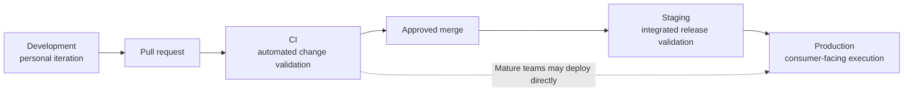
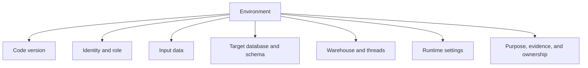

# Dev, CI, Staging, and Prod Environments

> Environments let substantially the same dbt project move from safe personal iteration to automated validation and controlled production execution without sharing identities, write targets, or operational responsibilities.

## Executive Summary

- **What it is:** An operating model that assigns development, continuous integration, staging, and production distinct purposes, code versions, identities, data access, target objects, compute, settings, and evidence.
- **Why it matters:** A Git branch or dbt target alone is not isolation. Without deliberate boundaries, developers and jobs can overwrite each other, tests can validate the wrong objects, and non-production identities can affect trusted production data.
- **Mental model:** **An environment is code version + identity + data + write target + compute + runtime settings + operational purpose.**
- **Best used when:** Any shared dbt project has multiple developers, automated pull-request checks, scheduled jobs, sensitive data, governed releases, or production consumers.
- **Avoid or reconsider when:** Do not create four environments merely to copy a standard diagram. Development, CI, and production solve distinct needs; add staging when it performs a defined integration, release, UAT, security, or performance-validation role.

## What It Can Do

- Give each developer an isolated workspace and personal attribution.
- Validate each proposed commit automatically in a temporary CI target.
- Provide a stable pre-production target for integrated release or user-acceptance testing when needed.
- Restrict production execution to approved code and a controlled service identity.
- Separate write permissions, source-data access, warehouses, threads, timeouts, and cost attribution by workload.
- Reduce blast radius by using separate schemas, databases, roles, warehouses, or Snowflake accounts.
- Preserve a traceable path from feature branch to CI evidence, approved commit, deployment run, and production result.
- Let the same dbt DAG operate against approved physical inputs in different environments without duplicating business logic.

## What It Cannot Do

- Create isolation merely by naming targets `dev`, `ci`, `staging`, and `prod`.
- Make a Git branch equivalent to a Snowflake database, role, warehouse, or account.
- Guarantee safety if every environment uses the same overpowered identity.
- Prove production-scale behavior when non-production data is stale, sampled, synthetic, or structurally different.
- Make environment-specific business definitions safe; different logic means non-production tests may not prove production behavior.
- Replace Git review, CI design, Snowflake RBAC, masking, row access, deployment controls, monitoring, reconciliation, or incident response.
- Justify a staging environment that has no owner, entry criteria, exit criteria, or distinct validation purpose.
- Promote mutable database objects safely without knowing which code and runtime configuration created them.

## Core Concepts

| Concept | Meaning | Why it matters |
|---|---|---|
| Environment | Complete runtime context in which a dbt project executes | More than a name: it combines code, identity, data, objects, compute, and purpose |
| Development | Human iteration using a feature branch and isolated personal target | Maximizes feedback speed without overwriting other developers or production |
| CI | Automated validation of one proposed commit in a temporary target | Supplies repeatable evidence before merge |
| Staging | Stable pre-production runtime for an integrated release | Supports UAT, cross-system, orchestration, security, or production-like validation |
| Production | Authoritative runtime that creates consumer-facing data | Requires approved code, controlled identity, retained evidence, and operational ownership |
| Code version | Commit or release that the environment executes | Makes results traceable and comparable |
| Execution identity | Human user, CI service identity, staging service identity, or production service account | Determines attribution and the maximum possible blast radius |
| Write target | Personal, PR-specific, staging, or production database/schema | Prevents environments from overwriting one another |
| Input-data strategy | Production reads, masked data, clones, subsets, synthetic data, or separate ingestion | Balances realism, privacy, cost, freshness, and isolation |
| Compute boundary | Warehouse, threads, timeout, scheduling, and query tagging | Separates concurrency, cost attribution, and performance expectations |
| Promotion | Moving an approved code version through controlled runtime contexts | Prefer promoting identifiable code over copying opaque mutable objects |
| Environment parity | Degree to which runtime version, configuration, data shape, permissions, and scale resemble production | Determines how much confidence non-production evidence provides |

## How It Works (Simple Flow)

1. A developer creates a feature branch and builds selected models with personal credentials in a personal Snowflake schema.
2. A pull request identifies the candidate commit and triggers CI with a dedicated CI identity, controlled warehouse, and PR-specific temporary schema.
3. CI builds and tests the configured impact scope, records evidence for that exact commit, and cleans up temporary objects according to policy.
4. Reviewers approve the current commit and it merges into the protected integration branch.
5. If the release requires integrated, business, security, orchestration, or production-like validation, a deployment service runs the approved release candidate in staging.
6. The production deployment process checks out the approved commit and executes it through a dedicated production identity.
7. Production artifacts, logs, query metadata, monitoring, and reconciliation show what ran and whether trusted data remained healthy.
8. Personal schemas, PR schemas, clones, staging objects, credentials, and artifacts follow documented lifecycle and retention rules.

## Visuals



Each environment is a bundle of controls:



## Readable Snippets

### Snowflake-oriented environment map

| Dimension | Development | CI | Staging | Production |
|---|---|---|---|---|
| Primary question | Can I build this idea safely? | Can this commit pass automated validation? | Does the integrated release behave like production? | Can trusted consumers rely on this data? |
| Actor | Human developer | CI service identity | Deployment service or release operator | Production service account |
| Code | Feature branch | Exact PR commit | Approved release candidate | Approved `main` or release commit |
| Write target | `ANALYTICS_DEV.DBT_SHONN` | `ANALYTICS_CI.PR_812` | `ANALYTICS_STG.MARTS` | `ANALYTICS_PROD.MARTS` |
| Role | Personal developer role | Least-privilege CI role | Staging deployment role | Production deployment role |
| Warehouse | Small dev warehouse | Controlled CI warehouse | Production-like when required | Production transform warehouse |
| Lifetime | Persistent but disposable | Temporary | Persistent | Persistent and governed |
| Trigger | Developer command | PR opened or updated | Release workflow | Schedule, event, or approved deployment |
| Evidence | Developer inspection | Automated check results | UAT/integration/release evidence | Artifacts, logs, monitoring, reconciliation |
| Production write | Never | Never | Never | Only through controlled process |

### Core/Fusion target shape

The connection mechanics belong primarily in [[02 dbt/01 Core Concepts and Project Structure/04 Environments Profiles Targets and Credentials|Environments, Profiles, Targets, and Credentials]], but the operating model typically maps to outputs like:

```yaml
investment_dbt:
  target: dev
  outputs:
    dev:
      type: snowflake
      role: DBT_DEV_ROLE
      warehouse: WH_DBT_DEV_XS
      database: ANALYTICS_DEV
      schema: DBT_SHONN

    ci:
      type: snowflake
      role: DBT_CI_ROLE
      warehouse: WH_DBT_CI_XS
      database: ANALYTICS_CI
      schema: "{{ env_var('DBT_CI_SCHEMA') }}"

    staging:
      type: snowflake
      role: DBT_STAGING_ROLE
      warehouse: WH_DBT_STAGING
      database: ANALYTICS_STG
      schema: MARTS

    prod:
      type: snowflake
      role: DBT_PROD_ROLE
      warehouse: WH_DBT_PROD
      database: ANALYTICS_PROD
      schema: MARTS
```

Real profiles also need approved account, user, authentication, threads, and connection settings. Keep secrets outside committed files.

### Keep one logical source while routing physical data

```yaml
sources:
  - name: core_banking
    database: "{{ env_var('CORE_BANKING_DATABASE') }}"
    schema: RAW
    tables:
      - name: transactions
```

The downstream project remains stable:

```sql
select *
from {{ source('core_banking', 'transactions') }}
```

The environment can route `CORE_BANKING_DATABASE` to an approved production, masked, cloned, or non-production source without duplicating the DAG.

### Runtime-aware logic: useful but limited

An acceptable development cost guardrail:

```sql
select *
from {{ source('core_banking', 'transactions') }}


where transaction_date >= dateadd(day, -7, current_date)

```

This makes development cheaper, but it also means development cannot prove full-history behavior.

Avoid different business definitions:

```sql
-- Risky: non-production no longer tests production logic.
where is_regulated_trade =
    {{ "true" if target.name == "prod" else "false" }}
```

### Code promotion is not database promotion

Preferred simple path:

```text
feature branch
  -> PR CI
  -> approved commit on main
  -> optional staging deployment
  -> production deployment of the same approved commit
```

Use a long-lived `staging` Git branch only when a real release-batching or promotion process justifies the merge complexity. Separate database environments do not require separate Git branches.

## Consultant Talking Points

- **Client question this answers:** "How should developers, pull-request automation, release validation, and production jobs share one dbt project without sharing the same blast radius?"
- **Trade-offs to mention:** More isolation increases safety and auditability but adds RBAC, data provisioning, secret management, cleanup, orchestration, cost, and operational ownership. Staging adds value only when it performs validation that CI cannot.
- **Risk or governance angle:** Separate identities and write privileges are more important than environment names. In regulated workloads, verify role inheritance, production-data access, masking and row access, author-versus-deployer separation, artifact retention, and the emergency path.
- **Cost/performance angle:** Development and CI usually use smaller warehouses, narrower selections, timeouts, and disposable objects. Production-like performance testing may require representative volume and compute in staging, but should be deliberate rather than continuously expensive.

### Dev, CI, staging, and prod are not interchangeable

| Environment | Optimized for | Why another environment cannot fully replace it |
|---|---|---|
| Development | Fast human feedback and exploration | CI is automated and disposable; it is not a personal workspace |
| CI | Repeatable per-commit validation before merge | Development results are not independent or consistently reproducible |
| Staging | Stable integrated release validation | PR-specific CI is temporary and often builds only affected resources |
| Production | Trusted service delivery | Non-production does not own authoritative consumer-facing outputs |

### CI versus staging

CI normally answers:

> Can this individual proposed commit build and pass our automated entry criteria?

Staging normally answers:

> Can the integrated release operate correctly with production-like dependencies, permissions, orchestration, consumers, scale, or business acceptance?

Staging is useful for:

- Formal business or regulatory UAT.
- Several repositories or systems changing together.
- End-to-end scheduler, dashboard, extract, or application validation.
- Permission and deployment rehearsal.
- Stable inspection over several days.
- Production-like performance and volume tests.

Staging may be unnecessary when small changes deploy continuously through strong CI, contracts, safe deployment, rollback or replay, and strong production monitoring.

### Input-data strategies

| Strategy | Strength | Main trade-off |
|---|---|---|
| Read approved production sources | High realism and freshness | Sensitive-data access and mixed-environment tests |
| Snowflake clones | Realistic structure and fast provisioning | Privileges, lifecycle, policy behavior, and storage after divergence |
| Masked production-like data | Useful realism with reduced exposure | Masking can change distributions and test behavior |
| Representative subset | Lower cost and faster iteration | Misses scale, rare cases, and full-history behavior |
| Synthetic data | Strong privacy and controlled edge cases | Expensive to make behaviorally realistic |
| Separate non-production ingestion | Strong operational separation | More infrastructure, lag, reconciliation, and ownership |
| Separate Snowflake account | Strongest boundary | More networking, governance, replication, and operational cost |

### Strength of isolation

Isolation should be evaluated across several controls:

1. **Schema separation** prevents basic write collisions.
2. **Database separation** strengthens object and privilege boundaries.
3. **Role separation** restricts what each identity can read and write.
4. **Warehouse separation** isolates concurrency and cost attribution.
5. **Data-policy separation** governs masking, row access, retention, and residency.
6. **Account separation** creates the strongest Snowflake administrative boundary.

A separate database with an inherited production-owner role is weak isolation. A separate role that still writes both CI and production schemas is also weak isolation.

### dbt platform terminology

The dbt platform distinguishes:

- A development environment for Studio IDE or dbt CLI development.
- Deployment environments for jobs.
- Deployment types including general, staging, and production.

The platform can designate one production environment as the source of truth for production state and platform features. These product objects help configure the operating model, but Snowflake roles, schemas, warehouses, data policies, and credentials still enforce the data-plane boundary.

## Common Pitfalls

- Using a single shared development schema, so developers overwrite and test one another's objects.
- Reusing one service account or role for CI, staging, and production.
- Allowing developer or CI roles to inherit production write privileges.
- Running production from a laptop or personal user.
- Treating `dev`, `ci`, `staging`, and `prod` names as proof of isolation without testing grants.
- Treating Git branches as database environments.
- Creating long-lived environment branches by default and accumulating divergence and repeated merges.
- Letting staging become stale, materially different from production, or unclear about what it certifies.
- Using environment-specific Jinja to change core business definitions.
- Testing with a small sample and assuming full-volume correctness, performance, or rare edge cases are proven.
- Copying sensitive data into non-production without equivalent masking, row-access, retention, or residency controls.
- Running every local and CI command on the production warehouse.
- Sharing one warehouse across interactive development, parallel CI, production transformations, and BI without cost or concurrency ownership.
- Failing to clean personal schemas, PR schemas, clones, temporary data, obsolete staging objects, and old artifacts.
- Deploying mutable objects without retaining the code commit, runtime version, configuration, and invocation evidence.
- Adding staging as an approval ceremony without entry criteria, exit criteria, accountable testers, or a distinct risk reduction.

## When to Recommend What (Decision Table)

| Situation | Recommend | Why | Watch-outs |
|---|---|---|---|
| Individual learner or short proof of concept | One personal development target | Minimizes setup while preserving safe iteration | Do not normalize personal execution as production |
| Several developers | Personal identities and schemas | Prevents collisions and supports attribution | Naming, grants, cleanup, and production-read policy |
| Any shared production project | Dedicated automated CI with PR-specific schemas | Validates proposed commits without writing trusted outputs | Data access, timeouts, concurrency, cleanup, and check scope |
| Small project with cheap execution | Full CI build | Simple, broad validation | Duration and compute may grow |
| Large project with trusted artifacts | State-aware Slim CI | Faster feedback and lower compute | Deferral, stale manifests, mixed environments, and downstream scope |
| Mature continuous-delivery team | Dev -> CI -> production | Keeps the path fast when automated controls are strong | Safe deployment, rollback/replay, monitoring, and small changes |
| Formal UAT or coordinated releases | Add stable staging | Provides an integrated release target | Prevent drift and define entry/exit criteria |
| Production-like performance testing | Temporary or scheduled staging test at representative scale | Tests volume, warehouse, and concurrency assumptions | Can be expensive; protect sensitive data |
| Sensitive production inputs | Masked data, approved clones, synthetic data, or tightly controlled production reads | Balances realism and confidentiality | Policies and distributions may differ |
| Regulated finance workload | Separate dev, CI, staging, and prod identities, roles, targets, and evidence paths | Reduces blast radius and supports segregation and auditability | More operational ownership and periodic access review |
| Client proposes branch-per-environment | Start with one protected integration branch and separate runtime contexts | Avoids conflating code promotion with database isolation | Release branches may still serve a documented batching need |
| Stronger administrative boundary required | Separate Snowflake accounts | Limits cross-environment blast radius | Data movement, networking, governance, and cost |
| Staging has no distinct tests or consumers | Remove it or define its purpose | Avoids cost and false confidence | Ensure CI and production safeguards cover the removed step |

## Related Topics

- [[02 dbt/05 Deployment CI CD and Operations/Deployment CI CD and Operations Overview|Deployment CI CD and Operations Overview]]
- [[02 dbt/01 Core Concepts and Project Structure/04 Environments Profiles Targets and Credentials|Environments, Profiles, Targets, and Credentials]]
- [[02 dbt/05 Deployment CI CD and Operations/40 Git Workflow and Pull Requests|Git Workflow and Pull Requests]]
- [[02 dbt/05 Deployment CI CD and Operations/42 CI Jobs and Slim CI|CI Jobs and Slim CI]]
- [[02 dbt/05 Deployment CI CD and Operations/43 Deploy Jobs and Merge Jobs|Deploy Jobs and Merge Jobs]]
- [[02 dbt/05 Deployment CI CD and Operations/47 Secrets Service Accounts and RBAC|Secrets, Service Accounts, and RBAC]]

## Related Decision Notes

- [[80 Comparisons and Decision Notes/Decision Notes/dbt/Decisions - Choosing a dbt Environment and Credential Strategy|Decisions - Choosing a dbt Environment and Credential Strategy]]
- [[80 Comparisons and Decision Notes/Decision Notes/Cross-Tool/Decisions - Choosing a Snowflake DevOps and Deployment Pattern|Decisions - Choosing a Snowflake DevOps and Deployment Pattern]]
- [[80 Comparisons and Decision Notes/Client Scenarios/Cross-Tool/Scenario - Manual Snowflake Changes Keep Breaking Dev Test Prod Consistency|Scenario - Manual Snowflake Changes Keep Breaking Dev Test Prod Consistency]]

## Questions

- What distinct risk or validation purpose does each proposed environment address?
- Which commit, runtime version, connection, and settings does each environment execute?
- Which human or service identity runs each environment, and what role hierarchy does it inherit?
- Where can each identity read, write, create, drop, or grant access?
- Should isolation use personal schemas, separate databases, separate accounts, or a combination?
- Which input-data strategy balances realism, privacy, freshness, and cost?
- Does the client genuinely need staging, and what are its entry and exit criteria?
- Which environment validates orchestration, permissions, consumers, scale, and UAT?
- Are any `target.name` branches changing business rules rather than routing or safe resource limits?
- How are schemas, clones, artifacts, credentials, and environment configuration cleaned up or retained?
- What proves that production ran the approved commit and remained healthy afterward?

## Sources To Revisit

- [dbt Developer Hub - dbt environments](https://docs.getdbt.com/docs/dbt-platform-environments)
- [dbt Developer Hub - Deployment environments](https://docs.getdbt.com/docs/deploy/deploy-environments)
- [dbt Developer Hub - dbt Core environments](https://docs.getdbt.com/docs/local/dbt-core-environments)
- [dbt Developer Hub - Continuous integration jobs](https://docs.getdbt.com/docs/deploy/ci-jobs)
- [dbt Developer Hub - About target variables](https://docs.getdbt.com/reference/dbt-jinja-functions/target)
- [dbt Developer Hub - About env_var](https://docs.getdbt.com/reference/dbt-jinja-functions/env_var)
- [Snowflake Docs - Overview of access control](https://docs.snowflake.com/en/user-guide/security-access-control-overview)
- [Snowflake Docs - Cloning considerations](https://docs.snowflake.com/en/user-guide/object-clone)
- [Snowflake Docs - Warehouse considerations](https://docs.snowflake.com/en/user-guide/warehouses-considerations)
