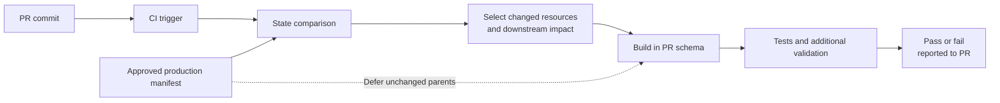
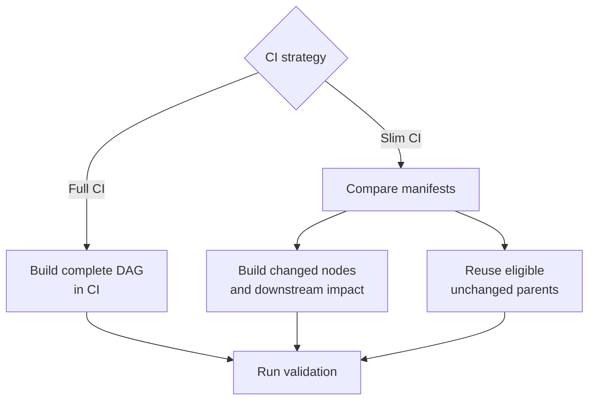
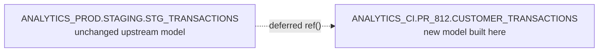

# CI Jobs and Slim CI

> A CI job validates the exact pull-request commit in an isolated target; Slim CI reduces redundant work by building changed resources and downstream impact while reusing eligible unchanged parents from an approved state.

## Executive Summary

- **What it is:** Pull-request automation that checks out proposed dbt code, selects a validation scope, builds and tests it in a temporary environment, reports evidence to the Git provider, and cleans up. Slim CI uses state comparison and deferral to avoid rebuilding the whole project.
- **Why it matters:** Full-project validation becomes slow and expensive as the DAG grows. Slim CI keeps feedback practical without giving the CI identity production write access.
- **Mental model:** **Slim CI = state comparison + impact selection + deferral + an isolated CI target.**
- **Best used when:** The project has a trustworthy production manifest, well-understood selectors, isolated PR schemas, approved access to deferred relations, and broader validation for risks that a narrow PR build cannot prove.
- **Avoid or reconsider when:** Use a full build when the project is small, artifacts are unreliable, strict data isolation is required, or the team does not yet understand mixed-environment tests and incremental-model behavior.

## What It Can Do

- Trigger repeatable validation whenever a PR is opened or updated.
- Validate the exact candidate commit rather than a developer's mutable local workspace.
- Build new or modified resources and affected downstream resources in a PR-specific schema.
- Reuse eligible, unchanged upstream relations from production or another approved environment.
- Run tests, contracts, unit tests, linting, project-governance checks, and optional semantic validation.
- Reduce Snowflake compute, temporary storage, and feedback time compared with rebuilding a large DAG for every PR.
- Cancel stale work when newer commits supersede an in-flight run.
- Report a pass or failure to a Git provider so branch protection can enforce it.
- Combine fast per-PR checks with scheduled full builds, staging validation, or production reconciliation.

## What It Cannot Do

- Prove the entire project works when only an impact scope was selected.
- Detect newly arrived warehouse rows; state compares project definitions, not data freshness.
- Guarantee that every external dashboard, extract, application, or manually coded dependency is represented in the dbt DAG.
- Reproduce an incremental branch automatically when the model's target table does not exist in CI.
- Make a mixed CI/production graph equivalent to a completely isolated environment.
- Defer `source()` references; deferral applies to eligible `ref()` resolution.
- Defer ephemeral models because they do not have persisted relations.
- Guarantee correct business logic merely because configured tests pass.
- Replace human review, deployment evidence, production monitoring, reconciliation, rollback, replay, or cleanup ownership.

## Core Concepts

| Concept | Meaning | Why it matters |
|---|---|---|
| CI job | Automated workflow triggered by a proposed code change | Produces consistent evidence before merge |
| Candidate commit | Exact Git SHA under review | Checks must apply to the version that may be merged |
| Full CI | Builds and tests the complete project in the CI target | Simplest and broadest validation, but can be slow and expensive |
| Slim CI | State-aware selection plus deferral in an isolated CI target | Avoids rebuilding unchanged parts of a large DAG |
| `manifest.json` | Artifact describing resources, dependencies, configuration, and relation locations | Supplies the approved comparison and deferral state |
| State comparison | Comparison of the current project with a previous manifest | Determines which dbt definitions changed |
| `state:modified` | Selector for dbt resources whose relevant definition changed | Forms the core change scope |
| Graph operator `+` | Expands selection through parents or children depending on position | A trailing `+` adds downstream impact |
| Deferral | Resolves eligible, unselected `ref()` targets through a previous manifest | Lets CI use unchanged upstream relations without rebuilding them |
| PR-specific schema | Temporary write target unique to one pull request | Prevents concurrent PRs from overwriting each other |
| Comparison baseline | Approved project state used to calculate changes | Must be trustworthy, compatible, and traceable to deployed code |
| Applied state | Relations that actually exist in an environment | May differ from the desired logical baseline in advanced deployments |
| Smart cancellation | Stops stale runs after a newer commit is pushed | Reduces queue time and wasted compute |
| Data comparison | Optional record-, count-, or aggregate-level comparison between candidate and baseline outputs | Adds behavioral evidence beyond successful execution |

## How It Works (Simple Flow)

1. A successful, approved production invocation publishes a trusted `manifest.json` and related artifacts.
2. A pull request event identifies the candidate commit and triggers the CI job.
3. The job checks out that commit and connects with a least-privilege CI identity to a PR-specific schema.
4. dbt compares the current project with the approved manifest and selects new or modified resources.
5. A trailing graph operator adds downstream resources that could behave differently because their inputs changed.
6. Selected resources build in the temporary CI schema; eligible unselected parent `ref()` calls can resolve to relations recorded in the deferred state.
7. Tests and additional checks run against the resulting graph, which may contain both CI-built and deferred relations.
8. The result is attached to the PR, temporary objects follow cleanup policy, and only the current passing commit can become merge-eligible.

## Visuals



Full CI and Slim CI take different paths:



## Readable Snippets

### Full CI

```bash
dbt build --target ci
```

Full CI is easy to reason about and does not require a previous manifest. Start here when it is affordable.

### Slim CI

```bash
dbt build \
  --select "state:modified+" \
  --state ./prod-artifacts \
  --defer \
  --target ci
```

This means:

- Compare the current project with `./prod-artifacts/manifest.json`.
- Select new or modified resources.
- Include their downstream dependants.
- Build selected resources in the current CI target.
- Resolve eligible unselected parent `ref()` calls through the saved state.

In a managed dbt CI job, the configured deferred environment can supply the state and deferral behavior, so the visible default command is commonly:

```bash
dbt build --select state:modified+
```

### Preview before building

```bash
dbt ls \
  --select "state:modified+" \
  --state ./prod-artifacts
```

Previewing matters because a central staging model or widely used macro can select most of the DAG.

### New `customer_transactions` mart

Assume the only changed file in the PR is:

```sql
-- models/marts/customer_transactions.sql

select
    customer_id,
    transaction_id,
    transaction_amount,
    transaction_timestamp
from {{ ref('stg_transactions') }}
```

With `state:modified+` and production deferral:

1. `customer_transactions` is new, so it is selected.
2. A trailing `+` includes anything downstream of it.
3. `stg_transactions` is unchanged and upstream, so it is not selected by the trailing `+`.
4. The eligible `ref('stg_transactions')` resolves to the production relation recorded in the manifest.
5. `customer_transactions` is created in the PR-specific CI schema.
6. Associated selected tests run if they are defined.



Because it is a completely new leaf model, it will usually have no existing downstream models. Existing project files cannot already call `ref('customer_transactions')` unless they also changed or were prepared in advance. The likely CI scope is therefore:

```text
customer_transactions
+ associated selected tests
```

The new model reads an approved upstream relation but never writes to production.

### `ref()` versus `source()`

Deferral can redirect an eligible upstream dbt model:

```sql
from {{ ref('stg_transactions') }}
```

That may compile to:

```text
ANALYTICS_PROD.STAGING.STG_TRANSACTIONS
```

A direct source is not deferred:

```sql
from {{ source('core_banking', 'transactions') }}
```

It resolves through the source configuration active in the CI project and target. That configuration might point to production raw data, masked staging data, a clone, or a separate non-production feed.

### When upstream resources also build

A prefix `+` includes parents:

```bash
dbt build \
  --select "+state:modified+" \
  --state ./prod-artifacts \
  --defer \
  --target ci
```

Upstream resources may also execute when:

- They were modified and therefore selected themselves.
- The selector explicitly includes parents.
- They are ephemeral and compile inline.
- The job performs a full build.
- A custom selector or test-selection rule requires them.

### Logical and applied state can differ

Most teams compare and defer against the same trusted production manifest. Advanced workflows can separate the code baseline from the relation baseline:

```bash
dbt build \
  --select "state:modified+" \
  --state ./approved-logical-state \
  --defer \
  --defer-state ./applied-production-state \
  --target ci
```

Use this only when the difference is intentional and documented.

### Changed incremental models

An incremental model built in an empty PR schema normally takes its initial-create path. That does not prove its incremental filter, `unique_key`, `merge`, late-arriving update, or target-state behavior.

On Snowflake, a controlled clone can provide realistic target state:

```bash
dbt clone --state ./prod-artifacts

dbt build \
  --select "state:modified+" \
  --state ./prod-artifacts \
  --defer \
  --target ci
```

Cloning adds privileges, sensitive-data, lifecycle, policy-behavior, and cleanup considerations.

### Layered CI commands

```bash
# Cheap project checks
dbt deps
dbt parse

# Warehouse validation
dbt build \
  --select "state:modified+" \
  --state ./prod-artifacts \
  --defer \
  --target ci
```

Optional layers include linting, unit tests, project-policy checks, data comparisons, reconciliations, and semantic validation. When semantic nodes are in scope, a managed job can add:

```bash
dbt sl validate --select state:modified+
```

## Consultant Talking Points

- **Client question this answers:** "How can we validate dbt pull requests quickly without rebuilding a large production DAG every time?"
- **Trade-offs to mention:** Full CI is simpler and broader. Slim CI is faster and cheaper, but depends on artifacts and may mix CI-built children with production-backed parents.
- **Risk or governance angle:** Retain the candidate commit, baseline commit, selector, identity, results, and deferred environment. The CI role should read only approved inputs, write only temporary CI objects, and never modify production.
- **Cost/performance angle:** State-aware selection, small warehouses, timeouts, concurrency controls, stale-run cancellation, and cleanup reduce waste. An overly broad `+`, macro change, expensive test, clone, or abandoned schema can still create material cost.

### Selection and deferral answer different questions

| Question | Mechanism |
|---|---|
| Which resources changed? | State comparison |
| Which resources should execute? | Selection |
| How far should impact validation extend? | Graph operators |
| Where should an unbuilt parent `ref()` point? | Deferral |

State selection does not automatically define deferral, and deferral does not determine what is selected.

### A passing check has a precise meaning

A passing Slim CI result supports:

> For this commit, using this comparison state, selector, identity, data mixture, and configured checks, the selected resources completed successfully.

It does not prove:

- The entire project rebuilt successfully.
- Every external consumer was tested.
- Production permissions or orchestration will work.
- Full production volume will perform adequately.
- An incremental branch was exercised.
- The comparison manifest was correct.
- Production data will reconcile after deployment.
- Business logic is correct beyond the evidence encoded in review and tests.

This distinction is especially important when CI evidence supports formal change control.

### CI job versus deployment job

| CI job | Deployment job |
|---|---|
| Runs proposed code | Runs approved code |
| Triggered before merge | Runs after approval or merge |
| Writes temporary objects | Writes persistent production objects |
| Uses a CI identity | Uses a production service identity |
| Makes a commit eligible to merge | Produces consumer-facing data |
| Should never write production | Has controlled production write access |

### Artifact ownership

A trustworthy comparison baseline should be:

- Produced by a successful approved deployment or deliberate manifest-refresh job.
- Associated with an identifiable code commit.
- Generated by a compatible dbt version.
- Stored outside the current run's output path.
- Protected from arbitrary partial jobs overwriting it.
- Representative of the relations that are actually deployed.

If production advances while a PR remains open, state comparison may identify changes introduced by other merged work. Merge or rebase the current target branch into the feature branch and rerun CI.

### Mixed-environment tests

Deferral may produce:

```text
CI-built child
joined to
production parent
```

That may be correct, but evaluate:

- Sampling or development limits.
- Different business dates or freshness.
- Masking and row-access behavior.
- Sensitive-data authorization.
- Cross-environment relationship tests.
- Whether the failure reflects code or mismatched data populations.

### Broader confidence without slowing every PR

Combine fast Slim CI with risk-based layers:

| Layer | Example |
|---|---|
| Fast static checks | Dependencies, parse, linting, YAML and project policy |
| PR warehouse checks | `state:modified+`, tests, contracts, unit tests |
| Specialized checks | Incremental clone, reconciliation, data comparison, semantic validation |
| Periodic integration | Nightly full build or stable staging validation |
| Production assurance | Artifacts, observability, freshness, reconciliation, incident response |

## Common Pitfalls

- Using a stale, partial, unsuccessful, untrusted, or incompatible manifest.
- Writing the prior manifest into the current `target/` directory and overwriting it before comparison.
- Treating `state:modified` as a detector for newly arrived source data.
- Omitting downstream expansion and missing affected consumers.
- Adding `+` without previewing scope and unexpectedly building most of the project.
- Treating broad selection after a central macro or staging-model change as a CI defect.
- Deferring to a temporary PR schema rather than stable approved state.
- Reusing a dirty CI schema so an unselected local relation is read instead of the intended deferred relation.
- Assuming `source()` is redirected by deferral.
- Expecting ephemeral resources to defer.
- Assuming an incremental model built in an empty schema exercised its incremental branch.
- Interpreting a mixed-environment relationship-test failure without checking data populations and policies.
- Giving the CI identity production write privileges.
- Allowing deferred reads to bypass approved masking, row-access, residency, or confidentiality rules.
- Letting PR schemas, clones, and artifacts accumulate without lifecycle ownership.
- Making every desirable signal blocking before it is stable and actionable.
- Making CI so narrow that a green check carries little information.
- Replacing human business-logic review with a passing automated check.
- Using `state:modified+` as the daily production selection even though unchanged code must still process new data.

## When to Recommend What (Decision Table)

| Situation | Recommend | Why | Watch-outs |
|---|---|---|---|
| Small project with cheap execution | Full CI build | Simple, broad, and independent of previous artifacts | Duration and compute can grow |
| Team has not yet operated state artifacts | Start with full CI | Establishes environment, permissions, tests, and cleanup first | Plan artifact ownership before scaling |
| Large project with trustworthy production artifacts | `state:modified+` with deferral | Faster feedback and less Snowflake work | Mixed graph, stale state, and downstream scope |
| New leaf mart model | Build the new model and tests; defer unchanged upstream `ref()` targets | Avoids rebuilding stable parents | Direct `source()` routing still comes from CI configuration |
| Central macro or widely used staging model changed | Allow broad impact selection | Many downstream nodes genuinely may change | Warehouse sizing, timeout, and reviewer expectations |
| Changed incremental logic must be tested | Clone or otherwise prepare realistic target state | Exercises merge/filter behavior rather than only initial creation | Privileges, sensitive data, clone cleanup |
| Strict data isolation is required | Build or clone the necessary upstream graph in an approved non-production environment | Avoids production/CI mixing | More provisioning, compute, storage, and test-data ownership |
| Production baseline is ambiguous | Create one deliberate artifact-producing job or merge job | Makes comparison state predictable | Document behavior when deployment lags `main` |
| Slim CI is fast but release risk remains high | Add targeted reconciliation, periodic full CI, or staging | Broadens confidence outside the PR critical path | Define which layer certifies which risk |
| Regulated finance workload | Slim CI with retained state, scope, identity, test, review, and deployment evidence | Combines efficiency with auditable change control | A green check remains limited evidence, not proof of correctness |

## Related Topics

- [[02 dbt/05 Deployment CI CD and Operations/Deployment CI CD and Operations Overview|Deployment CI CD and Operations Overview]]
- [[02 dbt/04 Incremental Processing and Performance/36 Model Selection State and Deferral|Model Selection, State, and Deferral]]
- [[02 dbt/05 Deployment CI CD and Operations/40 Git Workflow and Pull Requests|Git Workflow and Pull Requests]]
- [[02 dbt/05 Deployment CI CD and Operations/41 Dev CI Staging and Prod Environments|Dev, CI, Staging, and Prod Environments]]
- [[02 dbt/05 Deployment CI CD and Operations/43 Deploy Jobs and Merge Jobs|Deploy Jobs and Merge Jobs]]
- [[02 dbt/05 Deployment CI CD and Operations/45 Artifacts Logs and Run Results|Artifacts, Logs, and Run Results]]

## Related Decision Notes

- [[80 Comparisons and Decision Notes/Decision Notes/dbt/Decisions - Choosing a dbt Environment and Credential Strategy|Decisions - Choosing a dbt Environment and Credential Strategy]]
- [[80 Comparisons and Decision Notes/Decision Notes/dbt/Decisions - Choosing the Right dbt Quality Control|Decisions - Choosing the Right dbt Quality Control]]
- [[80 Comparisons and Decision Notes/Decision Notes/Cross-Tool/Decisions - Choosing a Snowflake DevOps and Deployment Pattern|Decisions - Choosing a Snowflake DevOps and Deployment Pattern]]

## Questions

- Which successful job and commit produce the trusted comparison manifest?
- Does that manifest represent approved logical code, actually deployed relations, or both?
- Should CI start with a full build or is the project ready for Slim CI?
- How far downstream should a change expand, and has the scope been previewed?
- Which unchanged parents may be deferred, and is production read access approved?
- Do any direct `source()` calls route to different data in CI?
- Could sampling, masking, row access, or freshness invalidate mixed-environment tests?
- Which incremental models need realistic target state or clones?
- What broader checks cover risks outside the Slim CI selection?
- How are stale runs cancelled and PR schemas, clones, and artifacts cleaned up?
- What exact claim is the organization willing to make from a green CI result?

## Sources To Revisit

- [dbt Developer Hub - Continuous integration jobs](https://docs.getdbt.com/docs/deploy/ci-jobs)
- [dbt Developer Hub - Continuous integration in dbt](https://docs.getdbt.com/docs/deploy/continuous-integration)
- [dbt Developer Hub - Advanced CI](https://docs.getdbt.com/docs/deploy/advanced-ci)
- [dbt Developer Hub - Configure state selection](https://docs.getdbt.com/reference/node-selection/configure-state)
- [dbt Developer Hub - Defer to another environment](https://docs.getdbt.com/reference/node-selection/defer)
- [dbt Developer Hub - State comparison caveats](https://docs.getdbt.com/reference/node-selection/state-comparison-caveats)
- [dbt Developer Hub - Graph operators](https://docs.getdbt.com/reference/node-selection/graph-operators)
- [dbt Developer Hub - dbt clone](https://docs.getdbt.com/reference/commands/clone)
- [dbt Developer Hub - dbt build](https://docs.getdbt.com/reference/commands/build)
