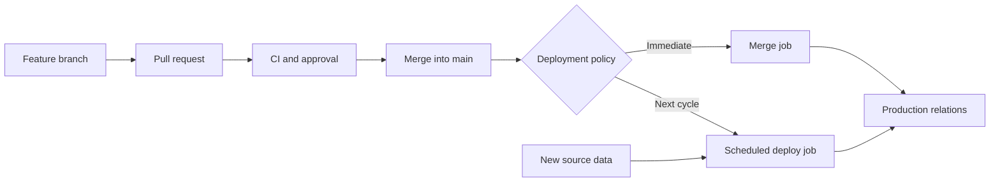
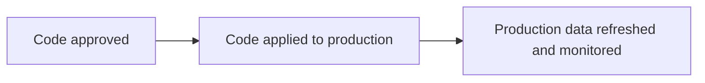

# Deploy Jobs and Merge Jobs

> Deploy jobs run persistent dbt workloads in an environment; merge jobs are deploy jobs triggered by approved code entering a Git branch.

## Executive Summary

- **What it is:** A deploy job runs dbt commands against a persistent environment on a schedule, event, API call, or manual trigger. A merge job starts because a pull request merged into the environment's tracked branch.
- **Why it matters:** Merging approves and integrates code, but another controlled process must apply that code to production data.
- **Mental model:** **Merge approves the version; a merge job can apply the change immediately; scheduled deploy jobs keep processing new data.**
- **Best used when:** Any production dbt project needs an explicit connection between approved Git commits, production execution, job evidence, and data-refresh expectations.
- **Avoid or reconsider when:** Do not automatically deploy every merge when the client needs release windows, coordinated changes, formal business approval, large backfills, or strict separation between code approval and production release.

## What It Can Do

- Run approved dbt code through a dedicated production identity.
- Execute complete or selected dbt workloads on a schedule or event.
- Apply new or modified models immediately after merge.
- Chain one production job after another.
- Record the trigger, commit SHA, environment, steps, logs, timings, and dbt artifacts.
- Refresh the production project manifest after code changes.
- Keep code-deployment timing separate from normal data-refresh timing.
- Support continuous deployment, scheduled releases, or a hybrid of both.

## What It Cannot Do

- Guarantee that a Git merge produced a successful production deployment.
- Make `state:modified+` process newly arrived data when model code is unchanged.
- Restore changed production data merely by reverting Git.
- Coordinate every external ingestion, application, dashboard, or extract without additional orchestration.
- Make overlapping production jobs safe automatically.
- Remove renamed or deleted relations automatically in every deployment pattern.
- Replace production alerts, reconciliation, rollback, replay, or incident ownership.
- Make a refreshed manifest equivalent to deployed production data.

## Core Concepts

| Concept | Meaning | Why it matters |
|---|---|---|
| Deploy job | dbt commands executed in a deployment environment | Performs persistent staging or production work |
| Merge job | Deploy job triggered by a PR merge into the tracked branch | Supports continuous deployment or fast state refresh |
| Scheduled deployment | Latest approved branch version is applied at the next scheduled job | Common when immediate deployment is unnecessary |
| Continuous deployment | Approved code is automatically applied after merge | Minimizes code-deployment delay |
| Production identity | Non-human credential and role used by production jobs | Separates production authority from developers and CI |
| Trigger | Schedule, merge, API, manual action, event, or upstream-job completion | Determines when production work begins |
| Job command | `dbt build`, `dbt parse`, a selected build, or another dbt command | Determines whether the job changes data or only metadata |
| `manifest.json` | Saved map of models, tests, sources, configurations, dependencies, and relation locations | Supports state comparison, deferral, Catalog, and traceability |
| Applied state | Code and relations actually deployed in the target environment | May temporarily differ from the latest merged branch |
| Deployment lag | Time between merge and production execution | Must be understood by developers, operators, and consumers |

## How It Works (Simple Flow)

1. A pull request passes CI and human review.
2. The approved commit merges into the branch tracked by the deployment environment, usually `main`.
3. Either a merge job runs immediately, or production waits for the next scheduled, manual, API, or orchestrated deploy job.
4. The job checks out an identifiable commit and connects through a controlled production identity.
5. dbt executes the configured commands and writes persistent production objects.
6. The run records logs, results, timings, commit information, and artifacts such as `manifest.json`.
7. Scheduled or event-driven jobs continue processing newly arrived data even when code has not changed.
8. Failures trigger operational response because Git and production may now represent different states.

## Visuals



The three events are related but distinct:



## Readable Snippets

### Regular deploy job

A scheduled production job usually runs a complete or business-selected workload:

```bash
dbt build
```

```bash
dbt build --select tag:hourly
```

It processes new data even when the project code has not changed.

### Merge job that applies changed code

```bash
dbt build --select state:modified+
```

This compares the newly merged project with previous state, then builds new or modified resources and their downstream dependants in the persistent target environment.

### Lightweight manifest-refresh merge job

```bash
dbt parse --no-partial-parse
```

This can update the environment manifest quickly without warehouse transformation work. It can keep later CI comparisons aligned with merged code, but:

```text
manifest refreshed != production data deployed
```

### Common three-hour schedule

It is normal to merge without running a merge job:

```text
10:15  PR merges into main
12:00  Normal three-hour deploy job starts
12:00  Job checks out latest main and applies the change
```

The trade-off is up to three hours of deployment lag. During that period:

- `main` contains the approved change.
- Production still runs the prior version.
- The production manifest may still describe the prior deployed state.
- CI for another PR may select some already-merged changes again.

This is acceptable when the delay is understood and the next scheduled job's selection includes the changed model.

### Merge job plus regular production cycle

```text
On merge:
    dbt build --select state:modified+

Every three hours:
    dbt build --select tag:three_hourly
```

The merge job applies code changes quickly. The three-hour job processes incoming data. Neither replaces the other.

## Consultant Talking Points

- **Client question this answers:** "When approved dbt code merges, should production change immediately or at the next controlled deployment window?"
- **Trade-offs to mention:** Deploying every merge reduces code lag but increases production activity and coordination needs. Scheduled deployment is predictable but allows `main`, the manifest, and production relations to differ temporarily.
- **Risk or governance angle:** Separate code approval from production authority where required. Retain the deployed commit, production identity, commands, results, and artifact baseline.
- **Cost/performance angle:** A state-aware merge build can avoid rebuilding the whole DAG, while scheduled jobs still need selections that process new data. Control warehouse size, concurrency, timeouts, and overlapping runs.

### Six-sentence explanation

A **deploy job** runs dbt commands against a persistent environment, usually production, based on a schedule, API call, event, or another trigger. A **merge job** is a deploy job that starts automatically when an approved pull request merges into `main`. It commonly runs `dbt build --select state:modified+` to apply changed models and their downstream dependants to production. Merge jobs do not replace scheduled production jobs because state comparison detects code changes, not newly arrived source data. Some teams deploy after every merge, while others wait for a scheduled or approved release window. The key distinction is: **merging approves the code, a deployment applies it, and recurring jobs keep production data refreshed.**

### Why the manifest matters here

The project manifest, `manifest.json`, is dbt's saved map of the project rather than a copy of the data. It describes resources, configuration, dependencies, and physical relation locations at a point in time. A successful production run can publish a manifest representing the deployed project state. A state-aware merge job compares newly merged code with that manifest to identify what changed. Later CI jobs can also use it to decide what to build and where unchanged parents exist. If the manifest is stale or produced by the wrong job, CI or merge selection may include the wrong scope or defer to missing relations. A parse-only merge job can refresh logical state quickly, but it does not prove those relations were applied to production.

### Deploy every merge or wait for the schedule?

| Pattern | Strength | Main trade-off |
|---|---|---|
| Build on every merge | Production follows approved code quickly | More production runs, concurrency risk, and immediate consumer impact |
| Wait for normal schedule | Simple and predictable | Deployment lag and temporary Git/production mismatch |
| Manual or release-window deployment | Strong release control | Slower delivery and more coordination |
| Parse on merge, build on schedule | CI state updates quickly without immediate warehouse work | Logical manifest can move ahead of applied relations |
| External orchestration | Coordinates dbt with ingestion and other systems | Additional platform and operational complexity |

Waiting for the natural three-hour cycle is common when:

- A delay of up to three hours is acceptable.
- The scheduled job always checks out the latest approved branch.
- Its model selection includes the merged change.
- Alerts make a later deployment failure visible.
- Urgent and high-risk changes have a separate release path.

### Failure after merge

If the production job fails after the PR merges:

```text
Git merge succeeded
Production deployment failed or partially completed
```

The response may require retry, fix-forward, Git revert plus redeployment, rebuilding affected models, or data repair. Reverting Git alone does not restore overwritten or partially updated data.

### Concurrency

Two close merges can trigger overlapping jobs that write the same production objects. Use one authoritative production pipeline and, where necessary, job serialization, a merge queue, concurrency controls, or release batching. Avoid having dbt jobs, GitHub Actions, Airflow, and Snowflake Tasks independently deploy the same models.

## Common Pitfalls

- Assuming a successful Git merge means production was updated.
- Using only `state:modified+` in production and forgetting unchanged models still need to process new data.
- Waiting for a schedule whose selection does not include the new model.
- Claiming data was deployed because a parse-only job refreshed the manifest.
- Letting several partial jobs create an unpredictable comparison manifest.
- Running production through a developer's personal credentials.
- Allowing merge-triggered production jobs to overlap writes.
- Deploying breaking changes immediately because CI passed.
- Forgetting explicit handling for full refreshes, backfills, contract breaks, renamed models, or deleted relations.
- Failing to alert when the scheduled post-merge deployment fails.
- Assuming Git revert also restores data.
- Scheduling in local time without checking that dbt platform cron schedules use UTC and do not adjust for daylight saving time.

## When to Recommend What (Decision Table)

| Situation | Recommend | Why | Watch-outs |
|---|---|---|---|
| Mature team, small changes, strong CI | `state:modified+` merge job | Minimizes code-deployment delay | Concurrency, consumer impact, and post-merge failures |
| Most production jobs run every three hours and delay is acceptable | Merge normally and wait for the scheduled deploy job | Simple and common operating model | Up to three hours of Git/production and manifest lag |
| New data must process regardless of code changes | Scheduled or event-driven deploy job | State comparison does not detect data arrival | Correct tags and selections |
| CI baseline becomes confusing during long production cycles | Deliberate lightweight manifest-refresh job | Updates logical comparison state quickly | Manifest can move ahead of applied relations |
| Regulated or coordinated release | Manual or scheduled release window after code approval | Separates technical approval from production authorization | More lead time and ownership |
| Several systems must release together | External orchestrator or controlled job chain | Coordinates cross-system dependencies | Avoid split deployment ownership |
| Multiple merges occur rapidly | Serialize production deployment or use a merge queue | Preserves execution order and stable writes | Queue latency |
| Urgent production fix | Immediate controlled deployment path | Avoids waiting for the next cycle | Retain approval, evidence, and incident controls |

## Related Topics

- [[02 dbt/05 Deployment CI CD and Operations/Deployment CI CD and Operations Overview|Deployment CI CD and Operations Overview]]
- [[02 dbt/05 Deployment CI CD and Operations/40 Git Workflow and Pull Requests|Git Workflow and Pull Requests]]
- [[02 dbt/05 Deployment CI CD and Operations/41 Dev CI Staging and Prod Environments|Dev, CI, Staging, and Prod Environments]]
- [[02 dbt/05 Deployment CI CD and Operations/42 CI Jobs and Slim CI|CI Jobs and Slim CI]]
- [[02 dbt/05 Deployment CI CD and Operations/44 Scheduling and Orchestration|Scheduling and Orchestration]]
- [[02 dbt/05 Deployment CI CD and Operations/45 Artifacts Logs and Run Results|Artifacts, Logs, and Run Results]]

## Related Decision Notes

- [[80 Comparisons and Decision Notes/Decision Notes/dbt/Decisions - Choosing a dbt Environment and Credential Strategy|Decisions - Choosing a dbt Environment and Credential Strategy]]
- [[80 Comparisons and Decision Notes/Decision Notes/Cross-Tool/Decisions - Choosing a Snowflake DevOps and Deployment Pattern|Decisions - Choosing a Snowflake DevOps and Deployment Pattern]]

## Questions

- Should approved code reach production immediately or at a scheduled release time?
- How much delay between `main` and production is acceptable?
- Which job and commit establish the authoritative production manifest?
- Does the normal production selection include every newly merged model that should run?
- Are code deployment and recurring data refresh separate commands or jobs?
- What happens when a deployment fails after merge?
- Can production jobs overlap or execute commits out of order?
- Which changes require a full refresh, backfill, coordinated release, or additional approval?
- How are renamed or deleted production relations removed safely?

## Sources To Revisit

- [dbt Developer Hub - Deploy jobs](https://docs.getdbt.com/docs/deploy/deploy-jobs)
- [dbt Developer Hub - Merge jobs](https://docs.getdbt.com/docs/deploy/merge-jobs)
- [dbt Developer Hub - Continuous deployment](https://docs.getdbt.com/docs/deploy/continuous-deployment)
- [dbt Developer Hub - Job scheduler](https://docs.getdbt.com/docs/deploy/job-scheduler)
- [dbt Developer Hub - Job commands](https://docs.getdbt.com/docs/deploy/job-commands)
- [dbt Developer Hub - Configure state selection](https://docs.getdbt.com/reference/node-selection/configure-state)
- [dbt Developer Hub - dbt artifacts](https://docs.getdbt.com/reference/artifacts/dbt-artifacts)
