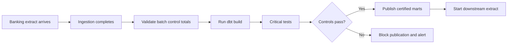
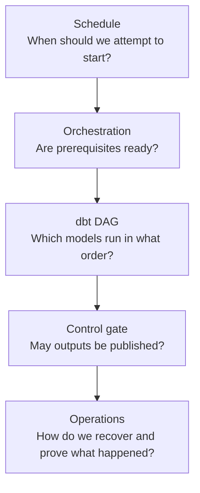

# Scheduling and Orchestration

> Scheduling decides when work should start; orchestration coordinates dependencies, conditions, recovery, evidence, and ownership across the wider data workflow.

## Executive Summary

- **What it is:** Scheduling starts jobs by time or event. Orchestration coordinates upstream readiness, dbt execution, tests, publication, downstream consumers, retries, backfills, alerts, and operational decisions.
- **Why it matters:** A clock can start dbt at 03:00, but it cannot prove that ingestion completed, control totals reconciled, or incomplete data should be withheld from consumers.
- **Mental model:** **A scheduler is an alarm clock; an orchestrator is a traffic controller.**
- **Best used when:** Every production dbt project needs a reliable trigger and owner. Use broader orchestration when dbt depends on ingestion, APIs, files, applications, approvals, business calendars, or cross-project workflows.
- **Avoid or reconsider when:** Do not introduce Airflow, Dagster, or another general platform merely to schedule one simple `dbt build`. Also avoid letting several tools independently own the same production models.

## What It Can Do

- Start dbt through a clock schedule, source event, API call, merge, manual action, or upstream-job completion.
- Wait for ingestion or validation evidence before transformations begin.
- Execute steps in sequence or parallel according to dependencies.
- Block publication when critical tests or reconciliations fail.
- Retry temporary failures and support intentional historical backfills.
- Control timeouts, concurrency, queues, overlapping runs, and resource use.
- Route alerts and operational evidence to the correct owner.
- Coordinate dbt with Snowflake, Fivetran, files, APIs, applications, BI extracts, and enterprise batch processes.
- Preserve run status, timestamps, parameters, logs, artifacts, and recovery decisions.

## What It Cannot Do

- Guarantee fresh or complete data merely because a job ran on time.
- Make a non-idempotent pipeline safe to retry.
- Infer business calendars, cutoff rules, publication controls, or incident ownership without explicit design.
- Eliminate the need for dbt tests, source freshness, reconciliation, monitoring, and runbooks.
- Prevent duplicate work when several independent schedulers trigger the same models.
- Make an over-scheduled job sustainable when runtime exceeds the trigger interval.
- Replace dbt's internal DAG more effectively by recreating one external task per model without a real operational reason.
- Solve production access, secrets, compute sizing, cost allocation, or audit retention by itself.

## Core Concepts

| Concept | Meaning | Why it matters |
|---|---|---|
| Schedule | Time-based rule such as every three hours | Simple trigger, but does not prove upstream readiness |
| Event trigger | Starts work after an event such as ingestion completion | Reduces fixed waiting and incomplete-input risk |
| Orchestrator | Control plane coordinating tasks, conditions, state, and recovery | Owns the end-to-end workflow rather than one command |
| dbt DAG | Dependency graph created from `ref()`, `source()`, tests, and resources | dbt already orders model-level work inside an invocation |
| Dependency | Requirement that must complete before another step starts | Prevents transformations or publication from running too early |
| Sensor or readiness check | Polls or listens for an external condition | Converts source availability into an execution decision |
| Retry | Reattempts failed work for the same logical run | Handles temporary failures when execution is repeatable |
| Backfill | Intentionally processes an earlier date, partition, or range | Corrects history or catches up missed work |
| Idempotency | Repeating the same logical operation produces the intended state | Makes retry and recovery safer |
| Concurrency control | Limits overlapping executions | Prevents conflicting writes and warehouse contention |
| Publication gate | Prevents consumer release until required controls pass | Separates successful SQL execution from trusted data availability |
| SLA/SLO | Expected availability, freshness, duration, or recovery level | Defines the outcome the workflow must deliver |
| Authoritative owner | One tool and team responsible for triggering and recovering the workflow | Avoids duplicate runs and split incident ownership |

## How It Works (Simple Flow)

1. The team defines the required business outcome, freshness target, cutoff, inputs, outputs, and accountable owner.
2. A clock, event, sensor, API, or upstream job signals that the workflow may begin.
3. The orchestrator verifies prerequisites such as source completion, business date, file arrival, or control totals.
4. It invokes a logical dbt workload; dbt uses its own DAG and threads to order model-level execution.
5. Critical tests and reconciliations determine whether data may be published.
6. Successful outputs trigger downstream extracts, applications, reports, or notifications.
7. Failures follow configured retry, block, escalation, or manual-intervention rules.
8. Logs, parameters, artifacts, timings, and recovery actions are retained for operations and audit.

## Visuals



Scheduling and orchestration answer different questions:



## Readable Snippets

### Clock-based dbt job

```bash
dbt build --select tag:three_hourly
```

This is appropriate when upstream delivery is predictable and the team accepts the risk and latency of a fixed schedule.

### Event-oriented flow

```text
ingestion_success
  -> validate_control_totals
  -> dbt build --select tag:finance_reporting
  -> critical_tests
  -> publish
  -> downstream_extract
```

The orchestrator should not publish when the reconciliation or critical tests fail.

### Keep dbt's internal DAG inside dbt

Preferred:

```bash
dbt build --select tag:finance_reporting
```

The external orchestrator treats this as a meaningful workload and lets dbt order:

```text
stg_transactions
  -> int_transactions
  -> fct_transactions
  -> data tests
```

Avoid recreating every dbt model as a separate external task unless different credentials, systems, SLAs, owners, or recovery boundaries genuinely require it.

### Retry versus backfill

```text
Retry:
The 2026-07-26 run failed temporarily
-> reattempt the same logical run

Backfill:
Recalculate 2026-07-01 through 2026-07-15
-> intentional historical processing
```

Both depend on explicit parameters and repeatable model behavior. Hooks, exports, snapshots, incremental logic, and external side effects need special care.

### Detect over-scheduling

```text
Schedule interval: 3 hours
Typical duration: 4 hours
Result: queue growth, cancelled runs, overlap, or missed expectations
```

Fix the scope or performance, change the cadence, or redesign the workload. Adding more scheduled starts does not create capacity.

## Consultant Talking Points

- **Client question this answers:** "Should dbt schedule itself, run through Snowflake, or be controlled by our existing enterprise orchestrator?"
- **Trade-offs to mention:** A dbt-native scheduler is simple and metadata-aware; Snowflake Tasks keep in-database workflows native; general orchestrators coordinate more systems but add platform ownership and code; enterprise schedulers fit central operations but may understand dbt only as a black-box job.
- **Risk or governance angle:** Define one authoritative trigger, production identity, publication gate, retry policy, backfill authority, manual override, and incident owner. Retain evidence across the complete chain, not only the dbt command.
- **Cost/performance angle:** Align frequency with business freshness, runtime, source arrival, warehouse capacity, and concurrency. Redundant triggers, broad selections, repeated retries, and overlapping jobs waste Snowflake compute.

### Scheduling versus orchestration

| Scheduling asks | Orchestration asks |
|---|---|
| When should the job attempt to start? | Are all prerequisites satisfied? |
| What recurrence or event triggers it? | What runs next and under which conditions? |
| Which timezone applies? | How are failures retried or escalated? |
| Should missed intervals catch up? | How are backfills parameterized and controlled? |
| Can another run start now? | Who owns the outcome and evidence? |

### Tool comparison

| Tool | Best fit | Strengths | Main trade-offs |
|---|---|---|---|
| dbt platform jobs | dbt-centric analytics workflow | Managed execution, Git integration, dbt logs/artifacts, schedules, API/manual/merge and job-completion triggers | Less suited as the enterprise controller for many unrelated systems |
| Snowflake Tasks | Workflow contained mainly inside Snowflake | Native schedules/triggers, task graphs, Snowflake RBAC, history, serverless or warehouse compute | Less capable for broad external coordination, rich backfill, and application workflows |
| Airflow | Complex multi-system workflow where Airflow already exists | Python DAGs, large integration ecosystem, sensors, retries, branching, backfills | Team owns workers, upgrades, packages, secrets, plugins, availability, and DAG quality |
| Dagster | Greenfield asset-oriented data platform | Asset model, partitions, lineage, observability, declarative dependencies, testability | Requires Dagster skills, integration design, and control-plane ownership |
| Enterprise scheduler | Bank-wide batch, applications, mainframe, files, and formal calendars | Central operations, SLA controls, broad connectivity, audit and release governance | Often less dbt-aware, licensed, and slower for analytics-engineering iteration |

### dbt platform jobs

The dbt scheduler supports cron, upstream-job completion, merge, API, and manual triggers. It prepares runtimes, queues jobs, loads credentials, and preserves logs and artifacts. This is a strong default when dbt is the primary production workload and cross-system coordination is modest.

Use caution when:

- Job duration exceeds its scheduled frequency.
- Run slots or queues delay freshness.
- Separate jobs write the same models.
- A clock schedule assumes ingestion is ready.
- The workflow needs broad application or file coordination outside dbt.

### Snowflake Tasks

Snowflake Tasks can run on a schedule or trigger, execute SQL and procedures, form task graphs, and use serverless or user-managed warehouse compute. They are a strong fit when the workflow remains inside Snowflake and the Snowflake platform team owns operations. A Task can also invoke a native dbt Project on Snowflake.

Prefer a broader orchestrator when the workflow requires many external APIs, files, applications, approvals, or complex cross-system recovery.

### Airflow

Airflow is valuable when the client already operates it as a data-platform standard and needs to coordinate ingestion, Python, Spark, dbt, Snowflake, files, APIs, and downstream exports. Its flexibility is real, but so is its operating cost. Do not introduce Airflow merely to avoid using one managed dbt schedule.

### Dagster

Dagster treats data assets, partitions, dependencies, and materialization state as first-class concepts. This can create a clear asset-oriented operating model for greenfield platforms. The choice should be driven by asset-centric requirements and team capability, not by novelty.

### Enterprise schedulers

In banking, an enterprise scheduler may already coordinate mainframe batches, core-banking extracts, file transfers, SAP workloads, regulatory reports, applications, and business calendars. A useful hybrid is:

```text
Enterprise scheduler owns the end-to-end batch
  -> triggers one governed dbt job
  -> dbt handles its internal model DAG
  -> returns status and artifacts
```

The enterprise scheduler does not need to recreate the internals of every dbt model.

### One clear orchestration owner

Multiple tools may participate, but one must own the final trigger and incident:

```text
Good:
Control-M -> dbt platform job -> dbt DAG

Risky:
Control-M + Airflow + dbt schedule + Snowflake Task
all independently run the same production models
```

The risky pattern creates duplicate work, overlapping writes, split alerts, inconsistent retries, and difficult incident reconstruction.

### Banking-specific control flow

```text
Required source batches arrived
  -> control totals reconcile
  -> business date is valid
  -> dbt transformations complete
  -> critical tests pass
  -> certified tables publish
  -> downstream reports and extracts start
```

Important design areas include:

- Business-date, holiday, cutoff, and month-end calendars.
- Restart from a known checkpoint.
- Idempotent retries and controlled backfills.
- Publication gates and consumer communication.
- Segregation between scheduler administration and data privileges.
- Retained evidence and manual-override procedures.

## Common Pitfalls

- Starting dbt at a fixed time without confirming source completion.
- Treating on-time execution as proof of fresh, complete, or valid data.
- Scheduling the same production models independently from multiple platforms.
- Rebuilding dbt's model DAG as one external task per model without a genuine boundary.
- Retrying a non-idempotent process and creating duplicates or repeated side effects.
- Treating retry and historical backfill as the same operation.
- Allowing overlapping runs to write the same incremental or snapshot targets.
- Scheduling more frequently than the job can complete.
- Ignoring queues, run-slot limits, warehouse contention, and downstream capacity.
- Using local time without defining timezone and daylight-saving behavior.
- Failing to define what happens when an event never arrives or arrives twice.
- Alerting on technical failure without an accountable business or data owner.
- Letting critical tests warn while downstream publication continues.
- Operating Airflow, Dagster, or an enterprise scheduler without clear platform ownership.
- Allowing the orchestrator's service identity broader Snowflake privileges than the workload requires.

## When to Recommend What (Decision Table)

| Situation | Recommend | Why | Watch-outs |
|---|---|---|---|
| Mostly dbt transformations on one platform | dbt platform jobs | Managed, dbt-aware, and simple | Cross-system scope and platform subscription |
| Workflow stays inside Snowflake | Snowflake Tasks | Native operations, RBAC, monitoring, and compute | Orchestration-lite for external dependencies and complex recovery |
| Client already has mature Airflow | Use Airflow as authoritative controller and invoke logical dbt workloads | Reuses established cross-system platform | Avoid one Airflow task per dbt model |
| Greenfield asset-oriented platform | Evaluate Dagster | Strong asset, partition, lineage, and testability model | Skills, operating ownership, integration maturity |
| Bank mandates enterprise batch scheduler | Let it own end-to-end flow and trigger dbt | Fits central calendars, SLAs, audit, and operations | Preserve dbt artifacts and model-level observability |
| One simple recurring dbt workload | Use the smallest managed scheduler already available | Avoids unnecessary platform complexity | Still configure alerts, identity, timeout, and ownership |
| Source arrival varies | Prefer event/dependency trigger with timeout monitoring | Avoids building incomplete inputs | Missing and duplicate event handling |
| Historical periods must be replayed | Parameterized, idempotent backfill workflow | Makes recovery deliberate and auditable | Incremental state, snapshots, exports, and side effects |
| Job exceeds schedule interval | Optimize, split by operational boundary, or reduce frequency | Prevents queue growth and overlap | Do not split only to hide poor performance |
| Several tools trigger the same models | Consolidate under one authoritative controller | Clarifies execution and incident ownership | Migration and downstream dependency coordination |

## Related Topics

- [[02 dbt/05 Deployment CI CD and Operations/Deployment CI CD and Operations Overview|Deployment CI CD and Operations Overview]]
- [[02 dbt/01 Core Concepts and Project Structure/01 What dbt Is and Is Not|What dbt Is and Is Not]]
- [[02 dbt/05 Deployment CI CD and Operations/43 Deploy Jobs and Merge Jobs|Deploy Jobs and Merge Jobs]]
- [[02 dbt/05 Deployment CI CD and Operations/45 Artifacts Logs and Run Results|Artifacts, Logs, and Run Results]]
- [[02 dbt/05 Deployment CI CD and Operations/48 Incident Response Rollback and Replay|Incident Response, Rollback, and Replay]]
- [[01 Snowflake/04 Data Engineering/20 Streams and Tasks|Streams and Tasks]]

## Related Decision Notes

- [[80 Comparisons and Decision Notes/Decision Notes/dbt/Decisions - Choosing a dbt Scheduling and Orchestration Pattern|Decisions - Choosing a dbt Scheduling and Orchestration Pattern]]
- [[80 Comparisons and Decision Notes/Comparisons/Cross-Tool/Comparison - dbt Projects on Snowflake vs dbt Platform|Comparison - dbt Projects on Snowflake vs dbt Platform]]
- [[80 Comparisons and Decision Notes/Decision Notes/Cross-Tool/Decisions - Choosing a Snowflake DevOps and Deployment Pattern|Decisions - Choosing a Snowflake DevOps and Deployment Pattern]]

## Questions

- What freshness or completion outcome does the client promise?
- Which source, event, business date, or control total proves the workflow may start?
- Is the workflow dbt-centric, Snowflake-contained, or broadly cross-system?
- Which scheduling or orchestration platform is already operated well?
- Which tool is the authoritative trigger and incident owner?
- What is the smallest meaningful dbt workload the external controller should invoke?
- Can every retry and backfill run safely more than once?
- How are overlapping runs, missed events, duplicate events, timeouts, and queues handled?
- Which failures block publication, and who may override the block?
- What logs and artifacts must be retained across the complete workflow?

## Sources To Revisit

- [dbt Developer Hub - Job scheduler](https://docs.getdbt.com/docs/deploy/job-scheduler)
- [dbt Developer Hub - Deploy jobs](https://docs.getdbt.com/docs/deploy/deploy-jobs)
- [dbt Developer Hub - Job commands](https://docs.getdbt.com/docs/deploy/job-commands)
- [Snowflake Docs - Introduction to Tasks](https://docs.snowflake.com/en/user-guide/tasks-intro)
- [Snowflake Docs - Task graphs](https://docs.snowflake.com/en/user-guide/tasks-graphs)
- [Snowflake Docs - Schedule dbt Project executions](https://docs.snowflake.com/en/user-guide/data-engineering/dbt-projects-on-snowflake-schedule-project-execution)
- [Apache Airflow - Architecture overview](https://airflow.apache.org/docs/apache-airflow/stable/core-concepts/overview.html)
- [Dagster Docs - Overview](https://docs.dagster.io/)
