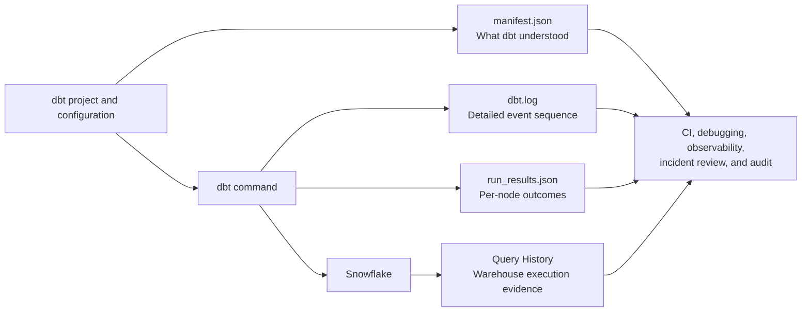
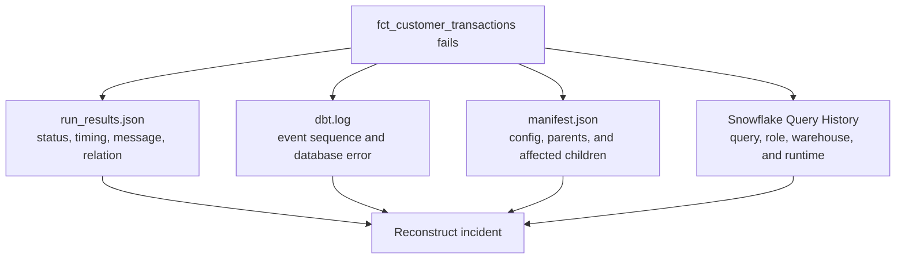

# Artifacts, Logs, and Run Results

> The manifest is dbt's blueprint, `run_results.json` is the invocation scorecard, logs are the detailed event history, and Snowflake Query History is the warehouse-side evidence.

## Executive Summary

- **What it is:** dbt produces structured JSON artifacts and detailed logs that describe the parsed project, selected execution, node outcomes, documentation metadata, and source-freshness checks.
- **Why it matters:** These files turn a green or red job into evidence that can support debugging, Slim CI, observability, performance analysis, incident review, and audit.
- **Mental model:** **`manifest.json` = what dbt understood; `run_results.json` = what this invocation attempted and how it ended; `dbt.log` = what happened in sequence; Snowflake Query History = what the warehouse executed.**
- **Best used when:** Retain and correlate them for CI, production jobs, failures, regulated workloads, runtime monitoring, retries, and state-aware selection.
- **Avoid or reconsider when:** Do not treat the local `target/` and `logs/` folders as durable storage, or treat a successful dbt status as proof that data is complete, correct, approved, or published.

## What It Can Do

- Describe the enabled project, resources, configurations, dependencies, selectors, and lineage at parse time.
- Record per-node status, timing, messages, relation names, compiled code, and adapter responses for an invocation.
- Show the detailed event sequence behind a compile, connection, SQL, test, or database failure.
- Provide the comparison state and deferral metadata required by Slim CI.
- Help `dbt retry` identify failed and skipped work from the previous invocation.
- Support docs, catalog generation, source-freshness monitoring, lineage, and metadata integrations.
- Build historical views of model duration, test outcomes, warnings, and failure patterns.
- Correlate dbt execution with Snowflake Query History for deeper performance and cost investigation.
- Preserve evidence of which code, command, environment, resources, and controls participated in a production run.

## What It Cannot Do

- Prove that technically successful SQL implemented the correct business rule.
- Prove that all expected resources, tests, or freshness checks were selected.
- Guarantee that successful models returned complete or reasonable row counts.
- Show full Snowflake compute cost from dbt execution time alone.
- Replace Git review, deployment approval, segregation of duties, control totals, or publication governance.
- Explain an external ingestion, BI, API, or file-transfer failure unless those systems contribute their own evidence.
- Recover historical evidence after an ephemeral runner disappears unless the files were persisted.
- Safely expose logs or compiled SQL without considering sensitive names, literals, metadata, and error messages.

## Core Concepts

| Concept | Meaning | Why it matters |
|---|---|---|
| Artifact | Versioned, structured output from a dbt command | Easier to automate, join, compare, and retain than console text |
| `manifest.json` | Full representation of enabled project resources and relationships known to dbt | Powers lineage, docs, state comparison, selection, and deferral |
| `run_results.json` | Outcomes for nodes involved in one completed invocation | Shows what was actually attempted and how each node ended |
| `dbt.log` | Detailed chronological execution events | Explains the sequence and context behind a result |
| `catalog.json` | Warehouse metadata such as relations, columns, and types from `dbt docs generate` | Enriches documentation with database-observed structure |
| `sources.json` | Source-freshness results from `dbt source freshness` | Supports freshness monitoring and source-SLA evidence |
| `unique_id` | Stable dbt resource identifier used across artifacts | Connects a run result to the resource definition in the manifest |
| `invocation_id` | Identifier associated with one dbt command invocation | Helps correlate artifacts, structured logs, job records, and telemetry |
| Structured log | Log events emitted as JSON rather than plain text | Easier for monitoring platforms to ingest and filter |
| Warehouse history | Snowflake-side record of queries, users, roles, warehouses, and timings | Confirms database activity and supports cost/performance investigation |
| Retention | Persisting evidence outside the working directory by invocation | Prevents later commands, cleanup, or runner termination from destroying history |

### Which output answers which question?

| Question | Best starting point |
|---|---|
| What resources and dependencies did dbt know about? | `manifest.json` |
| Which selected nodes ran, failed, warned, or skipped? | `run_results.json` |
| What happened immediately before the failure? | `dbt.log` |
| Was the source fresh enough? | `sources.json` |
| What columns and types existed when docs were generated? | `catalog.json` |
| Which SQL actually reached Snowflake, using which warehouse and role? | Snowflake Query History |
| What changed compared with the approved production state? | Current and comparison manifests |

### Manifest versus run results

The distinction is operationally important:

```text
manifest.json
  = the enabled project dbt parsed
  = may include nodes that were not selected

run_results.json
  = this command's completed node results
  = does not represent every node in the project
```

The same `unique_id`, for example `model.finance.fct_customer_transactions`, can be used to look up the execution result in `run_results.json` and the model's richer definition and dependencies in `manifest.json`.

### Common command outputs

| Command or activity | Important output |
|---|---|
| Parse or understand a project | `manifest.json` |
| `dbt run`, `build`, `test`, `seed`, or `snapshot` | `manifest.json`, `run_results.json`, compiled outputs, and logs |
| `dbt source freshness` | `sources.json` and logs |
| `dbt docs generate` | `manifest.json`, `catalog.json`, and related invocation results |
| Semantic Layer parsing | Semantic manifest |

Exact artifact availability depends on the dbt command and version. Artifact schemas are versioned, so downstream consumers should check the artifact schema and dbt version rather than assuming fields never change.

## How It Works (Simple Flow)

1. A CI, staging, or production job checks out a specific Git commit and starts a dbt command with known arguments and credentials.
2. dbt parses the project and writes `manifest.json`, describing the resources and graph it understands.
3. As selected nodes compile and execute, dbt emits console and file-log events.
4. Snowflake receives the generated queries and records warehouse-side execution history.
5. dbt writes `run_results.json` with the outcome of the nodes involved in that invocation; freshness and documentation commands may produce additional artifacts.
6. The job captures the command, selection, Git SHA, environment, identity, timestamps, artifacts, logs, and relevant Snowflake correlation metadata.
7. It stores this evidence outside the ephemeral working directory before another command overwrites files or cleanup removes them.
8. Operators, observability systems, CI, and auditors use the retained bundle to investigate, compare, alert, retry, or prove what happened.

## Visuals



### Failure investigation



## Readable Snippets

### Generate structured logs

```bash
dbt build \
  --select tag:finance_reporting \
  --log-format json
```

Structured JSON logs are easier to ingest into an observability platform. Human-readable text remains useful for interactive debugging.

### Keep the comparison manifest separate

```text
state/prod/manifest.json     <- approved comparison state
target/manifest.json        <- current invocation
target/run_results.json     <- current invocation results
logs/dbt.log                <- detailed current log
```

Do not copy the production state manifest into `target/` and then let the current command overwrite it.

### Retain evidence per invocation

```text
dbt-artifacts/
  prod/
    deploy-job-1234/
      invocation-5678/
        manifest.json
        run_results.json
        sources.json
        dbt.log
        execution-metadata.json
```

`execution-metadata.json` is an illustrative job-level record. It might contain the Git SHA, command, selection, target, dbt version, job ID, start/end time, and approved production identity.

### Read one model result

```json
{
  "unique_id": "model.finance.fct_customer_transactions",
  "status": "error",
  "execution_time": 42.8,
  "thread_id": "Thread-3",
  "relation_name": "FINANCE.PROD.FCT_CUSTOMER_TRANSACTIONS"
}
```

The exact available fields and adapter response vary by dbt artifact version and warehouse adapter.

### Correlate dbt with Snowflake

```text
dbt invocation and model identity
  -> query tag or recorded query ID
  -> Snowflake Query History
  -> warehouse, role, duration, bytes scanned, and execution details
```

Use dbt timing to identify a candidate problem and Snowflake history to diagnose the database work. dbt `execution_time` is not the same thing as Snowflake credit cost.

## Consultant Talking Points

- **Client question this answers:** "When a production job fails—or produces disputed data—can we reconstruct exactly what dbt knew, what it selected, what ran, and what Snowflake executed?"
- **Trade-offs to mention:** Rich retention improves diagnosis, observability, Slim CI, and auditability, but adds storage, schema-version handling, access control, integration, and retention ownership.
- **Risk or governance angle:** Retain immutable evidence by invocation with Git SHA, command, environment, identity, test/freshness outcomes, query correlation, and any retry or override. Artifacts support audit but do not prove authorization or business correctness on their own.
- **Cost/performance angle:** Trend model and test duration from `run_results.json`, then investigate expensive or regressing nodes in Snowflake Query History. Avoid equating dbt elapsed time directly with credits.

### Why "the job succeeded" is weak evidence

A green job may still mean:

- Only a subset of the intended project was selected.
- Models ran, but their tests did not.
- Important tests were configured to warn rather than fail.
- A model returned zero or unreasonable rows without causing a SQL error.
- Source freshness was checked in a different job or not checked.
- Publication, extracts, or downstream consumers failed outside dbt.
- Technically valid SQL implemented the wrong business logic.

For important pipelines, record the exact command and selection, per-node results, test severities, freshness evidence, business control totals, and publication decision.

### Banking evidence bundle

For a regulated or financially material workload, consider retaining:

- Git commit SHA and deployment approval reference.
- Job ID, run ID, `invocation_id`, timestamps, and environment.
- dbt, adapter, and relevant package versions.
- Command, selectors, variables, target, and safe non-secret parameters.
- Production service identity, Snowflake role, and warehouse.
- `manifest.json`, `run_results.json`, `sources.json`, and relevant logs.
- Per-node failures, warnings, skips, timing, and test severity.
- Snowflake query IDs or query tags for critical execution.
- Source batch ID, business date, reconciliation, and control totals.
- Publication, override, retry, backfill, or replay decisions.

Retention should follow the client's audit, incident, privacy, and legal requirements. Do not retain secrets or sensitive row data merely because a log collector can store them.

### Slim CI dependency

Slim CI compares the proposed project with a trusted prior manifest. It can also defer eligible unresolved parents to relations described by that approved state. Therefore:

- Publish the manifest only after the intended production state is established.
- Associate it with the correct Git commit and environment.
- Store it separately from current-run output.
- Validate artifact compatibility during dbt upgrades.
- Monitor failed or partial production runs so they do not silently become the trusted baseline.

### Retry dependency

`dbt retry` uses the preceding invocation's `run_results.json` to identify failed and skipped work. This is useful after temporary database, network, or concurrency failures.

Do not use retry as the answer when:

- A node succeeded but its data was logically wrong.
- The input data changed and a defined historical range must be rebuilt.
- A closed financial period requires controlled restatement.
- External side effects make repeated execution unsafe.

Those cases require a deliberate backfill, replay, correction, or restatement workflow.

### Security considerations

Artifacts and logs can reveal:

- Compiled SQL and literals.
- Database, schema, relation, model, and column names.
- File paths and package information.
- Environment metadata and database error details.
- Values deliberately printed by macros or hooks.

Use restricted storage, defined retention, encryption where required, and redaction or filtering before broad sharing. Never print credentials, tokens, or sensitive row-level data into logs.

## Common Pitfalls

- Treating the local `target/` and `logs/` directories as permanent history.
- Checking only the job-level green/red status and ignoring node-level warnings, skips, and selection scope.
- Assuming `run_results.json` contains the whole project rather than only the invocation's involved nodes.
- Assuming the manifest proves that every node was executed successfully.
- Overwriting the state manifest with the current run before Slim CI comparison.
- Allowing successive commands in one job to overwrite `run_results.json` without capturing each invocation.
- Publishing a stale, failed, partial, or wrong-environment manifest as the trusted production baseline.
- Building integrations that ignore artifact schema and dbt-version changes.
- Retaining verbose logs without an access, privacy, redaction, or deletion policy.
- Failing to correlate dbt nodes with Snowflake queries through query tags, IDs, or invocation metadata.
- Treating dbt execution time as a direct Snowflake cost measure.
- Retrying a successful but logically wrong result rather than performing a controlled correction.
- Logging secrets, personal data, or sensitive query literals through custom macros and hooks.
- Keeping evidence without clear ownership for reviewing alerts and acting on failures.

## When to Recommend What (Decision Table)

| Situation | Recommend | Why | Watch-outs |
|---|---|---|---|
| Developer debugging a failed model | `dbt.log`, compiled SQL, and `run_results.json` | Separates parsing, compilation, database, test, and runtime failures | Local evidence may disappear after cleanup |
| Slim CI | Versioned, approved production `manifest.json` stored separately from current output | Enables state comparison and deferral | Stale or incorrect state can produce misleading scope |
| Production alerting | Structured JSON logs plus parsed `run_results.json` | Supports node-level alerts, duration trends, and failure classification | Deduplicate alerts and preserve invocation context |
| Source SLA monitoring | `sources.json` plus orchestration metadata | Records freshness measurements and whether the workflow acted on them | Freshness does not prove completeness |
| Documentation and lineage | `manifest.json` plus `catalog.json` | Combines logical graph with warehouse-observed columns and types | Catalog can become stale between generations |
| Performance investigation | Historical `run_results.json` plus Snowflake Query History | Combines dbt model identity with warehouse execution detail | Correlation and query tagging must be designed |
| Temporary operational failure | Preserve prior `run_results.json` and use controlled `dbt retry` | Avoids unnecessarily repeating successful work | Not appropriate for incorrect successful data |
| Regulated production workload | Immutable per-invocation evidence bundle plus Git, deployment, control, and Snowflake records | Supports reconstruction and audit | Define retention, access, schema evolution, and ownership |
| Managed dbt platform | Use platform run history and artifact access, then export where policy requires | Reduces self-managed collection work | Confirm retention period, portability, and audit requirements |
| Self-managed dbt Core or Fusion runner | Upload artifacts and logs to governed object or metadata storage after every invocation | Prevents ephemeral-runner loss | Team owns reliability, parsing, security, and lifecycle |

## Related Topics

- [[02 dbt/05 Deployment CI CD and Operations/Deployment CI CD and Operations Overview|Deployment CI CD and Operations Overview]]
- [[02 dbt/01 Core Concepts and Project Structure/06 Commands and Artifacts|Commands and Artifacts]]
- [[02 dbt/04 Incremental Processing and Performance/36 Model Selection State and Deferral|Model Selection, State, and Deferral]]
- [[02 dbt/05 Deployment CI CD and Operations/42 CI Jobs and Slim CI|CI Jobs and Slim CI]]
- [[02 dbt/05 Deployment CI CD and Operations/44 Scheduling and Orchestration|Scheduling and Orchestration]]
- [[02 dbt/05 Deployment CI CD and Operations/48 Incident Response Rollback and Replay|Incident Response, Rollback, and Replay]]
- [[02 dbt/05 Deployment CI CD and Operations/49 Observability with dbt and Snowflake Metadata|Observability with dbt and Snowflake Metadata]]
- [[01 Snowflake/06 Cost Management and Operations/45 Account Usage Views|Account Usage Views]]

## Related Decision Notes

- [[80 Comparisons and Decision Notes/Decision Notes/dbt/Decisions - Choosing a dbt Scheduling and Orchestration Pattern|Decisions - Choosing a dbt Scheduling and Orchestration Pattern]]
- [[80 Comparisons and Decision Notes/Decision Notes/dbt/Decisions - Choosing a dbt Environment and Credential Strategy|Decisions - Choosing a dbt Environment and Credential Strategy]]

## Questions

- Which commands and selections must be reconstructable after a disputed run?
- Where are artifacts and logs stored after an ephemeral runner terminates?
- How long must each evidence type be retained, and who may access it?
- Which manifest is authoritative for Slim CI, and how is it linked to production deployment?
- Are job-level status, node results, test severity, freshness, and publication outcome all visible?
- How are dbt invocations correlated with Snowflake queries and cost?
- Which failures are safe to retry, and which require a controlled backfill or restatement?
- Can custom macros, hooks, compiled SQL, or error messages leak sensitive information?
- Who owns artifact schema changes during dbt upgrades?

## Sources To Revisit

- [dbt Developer Hub - About dbt artifacts](https://docs.getdbt.com/reference/artifacts/dbt-artifacts)
- [dbt Developer Hub - Manifest JSON file](https://docs.getdbt.com/reference/artifacts/manifest-json)
- [dbt Developer Hub - Run results JSON file](https://docs.getdbt.com/reference/artifacts/run-results-json)
- [dbt Developer Hub - Catalog JSON file](https://docs.getdbt.com/reference/artifacts/catalog-json)
- [dbt Developer Hub - Sources JSON file](https://docs.getdbt.com/reference/artifacts/sources-json)
- [dbt Developer Hub - Events and logs](https://docs.getdbt.com/reference/events-logging)
- [dbt Developer Hub - Log and target paths](https://docs.getdbt.com/reference/global-configs/logs)
- [dbt Developer Hub - Retry failed jobs](https://docs.getdbt.com/reference/commands/retry)
- [Snowflake Docs - QUERY_HISTORY view](https://docs.snowflake.com/en/sql-reference/account-usage/query_history)
