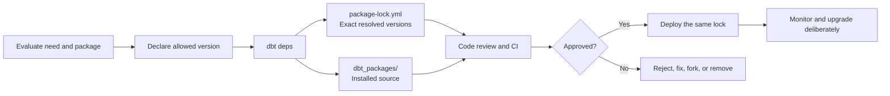

# Package Management and Dependency Governance

> A dbt package is executable project code, not a harmless download; declare it, lock it, review it, test it, and give it an owner before production use.

## Executive Summary

- **What it is:** Package management declares, resolves, installs, upgrades, and removes reusable dbt code. Dependency governance decides which packages are allowed, which exact versions run, how they are reviewed, and who owns their risk.
- **Why it matters:** A package can add macros, tests, models, sources, generated SQL, transitive dependencies, warehouse workload, and runtime compatibility requirements to the consuming project.
- **Mental model:** **`packages.yml` or `dependencies.yml` says what is allowed; `package-lock.yml` records exactly what was resolved; `dbt deps` installs it; `dbt_packages/` is the downloaded working copy.**
- **Best used when:** Adopt mature packages for stable, repeated, non-differentiating capabilities, or create a governed internal package when several projects genuinely need the same code.
- **Avoid or reconsider when:** Do not add a large or weakly maintained dependency for a small local requirement, important client-specific business logic, or a capability the team cannot support if the maintainer stops.

## What It Can Do

- Reuse macros, generic tests, models, sources, seeds, and other dbt resources across projects.
- Install public Hub packages, Git packages, native private packages, internal tarballs, and local packages.
- Resolve direct and transitive package dependencies.
- Lock exact versions and commit SHAs for repeatable development, CI, and production installs.
- Share governed utilities, naming rules, reconciliation tests, and platform conventions through an internal package.
- Use a dbt Mesh project dependency to reference another team's public models without copying and rebuilding its project.
- Surface available Hub updates when running `dbt deps`.
- Support deliberate upgrade, compatibility testing, rollback, license review, and supply-chain controls.

## What It Cannot Do

- Certify that a community package is secure, correct, maintained, licensed appropriately, or suitable for a regulated client.
- Guarantee behavioral compatibility merely because versions satisfy a semantic-version range.
- Prevent an installed package from increasing the DAG, query volume, build duration, or Snowflake cost.
- Make a mutable Git branch reproducible without a resolved lock and controlled upgrade process.
- Decide whether shared logic should be a package, a Mesh data-product interface, or local project code.
- Replace code review, CI, release notes, ownership, vulnerability handling, or an exit strategy.
- Protect credentials that are embedded in URLs, committed to Git, or printed by custom automation.
- Automatically run the consuming project's models; `dbt deps` installs package code but does not perform a `dbt run` or `dbt build`.

## Core Concepts

| Concept | Meaning | Why it matters |
|---|---|---|
| dbt package | A standalone dbt project consumed as reusable source code | Its resources become part of the consuming project's parsed environment |
| Package dependency | Downloads another dbt project's code into the consuming project | Appropriate for libraries, utilities, tests, and packaged transformations |
| Project dependency | Resolves references to public models owned and built by another dbt project | Creates a governed cross-team data interface without copying upstream code |
| `packages.yml` | Traditional package declaration file; supports package specifications and Jinja | Needed for public, Git, local, and Jinja-based package configuration |
| `dependencies.yml` | Static file that can describe packages and dbt Mesh project dependencies | Centralizes dependency relationships and supports cross-project references |
| `dbt deps` | Command that resolves and installs declared package dependencies | Prepares required code without building the analytics models |
| `package-lock.yml` | Exact resolved versions and commit SHAs | Makes installs repeatable across developers, CI, and production |
| `dbt_packages/` | Default local directory containing installed package source | Generated working copy; normally ignored by Git |
| Version constraint | Allowed package release or range | Expresses compatibility policy rather than the resolved installation |
| Transitive dependency | Package required by another installed package | Can create conflicts or introduce risk the root project did not declare directly |
| Fusion compatibility | Evidence that a package can work with the Fusion engine | Parse compatibility alone may not prove correct runtime behavior |
| Supply-chain review | Review of source, maintainer, license, release, security, and delivery path | Treats external code as a governed production input |
| Dependency owner | Team responsible for approval, upgrades, incidents, and replacement | Prevents abandoned packages from becoming nobody's responsibility |

### The four files and commands to remember

```text
packages.yml / dependencies.yml
  = dependencies and version ranges the project permits

package-lock.yml
  = exact versions and commit SHAs dbt resolved

dbt deps
  = resolve or reuse the lock, then install package code

dbt_packages/
  = downloaded working copy used by dbt
```

Commit the declarations and `package-lock.yml`. Normally do not commit `dbt_packages/`.

### What `dbt deps` actually does

When you run:

```bash
dbt deps
```

dbt:

1. Reads package declarations from `packages.yml` or `dependencies.yml`.
2. Checks whether the existing `package-lock.yml` matches those declarations.
3. Reuses the locked versions when the declarations have not changed.
4. Otherwise resolves compatible direct and transitive dependencies.
5. Downloads package source into `dbt_packages/` by default.
6. Creates or updates `package-lock.yml` with the exact resolution.

It does **not** build project models. A typical job runs `dbt deps` before `dbt parse`, `dbt compile`, `dbt build`, or another command that needs the installed package code.

### Package versus project dependency

| Question | Package dependency | Project dependency |
|---|---|---|
| What is consumed? | Full package source code | Public model metadata and resolved relations |
| Is upstream code parsed into this project? | Yes | No |
| Can its models become part of this project's build? | Yes, when enabled and selected | No; the producer project owns the build |
| Common use | Macros, tests, utilities, packaged transformations | Cross-team dbt Mesh data products |
| Ownership | Consuming team owns how the package runs | Producer owns the public model; consumer owns its use |
| Main risk | Code, compatibility, dependencies, query cost | Interface stability, contracts, versions, availability |

Project dependencies are a dbt platform capability for governed cross-project references. They are not merely a newer name for ordinary packages.

## How It Works (Simple Flow)

1. The team defines a repeated capability and decides whether it belongs in local code, an external package, an internal package, or a project dependency.
2. It reviews the maintainer, source, license, release history, transitive dependencies, dbt/adapter/Fusion compatibility, required permissions, and executable resources.
3. The dependency is declared with an approved version range, tag, or immutable Git commit.
4. `dbt deps` resolves or reuses the lock, installs the package, and records exact versions in `package-lock.yml`.
5. The declaration and lock-file changes are reviewed together in a pull request.
6. CI compiles the project, runs relevant unit/data tests and representative builds, and inspects changed SQL, DAG scope, performance, and package behavior.
7. Production installs the same locked dependency set rather than resolving unreviewed versions at deployment time.
8. An owner monitors releases, security and compatibility, then proposes upgrades or removal through the same controlled workflow.

## Visuals



## Readable Snippets

### Public Hub package

```yaml
# packages.yml
packages:
  - package: dbt-labs/dbt_utils
    version: [">=1.3.0", "<2.0.0"]
```

The range expresses which releases may be resolved. `package-lock.yml` records the exact release selected.

### Install locked dependencies

```bash
dbt deps
dbt compile
dbt build --select state:modified+
```

`dbt deps` prepares package code. The later commands parse, compile, build, and test the project.

### Deliberately upgrade

```bash
dbt deps --upgrade
```

This re-resolves allowed versions and updates the lock file. Run it in a controlled upgrade pull request—not automatically before every production build.

To update the lock after editing dependency declarations without installing packages:

```bash
dbt deps --lock
```

### Native private package

```yaml
packages:
  - private: bank-data/dbt_controls
    provider: github
    revision: "v1.4.2"
```

Prefer a supported Git integration or workload identity over an employee's personal token. Pin a reviewed tag or commit and grant only the repository access required.

### Immutable Git package

```yaml
packages:
  - git: "https://github.com/example/dbt-finance-controls.git"
    revision: "4e28d6da126e2940d17f697de783a717f2503188"
```

A full commit SHA is immutable. A branch such as `main` is mutable and should not be treated as a stable production release.

### Static package plus project dependency

```yaml
# dependencies.yml
packages:
  - package: dbt-labs/dbt_utils
    version: [">=1.3.0", "<2.0.0"]

projects:
  - name: finance_data_products
```

The package downloads reusable code. The project dependency resolves approved public models owned by the finance project.

### CI dependency step

```yaml
- name: Install locked dbt packages
  run: dbt deps

- name: Validate project
  run: dbt build --select state:modified+
```

The dependency declaration and lock file should already be part of the reviewed commit being tested.

## Consultant Talking Points

- **Client question this answers:** "Can we safely reuse this package in production, and can we reproduce, support, and remove it if something goes wrong?"
- **Trade-offs to mention:** Packages reduce duplicated implementation and speed delivery, but each dependency adds external code, compatibility constraints, upgrade work, transitive dependencies, and support responsibility.
- **Risk or governance angle:** Treat packages as executable supply-chain inputs. Approve source, version, license, maintainer, authentication, permissions, testing, retention of the lock file, and a named owner.
- **Cost/performance angle:** A package may introduce models or many test queries. Review what becomes enabled and measure the resulting DAG size, runtime, query volume, and Snowflake consumption.

### Why Hub presence is not approval

The dbt Package Hub is a discovery registry. dbt Labs explicitly does not certify the integrity, security, effectiveness, or suitability of community packages. A Hub listing, popularity, or recognizable maintainer reduces discovery effort but does not replace client review.

### Version constraints versus the lock

```text
Version range:
  "Any compatible 1.x release may be selected during an intentional resolution."

Lock file:
  "For this commit, install this exact release and commit SHA."
```

Both matter. Exact declarations without a lock can miss transitive resolution. A lock without reviewed constraints can preserve a version but does not explain the supported upgrade boundary.

### Upgrade strategy

Prefer small, explainable dependency changes:

1. Upgrade one package or closely related set.
2. Read its release and migration notes.
3. Review the lock-file diff and transitive changes.
4. Confirm compatibility with the dbt runtime, adapter, Snowflake, and Fusion where relevant.
5. Compile and test all package usages.
6. Inspect generated SQL and changed graph resources.
7. Compare representative outputs where business logic may change.
8. Promote the same lock through environments.
9. Keep the previous lock available for a code rollback, while separately planning any data correction required.

Avoid combining a dbt runtime upgrade, adapter upgrade, multiple package upgrades, and major model refactor in one release unless there is a compelling reason.

### Compatibility is multidimensional

A package should be checked against:

- dbt Core or Fusion version.
- Snowflake adapter and database behavior.
- Jinja and macro behavior.
- Required variables and configuration.
- Package-to-package version constraints.
- Generated SQL and supported Snowflake data types.
- Models, tests, hooks, operations, and materializations it introduces.
- Required database privileges and objects.

A Fusion parse-compatible result means the package can be parsed in that check; it is weaker than proof that every macro and model behaves correctly at runtime.

### Private package controls

For an internal package:

- Give it a clear purpose and avoid turning it into a dumping ground.
- Name a product or platform owner.
- Use semantic releases, change notes, compatibility ranges, and tests.
- Protect the repository and release process.
- Use a service integration, SSH configuration, or native private-package authentication rather than a personal credential.
- Grant read-only package access to CI and production.
- Define how consuming projects receive breaking-change notices.
- Maintain an exit or fork strategy.

### Banking review checklist

| Area | Questions |
|---|---|
| Business need | Does this solve a repeated problem better than small local code? |
| Ownership | Who approves, upgrades, supports, and replaces it? |
| Source | Is it Hub, Git, native private, local, or internal artifact storage? |
| Integrity | Is the release pinned and locked to an exact version or commit? |
| Maintenance | Are releases, issues, security reports, and breaking changes handled? |
| License | Can the bank use, modify, and redistribute it as intended? |
| Compatibility | Does it support the approved dbt engine, adapter, Snowflake, and package set? |
| Scope | Does it add macros only, or executable models, tests, hooks, and objects? |
| Access | What Git and Snowflake permissions does installation or execution require? |
| Data risk | Can generated SQL or logs expose sensitive literals or metadata? |
| Cost | How many models/tests/queries are added, and at what cadence? |
| Evidence | Are declaration, lock, review, test, and deployment records retained? |
| Exit | Can it be removed, replaced, forked, or supported internally? |

### Useful package categories

Understand packages as candidates, not default installations:

- **General utility:** `dbt_utils`
- **Development productivity:** `codegen`
- **Migration and reconciliation:** `audit_helper`
- **Project governance:** `dbt_project_evaluator`
- **Expanded data-quality tests:** `dbt_expectations`
- **Observability:** `elementary`, `dbt_artifacts`
- **Snowflake operations and attribution:** query-tag and Snowflake-monitoring packages
- **Finance or banking modeling:** Data Vault, audit, constraint, reconciliation, and metadata-testing packages when the client's architecture actually requires them

Every installed package should earn its place through a defined use case.

## Common Pitfalls

- Installing a popular package without a defined requirement or owner.
- Believing `dbt deps` runs or validates the project's models; it only installs dependencies.
- Ignoring `package-lock.yml` or adding it to `.gitignore`, causing environment drift.
- Committing the generated `dbt_packages/` directory instead of the declarations and lock.
- Running `dbt deps --upgrade` automatically during every production deployment.
- Depending on `main`, another mutable Git branch, or an unreviewed prerelease.
- Assuming a semantic-version range guarantees behavioral compatibility.
- Reviewing only direct packages and missing transitive dependencies.
- Treating a Hub listing, download count, Fusion badge, or parse check as security certification.
- Editing files directly inside `dbt_packages/`; the next install can overwrite the changes.
- Using an employee's personal token for scheduled private-package installation.
- Exposing tokens through Git URLs, environment variables, commands, or logs.
- Forgetting that package models and tests can increase Snowflake runtime and cost.
- Allowing a package to introduce business definitions without assigning business ownership.
- Upgrading dbt, its adapter, packages, and major project logic simultaneously.
- Keeping an abandoned package because no removal or fork plan exists.

## When to Recommend What (Decision Table)

| Situation | Recommend | Why | Watch-outs |
|---|---|---|---|
| Mature utility solves a standard problem | Approved Hub package with constraints and committed lock | Reuses tested general capability | Maintainer, compatibility, transitive dependencies |
| Small, stable, client-specific requirement | Keep a local macro or test | Avoids a large dependency for little value | Local code still needs tests and ownership |
| Shared utilities across several internal projects | Versioned private package | Centralizes stable reusable standards | Release process, coupling, support, credentials |
| Another team owns a certified dataset | Mesh project dependency to public models | Preserves producer ownership and avoids rebuilding its code | Platform entitlement, access, contracts, versions, availability |
| Important client business policy | Local governed project code or narrowly owned internal package | Keeps definition and change authority close to the client | Avoid uncontrolled duplication across teams |
| Weakly maintained but valuable package | Avoid, replace, or fork with explicit internal ownership | Removes dependency on an uncertain maintainer | Fork maintenance and license obligations |
| Regulated environment with restricted internet | Approved internal mirror, tarball, or private repository | Controls acquisition path and review | Update process, provenance, integrity verification |
| Fusion migration | Prefer clearly compatible packages and test runtime behavior | Reduces engine-migration risk | Parse-compatible is not equivalent to fully verified |
| Package adds many unused models | Disable unnecessary resources or reconsider the package | Controls DAG size and Snowflake cost | Configuration complexity and upgrade behavior |
| Production install | Plain `dbt deps` using the committed lock | Reproduces the reviewed dependency set | Do not resolve upgrades during deployment |
| Intentional dependency upgrade | `dbt deps --upgrade` in a dedicated pull request | Makes new resolution visible and testable | Transitive and generated-SQL changes |

## Related Topics

- [[02 dbt/05 Deployment CI CD and Operations/Deployment CI CD and Operations Overview|Deployment CI CD and Operations Overview]]
- [[02 dbt/01 Core Concepts and Project Structure/06 Commands and Artifacts|Commands and Artifacts]]
- [[02 dbt/05 Deployment CI CD and Operations/40 Git Workflow and Pull Requests|Git Workflow and Pull Requests]]
- [[02 dbt/05 Deployment CI CD and Operations/42 CI Jobs and Slim CI|CI Jobs and Slim CI]]
- [[02 dbt/05 Deployment CI CD and Operations/47 Secrets Service Accounts and RBAC|Secrets, Service Accounts, and RBAC]]
- [[02 dbt/07 Packages Macros and Advanced Reuse/60 Package Fundamentals|Package Fundamentals]]
- [[02 dbt/07 Packages Macros and Advanced Reuse/61 packages.yml vs dependencies.yml|packages.yml vs dependencies.yml]]
- [[02 dbt/07 Packages Macros and Advanced Reuse/66 Package Governance|Package Governance]]

## Related Decision Notes

- [[80 Comparisons and Decision Notes/Decision Notes/dbt/Decisions - Choosing a dbt Environment and Credential Strategy|Decisions - Choosing a dbt Environment and Credential Strategy]]
- [[80 Comparisons and Decision Notes/Comparisons/Cross-Tool/Comparison - dbt Projects on Snowflake vs dbt Platform|Comparison - dbt Projects on Snowflake vs dbt Platform]]

## Questions

- What repeated problem justifies adding this dependency?
- Does the package contain macros only, or executable models, tests, hooks, and warehouse objects?
- Which direct and transitive versions are present in `package-lock.yml`?
- Who owns approval, upgrades, incidents, and replacement?
- Does the license satisfy the client's legal and procurement requirements?
- Is the package compatible with the approved dbt engine, adapter, Snowflake, and Fusion strategy?
- How will private-package authentication work without a personal credential?
- Which CI tests would detect a breaking SQL, DAG, output, or performance change?
- How much additional Snowflake query volume and runtime can the package introduce?
- Should this be reusable code, local business logic, or a producer-owned Mesh interface?
- What is the plan if the maintainer abandons the package?

## Sources To Revisit

- [dbt Developer Hub - Packages](https://docs.getdbt.com/docs/build/packages)
- [dbt Developer Hub - About dbt deps](https://docs.getdbt.com/reference/commands/deps)
- [dbt Developer Hub - Project dependencies](https://docs.getdbt.com/docs/mesh/govern/project-dependencies)
- [dbt Developer Hub - Project dependency configuration](https://docs.getdbt.com/reference/project-configs/dependencies)
- [dbt Developer Hub - packages-install-path](https://docs.getdbt.com/reference/project-configs/packages-install-path)
- [dbt Package Hub](https://hub.getdbt.com/)
- [dbt Package Hub - Package disclaimer](https://hub.getdbt.com/package-disclaimer/)
