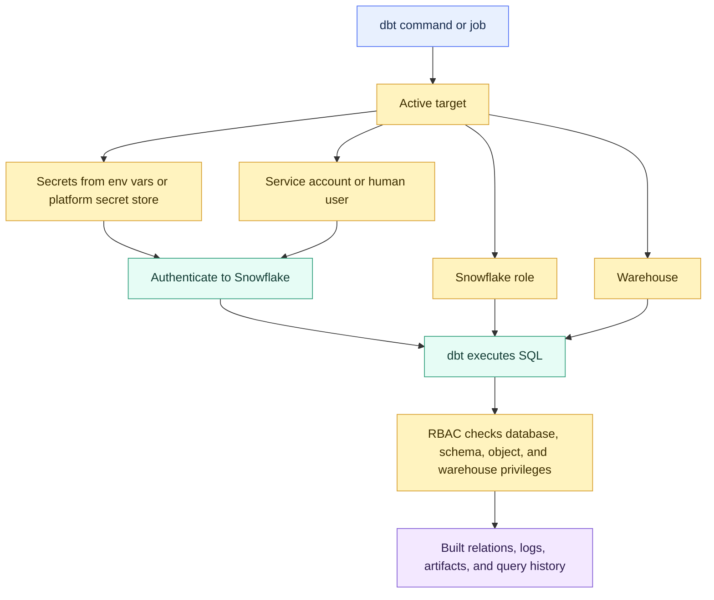
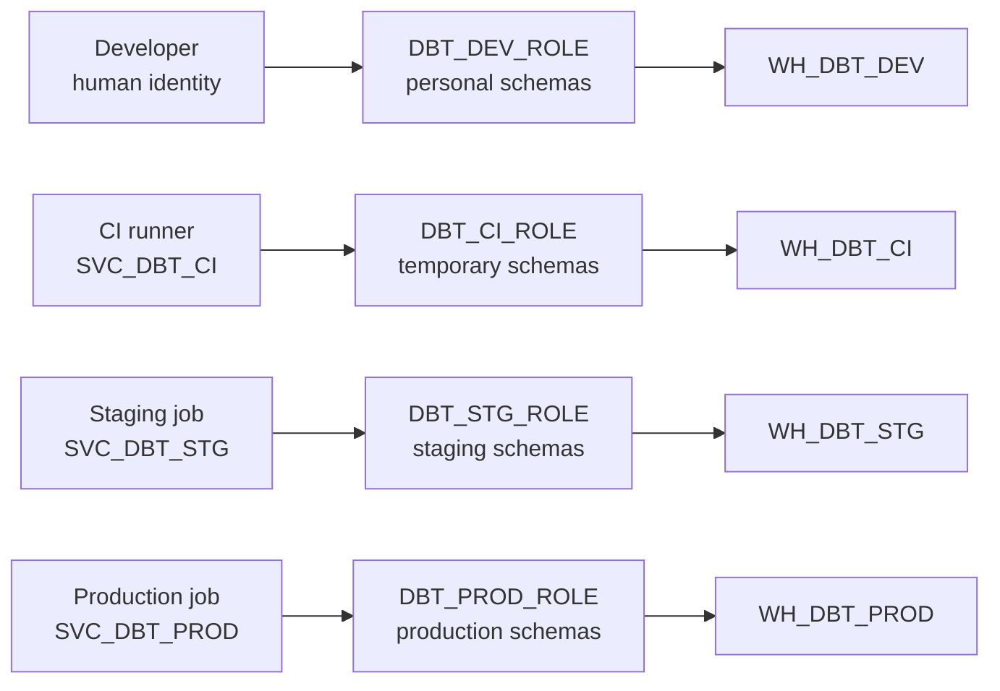

# Secrets, Service Accounts, and RBAC

> [!abstract] Mental model
> Secrets authenticate dbt, service accounts identify who dbt runs as, and RBAC defines what that identity is allowed to do.

## Executive Summary

- **What it is:** The credential and access-control layer for dbt execution across local development, CI, staging, and production.
- **Why it matters:** dbt can read sensitive sources, create trusted marts, replace tables, run expensive warehouses, and publish data used by business decisions. The execution identity must be controlled.
- **Mental model:** **Secrets = how dbt signs in; service account = who dbt acts as; RBAC = what dbt can read, write, create, and spend.**
- **Best used when:** A dbt project connects to Snowflake, runs automated jobs, handles sensitive data, supports multiple environments, or must satisfy audit and least-privilege expectations.
- **Avoid or reconsider when:** Do not treat credentials as a dbt-only setup detail. If Snowflake roles, warehouses, schemas, secret storage, rotation, and ownership are unclear, the project is not production-ready.

## What It Can Do

- Keep passwords, private keys, tokens, and API credentials out of committed project files.
- Give production jobs a stable non-human identity that is independent of any employee.
- Separate developer, CI, staging, and production access through different identities and roles.
- Apply least privilege to source reads, target writes, warehouse usage, object ownership, and environment boundaries.
- Improve auditability by showing which user, role, warehouse, job, and code version produced an object or query.
- Support credential rotation, offboarding, and incident response without disabling a human employee's account or breaking production.
- Prevent CI and developer jobs from writing to production schemas when configured correctly.
- Make Snowflake cost attribution clearer by granting each service role access to the correct warehouse only.

## What It Cannot Do

- Make committed or leaked secrets safe after the fact; they must be rotated and removed from history where possible.
- Guarantee least privilege if every target uses the same powerful role.
- Replace Snowflake Row Access Policies, masking policies, network controls, SSO, MFA, or private connectivity.
- Prove business correctness; access control only limits what dbt is allowed to touch.
- Prevent accidental production writes if the production role is granted too broadly.
- Remove the need for human review, CI, deployment approvals, monitoring, incident response, or periodic access review.
- Automatically transfer ownership of objects created by a disabled or retired identity.

## Core Concepts

| Concept | Meaning | Why it matters |
|---|---|---|
| Secret | Sensitive credential material such as password, private key, OAuth token, PAT, or API key | Must be stored outside Git and protected from logs, screenshots, and broad access |
| Environment variable | Runtime value read by dbt with `env_var()` | Lets profiles and jobs reference secrets without hardcoding them |
| `DBT_ENV_SECRET_` | dbt secret environment-variable prefix intended for credentials | Helps distinguish sensitive values and mask them in supported contexts |
| Service account | Non-human user used by automation | Makes production execution stable, auditable, and independent of personal accounts |
| Human identity | Named individual account used for development or administration | Supports attribution and employee lifecycle controls |
| Snowflake role | Collection of privileges used by dbt during execution | Determines the maximum database actions available to a run |
| Warehouse privilege | `USAGE` on a Snowflake warehouse | Without it, dbt can authenticate but cannot execute queries |
| Object privilege | Grants such as `SELECT`, `CREATE TABLE`, `CREATE VIEW`, `OWNERSHIP`, or `USAGE` | Controls source reads, target builds, and object management |
| Target | Active dbt runtime configuration such as `dev`, `ci`, `staging`, or `prod` | Chooses identity, role, warehouse, database, schema, and threads |
| Separation of duties | Different people or services own development, approval, deployment, and administration | Reduces fraud, error, and audit risk |
| Credential rotation | Replacing credential material on a defined schedule or after exposure | Limits impact of leaked or stale secrets |
| Break-glass access | Highly privileged emergency access with strict controls | Keeps admin privileges out of routine dbt execution |

## How It Works (Simple Flow)

1. A developer, CI runner, dbt platform job, or scheduler starts a dbt command in a specific environment.
2. dbt resolves the active target from `profiles.yml`, platform environment settings, or job configuration.
3. The target reads connection values and secrets from approved storage, often through `env_var()`.
4. dbt authenticates to Snowflake as a human user or service account.
5. Snowflake activates the configured role and warehouse for the session.
6. dbt compiles and runs SQL; Snowflake checks RBAC for every database, schema, object, and warehouse action.
7. Artifacts, logs, query history, and access history provide evidence of who ran what, using which role, against which objects.
8. Secrets, grants, service accounts, warehouses, and old schemas follow rotation, review, cleanup, and incident-response procedures.

## Visuals



Environment identities should not collapse into one super-user:



## Readable Snippets

### profiles.yml with secrets outside Git

```yaml
# ~/.dbt/profiles.yml or a CI/platform-rendered equivalent
investment_dbt:
  target: dev
  outputs:
    dev:
      type: snowflake
      account: "{{ env_var('DBT_SNOWFLAKE_ACCOUNT') }}"
      user: "{{ env_var('DBT_DEV_USER') }}"
      password: "{{ env_var('DBT_ENV_SECRET_DEV_PASSWORD') }}"
      role: DBT_DEV_ROLE
      warehouse: WH_DBT_DEV
      database: ANALYTICS_DEV
      schema: "dbt_{{ env_var('DBT_USER') }}"
      threads: 4

    prod:
      type: snowflake
      account: "{{ env_var('DBT_SNOWFLAKE_ACCOUNT') }}"
      user: "{{ env_var('DBT_PROD_USER') }}"
      private_key: "{{ env_var('DBT_ENV_SECRET_SNOWFLAKE_PRIVATE_KEY') }}"
      role: DBT_PROD_ROLE
      warehouse: WH_DBT_PROD
      database: ANALYTICS_PROD
      schema: MARTS
      threads: 8
```

The exact authentication fields depend on dbt version, adapter, and chosen Snowflake authentication method. The operating rule is stable: keep credentials outside committed code and bind each target to the least-privilege identity it needs.

### Environment-to-identity map

| Environment | Execution identity | Role | Write target | Warehouse |
|---|---|---|---|---|
| Development | Human developer | `DBT_DEV_ROLE` | Personal schema such as `ANALYTICS_DEV.DBT_SHONN` | `WH_DBT_DEV` |
| CI | `SVC_DBT_CI` | `DBT_CI_ROLE` | Temporary schema such as `ANALYTICS_CI.PR_812` | `WH_DBT_CI` |
| Staging | `SVC_DBT_STG` | `DBT_STG_ROLE` | `ANALYTICS_STG.MARTS` | `WH_DBT_STG` |
| Production | `SVC_DBT_PROD` | `DBT_PROD_ROLE` | `ANALYTICS_PROD.MARTS` | `WH_DBT_PROD` |

### Snowflake grants for a production dbt role

```sql
USE ROLE SECURITYADMIN;

CREATE ROLE IF NOT EXISTS DBT_PROD_ROLE;
GRANT ROLE DBT_PROD_ROLE TO ROLE SYSADMIN;

-- Let dbt spend only on the intended production transform warehouse.
GRANT USAGE ON WAREHOUSE WH_DBT_PROD
TO ROLE DBT_PROD_ROLE;

-- Read approved source data.
GRANT USAGE ON DATABASE RAW_PROD
TO ROLE DBT_PROD_ROLE;

GRANT USAGE ON SCHEMA RAW_PROD.CORE_BANKING
TO ROLE DBT_PROD_ROLE;

GRANT SELECT ON ALL TABLES IN SCHEMA RAW_PROD.CORE_BANKING
TO ROLE DBT_PROD_ROLE;

GRANT SELECT ON FUTURE TABLES IN SCHEMA RAW_PROD.CORE_BANKING
TO ROLE DBT_PROD_ROLE;

-- Build approved analytics outputs.
GRANT USAGE ON DATABASE ANALYTICS_PROD
TO ROLE DBT_PROD_ROLE;

GRANT USAGE ON SCHEMA ANALYTICS_PROD.MARTS
TO ROLE DBT_PROD_ROLE;

GRANT CREATE TABLE, CREATE VIEW ON SCHEMA ANALYTICS_PROD.MARTS
TO ROLE DBT_PROD_ROLE;
```

These grants are illustrative. Production dbt may also need access to snapshots, seeds, dynamic tables, stages, functions, procedures, or other objects depending on the project.

### CI role with no production writes

```sql
CREATE ROLE IF NOT EXISTS DBT_CI_ROLE;
GRANT ROLE DBT_CI_ROLE TO ROLE SYSADMIN;

GRANT USAGE ON WAREHOUSE WH_DBT_CI
TO ROLE DBT_CI_ROLE;

GRANT USAGE ON DATABASE ANALYTICS_CI
TO ROLE DBT_CI_ROLE;

GRANT CREATE SCHEMA ON DATABASE ANALYTICS_CI
TO ROLE DBT_CI_ROLE;

-- Optional: read approved production parents for Slim CI deferral.
GRANT USAGE ON DATABASE ANALYTICS_PROD
TO ROLE DBT_CI_ROLE;

GRANT USAGE ON SCHEMA ANALYTICS_PROD.STAGING
TO ROLE DBT_CI_ROLE;

GRANT SELECT ON ALL TABLES IN SCHEMA ANALYTICS_PROD.STAGING
TO ROLE DBT_CI_ROLE;
```

The CI role can read approved state when policy allows it, but it should not be able to create, replace, or drop production objects.

### Bad pattern

```yaml
target: prod
outputs:
  prod:
    type: snowflake
    user: analyst_name
    password: plain_text_password
    role: ACCOUNTADMIN
    warehouse: WH_SHARED_EVERYTHING
```

This combines a human account, committed secret risk, broad privilege, and unclear cost ownership. It is not a production operating model.

### Rotation runbook shape

```text
1. Create or upload new Snowflake credential material.
2. Add the new secret to the CI or dbt platform secret store.
3. Run dbt debug or a low-risk validation job.
4. Promote the secret to production jobs.
5. Revoke the old key, password, token, or credential.
6. Confirm production jobs and alerts remain healthy.
7. Record the change, owner, date, and next rotation due date.
```

## Consultant Talking Points

- **Client question this answers:** "Can we prove dbt runs with the right identity, the right secrets, and only the Snowflake access it needs?"
- **Trade-offs to mention:** More identities and roles improve blast-radius control and auditability, but add grant design, rotation, provisioning, troubleshooting, and access-review overhead.
- **Risk or governance angle:** Production dbt should usually run as a dedicated service account, not a human. Secrets should live in a secret manager or dbt platform environment settings, not Git. Roles should be least-privilege and reviewed periodically.
- **Cost/performance angle:** Warehouse `USAGE` grants define where each workload can spend credits. Separate warehouses for dev, CI, staging, production, BI, and heavy jobs improve cost attribution and reduce workload interference.

### What access does dbt actually need?

Think in layers:

| Need | Typical privilege |
|---|---|
| Authenticate | Valid user/service account credential |
| Execute SQL | `USAGE` on warehouse |
| Resolve database | `USAGE` on database |
| Resolve schema | `USAGE` on schema |
| Read sources or upstream models | `SELECT` on tables/views |
| Build tables/views | `CREATE TABLE`, `CREATE VIEW`, plus object ownership behavior |
| Manage existing objects | Ownership or sufficient privileges depending on materialization and adapter behavior |
| Use future source tables | Future grants or automated grant management |

Missing any layer can make dbt connect successfully but fail during execution.

### Human identities versus service accounts

| Identity type | Best for | Avoid using for |
|---|---|---|
| Human developer | Local exploration, feature branches, personal dev schemas | Scheduled production jobs |
| CI service account | Pull-request validation and temporary schemas | Production deployment writes |
| Staging service account | Release rehearsal and integration validation | Routine production publication |
| Production service account | Scheduled or approved production transformations | Ad hoc personal analysis |
| Admin or break-glass account | Emergency or platform administration | Daily dbt runs |

The production service account should have an owner, rotation process, monitoring, and emergency replacement procedure.

### Authentication choices

| Pattern | Fit | Watch-outs |
|---|---|---|
| Username and password | Simple development or early setup | Rotation, MFA constraints, leakage risk |
| Key-pair authentication | Common for Snowflake service accounts | Private-key handling and rotation discipline |
| OAuth or external OAuth | Human SSO and centralized identity controls | Token expiry, scope mapping, platform support |
| Workload identity or secret manager integration | Mature platform automation | More setup and cloud/IAM coordination |

Prefer authentication methods that avoid long-lived shared passwords for production automation.

### Least-privilege design principle

A good production dbt role usually has:

- Read access to approved source schemas.
- Write/create access only to approved target schemas.
- Warehouse usage only for intended dbt compute.
- No routine `ACCOUNTADMIN`, broad `SYSADMIN`, or source-system ownership.
- Separate access for dev, CI, staging, and production.
- Query tagging, artifacts, logs, and Snowflake history for evidence.

It should not be the same role analysts use for interactive exploration.

### Ownership matters

dbt-created objects are controlled by the role that creates them. That means object ownership is part of the operating model, not a footnote. If a table was created by a personal developer role, the production service account may not be able to replace it later. In mature projects, production objects should be created and maintained by the controlled production role.

## Common Pitfalls

- Committing `profiles.yml`, `.env`, private keys, passwords, or tokens with real secret values.
- Printing secrets through macros, hooks, logs, debug output, screenshots, or incident notes.
- Running production dbt jobs as a human developer.
- Giving dbt `ACCOUNTADMIN`, broad `SYSADMIN`, or a general-purpose data engineer role for routine runs.
- Reusing the same service account and role across dev, CI, staging, and production.
- Granting CI write access to production schemas.
- Forgetting warehouse `USAGE`, causing authentication to work while queries fail.
- Granting database and table access but forgetting schema `USAGE`.
- Allowing dbt to create production objects under a personal owner role.
- Not using future grants or grant automation, so newly created source tables fail later.
- Rotating a secret without testing all jobs that depend on it.
- Disabling or deleting an account without transferring object ownership or confirming job dependencies.
- Giving a service account access to more source domains than its DAG actually needs.
- Treating masking, row access, and sensitive-data policy as solved merely because a dbt role exists.
- Letting old CI schemas, unused service accounts, or stale secrets remain indefinitely.

## When to Recommend What (Decision Table)

| Situation | Recommend | Why | Watch-outs |
|---|---|---|---|
| Individual learner or local proof of concept | Personal credentials and a personal dev schema | Simple and attributable | Do not reuse this for production |
| Several developers | Human identities with personal schemas and limited dev role | Prevents collisions and supports audit | Cleanup and role-review process needed |
| Pull-request validation | Dedicated CI service account and temporary schemas | Validates changes without production writes | CI may need read-only deferral access |
| Scheduled production jobs | Dedicated production service account with least-privilege role | Stable, auditable, independent of employees | Rotate credentials and monitor failures |
| Regulated finance or banking | Separate dev, CI, staging, and prod identities, roles, warehouses, and evidence | Reduces blast radius and supports audit | More operating overhead and access review |
| Sensitive source data | Read only approved schemas with masking/row-access policies where required | Prevents broad service-account exposure | Test policy behavior under service roles |
| Team wants fast setup | Start narrow but document growth path | Avoids overengineering at the start | Do not normalize broad admin roles |
| Snowflake service account authentication | Prefer key-pair or approved OAuth pattern over shared passwords | Reduces static-password risk | Private key and token lifecycle still matter |
| Cost attribution is unclear | Separate warehouses and grants by workload | Makes spend easier to trace | More warehouses require suspend/resume and sizing discipline |
| Emergency production repair | Break-glass role with approval and logging | Supports urgent recovery | Revoke or disable after use; document incident |
| Service account owner leaves | Transfer ownership and rotate credentials | Avoids orphaned jobs and stale access | Confirm all schedules, tokens, and grants |

## Related Topics

- [[02 dbt/05 Deployment CI CD and Operations/Deployment CI CD and Operations Overview|Deployment CI CD and Operations Overview]]
- [[02 dbt/01 Core Concepts and Project Structure/04 Environments Profiles Targets and Credentials|Environments, Profiles, Targets, and Credentials]]
- [[02 dbt/05 Deployment CI CD and Operations/41 Dev CI Staging and Prod Environments|Dev, CI, Staging, and Prod Environments]]
- [[02 dbt/05 Deployment CI CD and Operations/42 CI Jobs and Slim CI|CI Jobs and Slim CI]]
- [[02 dbt/05 Deployment CI CD and Operations/43 Deploy Jobs and Merge Jobs|Deploy Jobs and Merge Jobs]]
- [[02 dbt/05 Deployment CI CD and Operations/45 Artifacts Logs and Run Results|Artifacts, Logs, and Run Results]]
- [[02 dbt/05 Deployment CI CD and Operations/48 Incident Response Rollback and Replay|Incident Response, Rollback, and Replay]]
- [[01 Snowflake/03 Security and Governance/12 RBAC Roles and Privileges|RBAC Roles and Privileges]]
- [[02 dbt/08 dbt on Snowflake and Finance Patterns/75 Snowflake RBAC for dbt|Snowflake RBAC for dbt]]

## Related Decision Notes

- [[80 Comparisons and Decision Notes/Decision Notes/dbt/Decisions - Choosing a dbt Environment and Credential Strategy|Decisions - Choosing a dbt Environment and Credential Strategy]]
- [[80 Comparisons and Decision Notes/Decision Notes/Cross-Tool/Decisions - Choosing a Snowflake DevOps and Deployment Pattern|Decisions - Choosing a Snowflake DevOps and Deployment Pattern]]
- [[80 Comparisons and Decision Notes/Comparisons/Snowflake/Comparison - Secondary Roles vs Composite Roles|Comparison - Secondary Roles vs Composite Roles]]

## Questions

- Which identity runs local development, CI, staging, and production?
- Where are passwords, private keys, tokens, and OAuth credentials stored?
- Who owns each service account and its rotation schedule?
- Which Snowflake role is active for each dbt target?
- Can any non-production identity write to production schemas?
- Which warehouses can each identity use, and who owns the cost?
- Do dbt-created objects have the intended production owner role?
- Are masking, row-access, and source-domain restrictions tested under service accounts?
- What happens if the production service account credential expires during a critical run?
- How are stale users, service accounts, old keys, temporary schemas, and unused grants reviewed or removed?

## Sources To Revisit

- [dbt Developer Hub - Environment variables](https://docs.getdbt.com/docs/build/environment-variables)
- [dbt Developer Hub - About env_var function](https://docs.getdbt.com/reference/dbt-jinja-functions/env_var)
- [dbt Developer Hub - About profiles.yml](https://docs.getdbt.com/docs/local/profiles.yml)
- [dbt Developer Hub - Connect Snowflake](https://docs.getdbt.com/docs/platform/connect-data-platform/connect-snowflake)
- [dbt Developer Hub - Set up Snowflake OAuth](https://docs.getdbt.com/docs/platform/manage-access/set-up-snowflake-oauth)
- [dbt Developer Hub - Set up external OAuth with Snowflake](https://docs.getdbt.com/docs/platform/manage-access/snowflake-external-oauth)
- [Snowflake Docs - Overview of access control](https://docs.snowflake.com/en/user-guide/security-access-control-overview)
- [Snowflake Docs - Key-pair authentication and key rotation](https://docs.snowflake.com/en/user-guide/key-pair-auth)
- [Snowflake Docs - Access History](https://docs.snowflake.com/en/sql-reference/account-usage/access_history)
