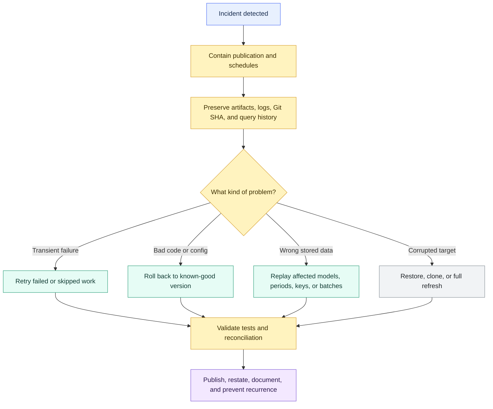

# Incident Response, Rollback, and Replay

> [!abstract] Mental model
> Incident response contains the damage, rollback restores a known-good version, and replay rebuilds the affected data with controlled scope and evidence.

## Executive Summary

- **What it is:** The operating pattern for responding when a dbt production workflow fails, publishes incorrect data, runs with bad code, or needs historical data reconstructed.
- **Why it matters:** A green job is not the same as trusted data. Production dbt needs recovery procedures that restore correctness, protect downstream consumers, and preserve audit evidence.
- **Mental model:** **Incident response = stop and diagnose; rollback = return code/config/data to known-good state; replay = rerun the affected history safely.**
- **Best used when:** dbt supports business-critical dashboards, finance outputs, regulated data products, or other pipelines where incorrect results must be contained and corrected deliberately.
- **Avoid or reconsider when:** The team has no retained artifacts, no source history, no idempotent write pattern, or no authority to change published historical results without formal approval.

## What It Can Do

- Separate temporary operational failures from bad releases and incorrect published data.
- Use dbt artifacts, logs, selectors, Git history, and warehouse metadata to identify blast radius.
- Roll back project code to a previous commit or release when a bad change was deployed.
- Retry failed or skipped work after transient failures.
- Replay affected models, date windows, keys, batches, or downstream dependencies after correction.
- Rebuild trusted outputs after late-arriving data, source corrections, broken logic, or partial processing.
- Preserve evidence for incident review, audit, regulatory sign-off, and stakeholder communication.
- Reduce unnecessary cost by targeting the affected portion of the DAG instead of rebuilding everything by default.

## What It Cannot Do

- Recover source records or historical source states that were never retained.
- Automatically know which business periods, keys, reports, or downstream consumers were affected.
- Make append-only or nondeterministic models replay-safe without intentional design.
- Undo incorrect data already exported to BI tools, files, APIs, or external consumers.
- Replace Git rollback, Snowflake recovery options, orchestration controls, or business reconciliation.
- Turn `dbt retry` into a fix for logically wrong data; retry is for failed or skipped execution.
- Bypass governance rules for closed financial periods, regulatory submissions, or externally published reports.

## Core Concepts

| Concept | Meaning | Why it matters |
|---|---|---|
| Incident | Production event where a dbt run fails, data is late, outputs are wrong, or trust is disputed | Triggers containment, diagnosis, and recovery |
| Containment | Preventing more incorrect data from being built or published | Stops the problem from spreading |
| Blast radius | Models, tests, reports, periods, consumers, and business decisions affected by the issue | Defines recovery scope and communication |
| Rollback | Returning code, configuration, environment, or data to a known-good state | Fixes bad deploys or corrupted targets |
| Retry | Rerunning failed or skipped work from a prior invocation | Best for temporary platform, network, permission, or concurrency failures |
| Replay | Controlled rerun of affected historical inputs through dbt logic | Repairs data after a fix or delayed/corrected input |
| Idempotency | Running the same repair scope more than once converges on the same correct result | Prevents duplicates and unstable recovery |
| Correction scope | Rows, dates, keys, batches, or models known to be wrong | Keeps repair work bounded |
| Impact scope | Downstream outputs affected by the correction | Can be wider than the original defect |
| Evidence bundle | Git SHA, command, variables, artifacts, logs, query history, approvals, and validation | Supports audit and post-incident review |
| Publication decision | Decision to release, hold, restate, or annotate repaired data | Keeps technical recovery aligned with business trust |

## How It Works (Simple Flow)

1. Detect the incident through a failed job, test failure, freshness alert, monitoring signal, reconciliation break, or stakeholder report.
2. Contain the issue by pausing schedules, blocking publication, warning consumers, or freezing affected downstream workflows.
3. Preserve evidence: Git SHA, dbt command, variables, artifacts, logs, run results, source batch metadata, and Snowflake query history.
4. Diagnose root cause and blast radius: failed node, bad model logic, stale source, permission change, package change, warehouse issue, or incorrect input data.
5. Choose the response: retry transient failures, roll back bad code/config, restore or clone damaged data, or replay affected history after a fix.
6. Execute the recovery through controlled selectors, variables, backfill windows, or full refreshes in an approved environment.
7. Validate with dbt tests, freshness checks, row counts, key checks, reconciliation totals, and business owner review.
8. Publish or restate the corrected outputs, document the incident, and add prevention such as tests, monitoring, review gates, or replay runbooks.

## Visuals



## Readable Snippets

### Retry the previous failed invocation

```bash
dbt retry
```

Use this after temporary failures where previously successful nodes are still trusted. Do not use retry to fix data that ran successfully but was logically wrong.

### Rebuild failed nodes and their dependents from prior artifacts

```bash
dbt build --select "result:error+" --state path/to/artifacts
```

This uses saved state and prior results to target erroring nodes and downstream dependents. Keep the prior artifacts somewhere durable; an ephemeral runner's `target/` directory is not enough.

### Roll back code, then rebuild affected downstream outputs

```bash
git revert <bad_commit_sha>
dbt build --select "fct_revenue+"
```

The Git rollback fixes the project code. The dbt rebuild repairs the affected data products. A rollback without a rebuild may leave bad data in production tables.

### Replay a bounded event-time window

```bash
dbt build \
  --select "fct_orders+" \
  --vars '{"start_date": "2026-07-01", "end_date": "2026-07-08"}'
```

This only works when the model SQL is designed to use those variables and the target write is idempotent.

### Parameterized replay pattern in a model

```sql



select
    order_id,
    customer_id,
    order_date,
    amount,
    updated_at
from {{ ref('stg_orders') }}


where order_date >= '{{ start_date }}'
  and order_date <  '{{ end_date }}'

where updated_at >= (
    select dateadd(day, -3, max(updated_at))
    from {{ this }}
)

```

Use inclusive start and exclusive end boundaries to avoid double-processing midnight or month-end edges.

### Replay with merge

```sql
{{ config(
    materialized='incremental',
    unique_key='order_id',
    incremental_strategy='merge'
) }}
```

`merge` can update existing rows when the same `order_id` is replayed. The source filter still has to select the corrected rows; the key only tells dbt where they belong.

### Replay a partition-like period with delete and insert

```sql
{{ config(
    materialized='incremental',
    unique_key=['account_id', 'balance_date'],
    incremental_strategy='delete+insert'
) }}
```

This pattern is useful when a replay should replace all rows for a defined business period or grain. Validate adapter behavior and model SQL before using it as a production control.

### Full-refresh when the whole model must be reconstructed

```bash
dbt build --select "fct_orders+" --full-refresh
```

Preview scope with `dbt ls` before running broad selectors. Full refresh is simple, but it can be slow, expensive, and disruptive.

## Replay by Materialization

All dbt materializations can be rerun, but only some are naturally good replay surfaces. Replay depends less on the materialization name and more on whether the model is deterministic, idempotent, historically reconstructable, and scoped by reliable keys or time windows.

| Materialization | Replay support | Consultant read |
|---|---|---|
| `view` | High | Replaying is mostly redeploying SQL because no data is stored in the view itself. Downstream persisted models may still need rebuilding. |
| `table` | High | Each run rebuilds the whole table, so recovery is straightforward when the source history exists. Cost and runtime are the main watch-outs. |
| `incremental` | Medium to high | Best replay surface for large facts when designed with `unique_key`, reliable change signals, `merge`, `delete+insert`, lookbacks, or explicit replay variables. |
| `materialized_view` | Medium | Useful for warehouse-managed refresh, but less controlled for surgical replay because refresh mechanics depend on the adapter and platform. |
| `ephemeral` | Indirect | Nothing is built as a standalone object. Replay happens through downstream models that inline the ephemeral SQL. |
| `snapshot` | Special case | Strong for reconstructing what changed over time, but not a normal overwrite-and-replay target. Often supports replay by preserving historical input states. |

### Best replay candidates

- `table` when full reconstruction is affordable and source history is complete.
- `incremental` with `merge` and a reliable `unique_key`.
- `incremental` with `delete+insert` or complete batch replacement for bounded dates, partitions, or business periods.
- Microbatch incremental models for large event-time datasets with bounded windows.
- Snapshots when the question is "what did we know at the time?" rather than "overwrite the latest corrected result."

### Weak replay candidates

- Append-only incremental models without deduplication or replacement.
- Models without stable keys, event-time boundaries, or retained source history.
- Models that use `current_timestamp()`, random values, nondeterministic tie-breaking, or current-state reference data for historical calculations.
- Materialized views where the platform controls refresh and the team needs precise row or period repair.

### Consultant rule of thumb

**Replay is not a materialization feature by itself; it is a property of model design.** The materialization gives the write mechanics, but idempotency, keys, source history, event-time boundaries, and validation determine whether replay is safe.

## Consultant Talking Points

- **Client question this answers:** "When dbt breaks production or publishes wrong numbers, how do we recover the affected data safely and prove what happened?"
- **Trade-offs to mention:** Retry is fast but only fits transient failures; rollback restores trusted code but does not automatically fix stored data; replay is precise but requires model design, source retention, validation, and approval.
- **Risk or governance angle:** For regulated or finance outputs, capture the incident timeline, impacted consumers, code version, execution identity, replay parameters, validation evidence, approval, and publication or restatement decision.
- **Cost/performance angle:** Target the smallest safe correction and impact scope. Full refreshes and wide downstream rebuilds can be expensive, so use isolated warehouses, scheduling windows, and cost estimates for large repairs.

### Choosing retry, rollback, or replay

| Problem | Usually choose | Why |
|---|---|---|
| Warehouse timeout, temporary network issue, transient lock | Retry | Previously successful data is still trusted |
| Bad PR changed revenue logic | Rollback, then replay/rebuild affected outputs | Code must return to known-good logic and stored results must be repaired |
| Late source file arrived for last week | Replay or backfill affected period | The code may be fine, but history must be reprocessed |
| Incremental target contains duplicates | Replay, targeted delete+insert, or full refresh | The stored table state is wrong |
| Closed financial month was published incorrectly | Governed replay plus restatement workflow | Technical correction must follow reporting controls |

### Evidence to retain

- Incident start, detection signal, owner, severity, and timeline.
- Git commit SHA, branch, deployment job, and approval reference.
- dbt command, selectors, variables, target, profile context, and package versions.
- `manifest.json`, `run_results.json`, logs, and source freshness results.
- Snowflake role, warehouse, query IDs or query tags, and relevant query history.
- Source batch IDs, correction scope, impact scope, and replay parameters.
- Validation results: tests, counts, reconciliations, control totals, and business sign-off.
- Publication decision, restatement notes, rollback path, and prevention actions.

## Common Pitfalls

- Treating "revert the PR" as complete rollback while incorrect rows remain in production tables.
- Using `dbt retry` after a model succeeded with wrong business logic.
- Rebuilding one corrected model but forgetting downstream marts, aggregates, exposures, and BI extracts.
- Running broad `+` selectors or `--full-refresh` without previewing scope and estimating cost.
- Designing incremental models with append-only writes that create duplicates during replay.
- Missing historical corrections because the replay filter uses `created_at` instead of a reliable change signal, load timestamp, batch ID, or event-time range.
- Replaying old facts against current unversioned dimensions, mappings, or exchange rates and accidentally changing more history than intended.
- Letting an orchestrator continue publishing downstream data while upstream incident response is still in progress.
- Not retaining artifacts and logs, making blast-radius analysis depend on memory and screenshots.
- Repairing a closed reporting period without approval, evidence, or stakeholder communication.

## When to Recommend What (Decision Table)

| Situation | Recommend | Why | Watch-outs |
|---|---|---|---|
| Temporary platform or warehouse failure | `dbt retry` or rerun failed selector | Fast recovery without repeating trusted work | Requires retained `run_results.json`; not for bad successful data |
| Bad transformation code was deployed | Git rollback plus targeted rebuild/replay | Restores known-good logic and repairs stored outputs | Reverting code alone may not repair published tables |
| Small table has incorrect logic for all history | `table` rebuild or incremental `--full-refresh` | Simpler than designing a surgical replay | Confirm source history and downstream impact |
| Large fact has one bad business period | Targeted replay/backfill with idempotent incremental strategy | Limits cost and disruption | Impact can extend into rolling or cumulative metrics |
| Append-only incremental model needs historical repair | Add dedupe/replacement pattern before replay, or full refresh | Blind append can duplicate rows | May require temporary quarantine or target cleanup |
| Event-time data has independent batches | Microbatch replay/backfill | Bounded, repeatable windows fit large time-series data | Confirm UTC boundaries and batch configuration |
| Source current-state table overwrote old values | Snapshot, CDC, backup, or warehouse Time Travel recovery | dbt cannot replay missing history | Snapshot cadence may miss intermediate states |
| Materialized view is stale or wrong | Refresh/recreate per platform behavior, then rebuild dependents if needed | Warehouse manages much of the persistence | Surgical row-level replay may not be available |
| Regulated or finance output is affected | Governed incident workflow with approval, evidence, replay, and restatement decision | Trust and audit matter as much as technical repair | Communication and publication controls are mandatory |

## Related Topics

- [[02 dbt/05 Deployment CI CD and Operations/Deployment CI CD and Operations Overview|Deployment CI CD and Operations Overview]]
- [[02 dbt/05 Deployment CI CD and Operations/45 Artifacts Logs and Run Results|Artifacts, Logs, and Run Results]]
- [[02 dbt/04 Incremental Processing and Performance/30 Materializations|Materializations]]
- [[02 dbt/04 Incremental Processing and Performance/31 Incremental Models and Unique Keys|Incremental Models and Unique Keys]]
- [[02 dbt/04 Incremental Processing and Performance/32 Incremental Strategies|Incremental Strategies]]
- [[02 dbt/04 Incremental Processing and Performance/33 Microbatch Incremental Models|Microbatch Incremental Models]]
- [[02 dbt/04 Incremental Processing and Performance/39 Full Refreshes Backfills and Replay|Full Refreshes, Backfills, and Replay]]
- [[02 dbt/05 Deployment CI CD and Operations/44 Scheduling and Orchestration|Scheduling and Orchestration]]

## Related Decision Notes

- [[80 Comparisons and Decision Notes/Comparisons/dbt/Comparison - Full Refresh vs Backfill vs Replay|Comparison - Full Refresh vs Backfill vs Replay]]
- [[80 Comparisons and Decision Notes/Decision Notes/dbt/Decisions - Choosing a dbt Incremental Strategy on Snowflake|Decisions - Choosing a dbt Incremental Strategy on Snowflake]]
- [[80 Comparisons and Decision Notes/Decision Notes/dbt/Decisions - Choosing a Data History and Restatement Pattern|Decisions - Choosing a Data History and Restatement Pattern]]

## Questions

- What detected the incident: job failure, test, freshness, reconciliation, dashboard complaint, or external report?
- Which exact models, periods, keys, reports, and consumers are affected?
- Is this a transient failure, bad code/config, bad source input, corrupted target, or disputed business logic?
- Does the source retain the data needed to reconstruct the affected period?
- Which materializations are involved, and are their writes idempotent under replay?
- Are downstream rolling, cumulative, or balance models affected beyond the original correction window?
- What validation proves the repaired data is correct enough to publish?
- Does the correction affect a closed or externally reported period?
- Which artifacts and query history must be retained for review?

## Sources To Revisit

- [dbt Developer Hub - Materializations](https://docs.getdbt.com/docs/build/materializations)
- [dbt Developer Hub - Configure incremental models](https://docs.getdbt.com/docs/build/incremental-models)
- [dbt Developer Hub - About incremental strategy](https://docs.getdbt.com/docs/build/incremental-strategy)
- [dbt Developer Hub - Microbatch incremental models](https://docs.getdbt.com/docs/build/incremental-microbatch)
- [dbt Developer Hub - Snapshots](https://docs.getdbt.com/docs/build/snapshots)
- [dbt Developer Hub - `dbt retry`](https://docs.getdbt.com/reference/commands/retry)
- [dbt Developer Hub - Run results JSON file](https://docs.getdbt.com/reference/artifacts/run-results-json)
- [dbt Developer Hub - State selection](https://docs.getdbt.com/reference/node-selection/state-selection)
- [dbt Developer Hub - `full_refresh` configuration](https://docs.getdbt.com/reference/resource-configs/full_refresh)
