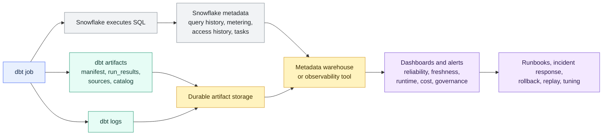
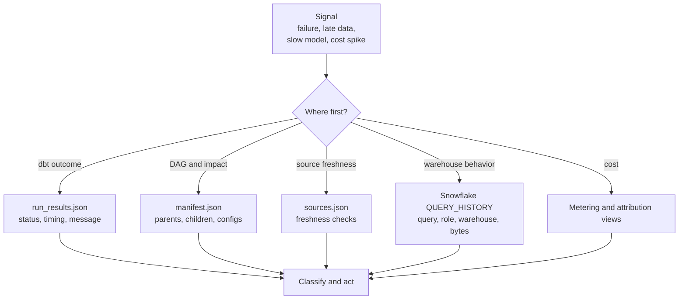

# Observability with dbt and Snowflake Metadata

> [!abstract] Mental model
> dbt tells you what the transformation workflow intended and reported; Snowflake tells you what the warehouse actually executed and spent.

## Executive Summary

- **What it is:** The practice of combining dbt artifacts, logs, job history, source freshness, Snowflake query history, warehouse usage, cost metadata, and access metadata into an operating picture for production data pipelines.
- **Why it matters:** A dbt job can be green while data is stale, expensive, incomplete, or suspicious. Observability helps teams detect issues, diagnose root cause, estimate blast radius, and prove what happened.
- **Mental model:** **dbt metadata explains the DAG and node outcomes; Snowflake metadata explains SQL execution, cost, access, and platform behavior. Observability joins the two.**
- **Best used when:** dbt supports important dashboards, finance outputs, regulated reporting, shared data products, or large Snowflake workloads where failures, freshness, runtime, and cost must be visible over time.
- **Avoid or reconsider when:** Do not confuse observability with correctness. Metrics and dashboards are only useful when they are tied to clear owners, thresholds, runbooks, and action paths.

## What It Can Do

- Show whether dbt jobs, models, tests, and freshness checks succeeded, failed, warned, or skipped.
- Track model and test runtime trends from historical `run_results.json` files.
- Preserve the dbt DAG, compiled SQL, configs, and lineage from `manifest.json`.
- Monitor source freshness through `sources.json` and job history.
- Correlate dbt invocations and models with Snowflake `QUERY_HISTORY`.
- Investigate slow or failing transformations using warehouse-side metadata.
- Attribute Snowflake spend by warehouse, query, role, user, job, project, or query tag where metadata supports it.
- Detect unusual runtime, cost, row-count, freshness, test, or access patterns.
- Support incident response, rollback, replay, audit evidence, and post-incident review.
- Build dashboards and alerts for production data operations.

## What It Cannot Do

- Prove that business logic is correct merely because a job succeeded.
- Recover historical evidence if artifacts and logs were overwritten or never stored.
- Attribute every Snowflake cost perfectly from dbt runtime alone.
- Explain BI, ingestion, API, file-delivery, or downstream application failures unless those systems provide their own telemetry.
- Replace model tests, reconciliation, source controls, release review, access governance, or runbooks.
- Provide real-time Snowflake Account Usage data; many Account Usage views are delayed.
- Make noisy alerts useful without severity definitions and ownership.
- Safely expose all logs and query text without privacy and security review.

## Core Concepts

| Concept | Meaning | Why it matters |
|---|---|---|
| Observability | Ability to understand system health and behavior from emitted evidence | Turns "the job failed" into diagnosable facts |
| dbt artifact | Structured file produced by dbt, usually JSON in `target/` | Captures project state, run outcomes, freshness, or docs metadata |
| Artifact storage | Durable retention of dbt artifacts outside the ephemeral `target/` folder | Preserves history for trends, Slim CI, incidents, and audit |
| `manifest.json` | dbt's parsed project graph: models, sources, tests, configs, dependencies, and compiled SQL | Explains lineage, selection, and what dbt understood |
| `run_results.json` | Per-invocation node outcomes for executed resources | Shows which models/tests ran, failed, skipped, warned, and how long they took |
| `sources.json` | Source freshness results from `dbt source freshness` | Supports source SLA and late-data monitoring |
| `catalog.json` | Warehouse-observed metadata used by docs | Helps compare dbt definitions with database-observed columns and types |
| Structured logs | Machine-readable dbt event logs | Easier to ingest into monitoring tools than plain console text |
| Invocation | One dbt command execution with a command, target, environment, Git SHA, and artifacts | Useful unit for evidence retention |
| Query tag | Label attached to Snowflake queries | Makes dbt-to-Snowflake correlation and cost attribution much easier |
| `QUERY_HISTORY` | Snowflake record of executed queries, users, roles, warehouses, timings, and status | Warehouse-side evidence of what actually ran |
| `WAREHOUSE_METERING_HISTORY` | Hourly Snowflake warehouse credit usage | Shows warehouse-level spend trends |
| `QUERY_ATTRIBUTION_HISTORY` | Query-level warehouse compute attribution where available | Helps find expensive queries and workloads |
| `ACCESS_HISTORY` | Snowflake object and column access metadata where available | Supports governance, lineage, and sensitive-data review |
| Alert | Notification tied to a threshold or failure condition | Useful only when actionable and owned |
| Runbook | Documented response path for a recurring signal | Turns observability into operations |

### What is a dbt artifact?

A dbt artifact is a file dbt creates when it runs. These files usually live in the project's `target/` folder immediately after a command.

```text
target/
  manifest.json
  run_results.json
  sources.json
  catalog.json
  compiled/
  run/
```

Not every command produces every artifact. For example, `dbt build` commonly produces `manifest.json` and `run_results.json`; `dbt source freshness` produces `sources.json`; `dbt docs generate` produces docs-related artifacts such as `catalog.json`.

### What does "store dbt artifacts" mean?

It means copying or loading the important artifact files somewhere durable after each important CI, staging, or production invocation. Do not leave the only copy in `target/`, because later commands can overwrite it and many CI runners disappear after the job ends.

Common storage patterns:

```text
s3://company-dbt-artifacts/prod/2026-07-28/job-123/invocation-456/
  manifest.json
  run_results.json
  sources.json
  dbt.log
  execution_metadata.json
```

```text
analytics_metadata.dbt_invocations
analytics_metadata.dbt_run_results
analytics_metadata.dbt_manifest_nodes
analytics_metadata.dbt_source_freshness
```

The object-store pattern is simpler for evidence retention. The warehouse-table pattern is better for dashboards and analytics. Mature teams often use both.

## How It Works (Simple Flow)

1. A dbt job starts with a known command, target, Git commit, identity, role, warehouse, and environment.
2. dbt parses the project and emits artifacts such as `manifest.json`, then runs selected nodes and writes `run_results.json`.
3. dbt logs events and, when configured, source freshness checks produce `sources.json`.
4. Snowflake executes the compiled SQL and records query, warehouse, access, task, and cost metadata.
5. The job uploads artifacts and logs to durable storage before the runner or next command overwrites them.
6. A metadata pipeline parses artifacts and queries Snowflake Account Usage views.
7. Observability dashboards join dbt invocation/model identity with Snowflake query, cost, freshness, and access metadata.
8. Alerts and runbooks route failures, late sources, unusual runtimes, cost spikes, and suspicious access to accountable owners.

## Visuals



The basic diagnosis path:



## Readable Snippets

### Generate structured logs

```bash
dbt build \
  --select tag:critical \
  --log-format json
```

Structured logs are easier for monitoring systems to ingest and filter. Keep access restricted because logs and compiled SQL can expose sensitive metadata or literals.

### Retain artifacts after a production job

```text
dbt-artifacts/
  prod/
    2026-07-28/
      deploy-job-123/
        invocation-456/
          manifest.json
          run_results.json
          sources.json
          dbt.log
          execution_metadata.json
```

`execution_metadata.json` is an illustrative wrapper record. It might include Git SHA, branch, command, target, dbt version, adapter version, job ID, invocation ID, user, role, warehouse, start time, end time, and approval reference.

### Minimal invocation table shape

```sql
create table analytics_metadata.dbt_invocations (
    invocation_id string,
    environment string,
    job_name string,
    git_sha string,
    command string,
    target_name string,
    snowflake_user string,
    snowflake_role string,
    warehouse_name string,
    started_at timestamp_ntz,
    completed_at timestamp_ntz,
    status string
);
```

This table does not replace raw artifacts. It is a query-friendly index over retained evidence.

### Query dbt production activity in Snowflake

```sql
select
    query_id,
    user_name,
    role_name,
    warehouse_name,
    query_tag,
    start_time,
    execution_status,
    total_elapsed_time,
    bytes_scanned,
    rows_produced,
    query_text
from snowflake.account_usage.query_history
where start_time >= dateadd(day, -1, current_timestamp())
  and user_name = 'SVC_DBT_PROD'
order by start_time desc;
```

This is the warehouse-side view of dbt activity. It answers what Snowflake executed, not whether the dbt model's business logic was correct.

### Find slow dbt-tagged queries

```sql
select
    query_id,
    warehouse_name,
    query_tag,
    start_time,
    total_elapsed_time / 1000 as elapsed_seconds,
    bytes_scanned,
    execution_status
from snowflake.account_usage.query_history
where start_time >= dateadd(day, -7, current_timestamp())
  and query_tag ilike '%dbt%'
order by elapsed_seconds desc
limit 25;
```

Query tags should be designed deliberately. At minimum, include enough context to identify dbt job, environment, invocation, or model where possible.

### Warehouse cost trend

```sql
select
    warehouse_name,
    date_trunc('day', start_time) as usage_day,
    sum(credits_used) as credits_used
from snowflake.account_usage.warehouse_metering_history
where start_time >= dateadd(day, -30, current_timestamp())
  and warehouse_name ilike 'WH_DBT%'
group by warehouse_name, usage_day
order by usage_day desc, credits_used desc;
```

This shows warehouse-level spend. It does not by itself prove which model caused the cost.

### Expensive attributed queries

```sql
select
    qah.credits_attributed_compute,
    qh.user_name,
    qh.role_name,
    qh.warehouse_name,
    qh.query_tag,
    qh.start_time,
    qh.query_id,
    qh.query_text
from snowflake.account_usage.query_attribution_history qah
join snowflake.account_usage.query_history qh
  on qah.query_id = qh.query_id
where qah.start_time >= dateadd(day, -7, current_timestamp())
  and qh.user_name = 'SVC_DBT_PROD'
order by qah.credits_attributed_compute desc
limit 25;
```

Query attribution helps with warehouse compute, but it does not include every cost category such as storage, transfer, serverless features, cloud services adjustment, or AI token/service costs.

### Source freshness command

```bash
dbt source freshness
```

The resulting `sources.json` is useful for answering whether upstream data was fresh enough before transformations ran.

## Consultant Talking Points

- **Client question this answers:** "When the dbt pipeline is late, expensive, failing, or disputed, can we quickly see what happened and who owns the response?"
- **Trade-offs to mention:** Rich observability improves diagnosis and auditability, but adds artifact retention, metadata modeling, alert design, query tagging, storage, access control, and operational ownership.
- **Risk or governance angle:** Artifacts, logs, query text, access history, and compiled SQL can reveal sensitive metadata. Treat observability data as governed data, not harmless exhaust.
- **Cost/performance angle:** dbt execution time is not the same as Snowflake credits. Join dbt runtime evidence with Snowflake metering and query attribution before recommending tuning or warehouse changes.

### Four questions observability should answer

| Question | Evidence |
|---|---|
| Did it run? | Job history, `run_results.json`, logs |
| Is the data fresh and valid? | `sources.json`, tests, row counts, reconciliations |
| What did it cost? | Warehouse metering, query attribution, query tags, warehouse names |
| What changed when it broke? | Git SHA, manifest comparison, model lineage, query history, incident timeline |

### dbt metadata versus Snowflake metadata

| dbt tells you | Snowflake tells you |
|---|---|
| Which dbt nodes were selected | Which SQL statements executed |
| Which models/tests passed or failed | Which queries succeeded, failed, queued, or scanned data |
| How long dbt reported each node took | What warehouse, role, user, and query profile behavior existed |
| What the DAG and configs looked like | What objects were accessed and what credits were consumed |
| Which source freshness checks ran | What platform activity happened around the same time |

The strongest operating picture combines both. Looking only at dbt hides warehouse behavior. Looking only at Snowflake hides the business DAG.

### Observability categories

| Category | Watch |
|---|---|
| Reliability | Job failures, model errors, skipped nodes, retries, scheduler delays |
| Freshness | Source freshness, late arrivals, stale marts, load timestamps |
| Data quality | Test failures, warnings, nulls, uniqueness, relationship tests, reconciliation breaks |
| Performance | Model runtime, query elapsed time, bytes scanned, queueing, warehouse load |
| Cost | Warehouse credits, attributed queries, full refreshes, CI scope, expensive tests |
| Governance | User, role, warehouse, access history, sensitive object access, approved commit evidence |

### Dashboard that is actually useful

A useful first dashboard for a dbt-on-Snowflake project usually includes:

- Latest production job status and duration.
- Critical source freshness status.
- Failed and warning tests by severity.
- Slowest models this week versus normal baseline.
- Warehouse credits for dbt warehouses.
- Top expensive dbt-tagged queries.
- Models with unusual row-count changes or zero-row outcomes.
- Links to run artifacts, logs, Snowflake query history, and incident runbooks.

Keep the first dashboard boring and actionable. Decorative observability is just more stuff to ignore.

## Common Pitfalls

- Watching only job success/failure and calling that observability.
- Treating a green dbt job as proof that data is complete, correct, approved, and published.
- Leaving artifacts only in `target/`, then losing history when the next command overwrites them.
- Not storing the Git SHA, command, target, variables, identity, and environment with each invocation.
- Failing to use query tags, making dbt-to-Snowflake correlation guessy and slow.
- Equating dbt node runtime with Snowflake credit cost.
- Ignoring source freshness and only monitoring transformation success.
- Alerting on every warning until teams stop paying attention.
- Building dashboards without owners, thresholds, runbooks, or service-level expectations.
- Querying Account Usage as if it were real time.
- Forgetting that query text, compiled SQL, logs, and access history can contain sensitive information.
- Not separating reliability, freshness, quality, performance, cost, and governance signals.
- Treating row counts as quality checks without business context or reconciliation.
- Ignoring downstream BI or extract failures because "dbt finished."

## When to Recommend What (Decision Table)

| Situation | Recommend | Why | Watch-outs |
|---|---|---|---|
| Team only sees green/red job status | Start by retaining `run_results.json`, logs, and job metadata | Gives node-level evidence | Must store artifacts outside ephemeral runners |
| Need Slim CI or state comparison | Store approved production `manifest.json` by commit | Provides trusted comparison state | Do not overwrite it with current-run output |
| Need source SLA monitoring | Run `dbt source freshness` and retain `sources.json` | Separates source lateness from transformation failure | Freshness does not prove completeness |
| Need model runtime trends | Parse historical `run_results.json` into metadata tables | Shows slow or regressing nodes over time | Different commands select different node sets |
| Need Snowflake cost visibility | Use warehouse metering, query attribution, and query tags | Connects dbt workloads to credits | Some cost categories are outside query attribution |
| Need query-level diagnosis | Join dbt invocation/model context to `QUERY_HISTORY` | Moves from dbt model to executed SQL | Requires tagging or correlation strategy |
| Need governance review | Use access history, query history, role/user metadata, and retained dbt evidence | Shows who accessed or produced what | Sensitive telemetry needs restricted access |
| Alerts are noisy | Define severity, owners, thresholds, and runbooks | Makes alerts actionable | Some warnings belong in reports, not pages |
| Regulated finance output | Retain immutable evidence bundle per production invocation | Supports audit and incident review | Include approvals, reconciliation, and publication decision |
| Small early project | Start with artifacts, basic job dashboard, and source freshness | Enough visibility without heavy platform build | Design for future query tags and metadata tables |

## Related Topics

- [[02 dbt/05 Deployment CI CD and Operations/Deployment CI CD and Operations Overview|Deployment CI CD and Operations Overview]]
- [[02 dbt/01 Core Concepts and Project Structure/06 Commands and Artifacts|Commands and Artifacts]]
- [[02 dbt/05 Deployment CI CD and Operations/42 CI Jobs and Slim CI|CI Jobs and Slim CI]]
- [[02 dbt/05 Deployment CI CD and Operations/44 Scheduling and Orchestration|Scheduling and Orchestration]]
- [[02 dbt/05 Deployment CI CD and Operations/45 Artifacts Logs and Run Results|Artifacts, Logs, and Run Results]]
- [[02 dbt/05 Deployment CI CD and Operations/47 Secrets Service Accounts and RBAC|Secrets, Service Accounts, and RBAC]]
- [[02 dbt/05 Deployment CI CD and Operations/48 Incident Response Rollback and Replay|Incident Response, Rollback, and Replay]]
- [[01 Snowflake/06 Cost Management and Operations/45 Account Usage Views|Account Usage Views]]
- [[01 Snowflake/02 Performance and Optimization/06 Query Profile|Query Profile]]

## Related Decision Notes

- [[80 Comparisons and Decision Notes/Decision Notes/Snowflake/Decisions - Diagnosing Snowflake Spend Increases|Decisions - Diagnosing Snowflake Spend Increases]]
- [[80 Comparisons and Decision Notes/Decision Notes/Snowflake/Decisions - Diagnosing Slow Snowflake Queries|Decisions - Diagnosing Slow Snowflake Queries]]
- [[80 Comparisons and Decision Notes/Decision Notes/dbt/Decisions - Choosing the Right dbt Quality Control|Decisions - Choosing the Right dbt Quality Control]]

## Questions

- Which production jobs and commands must be observable?
- Where are `manifest.json`, `run_results.json`, `sources.json`, and logs stored after each run?
- What metadata identifies the Git SHA, command, target, variables, identity, role, warehouse, and environment?
- Are Snowflake queries tagged well enough to connect them back to dbt invocations and models?
- Which signals should page someone versus appear in a daily report?
- What thresholds define late, slow, expensive, stale, or suspicious?
- Which sources and models are critical enough for stricter freshness, tests, and reconciliation?
- Who owns each alert and runbook?
- Who is allowed to see query text, compiled SQL, logs, and access history?
- Which downstream BI dashboards, extracts, or consumers need separate observability?

## Sources To Revisit

- [dbt Developer Hub - About dbt artifacts](https://docs.getdbt.com/reference/artifacts/dbt-artifacts)
- [dbt Developer Hub - Manifest JSON file](https://docs.getdbt.com/reference/artifacts/manifest-json)
- [dbt Developer Hub - Run results JSON file](https://docs.getdbt.com/reference/artifacts/run-results-json)
- [dbt Developer Hub - Sources JSON file](https://docs.getdbt.com/reference/artifacts/sources-json)
- [dbt Developer Hub - Catalog JSON file](https://docs.getdbt.com/reference/artifacts/catalog-json)
- [dbt Developer Hub - Events and logs](https://docs.getdbt.com/reference/events-logging)
- [Snowflake Docs - Account Usage](https://docs.snowflake.com/en/sql-reference/account-usage)
- [Snowflake Docs - QUERY_HISTORY view](https://docs.snowflake.com/en/sql-reference/account-usage/query_history)
- [Snowflake Docs - QUERY_ATTRIBUTION_HISTORY view](https://docs.snowflake.com/en/sql-reference/account-usage/query_attribution_history)
- [Snowflake Docs - WAREHOUSE_METERING_HISTORY view](https://docs.snowflake.com/en/sql-reference/account-usage/warehouse_metering_history)
- [Snowflake Docs - ACCESS_HISTORY view](https://docs.snowflake.com/en/sql-reference/account-usage/access_history)
