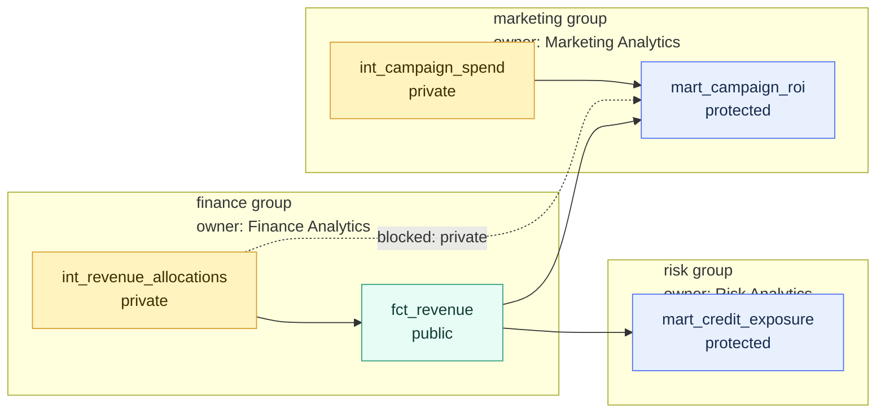

# Groups and Ownership

> [!abstract] Mental model
> Groups turn "someone probably owns this model" into explicit ownership and dependency boundaries in the dbt DAG.

## Executive Summary

- **What it is:** A dbt group is a named collection of DAG resources with an owner, usually representing a team, domain, source area, or business function.
- **Why it matters:** Groups make accountability visible. They help teams know who owns a model, who should be notified when it breaks, and which models are internal details versus shared interfaces.
- **Mental model:** **Models are buildings, `ref()` calls are roads, groups are neighborhoods, and owners are the teams responsible for those neighborhoods.**
- **Best used when:** Multiple teams work in one dbt project, models support important reporting, ownership is unclear during incidents, or the organization is preparing for dbt Mesh and domain-owned data products.
- **Avoid or reconsider when:** The project is tiny, one team owns everything, model structure is still experimental, or the real need is Snowflake RBAC, masking, row access, or dbt Platform user permissions.

## What It Can Do

- Assign explicit ownership to a group of dbt resources.
- Organize related models by team, business domain, source area, or data product boundary.
- Support model-level notifications to the right owner when models or tests fail in deployment jobs.
- Work with model access settings so internal models can be private to their group.
- Make the DAG easier to reason about by highlighting team and domain boundaries.
- Help large projects evolve toward dbt Mesh by identifying potential cross-project interfaces.
- Store useful metadata such as cost center, Slack channel, data classification, support tier, or domain owner in `config.meta`.
- Improve consultant discovery by making "who owns this?" answerable from project metadata instead of tribal knowledge.

## What It Cannot Do

- Replace Snowflake RBAC, database ownership, grants, masking policies, row access policies, or object tags.
- Replace dbt Platform user groups, SSO, licenses, or account-level permissions.
- Guarantee that the named owner is actually staffed, accountable, or reviewing changes.
- Prevent poor dependencies unless paired with model access choices and code review.
- Make a model trustworthy by itself; tests, documentation, contracts, and operational monitoring are still needed.
- Solve unclear business ownership if the organization has not agreed which team owns which data domain.
- Apply model governance guarantees to every dbt resource type in the same way; sources and exposures are not group members.

## Core Concepts

| Concept | Meaning | Why it matters |
|---|---|---|
| Group | A named collection of dbt DAG resources | Makes related resources and ownership explicit |
| Owner | The person, team, or email accountable for a group | Gives incidents, questions, and review requests somewhere to go |
| `groups:` key | YAML section where groups are defined | Central place to declare ownership metadata |
| `group` config | Resource config that assigns a model or other supported resource to a group | Connects individual resources or folders to their owner |
| One group per node | A dbt node can belong to only one group | Forces clear primary ownership instead of ambiguous shared ownership |
| Domain ownership | Ownership organized by business capability such as finance, risk, treasury, or marketing | Aligns data products with the teams that understand the business logic |
| Model access | `private`, `protected`, or `public` access setting for models | Decides which models are internal implementation details and which are stable interfaces |
| Private model | A model that can only be referenced by resources in the same group | Protects volatile or internal logic from accidental downstream dependencies |
| Public model | A stable model intended for cross-group, package, or project dependency | Becomes an intentional interface for other teams |
| `config.meta` | Arbitrary metadata attached to a group or resource | Useful for support channels, cost centers, sensitivity, ownership notes, or operating metadata |
| dbt Platform user groups | Account and project permission groups in dbt Platform | Related governance concept, but different from DAG groups |
| Snowflake object ownership | Warehouse-level ownership and grants on database objects | Important runtime control, but separate from dbt DAG ownership |

## How It Works (Simple Flow)

1. The team defines one or more groups in a YAML file, usually with an owner name and email.
2. Models or folders are assigned to those groups using the `group` config.
3. dbt parses the project and adds group ownership to the manifest and documentation metadata.
4. Teams decide which grouped models are internal and which are stable shared interfaces.
5. Internal models can be marked `access: private` so only resources in the same group can `ref()` them.
6. Shared models can remain `protected` inside the project or become `public` when they are intended as cross-group or cross-project interfaces.
7. In deployment environments, dbt Platform can use group ownership to route model-level notifications.
8. Over time, group boundaries reveal whether the project has clean domain ownership or a tangled DAG that needs refactoring.

## Visuals



The useful pattern is not "every team can reference everything." It is "teams expose a few intentional interfaces and keep implementation details private."

## Readable Snippets

### Recommended folder shape

```text
dbt_project.yml
models/
  _groups.yml
  staging/
    stripe/
      stg_stripe__payments.sql
      _stripe.yml
  intermediate/
    finance/
      int_revenue_allocations.sql
      _finance.yml
  marts/
    finance/
      fct_revenue.sql
      dim_accounts.sql
      _finance.yml
```

### Define groups once in `models/_groups.yml`

```yaml
groups:
  - name: finance
    description: "Models owned by the Finance Analytics team."
    owner:
      name: "Finance Analytics"
      email: finance-analytics@example.com
    config:
      meta:
        cost_center: finance
        data_classification: sensitive
        slack: "#finance-analytics"

  - name: marketing
    description: "Models owned by the Marketing Analytics team."
    owner:
      name: "Marketing Analytics"
      email: marketing-analytics@example.com
    config:
      meta:
        cost_center: marketing
        data_classification: internal
```

`models/_groups.yml` is a simple default because dbt already reads YAML files under the `models/` path. dbt also supports defining groups in a separate `groups/` directory, but then the project must include that directory in `model-paths`.

### Assign folder ownership in `dbt_project.yml`

```yaml
models:
  your_project_name:
    intermediate:
      finance:
        +group: finance
    marts:
      finance:
        +group: finance
      marketing:
        +group: marketing
```

This says every model under `models/intermediate/finance/` and `models/marts/finance/` belongs to the `finance` group. It avoids repeating `group: finance` on every model.

### Put model-specific behavior in folder YAML

```yaml
models:
  - name: int_revenue_allocations
    description: "Intermediate allocation logic used by finance-owned revenue models."
    config:
      access: private

  - name: fct_revenue
    description: "Finance-owned revenue fact table for reporting and downstream analytics."
    config:
      access: public
    columns:
      - name: revenue_id
        tests:
          - not_null
          - unique
```

Because the folder already has `+group: finance`, this file only needs model-specific settings such as `access`, descriptions, columns, tests, and contracts.

### Direct per-model assignment when needed

```yaml
models:
  - name: fct_revenue
    config:
      group: finance
      access: public
```

This is useful for an exception or a smaller project. In larger projects, folder-level assignment is usually easier to maintain.

### Quick placement rule

| Thing | Where to put it | Why |
|---|---|---|
| Group owner definitions | `models/_groups.yml` | One obvious place for ownership metadata |
| Broad folder ownership | `dbt_project.yml` | Assigns whole domains or layers without repetition |
| Model-specific `access`, tests, docs, contracts | Folder YAML such as `models/marts/finance/_finance.yml` | Keeps model behavior near the models |
| Transformation logic | `.sql` model files | Keeps SQL separate from ownership and documentation metadata |
| Exception ownership | Specific model YAML or in-file config | Allows careful override when folder ownership is not enough |

### Private model reference error pattern

```yaml
models:
  - name: finance_internal_margin_calc
    config:
      group: finance
      access: private

  - name: marketing_campaign_roi
    config:
      group: marketing
```

```sql
select *
from {{ ref('finance_internal_margin_calc') }}
```

If the marketing model references a private finance model, dbt should raise a reference error. The fix is usually not "make it public immediately." First ask whether finance should expose a stable public model instead.

## Consultant Talking Points

- **Client question this answers:** "Who owns this model, and which parts of the DAG are safe for other teams to depend on?"
- **Trade-offs to mention:** Groups add clarity and governance, but they also add maintenance. They work best when ownership boundaries reflect real teams and operating responsibilities.
- **Risk or governance angle:** In finance or banking, ownership matters because models can feed close processes, regulatory reporting, risk measures, liquidity views, credit exposure, or customer-impacting analytics.
- **Cost/performance angle:** Groups do not control compute by themselves, but group metadata can support cost-center reporting, query tagging strategy, support routing, and prioritization of expensive model fixes.

### Groups versus adjacent controls

| Question | Better control |
|---|---|
| Who owns this part of the DAG? | dbt groups and owner metadata |
| Can another model `ref()` this model? | dbt model access |
| Can a user query this table in Snowflake? | Snowflake RBAC and grants |
| Can a user see sensitive rows or columns? | Snowflake row access and masking policies |
| Can a user edit dbt jobs or environments? | dbt Platform user permissions |
| What columns and types should this model expose? | dbt model contracts |
| How do we change a shared model without breaking consumers? | dbt model versions and deprecation |

### Naming groups

Prefer names that match stable ownership boundaries:

- `finance`
- `risk`
- `treasury`
- `customer_analytics`
- `data_platform`
- `regulatory_reporting`

Avoid vague labels such as:

- `important`
- `shared`
- `misc`
- `phase_2`
- `johns_models`

If the group name would not help during an incident, it is probably not a good ownership boundary.

## Common Pitfalls

- Creating groups that mirror folders mechanically but do not match real team ownership.
- Treating dbt groups as Snowflake permissions. A private dbt model controls `ref()` behavior, not direct warehouse querying.
- Treating dbt groups as dbt Platform user access groups. They are separate concepts.
- Making every model `public`, which recreates fragile cross-team dependencies with nicer labels.
- Making too many tiny groups, which creates overhead without better accountability.
- Using one giant `analytics` group, which hides real ownership.
- Adding strict access controls before the model structure has stabilized.
- Forgetting that each node can belong to only one group, so shared ownership still needs a clear primary owner.
- Putting group metadata in many scattered files without a predictable convention.
- Leaving owner emails stale after reorganizations, departures, or support model changes.
- Using personal emails instead of team-owned distribution lists for important production areas.
- Assuming ownership metadata is enough without tests, contracts, docs, review, and incident process.

## When to Recommend What (Decision Table)

| Situation | Recommend | Why | Watch-outs |
|---|---|---|---|
| Small project owned by one analytics team | Minimal or no groups at first | Avoids governance overhead before it helps | Add groups once ownership becomes unclear |
| One project, several domain folders | Define groups centrally and assign folders in `dbt_project.yml` | Low repetition and clear ownership | Folder structure must match real ownership |
| Finance/risk/regulatory reporting models | Use explicit groups with team owner emails and useful `meta` | Supports accountability and incident routing | Pair with Snowflake RBAC, tests, contracts, and approvals |
| Internal staging or intermediate logic | Use group assignment plus `access: private` where appropriate | Prevents other teams from depending on unstable internals | Expose stable downstream marts instead |
| Shared mart or data product | Use group assignment plus `access: public` only when intentionally stable | Creates a clear interface for other teams | Requires stronger docs, tests, contracts, and change management |
| Preparing for dbt Mesh | Use groups to identify future project boundaries | Reveals natural domain interfaces before splitting projects | Do not split projects before ownership and interfaces are mature |
| Ownership is unclear | Start with a workshop mapping folders/models to accountable teams | Solves the organizational issue before encoding metadata | Avoid inventing ownership in YAML without agreement |
| Need user permissions | Use dbt Platform RBAC or Snowflake RBAC, not dbt groups alone | Groups are DAG metadata, not account security | Keep terminology clear with stakeholders |
| Need data access controls | Use Snowflake grants, masking, row access, and tags | Direct database access is controlled in Snowflake | dbt groups can document ownership but cannot enforce warehouse policies |

## Related Topics

- [[02 dbt/06 Governance Semantic Layer and Mesh/Governance Semantic Layer and Mesh Overview|Governance Semantic Layer and Mesh Overview]]
- [[02 dbt/06 Governance Semantic Layer and Mesh/51 Model Access|Model Access]]
- [[02 dbt/06 Governance Semantic Layer and Mesh/52 Model Contracts|Model Contracts]]
- [[02 dbt/06 Governance Semantic Layer and Mesh/53 Model Versions and Deprecation|Model Versions and Deprecation]]
- [[02 dbt/06 Governance Semantic Layer and Mesh/54 dbt Mesh and Project Dependencies|dbt Mesh and Project Dependencies]]
- [[02 dbt/06 Governance Semantic Layer and Mesh/57 Metadata Lineage and Catalog Strategy|Metadata, Lineage, and Catalog Strategy]]
- [[02 dbt/06 Governance Semantic Layer and Mesh/58 Domain Ownership in Banking|Domain Ownership in Banking]]
- [[02 dbt/05 Deployment CI CD and Operations/47 Secrets Service Accounts and RBAC|Secrets, Service Accounts, and RBAC]]
- [[02 dbt/08 dbt on Snowflake and Finance Patterns/75 Snowflake RBAC for dbt|Snowflake RBAC for dbt]]

## Related Decision Notes

- No related decision note yet.

## Questions

- Which teams or domains are stable enough to become dbt groups?
- Does folder structure already match ownership, or does it need cleanup first?
- Should group definitions live in `models/_groups.yml` or a dedicated `groups/` directory?
- Which models are internal implementation details and should be `private`?
- Which models are true shared interfaces and deserve `public` access?
- Should owners be team distribution lists instead of individuals?
- What metadata is useful for operations: Slack channel, cost center, support tier, data classification, or system owner?
- How often should ownership metadata be reviewed?
- Who approves changes to public models owned by a group?
- Are Snowflake RBAC and dbt model access being explained clearly as separate layers?

## Sources To Revisit

- [dbt Developer Hub - Add groups to your DAG](https://docs.getdbt.com/docs/build/groups)
- [dbt Developer Hub - Model access](https://docs.getdbt.com/docs/mesh/govern/model-access)
- [dbt Developer Hub - group resource config](https://docs.getdbt.com/reference/resource-configs/group)
- [dbt Developer Hub - Model notifications](https://docs.getdbt.com/docs/deploy/model-notifications)
