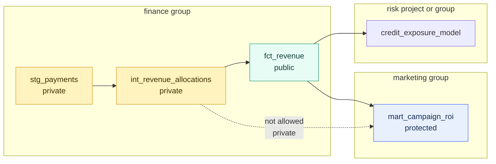

# Model Access

> [!abstract] Mental model
> Model access separates internal transformation machinery from stable shared interfaces in the dbt DAG.

## Executive Summary

- **What it is:** Model access is a dbt model config that controls whether other groups, packages, or projects can reference a model with `ref()`.
- **Why it matters:** It prevents accidental dependencies on internal models and helps teams expose a smaller set of trusted, documented interfaces.
- **Mental model:** **Groups define neighborhoods. Model access defines which doors are private rooms, internal corridors, or public entrances.**
- **Best used when:** A dbt project has multiple groups, important marts, shared reporting dependencies, cross-team collaboration, or dbt Mesh-style project dependencies.
- **Avoid or reconsider when:** The model structure is still unstable, the project has one small team, or the actual requirement is warehouse-level security rather than dbt DAG dependency control.

## What It Can Do

- Mark models as `private`, `protected`, or `public`.
- Prevent other groups from using `ref()` against private implementation models.
- Make stable shared models easier to identify in documentation and governance reviews.
- Support dbt Mesh by declaring which models are safe for downstream projects to reference.
- Encourage cleaner interfaces between domain-owned groups.
- Reduce breakage caused by downstream models depending on volatile staging or intermediate logic.
- Help teams decide which models need stronger documentation, tests, contracts, and versioning.
- Allow broad defaults in `dbt_project.yml` and precise overrides in model YAML or SQL config.

## What It Cannot Do

- Prevent a user from directly querying a table or view in Snowflake if Snowflake grants allow it.
- Replace Snowflake RBAC, masking policies, row access policies, object tags, or database ownership.
- Replace dbt Platform user permissions, environment permissions, or repository permissions.
- Guarantee that a public model is correct, well-documented, or stable.
- Stop breakage caused by raw source changes, bad SQL logic, incomplete tests, or missing contracts.
- Automatically create a good domain model; teams still need to decide which outputs are real interfaces.
- Apply to sources or exposures in the same way as models; model access is about dbt model references.

## Core Concepts

| Concept | Meaning | Why it matters |
|---|---|---|
| `access` | dbt config for a model's reference boundary | Controls who can `ref()` the model |
| `private` | Referenceable only by resources in the same group | Protects internal implementation details |
| `protected` | Referenceable by models in the same project or package | Default level; useful for project-internal sharing |
| `public` | Referenceable by any group, package, or project | Creates a stable interface for wider reuse |
| `ref()` | dbt function that declares a dependency on another model | Model access governs whether that dependency is allowed |
| Group | Ownership boundary used with private access | Private access depends on same-group membership |
| Interface model | A model intentionally exposed for downstream use | Should usually be documented, tested, and stable |
| Implementation model | A model used to build another model but not intended for consumers | Good candidate for `private` access |
| Default access | Models are `protected` unless configured otherwise | Existing projects keep working when access is introduced |
| Access error | dbt parsing/reference error when a model references something outside its allowed boundary | Catches bad dependencies before they become hidden production risk |
| Public model contract | Optional contract on a public model | Helps protect downstream consumers from shape-breaking changes |
| Model versioning | Versioned public model interface | Lets teams evolve shared models without sudden downstream breakage |

## How It Works (Simple Flow)

1. Teams define ownership groups for major domains, such as finance, risk, marketing, or data platform.
2. Models are assigned to groups directly or through folder-level config.
3. Each model gets an access level: `private`, `protected`, or `public`.
4. dbt parses the project and evaluates `ref()` calls against those access rules.
5. Same-group models can reference private models inside their group.
6. Same-project models can reference protected models.
7. Other groups, packages, or projects can reference public models.
8. If a model references something outside the allowed boundary, dbt raises an error before the dependency becomes part of the DAG.

## Visuals



The point is to let finance refactor `stg_payments` and `int_revenue_allocations` freely while downstream teams build on `fct_revenue`, the intended interface.

## Readable Snippets

### Access levels in model YAML

```yaml
models:
  - name: int_revenue_allocations
    description: "Intermediate finance-owned revenue allocation logic."
    config:
      group: finance
      access: private

  - name: fct_revenue
    description: "Stable finance-owned revenue fact table for downstream reporting."
    config:
      group: finance
      access: public
```

### Folder defaults in `dbt_project.yml`

```yaml
models:
  your_project_name:
    staging:
      +access: private
    intermediate:
      +access: private
    marts:
      finance:
        +group: finance
        +access: protected
```

Folder defaults are useful, but they are powerful. A broad `+access: public` on a folder can accidentally expose too many models.

### Public-model exception in folder YAML

```yaml
models:
  - name: fct_revenue
    description: "Approved revenue interface for finance, risk, and reporting consumers."
    config:
      access: public
      contract:
        enforced: true
    columns:
      - name: revenue_id
        data_type: varchar
        tests:
          - not_null
          - unique
      - name: recognized_revenue_amount
        data_type: number
        tests:
          - not_null
```

This pattern keeps most finance marts protected while making one carefully governed model public.

### Inline SQL config

```sql
{{ config(
    group = "finance",
    access = "private"
) }}

select
    payment_id,
    customer_id,
    amount
from {{ ref('stg_payments') }}
```

Inline config is valid, but model YAML is usually easier to review for governance because ownership, access, descriptions, tests, and contracts are visible together.

### Reference pattern

```sql
-- Good: marketing references finance's intended public interface.
select
    campaign_id,
    recognized_revenue_amount
from {{ ref('fct_revenue') }}
```

```sql
-- Bad: marketing reaches into finance's private implementation logic.
select *
from {{ ref('int_revenue_allocations') }}
```

The second pattern should fail if `int_revenue_allocations` is private to the finance group.

### List models by access level

```bash
dbt list --select "access:public"
dbt list --select "access:private"
dbt list --select "access:protected"
```

These commands are useful during governance cleanup because they show what the project is exposing.

### Practical layer default

```text
staging       -> private
intermediate  -> private
marts         -> protected by default
shared APIs   -> public by exception
```

This is a good starting rule. Public should usually mean intentional, documented, tested, and reviewed.

## Consultant Talking Points

- **Client question this answers:** "Which models are safe for other teams to build on, and which models are internal details?"
- **Trade-offs to mention:** Stricter access improves stability and ownership, but can expose messy hidden dependencies during migration.
- **Risk or governance angle:** Public models become informal data contracts unless the team explicitly manages documentation, tests, contracts, versioning, and deprecation.
- **Cost/performance angle:** Access does not directly reduce Snowflake cost, but cleaner dependency boundaries reduce accidental rebuilds, unnecessary model coupling, and expensive refactor risk.

### Access levels as consultant language

| Access | Plain-English meaning | Example |
|---|---|---|
| `private` | "This is our internal machinery." | Staging and intermediate calculations inside finance |
| `protected` | "This can be used inside this dbt project." | A mart used by nearby models in the same repository |
| `public` | "This is an intentional interface." | A governed revenue fact used by risk, finance, and reporting |

### Model access versus security

| Question | Better control |
|---|---|
| Can another dbt model `ref()` this model? | dbt model access |
| Who owns this model? | dbt groups |
| Can a user query the built table in Snowflake? | Snowflake RBAC and grants |
| Can a user see sensitive rows or columns? | Snowflake row access and masking policies |
| Who can edit dbt jobs, environments, and project settings? | dbt Platform permissions |
| Can downstream users rely on column names and types? | dbt model contracts |
| How do we avoid breaking consumers during a redesign? | Model versions and deprecation |

### Good public model checklist

- The model has a clear business purpose.
- The owner is explicit through a group.
- The description explains grain, filters, exclusions, and intended consumers.
- Important columns are documented.
- Key tests protect uniqueness, nullability, accepted values, and relationships.
- A contract is considered when downstream breakage would be costly.
- Breaking changes have a versioning or deprecation path.
- Snowflake grants align with the intended audience.

## Common Pitfalls

- Treating `private` as data security. It limits dbt references, not direct Snowflake queries.
- Making every model `public` because downstream users might someday want it.
- Leaving everything at default `protected` in a large project, which allows project-internal dependency sprawl.
- Setting `+access: public` at a high folder level and accidentally exposing staging or intermediate models.
- Marking a model public without stronger documentation, tests, contracts, or support ownership.
- Using private access before groups are defined clearly.
- Breaking existing dependencies by tightening access without first running selection and lineage checks.
- Forgetting that a private model can still be viewed or edited by users who have project development access.
- Confusing dbt model access with dbt Platform user permissions.
- Confusing dbt model access with Snowflake grants and object ownership.
- Exposing a public model whose grain or business logic is still disputed.
- Failing to revisit access levels after reorganizing folders or splitting projects.

## When to Recommend What (Decision Table)

| Situation | Recommend | Why | Watch-outs |
|---|---|---|---|
| Staging models | `private` | Staging is usually source cleanup, not a consumer interface | Some teams may need source-level patterns instead of staging refs |
| Intermediate models | `private` by default | Lets owners refactor internal logic safely | Expose a downstream mart if other teams need the logic |
| Marts used only inside one project | `protected` | Allows project-internal reuse without making a formal external interface | Can still become messy in very large projects |
| Shared enterprise mart | `public` | Makes the model an intentional interface | Needs stronger docs, tests, contracts, versioning, and ownership |
| dbt Mesh producer model | `public` | Downstream projects need to reference it | Treat it like a product API |
| Volatile model under active redesign | `private` or keep protected until stabilized | Avoids promising stability too early | Communicate migration path for existing users |
| Legacy project with many hidden refs | Start by listing access and dependencies, then tighten gradually | Prevents sudden parse failures | Use lineage review before changing broad defaults |
| Sensitive model | Use access plus Snowflake controls | dbt access documents dependency boundaries; Snowflake enforces data access | Do not confuse the two controls |
| One-team learning project | Leave default `protected` or use light private defaults | Keeps setup simple | Add access discipline before multiple teams depend on it |
| Public model with breaking changes | Add versions and deprecation window | Downstream consumers need time to migrate | Requires communication and cleanup ownership |

## Related Topics

- [[02 dbt/06 Governance Semantic Layer and Mesh/Governance Semantic Layer and Mesh Overview|Governance Semantic Layer and Mesh Overview]]
- [[02 dbt/06 Governance Semantic Layer and Mesh/50 Groups and Ownership|Groups and Ownership]]
- [[02 dbt/06 Governance Semantic Layer and Mesh/52 Model Contracts|Model Contracts]]
- [[02 dbt/06 Governance Semantic Layer and Mesh/53 Model Versions and Deprecation|Model Versions and Deprecation]]
- [[02 dbt/06 Governance Semantic Layer and Mesh/54 dbt Mesh and Project Dependencies|dbt Mesh and Project Dependencies]]
- [[02 dbt/06 Governance Semantic Layer and Mesh/57 Metadata Lineage and Catalog Strategy|Metadata, Lineage, and Catalog Strategy]]
- [[02 dbt/06 Governance Semantic Layer and Mesh/58 Domain Ownership in Banking|Domain Ownership in Banking]]
- [[02 dbt/08 dbt on Snowflake and Finance Patterns/75 Snowflake RBAC for dbt|Snowflake RBAC for dbt]]
- [[01 Snowflake/03 Security and Governance/12 RBAC Roles and Privileges|RBAC Roles and Privileges]]

## Related Decision Notes

- No related decision note yet.

## Questions

- Which models are true interfaces versus internal build steps?
- Which models are currently referenced across groups?
- Which public models need contracts, versions, or deprecation rules?
- Which folders should default to `private`, `protected`, or `public`?
- Are existing downstream dependencies relying on models that should become private?
- Do group boundaries match the way teams actually support the data?
- Who approves a model becoming public?
- How will downstream consumers be notified before a public model changes?
- Are Snowflake grants aligned with dbt access intent?
- Does the team understand that model access controls `ref()`, not database querying?

## Sources To Revisit

- [dbt Developer Hub - Model access](https://docs.getdbt.com/docs/mesh/govern/model-access)
- [dbt Developer Hub - access resource config](https://docs.getdbt.com/reference/resource-configs/access)
- [dbt Developer Hub - group resource config](https://docs.getdbt.com/reference/resource-configs/group)
- [dbt Developer Hub - About model governance](https://docs.getdbt.com/docs/mesh/govern/about-model-governance)
- [dbt Developer Hub - Node selector methods](https://docs.getdbt.com/reference/node-selection/methods)
