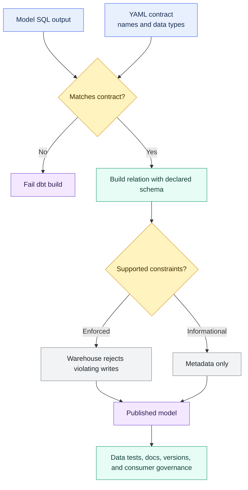

# Model Contracts

> [!abstract] Mental model
> A model contract is the schema promise of a trusted dbt model: these columns, with these types, or the build should fail.

## Executive Summary

- **What it is:** A dbt model contract declares the expected output columns and data types for a model and, when enforced, makes dbt fail the build if the SQL output does not match.
- **Why it matters:** Contracts protect downstream consumers from accidental schema changes on important models, especially public models and cross-team interfaces.
- **Mental model:** **Treat a public dbt model like an API. The contract defines the response shape; tests and reconciliation prove the content is trustworthy.**
- **Best used when:** A stable mart, public model, exposure, application feed, finance output, regulatory report input, or dbt Mesh producer model needs a predictable interface.
- **Avoid or reconsider when:** The model is experimental, changes shape often, uses unsupported materializations, or the team thinks a contract will prove business correctness by itself.

## What It Can Do

- Require every output column to be declared with a name and data type.
- Fail a build when SQL returns missing, extra, renamed, or incompatible columns.
- Make public model interfaces explicit in code review.
- Help downstream teams trust that a model's structure will not change casually.
- Support stable producer-consumer boundaries in dbt Mesh.
- Work alongside model access so public models become deliberate interfaces instead of accidental dependencies.
- Include supported constraints in generated DDL for table and incremental models.
- Order materialized columns according to the contract declaration.
- Help identify breaking changes when comparing project state.

## What It Cannot Do

- Prove that a revenue, risk, balance, or customer calculation is correct.
- Detect semantic changes when the same column names and types remain.
- Prove uniqueness, relationships, freshness, completeness, reconciliation, or grain unless separate tests or controls check them.
- Replace data tests, unit tests, documentation, model versions, ownership, or change approval.
- Replace Snowflake RBAC, masking, row access policies, or warehouse-enforced data controls.
- Make every constraint enforceable; enforcement depends on the adapter, materialization, and data platform.
- Apply to every dbt resource type. Contracts are model-focused and are not a general guarantee for sources, seeds, snapshots, or exposures.
- Avoid maintenance work. Every contracted column becomes interface metadata that must be kept current.

## Core Concepts

| Concept | Meaning | Why it matters |
|---|---|---|
| Model contract | Declared output schema for a model | Defines what downstream consumers can structurally rely on |
| `contract.enforced` | Config that makes dbt check the model output against the declared contract | Converts documentation into a build-time gate |
| Column name | Required field for each contracted column | Protects consumers from removed, renamed, or extra columns |
| `data_type` | Required type for each contracted column | Protects consumers from incompatible type changes |
| Preflight check | dbt comparison between the model query output and the YAML contract | Catches interface mismatch before accepting the build |
| Constraint | Optional rule such as `not_null`, `primary_key`, `foreign_key`, `unique`, `check`, or custom constraint | May be enforced or may only be metadata depending on platform support |
| Informational constraint | Constraint recorded as metadata but not enforced | Useful for catalogs and intent, but not proof of data quality |
| Data test | SQL-based validation of actual records after the model builds | Complements contracts by checking values and business rules |
| Public model | Model intentionally exposed to other groups, packages, projects, or external consumers | Strong candidate for contracts |
| Breaking change | Schema or constraint change that can disrupt downstream consumers | May require model versioning and deprecation planning |

## How It Works (Simple Flow)

1. A team identifies a stable model whose output shape matters to downstream consumers.
2. The model's YAML declares every output column and a warehouse-compatible `data_type`.
3. The model enables `contract.enforced: true`.
4. dbt compiles the model SQL and performs a preflight check against the declared columns and types.
5. If the SQL output is missing a column, adds an undeclared column, renames a column, or returns an incompatible type, dbt fails the build.
6. If the output matches, dbt builds the relation using the declared names, types, and supported constraints.
7. The warehouse enforces only the constraints it actually supports for that materialization.
8. Data tests, unit tests, reconciliation, documentation, access, ownership, versions, and release process cover the guarantees outside the schema contract.

## Visuals



## Readable Snippets

### Contracted finance model SQL

Keep the model output explicit and cast important types deliberately:

```sql
-- models/marts/finance/fct_revenue.sql

select
    cast(revenue_id as varchar) as revenue_id,
    cast(customer_id as varchar) as customer_id,
    cast(recognized_revenue_amount as number(38, 2)) as recognized_revenue_amount,
    cast(revenue_date as date) as revenue_date
from {{ ref('int_revenue_allocations') }}
```

### Enforced contract in model YAML

```yaml
models:
  - name: fct_revenue
    description: "Stable finance-owned revenue fact table for downstream reporting."
    config:
      group: finance
      access: public
      materialized: table
      contract:
        enforced: true

    columns:
      - name: revenue_id
        data_type: varchar

      - name: customer_id
        data_type: varchar

      - name: recognized_revenue_amount
        data_type: number(38, 2)

      - name: revenue_date
        data_type: date
```

If the SQL stops returning `revenue_date`, adds an undeclared column, or changes a declared type incompatibly, the model should fail instead of silently publishing a changed interface.

### Contract plus tests

```yaml
models:
  - name: fct_revenue
    config:
      contract:
        enforced: true

    columns:
      - name: revenue_id
        data_type: varchar
        tests:
          - not_null
          - unique

      - name: recognized_revenue_amount
        data_type: number(38, 2)
        tests:
          - not_null
```

The contract checks that `revenue_id` exists and is a string-like type. The tests check that actual built records are non-null and unique.

### Contract plus constraints

```yaml
models:
  - name: fct_revenue
    config:
      materialized: table
      contract:
        enforced: true

    constraints:
      - type: primary_key
        columns:
          - revenue_id

    columns:
      - name: revenue_id
        data_type: varchar
        constraints:
          - type: not_null
```

On Snowflake standard tables, `not_null` is enforced, while primary key, unique, and foreign key constraints are generally informational. Keep dbt data tests when the project needs proof of uniqueness or relationships.

### Four different controls

```text
Contract:
recognized_revenue_amount must be NUMBER(38,2)

Constraint:
revenue_id must not be NULL

Data test:
revenue_id must be unique in the built table

Unit test:
a refund transaction must reduce recognized revenue correctly
```

### Practical placement rule

```text
staging       -> usually no contract while interfaces are changing
intermediate  -> usually no contract unless heavily reused
marts         -> contract when stable and important
public models -> strongest contract candidate
```

## Consultant Talking Points

- **Client question this answers:** "How do we stop a shared dbt model from changing shape unexpectedly?"
- **Trade-offs to mention:** Contracts improve interface stability, but every column becomes maintained metadata. They are valuable on stable shared models and annoying on volatile models.
- **Risk or governance angle:** In finance or banking, contracts help protect report feeds, regulatory data products, and cross-team marts from accidental schema drift. They do not prove the business numbers are right.
- **Cost/performance angle:** A contract check is usually cheaper than discovering broken dashboards later. Some enforced constraints can reduce separate validation work, but informational constraints do not replace data tests.

### Governance trio

| Feature | Question answered |
|---|---|
| Groups and Ownership | Who owns this model? |
| Model Access | Who is allowed to `ref()` this model? |
| Model Contracts | What shape does this model promise to return? |

For a high-value model, this combination is powerful:

```yaml
config:
  group: finance
  access: public
  contract:
    enforced: true
```

Plain-English meaning:

```text
Finance owns this model.
Other teams may intentionally depend on it.
dbt should fail the build if its schema interface changes unexpectedly.
```

### Contracts versus tests versus constraints

| Control | Best at | Weak at |
|---|---|---|
| Model contract | Protecting column names and data types | Proving values, grain, business meaning, or freshness |
| Data test | Detecting invalid records or business-rule violations | Preventing bad writes before materialization |
| Warehouse constraint | Preventing supported invalid writes | Flexible business checks and diagnostic evidence, especially when informational only |
| Unit test | Proving SQL logic on controlled examples | Validating current production data |

## Common Pitfalls

- Assuming a contract proves the model's business logic is correct.
- Using `select *` in a contracted model and accidentally introducing extra columns.
- Forgetting every contracted output column needs a declared `name` and `data_type`.
- Contracting volatile staging or intermediate models too early.
- Marking a public model as contracted but leaving descriptions, tests, and ownership weak.
- Treating informational Snowflake primary keys or foreign keys as enforced data quality controls.
- Removing uniqueness or relationship tests because a constraint exists in YAML.
- Changing a column's meaning while keeping the same name and type, allowing the contract to pass.
- Under-specifying financial decimal types and creating avoidable precision or scale ambiguity.
- Applying contracts to unsupported materializations or resource types.
- Tightening contracts in a legacy project without checking downstream impact first.
- Ignoring versioning and deprecation when a contracted public model needs a breaking change.

## When to Recommend What (Decision Table)

| Situation | Recommend | Why | Watch-outs |
|---|---|---|---|
| Experimental staging model | Avoid contracts initially | Keeps iteration fast while source cleanup evolves | Revisit once it becomes a stable interface |
| Stable internal mart | Consider a contract if downstream breakage would hurt | Protects local consumers from schema drift | Do not over-contract low-value models |
| Public model | Use an enforced contract | Public models are intentional interfaces | Add ownership, docs, tests, and change process |
| dbt Mesh producer model | Use contract plus public access | Other projects need a stable dependency | Plan versions before breaking changes |
| Finance or regulatory output | Use contract plus tests, reconciliation, and approvals | Schema stability is necessary but not sufficient | Semantic accuracy still needs controls |
| Model with important decimal amounts | Cast in SQL and declare precise types in YAML | Avoids accidental type coercion | Test rounding and calculation rules separately |
| Need uniqueness proof | Use data tests, even if declaring key constraints | Snowflake key constraints may be informational | Explain enforcement clearly to stakeholders |
| Need direct database access control | Use Snowflake RBAC and policies | Contracts do not control who can query the table | Align grants with intended consumers |
| Breaking schema change | Use model versions and deprecation | Consumers need a migration path | Coordinate owners, exposures, and release timing |
| Very wide unstable model | Stabilize or narrow the interface before contracting | Reduces noisy YAML maintenance | A huge public interface is often a design smell |

## Related Topics

- [[02 dbt/06 Governance Semantic Layer and Mesh/Governance Semantic Layer and Mesh Overview|Governance Semantic Layer and Mesh Overview]]
- [[02 dbt/06 Governance Semantic Layer and Mesh/50 Groups and Ownership|Groups and Ownership]]
- [[02 dbt/06 Governance Semantic Layer and Mesh/51 Model Access|Model Access]]
- [[02 dbt/06 Governance Semantic Layer and Mesh/53 Model Versions and Deprecation|Model Versions and Deprecation]]
- [[02 dbt/06 Governance Semantic Layer and Mesh/54 dbt Mesh and Project Dependencies|dbt Mesh and Project Dependencies]]
- [[02 dbt/06 Governance Semantic Layer and Mesh/57 Metadata Lineage and Catalog Strategy|Metadata, Lineage, and Catalog Strategy]]
- [[02 dbt/03 Testing Documentation and Data Quality/21 Generic Singular and Custom Data Tests|Generic, Singular, and Custom Data Tests]]
- [[02 dbt/03 Testing Documentation and Data Quality/22 Unit Tests for SQL Logic|Unit Tests for SQL Logic]]
- [[02 dbt/03 Testing Documentation and Data Quality/26 Model Contracts and Constraints|Model Contracts and Constraints]]
- [[02 dbt/03 Testing Documentation and Data Quality/29 Data Quality Strategy in Regulated Environments|Data Quality Strategy in Regulated Environments]]

## Related Decision Notes

- [[80 Comparisons and Decision Notes/Decision Notes/dbt/Decisions - Choosing the Right dbt Quality Control|Decisions - Choosing the Right dbt Quality Control]]
- [[80 Comparisons and Decision Notes/Comparisons/dbt/Comparison - Model Contracts vs Data Tests vs Warehouse Constraints|Comparison - Model Contracts vs Data Tests vs Warehouse Constraints]]

## Questions

- Which models are stable enough to make a schema promise?
- Which public models currently lack contracts?
- Which downstream dashboards, reports, applications, or projects would break if a column changed?
- Which contracted models also need data tests, unit tests, or reconciliation controls?
- Which constraints are actually enforced on the current warehouse and materialization?
- Are finance amounts using explicit precision and scale?
- Which schema changes should trigger a model version instead of an in-place edit?
- Who approves changes to a contracted public model?
- Are consumers notified before breaking changes?
- Does the team understand that contracts protect structure, not business correctness?

## Sources To Revisit

- [dbt Developer Hub - Model contracts](https://docs.getdbt.com/docs/mesh/govern/model-contracts)
- [dbt Developer Hub - Contract configuration](https://docs.getdbt.com/reference/resource-configs/contract)
- [dbt Developer Hub - Constraints](https://docs.getdbt.com/reference/resource-properties/constraints)
- [dbt Developer Hub - About model governance](https://docs.getdbt.com/docs/mesh/govern/about-model-governance)
- [Snowflake Documentation - Overview of constraints](https://docs.snowflake.com/en/sql-reference/constraints-overview)
