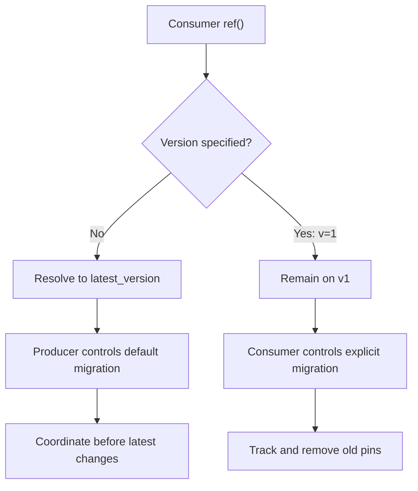

# Model Versions and Deprecation

> [!abstract] Mental model
> A shared dbt model behaves like an API: versions let a new breaking interface coexist with the old one, while deprecation gives consumers a deadline to migrate.

## Executive Summary

- **What it is:** Model versioning lets dbt operate several implementations of one logical model simultaneously. Deprecation communicates when an old model or version will stop being supported.
- **Why it matters:** Mature models can feed other teams, projects, BI tools, applications, files, and regulatory processes. Replacing their interface in place can create unplanned downstream failures.
- **Mental model:** **Git versions project code; dbt model versions operate multiple data interfaces at once.**
- **Best used when:** A stable public model needs a breaking schema, grain, identifier, constraint, or semantic change and consumers cannot all migrate in one coordinated release.
- **Avoid or reconsider when:** Do not version every refactor, additive column, test, or small internal model change. The migration, duplicate compute, storage, communication, and cleanup costs must be justified.

## What It Can Do

- Keep an old and new model interface live in the same codebase and data environment.
- Declare which version is the canonical `latest_version`.
- Let consumers follow the latest version or pin `ref()` to a specific live version.
- Treat a higher-than-latest version as a prerelease for production testing before general adoption.
- Reuse common properties and highlight column or configuration differences between versions.
- Give each version its own SQL/Python definition, contract, materialization, alias, tests, and deprecation date.
- Warn producers and consumers about upcoming or past deprecation.
- Protect versioned or contracted models from premature removal before their declared deprecation date.
- Support version-aware node selection for latest, prerelease, old, or specific versions.
- Give cross-team dbt Mesh producers and consumers a controlled migration mechanism.

## What It Cannot Do

- Decide whether a semantic change is breaking when names and data types remain unchanged.
- Automatically migrate dashboards, applications, spreadsheets, stored procedures, data shares, or direct Snowflake queries.
- Discover every non-dbt consumer merely by inspecting `ref()` lineage.
- Disable or stop building a deprecated version automatically.
- Drop the old Snowflake table or view when its dbt definition is removed.
- Eliminate the compute, storage, testing, support, and coordination cost of parallel versions.
- Prove that the new version is correct, reconciled, approved, or appropriate for historical restatement.
- Replace model contracts, data tests, unit tests, reconciliation, ownership, access, documentation, or release governance.
- Apply model-governance guarantees to sources, seeds, or snapshots in the same way.
- Make an unpinned consumer safe if the producer changes `latest_version` without adequate coordination.

## Core Concepts

| Concept | Meaning | Why it matters |
|---|---|---|
| Versioned model | One logical dbt model with multiple live implementations | Lets old and new interfaces coexist during migration |
| Breaking change | Change that can violate a consumer's reasonable dependency | Primary reason to introduce a new model version |
| `versions` | YAML property listing supported version identifiers | Makes versions first-class dbt resources |
| `v` | Version identifier, usually `1`, `2`, `3` | Simple major numbers communicate breaking generations |
| `latest_version` | Canonical version used by unpinned references | Controls which implementation new/default consumers receive |
| Prerelease version | Version greater than the declared latest | Enables testing before it becomes canonical |
| Old version | Version lower than the declared latest | Remains supported temporarily while consumers migrate |
| Pinned reference | `ref()` explicitly naming a version | Gives consumer stability but creates migration responsibility |
| Unpinned reference | `ref()` without a version | Follows the producer's latest version |
| `deprecation_date` | Declared end-of-support date | Communicates a deadline and enables dbt warnings/protection |
| Model contract | Declared columns, data types, and supported constraints for a version | Makes structural differences and breaking changes explicit |
| `defined_in` | Optional override for the model file containing a version | Useful for exceptions to the normal file convention |
| `alias` | Physical database relation name | Must be planned for dbt and direct Snowflake consumers |
| Consumer inventory | dbt and non-dbt systems relying on a version | Required before promotion or retirement |
| Migration window | Period when old and new versions coexist | Gives consumers time while bounding support cost |

### Model versions versus Git version control

| Git version control | dbt model versions |
|---|---|
| Tracks changes to the project repository | Defines simultaneously supported model interfaces |
| Normally deploys the latest approved `main` commit | Deploys v1 and v2 together |
| Supports review, history, revert, and collaboration | Supports downstream testing and migration |
| Restores previous project code through rollback | Keeps previous and new data products available at once |
| Answers "Which project code did we deploy?" | Answers "Which interface may this consumer use?" |

A Git rollback can restore yesterday's project. It does not let yesterday's interface and today's interface remain supported concurrently.

### Breaking versus non-breaking

| Change | Typical treatment | Important nuance |
|---|---|---|
| Remove or rename a column | New version | Direct and dbt consumers can break |
| Change a column data type | New version | Casting compatibility does not guarantee semantic compatibility |
| Change grain or primary identifier | New version | Often more disruptive than a visible schema change |
| Change a financial or regulatory definition | Often new version | dbt cannot infer breaking semantics from unchanged schema |
| Remove or weaken promised constraints | New version | Can invalidate consumer assumptions |
| Add an optional column | Usually change in place | `select *` consumers can still be fragile |
| Add tests or documentation | Change in place | Failure behavior may need communication |
| Optimize SQL with equivalent output | Change in place | Validate equivalence and performance |
| Fix a clear defect | Judgment call | Consumers may rely on old behavior even when it is wrong |
| Change a private implementation model | Usually coordinated in place | Evaluate only its controlled downstream DAG |

The producer must decide whether a reasonable consumer would experience an unexpected behavioral change. Schema comparison cannot make that business judgment.

## How It Works (Simple Flow)

1. The owner identifies a breaking change to a mature shared model and inventories dbt and non-dbt consumers.
2. A new version is declared and implemented while the existing version remains `latest_version`.
3. Both versions build with explicit contracts, tests, documentation, access, and ownership.
4. The producer reconciles expected differences and allows selected consumers to test the prerelease version.
5. The owner communicates the new interface, effective date, migration instructions, and support deadline.
6. `latest_version` is advanced only when the new version is approved as canonical; unpinned `ref()` calls then resolve to it.
7. The old version receives a `deprecation_date`, and pinned or direct consumers migrate during the defined window.
8. After the date, the owner verifies dbt lineage, warehouse usage, BI/application inventory, and consumer sign-off before removing code and deliberately dropping the old relation.

## Visuals

```mermaid
flowchart LR
    A["v1 is latest"] --> B["Build v2 as prerelease"]
    B --> C["Contract, test, and reconcile"]
    C --> D["Consumer testing and communication"]
    D --> E["Make v2 latest"]
    E --> F["Deprecate v1 with deadline"]
    F --> G["Consumers migrate"]
    G --> H["Verify no remaining use"]
    H --> I["Remove v1 code"]
    I --> J["Deliberately drop old relation"]

    classDef current fill:#E8F0FE,stroke:#4C6EF5,color:#172B4D
    classDef validate fill:#FFF3BF,stroke:#D69E2E,color:#3D2E00
    classDef migrate fill:#E6FCF5,stroke:#2F9E7B,color:#123C34
    classDef retire fill:#F3E8FF,stroke:#805AD5,color:#2D1B4E
    class A,B current
    class C,D validate
    class E,F,G migrate
    class H,I,J retire
```



### Reference behavior



## Readable Snippets

### Declare v1 as latest and v2 as prerelease

```yaml
models:
  - name: dim_customers
    description: "Customer interface shared with downstream domains."
    latest_version: 1

    config:
      group: customer
      access: public
      materialized: table
      contract:
        enforced: true

    columns:
      - name: customer_id
        data_type: varchar

      - name: country_name
        data_type: varchar

    versions:
      - v: 1

      - v: 2
        columns:
          - include: all
            exclude:
              - country_name
```

`v2` is higher than the declared latest, so it is a prerelease. The normal file convention is:

```text
models/marts/customer/dim_customers_v1.sql
models/marts/customer/dim_customers_v2.sql
```

Use simple identifiers such as `v: 1` and `v: 2`; do not include the letter `v` inside the identifier.

### Unpinned versus pinned references

```sql
-- Follows whichever version the producer declares latest
select *
from {{ ref('dim_customers') }}
```

```sql
-- Remains on v1 until this consumer deliberately migrates
select *
from {{ ref('dim_customers', v=1) }}
```

An unpinned reference reduces long-term pinning debt but makes the producer's promotion of `latest_version` consequential. A pinned reference provides stability but requires an owner and migration deadline.

### Promote v2 and deprecate v1

```yaml
models:
  - name: dim_customers
    latest_version: 2

    versions:
      - v: 1
        deprecation_date: 2027-03-31T23:59:59+00:00

      - v: 2
```

Use an explicit timezone, preferably UTC, so execution environments interpret the deadline consistently.

### Physical relation naming

The default alias for a versioned model follows:

```text
<model_name>_v<version>

dim_customers_v1
dim_customers_v2
```

If the existing unversioned relation must retain `DIM_CUSTOMERS` during migration:

```yaml
versions:
  - v: 1
    config:
      alias: dim_customers

  - v: 2
```

`defined_in` controls where dbt finds the code; `alias` independently controls the database relation name. Plan both deliberately, especially for consumers that query Snowflake directly.

### Select versions

```bash
# Build all live versions of the logical model
dbt build --select dim_customers

# Build one version
dbt build --select dim_customers.v2

# Build the latest version
dbt build --select dim_customers,version:latest
```

Production must build every version that remains supported. Development jobs may exclude old versions to reduce unnecessary work, provided CI and production still validate the supported interfaces.

### Compatibility view when safe

```sql
-- dim_customers_v1.sql
select
    customer_id,
    country_name
from {{ ref('dim_customers', v=2) }}
```

This pattern is valid only when v1 can be truthfully reproduced from v2. If logic, grain, or meaning changed, independent implementations may be required.

## Consultant Talking Points

- **Client question this answers:** "How can we change a shared model without forcing every downstream team and system to migrate on the same day?"
- **Trade-offs to mention:** Versions replace an abrupt breaking change with a managed migration, but parallel interfaces increase compute, storage, testing, documentation, communication, and support cost.
- **Risk or governance angle:** Define an owner, breaking-change policy, approval, consumer inventory, migration window, deprecation enforcement, retirement evidence, and exceptions process. Do not infer external usage solely from dbt lineage.
- **Cost/performance angle:** Build every supported version in production, or use a compatibility view only when it preserves the old promise. Keep the number and lifetime of versions small.

### Governance stack for a public model

| Feature | Question answered |
|---|---|
| Group and ownership | Who is accountable? |
| Model access | Who may depend on it through dbt? |
| Model contract | What structural interface is promised? |
| Model version | How can that promise change safely? |
| Deprecation date | When does support for the old promise end? |

```yaml
config:
  group: finance
  access: public
  contract:
    enforced: true
```

Add versions when this stable public contract must change incompatibly. Governance features are valuable because the model has consumers—not because every model needs maximum ceremony.

### Consumer migration choices

| Consumer posture | Reference strategy | Governance requirement |
|---|---|---|
| Accepts producer's compatible release process | Unpinned `ref()` | Producer must coordinate latest promotion |
| Critical workload needs explicit control | Pin to a version | Consumer owns migration before deprecation |
| Prerelease testing | Pin to prerelease version | Do not treat it as certified until approved |
| Direct Snowflake or BI consumer | Physical relation or governed view | Track outside dbt lineage and communicate separately |

### External consumer discovery

Before retiring a version, combine:

- dbt DAG, groups, project dependencies, exposures, and catalog metadata.
- Snowflake Access History or Query History.
- BI catalog, dashboard, and extract inventory.
- Application, stored procedure, file, data-share, and spreadsheet ownership.
- Consumer attestations for material dependencies.

"No downstream `ref()` remains" does not prove that the Snowflake relation is unused.

### What deprecation actually does

Declaring `deprecation_date`:

- Communicates a support deadline through dbt metadata.
- Produces warnings for upcoming or past deprecated references.
- Can be combined with warning-to-error configuration for stronger enforcement.
- Prevents certain versioned or contracted models from being removed before their date.

It does **not**:

- Stop scheduling or building the model.
- Disable the model after the date.
- Migrate downstream consumers.
- Drop the warehouse relation.
- Save compute or storage until execution and cleanup change.

Retirement therefore requires an operational runbook, not only one YAML property.

### Contracts and state-aware CI

dbt state comparison can detect several structural breaking changes to contracted models, including removed columns, changed data types, altered constraints, and removal of contract enforcement. Additive columns are normally classified as non-breaking.

This is useful but incomplete:

- Grain can change without the schema changing.
- A metric or financial rule can change under the same name and type.
- A `select *` consumer can still react poorly to an added column.
- Consumers outside dbt may not see compilation warnings.

The owner must supplement automated structural checks with semantic review and consumer coordination.

### Banking release example

Suppose `fct_credit_exposure` changes its classification methodology but keeps the same columns and data types.

The contract may pass, yet the change can alter:

- Risk-weighted exposure.
- Regulatory classification.
- Capital calculations.
- Management and external reporting.
- Historical comparability.

A controlled release should define:

- Methodology represented by each version.
- Business and regulatory approval.
- Effective business date and cutoff.
- Expected differences and reconciliation thresholds.
- Whether history is restated or only future periods use v2.
- Reports and processes permitted to use each version.
- Consumer migration register and deadline.
- Final v1 publication and retention date.
- Evidence that critical consumers migrated before retirement.

Model versions manage interface coexistence. They do not decide the accounting, risk, or regulatory restatement policy.

### Versioning cadence

Prefer non-breaking additions when they are genuinely safe, then introduce a major version on a predictable and communicated cadence rather than generating a new version for every small change. Two or three concurrent versions may be manageable; an open-ended collection becomes an expensive second legacy estate.

## Common Pitfalls

- Confusing model versions with Git commits, branches, dbt package versions, or YAML file schema versions.
- Versioning every small refactor or additive change.
- Changing grain, identifiers, or financial meaning in place because the contract still passes.
- Changing `latest_version` before v2 is reconciled, approved, and tested by consumers.
- Assuming every unpinned consumer will tolerate the new latest interface.
- Pinning critical consumers without tracking their migration ownership and deadline.
- Setting a deprecation date without a consumer inventory, migration instructions, or accountable owner.
- Assuming deprecation automatically stops builds or drops Snowflake relations.
- Removing code immediately after the date without checking actual dbt and non-dbt usage.
- Treating dbt lineage as a complete inventory of BI, application, file, spreadsheet, or data-share consumers.
- Failing to build, test, document, and monitor every supported version in production.
- Keeping old versions permanently and paying avoidable compute, storage, and support cost.
- Building an old version as a view over the new one when the old semantics cannot be reproduced accurately.
- Reusing the unsuffixed physical alias without planning how direct consumers will migrate.
- Omitting explicit timezone from a deprecation date.
- Treating version promotion as equivalent to historical data restatement.
- Removing or changing masking, row access, grants, tags, or retention controls inconsistently across versions.

## When to Recommend What (Decision Table)

| Situation | Recommend | Why | Watch-outs |
|---|---|---|---|
| Private model with controlled dbt descendants | Coordinated in-place change | Team can update the complete known DAG together | Verify no direct external consumers |
| Additive optional column on stable model | Usually change in place | dbt considers this structurally non-breaking | Fragile `select *` consumers and documentation |
| Column removal, rename, or incompatible type | New model version | Preserves the old structural promise during migration | Duplicate build and migration cost |
| Grain or identifier changes | New model version, often with a new conceptual name if meaning changed | Prevents silent misuse under the old interface | Decide whether it is still the same logical data product |
| Major semantic or financial methodology change | Version plus formal approval and reconciliation | Schema checks cannot detect meaning changes | Effective date, restatement, and report governance |
| Entirely different business concept | Separate model rather than a version | Avoids pretending two different products share one identity | Naming, ownership, discovery, and consumer education |
| Small organization can coordinate all consumers | In-place breaking change may be acceptable | Version migration overhead may exceed benefit | Confirm there are no unmanaged external consumers |
| Cross-team public or Mesh model | Contracted version with explicit migration window | Treats the shared relation as an API | Consumer ownership, latest promotion, deprecation enforcement |
| Critical consumer needs upgrade control | Pin its `ref()` during migration | Avoids automatic switch when latest changes | Track and remove the pin |
| Low-risk consumer accepts producer cadence | Unpinned `ref()` | Reduces persistent migration debt | Producer must make latest changes predictably |
| Old interface is a simple projection of v2 | Compatibility view | Reduces duplicate storage and transformation | Must preserve old meaning and acceptable performance |
| Old and new logic differ materially | Build independently | Preserves correct semantics | Compute, storage, tests, and reconciliation |
| Deprecation window has ended | Verify all usage, remove definition, then explicitly drop relation | Completes cleanup and stops cost | dbt does not perform warehouse cleanup automatically |
| Closed financial period is affected | Pair versioning with approved restatement/backfill process | Interface and historical correction are separate decisions | Audit trail, cutoff, downstream republication |

## Related Topics

- [[02 dbt/06 Governance Semantic Layer and Mesh/Governance Semantic Layer and Mesh Overview|Governance Semantic Layer and Mesh Overview]]
- [[02 dbt/06 Governance Semantic Layer and Mesh/50 Groups and Ownership|Groups and Ownership]]
- [[02 dbt/06 Governance Semantic Layer and Mesh/51 Model Access|Model Access]]
- [[02 dbt/06 Governance Semantic Layer and Mesh/52 Model Contracts|Model Contracts]]
- [[02 dbt/06 Governance Semantic Layer and Mesh/54 dbt Mesh and Project Dependencies|dbt Mesh and Project Dependencies]]
- [[02 dbt/06 Governance Semantic Layer and Mesh/57 Metadata Lineage and Catalog Strategy|Metadata, Lineage, and Catalog Strategy]]
- [[02 dbt/06 Governance Semantic Layer and Mesh/58 Domain Ownership in Banking|Domain Ownership in Banking]]
- [[02 dbt/04 Incremental Processing and Performance/39 Full Refreshes Backfills and Replay|Full Refreshes, Backfills, and Replay]]
- [[02 dbt/03 Testing Documentation and Data Quality/28 Audit and Migration Validation|Audit and Migration Validation]]

## Related Decision Notes

- [[80 Comparisons and Decision Notes/Decision Notes/dbt/Decisions - Versioning and Deprecating a dbt Model|Decisions - Versioning and Deprecating a dbt Model]]
- [[80 Comparisons and Decision Notes/Decision Notes/dbt/Decisions - Choosing a Data History and Restatement Pattern|Decisions - Choosing a Data History and Restatement Pattern]]
- [[80 Comparisons and Decision Notes/Decision Notes/dbt/Decisions - Choosing the Right dbt Quality Control|Decisions - Choosing the Right dbt Quality Control]]

## Questions

- Is the model mature, shared, and important enough to justify version maintenance?
- Would a reasonable consumer consider the schema, grain, identifier, constraint, or semantic change breaking?
- Is the new implementation still the same logical data product, or should it have a new model name?
- Which dbt and non-dbt consumers use the current relation?
- Which consumers should remain pinned, and who owns their migration?
- What evidence must pass before the new version becomes latest?
- What effective date and deprecation window fit the consumer and business calendars?
- Can the old version safely be a compatibility view, or must it retain independent logic?
- How will production build and monitor every supported version?
- Which warnings should be promoted to CI errors?
- What proves the old version is unused before removal?
- Does the change require historical restatement in addition to interface versioning?
- Who approves retirement and warehouse cleanup?

## Sources To Revisit

- [dbt Developer Hub - Model versions](https://docs.getdbt.com/docs/mesh/govern/model-versions)
- [dbt Developer Hub - Coordinating model versions](https://docs.getdbt.com/docs/mesh/govern/model-versions#coordinate-model-versioning)
- [dbt Developer Hub - versions property](https://docs.getdbt.com/reference/resource-properties/versions)
- [dbt Developer Hub - latest_version property](https://docs.getdbt.com/reference/resource-properties/latest_version)
- [dbt Developer Hub - deprecation_date property](https://docs.getdbt.com/reference/resource-properties/deprecation_date)
- [dbt Developer Hub - ref version argument](https://docs.getdbt.com/reference/dbt-jinja-functions/ref#versioned-ref)
- [dbt Developer Hub - Model contracts](https://docs.getdbt.com/docs/mesh/govern/model-contracts)
- [dbt Developer Hub - Model governance](https://docs.getdbt.com/docs/mesh/govern/about-model-governance)
