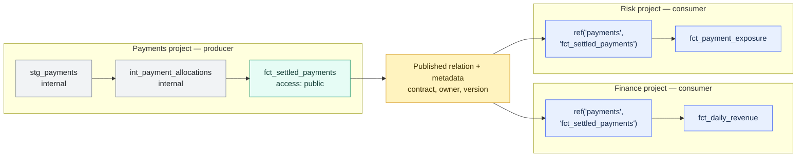

# dbt Mesh and Project Dependencies

> [!abstract] Mental model
> dbt Mesh lets several domain-owned dbt projects behave like one governed transformation ecosystem: producers publish stable models as data APIs, and consumers reference the built outputs without taking ownership of the producer's code or execution.

## Executive Summary

- **What it is:** dbt Mesh is a multi-project architecture supported by cross-project `ref()`, project dependencies, public model interfaces, contracts, versions, ownership, and cross-project metadata.
- **Why it matters:** Large organizations can give Finance, Risk, Customer, Payments, and other domains independent development and deployment workflows without losing governed lineage between their dbt projects.
- **Mental model:** **A package lets me run your code; a project dependency lets me trust and consume your output.**
- **Best used when:** Mature domain teams need independent workflows, a single dbt project has become slow or organizationally coupled, and teams can define stable data-product boundaries.
- **Avoid or reconsider when:** One team can still operate a manageable project, ownership is unresolved, proposed projects would depend heavily on each other's internals, or the organization is not ready to support multiple deployments and interfaces.

## What It Can Do

- Split a large dbt estate into independently owned and deployed projects.
- Let one project reference a public model built by another project.
- Resolve a two-argument `ref()` to the producer's existing relation through dbt metadata.
- Preserve cross-project lineage without copying the producer's project into the consumer.
- Keep the consumer's parse scope and development context narrower.
- Prevent the consumer from accidentally running or rebuilding the producer's models.
- Make public data-product boundaries explicit with model access.
- Combine ownership, contracts, versions, and deprecation into an API-like governance model.
- Support separate environment, credential, warehouse, and cost ownership by domain.
- Detect node-level cycles across project dependencies.

## What It Cannot Do

- Decide the correct organizational or business-domain boundaries.
- Turn several repositories into a healthy Mesh without ownership and stable public interfaces.
- Guarantee that the producer's data is fresh, correct, reconciled, or available when the consumer runs.
- Automatically coordinate every producer and consumer release, incident, SLA, or breaking semantic change.
- Replace Snowflake RBAC, masking policies, row access policies, object tags, or network controls.
- Make `access: public` a database grant; it only controls dbt reference eligibility.
- Eliminate the operational overhead of multiple repositories, jobs, environments, credentials, artifacts, and support teams.
- Discover every direct SQL, BI, application, file, or spreadsheet consumer outside dbt.
- Make a package dependency equivalent to a project dependency.
- Implement the full organizational concept of data mesh by itself.

## Core Concepts

| Concept | Meaning | Why it matters |
|---|---|---|
| dbt Mesh | Multi-project dbt architecture with governed cross-project dependencies | Enables team autonomy without losing shared lineage and interfaces |
| Producer project | Project that owns, builds, tests, and publishes a shared model | Keeps accountability and execution cost with the domain that understands the data |
| Consumer project | Project that references the producer's published model | Builds downstream logic without importing the producer's source code |
| Project dependency | Declaration that one dbt project consumes another project's public models | Gives dbt enough context to resolve cross-project references |
| Cross-project `ref()` | Two-argument reference containing project and model name | Makes the external dependency explicit and preserves lineage |
| Public model | Deliberate cross-project interface configured with `access: public` | Prevents consumers from coupling to arbitrary implementation models |
| Private or protected model | Model whose allowed dbt references are narrower | Gives the producer freedom to refactor internal layers |
| Metadata service | dbt platform mechanism that resolves public models from producer artifacts | Avoids downloading, parsing, configuring, or building the upstream project |
| `manifest.json` | Artifact containing the producer's resource metadata | Must be generated by a successful deployment run before consumers can resolve the interface |
| Model contract | Structural promise covering expected columns and data types | Protects consumers from accidental interface drift |
| Model version | Coexisting generation of a logical model interface | Supports controlled migration when a public interface must break |
| Ownership and groups | Assignment of accountable teams to dbt resources | Makes support and change decisions actionable |
| Environment alignment | Development, staging, and production resolution rules across projects | Prevents unsafe or misleading cross-environment dependencies |
| Data mesh | Wider organizational approach to domain ownership and data products | dbt Mesh can enable it but does not create the operating model |

### dbt Mesh versus merely having several projects

| Several disconnected dbt projects | Governed dbt Mesh |
|---|---|
| Teams query each other's tables with hard-coded names | Consumers use cross-project `ref()` |
| Shared relations are discovered informally | Producers deliberately publish public models |
| Interface changes rely on team memory | Contracts, versions, ownership, and deprecation govern changes |
| Cross-project lineage is incomplete | dbt metadata connects the project DAGs |
| Internal models become accidental dependencies | Access rules preserve implementation boundaries |
| Build and support responsibility is ambiguous | Producer and consumer responsibilities are explicit |

## How It Works (Simple Flow)

1. The organization identifies a real domain boundary with an accountable producer team and a useful shared data product.
2. The producer keeps staging and intermediate implementation models internal and configures only stable interface models with `access: public`.
3. Critical public models receive ownership, tests, documentation, contracts, and a breaking-change/version policy.
4. A successful producer deployment builds the relations and publishes a `manifest.json` from an appropriate deployment environment.
5. The consumer lists the producer project in `dependencies.yml`.
6. Consumer SQL calls the public model with `ref('<project_name>', '<model_name>')`.
7. dbt resolves the reference to the producer's already-built relation and includes the edge in cross-project lineage; the consumer does not parse or run the producer's models.
8. Producer and consumer teams operate their own jobs while coordinating freshness, incidents, versions, environment alignment, security, and service expectations.

## Visuals



The project boundary changes ownership, deployment, and interface governance. It does not copy the Payments code into Finance or Risk.

## Readable Snippets

### Producer project name

```yaml
# payments/dbt_project.yml

name: payments
```

Project names must be unique in the dbt account. Matching is case-sensitive, so consumers must use the exact `dbt_project.yml` name.

### Publish a stable producer model

```yaml
# payments/models/marts/payments/_payments__models.yml

models:
  - name: fct_settled_payments
    description: "Settled payment interface published by the Payments domain."

    config:
      group: payments
      access: public
      materialized: table
      contract:
        enforced: true

    columns:
      - name: payment_id
        data_type: varchar
        data_tests:
          - not_null
          - unique

      - name: settlement_date
        data_type: date
        data_tests:
          - not_null

      - name: settled_amount
        data_type: number(38, 2)
        data_tests:
          - not_null
```

`access: public` makes the model eligible for cross-project `ref()`. It does not grant a Snowflake role permission to query the table.

### Declare the consumer's dependencies

```yaml
# finance/dependencies.yml

packages:
  - package: dbt-labs/dbt_utils
    version: 1.3.3

projects:
  - name: payments
```

`dependencies.yml` can contain project dependencies and compatible package dependencies. Keep `packages.yml` when package specifications require unsupported dynamic Jinja configuration or a package installation pattern that specifically depends on it.

### Reference the public model

```sql
-- finance/models/marts/finance/fct_daily_revenue.sql

select
    settlement_date,
    sum(settled_amount) as settled_revenue
from {{ ref('payments', 'fct_settled_payments') }}
group by settlement_date
```

This two-argument `ref()` means:

```text
ref(<producer project name>, <public model name>)
```

The Finance build selects from the existing Payments relation. It cannot build the Payments models through this dependency.

### Package dependency is a different mechanism

```yaml
# packages.yml

packages:
  - package: dbt-labs/dbt_utils
    version: 1.3.3
```

Running `dbt deps` downloads package source code into the consumer environment so its macros or models become part of the consumer's runtime. That is appropriate for reusable code, not the normal interface between independently operated domain projects.

## Consultant Talking Points

- **Client question this answers:** "How can independent domain teams build on each other's trusted dbt data without putting everyone in one repository and deployment?"
- **Trade-offs to mention:** Mesh improves autonomy, isolation, parse scope, ownership, lineage, and cost attribution, but introduces interface management and multi-project operational overhead.
- **Risk or governance angle:** Treat public models as data products: name an owner, minimize the interface, enforce structural contracts where appropriate, test and reconcile content, version breaking changes, inventory non-dbt consumers, and align Snowflake security separately.
- **Cost/performance angle:** Consumers do not rebuild producer models, which protects producer ownership and avoids duplicate compute. Multiple environments, parallel versions, duplicated transformations, and poorly chosen boundaries can still increase warehouse and platform cost.

### Package dependency versus project dependency

| Dimension | Package dependency | Project dependency |
|---|---|---|
| Shared object | Source code | Already-built dataset through metadata |
| Mental model | Software library | Data API |
| Typical use | Utility macros, reusable transformations, starter projects | Finance consuming a Payments-owned public model |
| Upstream code downloaded | Yes | No |
| Parsed in consumer project | Yes | No |
| Built by consumer | Possible and often expected for packaged models | No |
| Producer retains execution ownership | Not necessarily | Yes |
| Consumer needs producer runtime configuration | Often | No |
| Cross-project lineage pattern | Not dbt Mesh | Yes |
| Main risk | Extra parsing, configuration, unintended builds, and blurred ownership | Stale interfaces, operational dependency, and weak change governance |

Use the decision rule:

> **Share code through packages. Share governed domain outputs through project dependencies.**

Installing an internal domain project as a package can be justified for exceptional unified deployment or coordinated end-to-end testing. If teams need that constantly, reconsider whether the proposed project boundary is genuinely stable.

### Governance stack for a public Mesh model

| Feature | Question answered |
|---|---|
| Group and owner | Who is accountable for this data product? |
| Model access | Who may depend on it through dbt? |
| Contract | What structural interface is promised? |
| Tests and reconciliation | Is its content trustworthy enough to publish? |
| Version and deprecation | How will breaking changes be introduced and retired? |
| Catalog and lineage | Who consumes it and what does it affect? |
| Snowflake RBAC and policies | Who may query which rows and columns? |
| Job monitoring and SLA | Is it available and fresh when consumers need it? |

No single row replaces the others.

### Producer and consumer responsibilities

| Producer owns | Consumer owns | Shared coordination |
|---|---|---|
| Model logic and grain | Downstream model logic | Interface expectations |
| Build, tests, and deployment | Consumer build and deployment | Freshness and availability windows |
| Warehouse cost for the public relation | Warehouse cost for downstream transformations | Incident communication |
| Contract, documentation, and versions | Migration before deprecation | Breaking semantic changes |
| Support and data-quality triage | Appropriate use of the published data | Staging and production alignment |

### Snowflake security boundary

dbt and Snowflake enforce different controls:

```text
dbt access: public
    -> This project may form a dbt dependency on the model.

Snowflake grants and policies
    -> This role may query this database object, row, or column.
```

For regulated environments, align public dbt interfaces with:

- Dedicated producer and consumer roles.
- Database and schema usage grants.
- Object privileges or future-grant strategy.
- Masking and row access policies for sensitive data.
- Object tags and classification.
- Separate development, staging, and production data boundaries.
- Query and access-history evidence for non-dbt consumption.

### Environment behavior

Cross-project resolution depends on successful producer deployment metadata:

- The producer needs a successful production deployment run that generates `manifest.json`.
- If staging is used, populate it successfully before downstream projects rely on it.
- Staging consumers should resolve against producer staging, and production consumers against producer production.
- Development may otherwise resolve references using producer production metadata or data, depending on the configured workflow.
- A project dependency proves where the model is; it does not prove that its latest data satisfies the consumer's freshness requirement.

In banking, prevent developers from reaching sensitive production data merely because cross-project development is convenient.

### dbt Mesh versus data mesh

| dbt Mesh | Organizational data mesh |
|---|---|
| dbt multi-project technical pattern | Enterprise operating model |
| Cross-project references and lineage | Domain-oriented ownership |
| Public model interfaces | Data products with service expectations |
| Contracts, access, and versions | Federated computational governance |
| Helps implement part of the architecture | Also requires people, funding, incentives, platform, and support processes |

A client can use dbt Mesh without adopting every data-mesh principle. It can also claim a data-mesh strategy while still having poorly governed dbt projects.

### Incremental adoption path

1. Improve groups, ownership, model access, contracts, and documentation inside the current project.
2. Measure real pain: parse time, deployment coupling, security isolation, coordination delays, and incident ownership.
3. Identify one domain with a stable, useful public interface and a team able to operate it.
4. Split that boundary and establish producer and consumer jobs, environments, grants, artifacts, and service expectations.
5. Validate cross-project lineage, staging behavior, CI, incident handling, and breaking-change migration.
6. Expand only when the first boundary produces measurable autonomy rather than additional hand-offs.

## Common Pitfalls

- Splitting a small project before organizational or technical scale requires it.
- Dividing projects according to the current org chart instead of stable data-product boundaries.
- Calling several disconnected repositories "Mesh" while consumers still hard-code relation names.
- Marking most models public and exposing staging or intermediate implementation details.
- Assuming `access: public` grants Snowflake database access.
- Treating a public model's contract as proof that its calculations, grain, freshness, or reconciliations are correct.
- Forgetting the producer needs a successful deployment artifact before consumers can resolve the dependency.
- Creating a staging environment before successfully populating its metadata, causing downstream resolution failures.
- Allowing development workflows to reach sensitive production data without deliberate controls.
- Assuming the consumer's job will rebuild, refresh, or repair the producer's model.
- Changing public semantics in place because column names and data types did not change.
- Installing an internal producer project as a package by default and transferring its configuration and build complexity to consumers.
- Creating bidirectional dependencies or recurring coordinated releases that reveal a weak project boundary.
- Splitting into many tiny projects and multiplying jobs, credentials, warehouses, alerts, and support rotations.
- Ignoring direct Snowflake, BI, application, file, and spreadsheet consumers outside dbt lineage.
- Duplicating the same conformed logic in several domains instead of assigning a clear authoritative producer.
- Measuring the success of Mesh by project count rather than delivery autonomy, reliability, interface stability, and cost.

## When to Recommend What (Decision Table)

| Situation | Recommend | Why | Watch-outs |
|---|---|---|---|
| One team and manageable project | Keep one project | Lowest operational and governance overhead | Still use ownership, access, tests, and documentation |
| Several teams but coordinated releases remain effective | Improve governance inside the monolith first | Groups and model access may solve the immediate issue | Reassess when coupling becomes measurable |
| Large project has slow parsing and unrelated domains | Evaluate a small number of project boundaries | Narrows development scope and ownership | Do not split solely to chase faster parsing |
| Mature domains need independent releases | Adopt dbt Mesh incrementally | Project dependencies retain governed lineage | Define interfaces and service expectations before migration |
| Another team needs a trusted built dataset | Use a project dependency | Producer retains logic, execution, and cost ownership | Requires public model and deployment metadata |
| Several projects need the same macro or generic transformation | Use a package | Code reuse is the actual requirement | Pin versions and assign package maintenance ownership |
| Internal project must be built centrally as part of one deployment | Consider package or orchestration exception | Can support unified builds | Blurs ownership and may add parse and compute cost |
| Teams frequently need coordinated end-to-end branch testing | Reassess the boundary before adding workarounds | High change coupling contradicts a stable data API | Temporary package testing may be an exception |
| Public model needs a breaking change | Use model versions and deprecation | Consumers need a controlled migration window | Track pinned and non-dbt consumers |
| Sensitive banking domains need isolation | Mesh plus Snowflake security controls | Separates workflows and narrows permitted interfaces | dbt access is not row- or column-level security |
| Domain ownership is disputed | Resolve ownership before splitting | A repository cannot create accountability | Establish decision rights and support model |
| Proposed projects form repeated cycles | Redesign domains or retain one project | Cycles signal shared responsibility or misplaced logic | dbt cycle detection is not an architecture strategy |
| Client uses dbt Core or a non-eligible dbt plan | Use separate projects with explicit orchestration, sources, or other interfaces | Native project dependencies are a dbt platform Enterprise feature | Lineage and governance will require different mechanisms |

## Related Topics

- [[02 dbt/06 Governance Semantic Layer and Mesh/Governance Semantic Layer and Mesh Overview|Governance Semantic Layer and Mesh Overview]]
- [[02 dbt/06 Governance Semantic Layer and Mesh/50 Groups and Ownership|Groups and Ownership]]
- [[02 dbt/06 Governance Semantic Layer and Mesh/51 Model Access|Model Access]]
- [[02 dbt/06 Governance Semantic Layer and Mesh/52 Model Contracts|Model Contracts]]
- [[02 dbt/06 Governance Semantic Layer and Mesh/53 Model Versions and Deprecation|Model Versions and Deprecation]]
- [[02 dbt/06 Governance Semantic Layer and Mesh/57 Metadata Lineage and Catalog Strategy|Metadata, Lineage, and Catalog Strategy]]
- [[02 dbt/06 Governance Semantic Layer and Mesh/58 Domain Ownership in Banking|Domain Ownership in Banking]]
- [[02 dbt/06 Governance Semantic Layer and Mesh/59 Sensitive Data and Regulatory Boundaries|Sensitive Data and Regulatory Boundaries]]
- [[02 dbt/05 Deployment CI CD and Operations/41 Dev CI Staging and Prod Environments|Dev, CI, Staging, and Prod Environments]]
- [[02 dbt/05 Deployment CI CD and Operations/45 Artifacts Logs and Run Results|Artifacts, Logs, and Run Results]]
- [[01 Snowflake/03 Security and Governance/12 RBAC Roles and Privileges|RBAC, Roles, and Privileges]]
- [[01 Snowflake/04 Data Engineering/25 dbt on Snowflake|dbt on Snowflake]]

## Related Decision Notes

- [[80 Comparisons and Decision Notes/Comparisons/dbt/Comparison - dbt Packages vs Project Dependencies|Comparison - dbt Packages vs Project Dependencies]]
- [[80 Comparisons and Decision Notes/Decision Notes/dbt/Decisions - Versioning and Deprecating a dbt Model|Decisions - Versioning and Deprecating a dbt Model]]
- [[80 Comparisons and Decision Notes/Decision Notes/dbt/Decisions - Choosing a dbt Environment and Credential Strategy|Decisions - Choosing a dbt Environment and Credential Strategy]]

## Questions

- What measurable problem would multiple projects solve that groups and model access cannot solve inside one project?
- Which boundaries are stable business domains rather than temporary team structures?
- Who owns, builds, pays for, supports, and approves changes to each public model?
- Which models are genuine interfaces, and which should remain internal?
- What contract, grain, business meaning, tests, reconciliation, freshness, and availability does each interface promise?
- How will breaking changes be versioned, communicated, migrated, and retired?
- Which consumers exist outside dbt lineage?
- How are production and staging artifacts generated, retained, and monitored?
- Can development safely resolve upstream data without exposing sensitive production records?
- How will producer failures block, warn, or pause consumers?
- Do proposed dependencies form cycles or require frequent coordinated releases?
- Does the client have the dbt platform plan and operating maturity required for project dependencies?
- How will Snowflake grants, policies, warehouses, query tags, and cost attribution align with domain ownership?
- What success measures will prove the split improved autonomy, reliability, delivery time, or cost?

## Sources To Revisit

- [dbt Developer Hub - About dbt Mesh](https://docs.getdbt.com/docs/mesh/about-mesh)
- [dbt Developer Hub - Project dependencies](https://docs.getdbt.com/docs/mesh/govern/project-dependencies)
- [dbt Developer Hub - Model access](https://docs.getdbt.com/docs/mesh/govern/model-access)
- [dbt Developer Hub - Model contracts](https://docs.getdbt.com/docs/mesh/govern/model-contracts)
- [dbt Developer Hub - Model versions](https://docs.getdbt.com/docs/mesh/govern/model-versions)
- [dbt Developer Hub - About model governance](https://docs.getdbt.com/docs/mesh/govern/about-model-governance)
- [dbt Developer Hub - ref function](https://docs.getdbt.com/reference/dbt-jinja-functions/ref)
- [dbt Developer Hub - dependencies.yml](https://docs.getdbt.com/reference/project-configs/dependencies)
- [dbt Developer Hub - Environment-level configurations](https://docs.getdbt.com/docs/dbt-cloud-environments)
- [Snowflake Documentation - Overview of Access Control](https://docs.snowflake.com/en/user-guide/security-access-control-overview)
