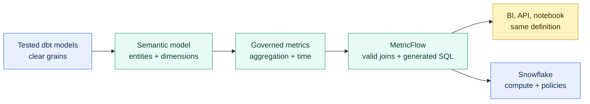

# Semantic Models and Metrics

> [!abstract] Mental model
> A dbt model organizes the data; a semantic model explains how it may be joined and sliced; a metric gives a governed calculation a stable business name.

## Executive Summary

- **What it is:** dbt semantic models are YAML metadata over dbt models. They describe entities, dimensions, time behavior, and metrics so MetricFlow can generate queries consistently.
- **Why it matters:** Revenue, exposure, active customers, and similar KPIs stop being reimplemented differently in every dashboard or notebook.
- **Mental model:** **The warehouse stores the ingredients, dbt models prepare them, and the Semantic Layer is the governed menu for asking for a metric by approved dimensions.**
- **Best used when:** The same important metrics are consumed in several tools, users need flexible slicing, and the business can assign owners to definitions.
- **Avoid or reconsider when:** One report owns a local calculation, the underlying grain is not trustworthy, or the client cannot support the dbt platform integration and credential model.

## What It Can Do

- Define metrics next to version-controlled transformation logic.
- Describe join keys as entities and valid groupings as dimensions.
- Generate SQL for requested metrics, filters, dimensions, and time grains through MetricFlow.
- Reduce duplicated calculation and join logic across supported downstream tools and APIs.
- Express simple, cumulative, derived, ratio, and conversion metrics.
- Query definitions locally with MetricFlow; dbt platform plans add dynamic APIs and supported integrations.
- Apply warehouse access policies through the credentials used for Semantic Layer queries.

## What It Cannot Do

- Repair an incorrect grain, duplicate key, or poorly modeled fact table.
- Decide which business definition is authoritative or who approves changes.
- Guarantee that every BI tool, spreadsheet, or direct SQL user consumes the metric.
- Replace tests, reconciliation, freshness monitoring, or model contracts.
- Replace Snowflake RBAC, masking policies, row access policies, or audit evidence.
- Make every query cheap; flexible slicing can still generate large joins and scans.
- Provide dbt platform APIs and integrations to a dbt Core-only implementation.

## Core Concepts

| Concept | Meaning | Why it matters |
|---|---|---|
| Semantic model | Semantic annotations attached to a dbt model | Connects physical data to business meaning |
| MetricFlow | Engine that validates the semantic graph and generates SQL | Produces consistent joins and aggregations |
| Entity | Business key such as account, trade, or customer | Connects semantic models and controls valid join paths |
| Dimension | Categorical or time attribute used to group or filter | Defines how users may slice a metric |
| Simple metric | Aggregation over a column expression | Base KPI such as total settled amount |
| Derived or ratio metric | Calculation built from other metrics | Reuses governed components instead of copying SQL |
| Aggregation time dimension | Default event time for a metric | Prevents ambiguous time-series behavior |
| Semantic Layer API | dbt platform interface for downstream metric queries | Makes definitions reusable outside dbt code |
| Saved query / export | Governed metric query that can be reused or written back | Useful when a consumer needs a stable result shape |

## How It Works (Simple Flow)

1. Build and test dbt models at clear grains, such as one row per settled trade.
2. Enable semantic behavior on the relevant model in YAML.
3. Mark key columns as entities and analytical attributes as dimensions.
4. Define metrics with explicit aggregation, expression, time dimension, description, and owner.
5. dbt validates the project and MetricFlow builds a semantic graph from the definitions.
6. A user or integrated tool requests a metric with dimensions, filters, and time grain.
7. MetricFlow selects valid join paths, generates SQL, and executes it using configured warehouse credentials.
8. The team monitors correctness, performance, adoption, and definition changes like any other governed interface.

## Visuals



The semantic definition governs how a question is translated into SQL. Snowflake still governs who can execute that SQL and which data they can see.

## Readable Snippets

### Current dbt v1.12-style shape

```yaml
models:
  - name: fct_settled_trades
    description: "One row per settled trade."
    semantic_model:
      enabled: true

    agg_time_dimension: settlement_date

    columns:
      - name: trade_id
        entity:
          type: primary
          name: trade

      - name: client_id
        entity:
          type: foreign
          name: client

      - name: settlement_date
        granularity: day
        dimension:
          type: time

      - name: desk
        dimension:
          type: categorical

    metrics:
      - name: settled_notional
        label: Settled Notional
        type: simple
        agg: sum
        expr: notional_amount
```

This says how to calculate `settled_notional` and which dimensions may slice it. It does not test that `trade_id` is actually unique; add a data test for that assumption.

```text
Business request: settled notional by desk by month
MetricFlow inputs: settled_notional + desk + settlement_date__month
Result: generated SQL against the governed dbt models
```

dbt's semantic YAML changed materially between release tracks. Always use the documentation for the client's pinned dbt version rather than copying examples from another version.

## Consultant Talking Points

- **Client question this answers:** "How can Finance and Risk calculate the same KPI consistently in more than one analytics tool?"
- **Trade-offs to mention:** Central governance and flexible slicing improve consistency, but introduce semantic modeling, platform, integration, and change-management work.
- **Risk or governance angle:** Assign a business owner, technical owner, grain, time basis, currency treatment, reconciliation control, and breaking-change process to each material KPI.
- **Cost/performance angle:** Metrics are normally computed against underlying warehouse tables on request. Generated joins, high-cardinality dimensions, and repeated queries still consume Snowflake compute; caching or exports should solve measured problems.

### Minimum definition of a bank-grade metric

| Question | Example answer |
|---|---|
| What does it measure? | Settled principal amount |
| At what grain? | One settled trade |
| Which date applies? | Settlement date, not trade date |
| Which currency? | Reporting currency after approved FX conversion |
| Which records are excluded? | Cancelled and reversed trades |
| Who owns it? | Treasury Reporting |
| How is it controlled? | Daily reconciliation to settlement ledger |

## Common Pitfalls

- Defining metrics before the underlying model grain and keys are reliable.
- Calling two different time bases or business scopes by the same metric name.
- Declaring an entity type that the data does not satisfy, producing unsafe joins or incorrect totals.
- Assuming generated SQL removes the need for query tuning and warehouse cost monitoring.
- Publishing hundreds of metrics without ownership, descriptions, certification, or adoption evidence.
- Treating metric YAML as access control; warehouse credentials and Snowflake policies still decide data visibility.
- Expecting dbt Core-only users to have the dbt platform APIs and first-class integrations.
- Copying pre-1.12 semantic YAML into a 1.12 project, or the reverse, without checking the pinned version.

## When to Recommend What (Decision Table)

| Situation | Recommend | Why | Watch-outs |
|---|---|---|---|
| One dashboard owns a local calculation | Keep it in the BI model initially | Lowest governance overhead | Promote it when reuse or inconsistency appears |
| Important KPI used across several tools | dbt Semantic Layer | One version-controlled definition and dynamic queries | Platform plan, integration coverage, credentials |
| Stable, frequently reused aggregate | Governed dbt mart or Semantic Layer export | Predictable shape and performance | Less flexible than dynamic slicing |
| Underlying data grain is disputed | Fix models and reconciliation first | A semantic layer cannot correct bad foundations | Name a business owner before publishing |
| Sensitive metric with user-specific access | Semantic Layer plus Snowflake RBAC and policies | Separates semantic consistency from enforcement | Test effective access for every credential path |
| Snowflake-native AI and SQL are primary consumers | Evaluate Snowflake Semantic Views | Native schema object and Cortex integration | Separate semantic system from MetricFlow |

## Related Topics

- [[02 dbt/06 Governance Semantic Layer and Mesh/Governance Semantic Layer and Mesh Overview|Governance Semantic Layer and Mesh Overview]]
- [[02 dbt/02 Modeling Patterns and Layering/13 Marts and Data Products|Marts and Data Products]]
- [[02 dbt/06 Governance Semantic Layer and Mesh/50 Groups and Ownership|Groups and Ownership]]
- [[02 dbt/06 Governance Semantic Layer and Mesh/56 Semantic Layer vs BI Metrics vs Snowflake Semantic Views|Semantic Layer vs BI Metrics vs Snowflake Semantic Views]]
- [[02 dbt/06 Governance Semantic Layer and Mesh/59 Sensitive Data and Regulatory Boundaries|Sensitive Data and Regulatory Boundaries]]

## Related Decision Notes

- [[80 Comparisons and Decision Notes/Decision Notes/dbt/Decisions - Choosing Where Governed Metrics Should Live|Decisions - Choosing Where Governed Metrics Should Live]]

## Questions

- Which metrics are genuinely reused across tools rather than merely duplicated by accident?
- What grain, time basis, currency basis, and exclusions define each metric?
- Which downstream tools can consume the chosen semantic interface?
- Who approves semantic changes and verifies that dashboards have adopted them?
- What warehouse role executes queries, and which policies apply to it?

## Sources To Revisit

- [dbt Developer Hub - Semantic models](https://docs.getdbt.com/docs/build/semantic-models)
- [dbt Developer Hub - Creating metrics](https://docs.getdbt.com/docs/build/metrics-overview)
- [dbt Developer Hub - About the dbt Semantic Layer](https://docs.getdbt.com/docs/use-dbt-semantic-layer/dbt-sl)
- [dbt Developer Hub - Semantic Layer FAQs](https://docs.getdbt.com/docs/use-dbt-semantic-layer/sl-faqs)
- [dbt Developer Hub - Entities](https://docs.getdbt.com/docs/build/entities)
