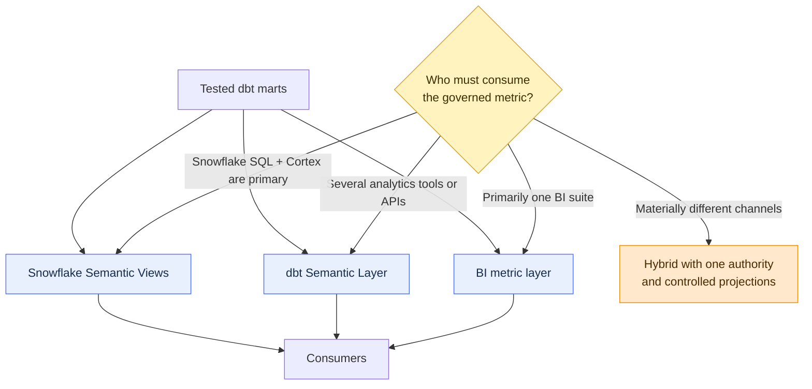

# Semantic Layer vs BI Metrics vs Snowflake Semantic Views

> [!abstract] Mental model
> Choose the semantic authority closest to all important consumers: BI-local for one experience, dbt for cross-tool analytics, or Snowflake for native SQL and Cortex consumers.

## Executive Summary

- **What it is:** A comparison of three places to define metrics and business semantics: dbt's MetricFlow-powered Semantic Layer, a BI tool's own semantic model, and Snowflake Semantic Views.
- **Why it matters:** Running several metric authorities without explicit boundaries recreates the inconsistency a semantic layer is meant to solve.
- **Mental model:** **The same KPI can have three possible homes; pick one authoritative home and treat other copies as projections, not independent definitions.**
- **Best used when:** A client is choosing where shared calculations, join rules, dimensions, and governance should live.
- **Avoid or reconsider when:** The underlying data products and business definitions are still unstable; fix those before selecting a semantic technology.

## What It Can Do

- Clarify which layer owns calculation logic versus presentation logic.
- Match governance to the actual consumer landscape.
- Reduce duplicated measures across dashboards, notebooks, APIs, and AI applications.
- Show when a hybrid is justified and where synchronization controls are required.
- Separate semantic governance from warehouse security and physical modeling.

## What It Cannot Do

- Prove that one technology is universally best.
- Guarantee every downstream tool supports every feature of the chosen layer.
- Automatically synchronize MetricFlow definitions, BI measures, and Snowflake Semantic Views.
- Remove tool-specific calculations needed only for presentation or interaction.
- Replace conformed data models, reconciliation, contracts, or Snowflake access policies.
- Resolve a political disagreement about metric ownership.

## Core Concepts

| Dimension | dbt Semantic Layer | BI metric layer | Snowflake Semantic Views |
|---|---|---|---|
| Primary home | dbt project and dbt platform | BI semantic model or dataset | Native Snowflake schema object |
| Query engine | MetricFlow generates SQL | BI engine generates or executes queries | Snowflake semantic SQL/query rewrite |
| Strongest fit | Cross-tool governed analytics | One BI ecosystem and rich presentation behavior | Snowflake SQL, Cortex Analyst, agents, and native governance |
| Consumers | Supported integrations and APIs | Reports and tools in that BI ecosystem | SQL clients, Cortex experiences, applications, sharing |
| Change workflow | Git, dbt CI/deploy, semantic deployment | BI lifecycle and deployment workflow | SQL/YAML/UI; preferably Git and CI/CD |
| Security basis | Semantic credentials plus warehouse policies | BI identity plus connection/storage model | Snowflake owner-rights object and RBAC/policies |
| Portability | Designed for several supported analytics tools | Usually vendor-specific | Snowflake-specific |
| Main risk | Integration and platform dependency | Metric logic trapped or duplicated per BI tool | Snowflake lock-in and a second semantic definition beside MetricFlow |

Snowflake explicitly documents that Semantic Views do not support the Open Semantic Interchange interface and do not integrate directly with dbt Labs MetricFlow. Managing a Semantic View from a dbt package is a deployment pattern, not automatic semantic equivalence.

## How It Works (Simple Flow)

1. Inventory the real consumers: BI reports, notebooks, SQL, APIs, Cortex Analyst, agents, and regulatory extracts.
2. Identify the metrics shared across those consumers and the calculations that are genuinely tool-local.
3. Score each option for integration coverage, governance, security, cost, latency, ownership, and skills.
4. Choose one authoritative definition for each shared business metric.
5. Keep presentation-only calculations in BI and physical transformation logic in dbt models.
6. If a second semantic system is necessary, define an explicit publication or reconciliation contract rather than copying definitions informally.
7. Version, test, deploy, and monitor the authoritative layer and validate its downstream adoption.
8. Periodically remove duplicate or unused metric definitions.

## Visuals



Hybrid does not mean "define everything three times." It means each metric has one named authority and any secondary representation is generated, reconciled, or tightly controlled.

## Readable Snippets

### dbt Semantic Layer request shape

```text
Metric: settled_notional
Dimensions: desk, settlement_date__month
Execution: MetricFlow generates SQL against governed dbt models
```

### Snowflake Semantic View query shape

```sql
select * from semantic_view(
  trade_semantics
  dimensions trades.desk
  metrics trades.settled_notional
);
```

Snowflake Semantic Views are native schema objects. A role granted `SELECT` on the Semantic View does not also need `SELECT` on its underlying tables; test this owner-rights behavior carefully against the intended security design.

### Authority register

```yaml
metric: settled_notional
authoritative_layer: dbt_semantic_layer
business_owner: treasury_reporting
secondary_projection: power_bi
reconciliation_control: daily_total_by_currency
```

This is an operating-model example, not a dbt configuration. Its purpose is to stop "temporary" copies from becoming competing authorities.

## Consultant Talking Points

- **Client question this answers:** "Should the definition live in dbt, our BI tool, or Snowflake?"
- **Trade-offs to mention:** Centrality, integration reach, native user experience, platform dependency, delivery speed, and the cost of operating more than one semantic system.
- **Risk or governance angle:** Record the authoritative metric, owner, consumers, access path, approval workflow, and reconciliation rule. Semantic consistency and data access are separate control objectives.
- **Cost/performance angle:** All three choices eventually execute work somewhere. Measure generated SQL, BI extracts, caching, concurrency, and Snowflake warehouse consumption rather than assuming a semantic layer is free.

### Practical boundary rules

| Logic | Best default home |
|---|---|
| Cleansing, conformance, currency conversion, deduplication | dbt transformation models |
| Shared KPI aggregation and valid dimensions | Chosen authoritative semantic layer |
| Visual labels, formatting, conditional color, tooltip behavior | BI layer |
| Row/column protection and object privilege | Snowflake |
| Reconciliation and data-quality controls | dbt tests/models plus operational evidence |

## Common Pitfalls

- Choosing the layer by vendor preference before inventorying consumers.
- Defining the same KPI independently in dbt, BI, and Snowflake with no authority register.
- Treating the Snowflake `dbt_semantic_view` package as a bridge that converts MetricFlow definitions automatically.
- Moving data cleansing or conformance into a metric layer where it becomes hard to test and reuse.
- Assuming a BI-certified measure protects direct SQL or another BI tool from inconsistent logic.
- Assuming semantic access replaces Snowflake RBAC, masking, or row access policies.
- Ignoring owner-rights behavior when granting access to a Snowflake Semantic View.
- Selecting a feature that key consumers cannot query or that the client's plan does not include.
- Creating a hybrid without reconciliation tests, synchronized releases, or a named support owner.

## When to Recommend What (Decision Table)

| Situation | Recommend | Why | Watch-outs |
|---|---|---|---|
| One BI platform is the dominant governed interface | BI metric layer | Best native authoring and report experience | Direct SQL and other tools may bypass it |
| Metrics must be reused across supported BI tools and APIs | dbt Semantic Layer | Tool-agnostic definition near dbt models | Integration coverage, plan, credentials, query cost |
| Cortex Analyst, agents, and Snowflake SQL are primary | Snowflake Semantic Views | Native schema object, SQL interface, RBAC, and Cortex integration | Snowflake-specific and not MetricFlow-integrated |
| BI needs visual calculations only | Keep those calculations in BI | Avoids polluting shared semantics with presentation logic | Do not redefine shared business KPIs |
| Two semantic channels are mandatory | Hybrid with one authority and tested projection | Meets different consumers without pretending the systems are one | Synchronization, drift, duplicated operations |
| Client has no stable conformed marts | Build the data foundation first | Semantic tools amplify the underlying model | Delay broad self-service claims |
| Regulated metric with formal evidence needs | Choose the best consumer fit, then add Git, approvals, reconciliation, and access evidence | Governance depends on process as well as technology | UI-only edits and untracked copies |

## Related Topics

- [[02 dbt/06 Governance Semantic Layer and Mesh/Governance Semantic Layer and Mesh Overview|Governance Semantic Layer and Mesh Overview]]
- [[02 dbt/06 Governance Semantic Layer and Mesh/55 Semantic Models and Metrics|Semantic Models and Metrics]]
- [[02 dbt/06 Governance Semantic Layer and Mesh/57 Metadata Lineage and Catalog Strategy|Metadata, Lineage, and Catalog Strategy]]
- [[01 Snowflake/05 Advanced Analytics and AI/34 Cortex Analyst|Cortex Analyst]]
- [[01 Snowflake/04 Data Engineering/25 dbt on Snowflake|dbt on Snowflake]]

## Related Decision Notes

- [[80 Comparisons and Decision Notes/Decision Notes/dbt/Decisions - Choosing Where Governed Metrics Should Live|Decisions - Choosing Where Governed Metrics Should Live]]

## Questions

- Which tools must consume the same metric dynamically?
- Which calculations are shared business rules and which are presentation-only?
- Does the selected layer support the required identities, policies, and environments?
- If two layers remain, which one is authoritative and how is drift detected?
- What evidence proves that downstream reports adopted the governed definition?

## Sources To Revisit

- [dbt Developer Hub - About the dbt Semantic Layer](https://docs.getdbt.com/docs/use-dbt-semantic-layer/dbt-sl)
- [dbt Developer Hub - Semantic Layer FAQs](https://docs.getdbt.com/docs/use-dbt-semantic-layer/sl-faqs)
- [Snowflake Documentation - Overview of Semantic Views](https://docs.snowflake.com/en/user-guide/views-semantic/overview)
- [Snowflake Documentation - Best practices for dbt Projects on Snowflake](https://docs.snowflake.com/en/user-guide/data-engineering/dbt-projects-on-snowflake-best-practices)
- [Snowflake Documentation - Querying Semantic Views](https://docs.snowflake.com/en/user-guide/views-semantic/querying)
- [Snowflake Documentation - Best practices for Semantic Views](https://docs.snowflake.com/en/user-guide/views-semantic/best-practices-dev)
