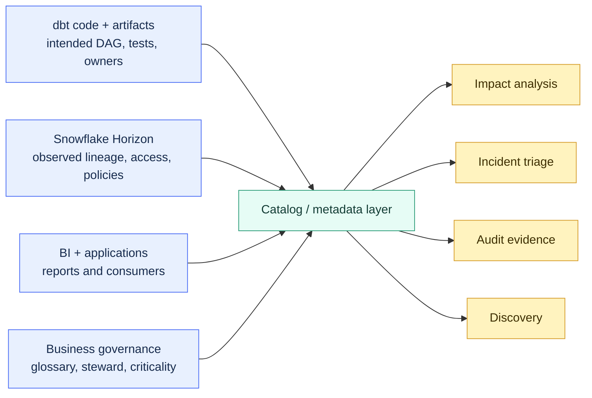

# Metadata, Lineage, and Catalog Strategy

> [!abstract] Mental model
> dbt explains intended transformation lineage, Snowflake records warehouse reality, and an enterprise catalog connects that evidence to business ownership and consumers.

## Executive Summary

- **What it is:** A strategy for combining dbt project metadata, runtime artifacts, Snowflake Horizon metadata, BI metadata, and business catalog context.
- **Why it matters:** No single source sees the whole path from operational source through transformation to dashboard, owner, policy, and actual use.
- **Mental model:** **The code map, runtime map, and business map overlap, but they are not the same map.**
- **Best used when:** Clients need discovery, impact analysis, incident triage, audit evidence, data-product ownership, or cross-tool lineage.
- **Avoid or reconsider when:** The immediate need is only local dbt navigation; start with generated docs or dbt Catalog before buying and integrating an enterprise catalog.

## What It Can Do

- Show dbt DAG dependencies created by `ref()`, `source()`, tests, exposures, metrics, and project metadata.
- Publish model descriptions, owners, tags, contracts, test results, and execution state.
- Support impact analysis before changing a shared model or column.
- Combine declared lineage with Snowflake's observed object and column lineage.
- Connect warehouse assets to BI dashboards, policies, classifications, and business terms when integrations exist.
- Feed monitoring, reporting, or governance applications through dbt artifacts and the Discovery API.
- Help auditors distinguish intended design from actual warehouse access and execution.

## What It Cannot Do

- Discover every dependency when users hard-code relation names or extract data outside integrated systems.
- Prove that a description, owner, or classification is correct merely because it exists.
- Make dbt column lineage complete for every SQL construct or Python model.
- Replace Snowflake Access History for evidence of who actually queried data.
- Replace source-system, ingestion, BI, application, spreadsheet, or file lineage by itself.
- Guarantee real-time metadata; artifacts and catalogs update on their own cadences.
- Turn an enterprise catalog into a useful product without curation and operating ownership.

## Core Concepts

| Concept | Meaning | Why it matters |
|---|---|---|
| Declared lineage | Dependencies inferred from dbt code and metadata | Shows intended transformation structure |
| Observed lineage | Relationships recorded from executed warehouse operations | Shows what Snowflake actually read, wrote, or referenced |
| `manifest.json` | dbt graph, resource, configuration, and dependency metadata | Main machine-readable description of a dbt project |
| `catalog.json` | Relation and column metadata produced by `dbt docs generate` | Connects declared resources to warehouse shape |
| `run_results.json` | Per-node execution results, status, timing, and adapter response | Supports operational analysis rather than design alone |
| dbt Catalog | dbt platform discovery and lineage experience | Gives users searchable project context and impact views |
| Discovery API | Query interface for dbt platform metadata and run history | Supports integrations and automation |
| Snowflake Horizon Catalog | Native catalog, governance, classification, and lineage layer | Covers Snowflake runtime and broader connected metadata |
| Exposure | Declared downstream dashboard, application, or analysis | Extends dbt impact analysis when maintained |
| Business glossary | Agreed business terms and definitions | Adds meaning that code and query logs cannot infer reliably |

## How It Works (Simple Flow)

1. Teams document sources, models, columns, tests, owners, groups, metrics, and exposures in dbt.
2. Production and staging jobs generate artifacts from the deployed project and warehouse relations.
3. dbt Catalog or an integration ingests those artifacts and displays resource and column lineage.
4. Snowflake records object dependencies, lineage, query activity, access, policies, and classifications from warehouse operations.
5. BI and other platforms contribute dashboard, report, and application metadata where connectors exist.
6. The chosen catalog reconciles identifiers and presents the combined technical and business view.
7. Owners use that view for discovery, impact analysis, incident response, control testing, and deprecation.
8. Governance teams monitor coverage, freshness, broken links, missing owners, and unused assets.

## Visuals



The catalog is an index over several evidence sources. It should not erase the distinction between code-declared lineage and runtime-observed lineage.

## Readable Snippets

### Generate local dbt documentation metadata

```bash
dbt docs generate
dbt docs serve
```

For durable production metadata, generate artifacts in a controlled job and retain them with the code revision and run identity. A developer's local catalog is useful for learning, not sufficient audit evidence.

### Declare a downstream consumer

```yaml
exposures:
  - name: treasury_liquidity_dashboard
    type: dashboard
    maturity: high
    owner:
      name: Treasury Reporting
      email: treasury-reporting@example.com
    depends_on:
      - ref('fct_daily_liquidity')
```

This improves declared impact analysis only if the exposure stays synchronized with the actual BI asset.

### Coverage register

```yaml
system: treasury_reporting
dbt_lineage: covered
snowflake_runtime_lineage: covered
bi_lineage: partial
file_exports: manual_register
owner: data_governance
review_frequency: quarterly
```

This is an operating example, not dbt syntax. It makes gaps visible instead of claiming impossible end-to-end completeness.

## Consultant Talking Points

- **Client question this answers:** "Where did this number come from, who owns it, and what will break if we change this column?"
- **Trade-offs to mention:** dbt metadata is precise inside the dbt graph; Snowflake metadata is strong for warehouse reality; enterprise catalogs broaden coverage but add integration and stewardship cost.
- **Risk or governance angle:** Preserve timestamps, environment, code revision, job run, owners, classifications, and evidence retention. A live graph without historical context may be insufficient for an audit.
- **Cost/performance angle:** Metadata collection and API use have costs and quotas. Snowflake Account Usage queries, catalog scans, and over-frequent ingestion should be sized to the decision need.

### Tool responsibility boundary

| Question | Best starting evidence |
|---|---|
| What should this dbt model depend on? | dbt manifest and DAG |
| Did the production model succeed? | `run_results.json` and job logs |
| Which physical columns were read or written? | Snowflake lineage and Access History |
| Which dashboard is declared downstream? | dbt exposure or BI catalog metadata |
| Who actually queried sensitive data? | Snowflake Access History |
| What does a business term mean? | Governed glossary and named steward |

## Common Pitfalls

- Calling dbt's DAG "end-to-end lineage" while ingestion, BI, files, and direct SQL are missing.
- Using hard-coded table names instead of `ref()` or `source()`, hiding dependencies from dbt.
- Declaring exposures once and never reconciling them with the BI platform.
- Assuming column-level lineage is complete; dbt documents limitations for joins, filters, complex parsing, and Python models.
- Mixing development and production artifacts in one catalog view without environment labels.
- Treating a current catalog screenshot as historical evidence without retained artifacts and timestamps.
- Buying an enterprise catalog before defining ownership, priority use cases, and metadata stewardship.
- Ingesting everything at high frequency without measuring API quotas, compute, storage, or user value.
- Confusing actual access evidence with dependency lineage.

## When to Recommend What (Decision Table)

| Situation | Recommend | Why | Watch-outs |
|---|---|---|---|
| Small dbt project and technical users | Generated dbt docs | Simple and local | Static, dbt-only, and limited operational context |
| Managed dbt estate needing discovery and impact views | dbt Catalog | Rich dbt-native resource and column context | Plan availability and non-dbt coverage |
| Snowflake-centric governance and runtime evidence | Snowflake Horizon plus Account Usage | Native observed lineage, policies, classification, and access | Edition, latency, retention, and external gaps |
| Many tools and formal business glossary | Enterprise catalog integrated with dbt and Snowflake | Broader discovery and stewardship | Integration effort, identifier matching, ownership |
| Audit reconstruction | Retained artifacts, run logs, code revision, and Snowflake history | Preserves point-in-time evidence | Live catalog alone may not reconstruct past state |
| Missing BI or file lineage | Declare the gap and add targeted integration or register | Honest coverage is actionable | Manual registers decay without owners |

## Related Topics

- [[02 dbt/06 Governance Semantic Layer and Mesh/Governance Semantic Layer and Mesh Overview|Governance Semantic Layer and Mesh Overview]]
- [[02 dbt/01 Core Concepts and Project Structure/10 Documentation Lineage and Exposures|Documentation, Lineage, and Exposures]]
- [[02 dbt/03 Testing Documentation and Data Quality/24 Documentation Blocks and Catalog|Documentation Blocks and Catalog]]
- [[02 dbt/03 Testing Documentation and Data Quality/25 Exposures|Exposures]]
- [[02 dbt/05 Deployment CI CD and Operations/49 Observability with dbt and Snowflake Metadata|Observability with dbt and Snowflake Metadata]]

## Related Decision Notes

- [[80 Comparisons and Decision Notes/Decision Notes/dbt/Decisions - Designing dbt Observability and Incident Evidence|Decisions - Designing dbt Observability and Incident Evidence]]
- [[80 Comparisons and Decision Notes/Decision Notes/dbt/Decisions - Choosing a Catalog and Lineage Authority|Decisions - Choosing a Catalog and Lineage Authority]]

## Questions

- Which concrete use case comes first: discovery, impact analysis, incidents, or audit?
- Which systems and environments are covered, partial, or absent?
- Which metadata is declared, observed, or manually curated?
- How often must metadata refresh, and how long must historical evidence remain available?
- Who owns broken integrations, stale exposures, and missing descriptions?

## Sources To Revisit

- [dbt Developer Hub - Discover data with Catalog](https://docs.getdbt.com/docs/explore/explore-projects)
- [dbt Developer Hub - Column-level lineage](https://docs.getdbt.com/docs/explore/column-level-lineage)
- [dbt Developer Hub - About dbt docs commands](https://docs.getdbt.com/reference/commands/cmd-docs)
- [dbt Developer Hub - Discovery API](https://docs.getdbt.com/docs/dbt-apis/discovery-api)
- [Snowflake Documentation - Snowflake Horizon Catalog](https://docs.snowflake.com/en/user-guide/snowflake-horizon)
- [Snowflake Documentation - Data Lineage](https://docs.snowflake.com/en/user-guide/ui-snowsight-lineage)
- [Snowflake Documentation - Access History](https://docs.snowflake.com/en/user-guide/access-history)
