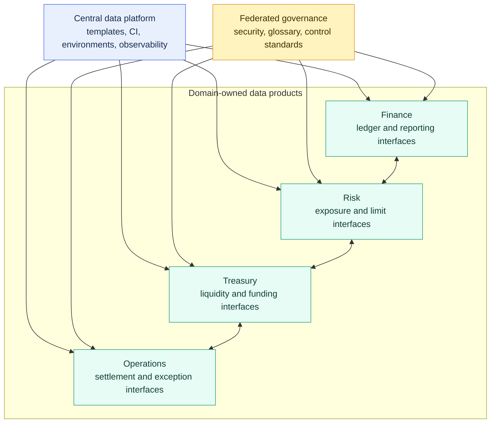

# Domain Ownership in Banking

> [!abstract] Mental model
> Domains own business meaning and service quality; the platform owns common engineering guardrails; control functions challenge and approve where independence is required.

## Executive Summary

- **What it is:** An operating model in which accountable banking domains - such as Finance, Risk, Treasury, Markets, Operations, or Compliance - own defined data products and dbt interfaces.
- **Why it matters:** The teams closest to the business rules can own meaning and quality without every team inventing its own controls, tooling, or customer definition.
- **Mental model:** **Federated ownership is a bank with branches and a central rulebook: local experts make domain decisions inside shared control boundaries.**
- **Best used when:** Several mature teams need independent delivery, shared data products have clear consumers, and central platform/governance teams can provide enforceable standards.
- **Avoid or reconsider when:** Ownership is unclear, teams lack operational capacity, the dbt estate is still manageable by one team, or proposed domains exchange unstable internal models constantly.

## What It Can Do

- Put business logic decisions with teams that understand the domain.
- Make data-product owners, support contacts, and escalation paths visible in dbt metadata.
- Separate internal implementation models from stable public interfaces.
- Allow domains to release independently when dbt Mesh boundaries are justified.
- Improve cost attribution through domain jobs, warehouses, and metadata.
- Establish service expectations for freshness, quality, reconciliation, incidents, and change.
- Preserve shared governance through templates, CI policies, naming, security, and evidence standards.

## What It Cannot Do

- Make an organizational chart a good data architecture.
- Resolve overlapping accountability between Finance, Risk, Treasury, and regulatory reporting automatically.
- Replace model risk, financial control, security, privacy, or independent validation functions.
- Guarantee that a domain has enough people to operate its data product.
- Make `group`, `access: public`, or a dbt project boundary enforce Snowflake data access.
- Eliminate enterprise definitions such as legal entity, customer, instrument, currency, or calendar.
- Justify one dbt project per department when the technical dependencies remain tightly coupled.

## Core Concepts

| Concept | Meaning | Why it matters |
|---|---|---|
| Domain | Stable business capability with expertise and accountability | Better boundary than a temporary project or reporting team |
| Data product | Governed dataset or metric with owner, consumers, quality, and service expectations | Makes ownership about a usable service, not a folder |
| Producer | Team that defines, builds, tests, and supports an interface | Keeps decisions with the domain that understands the logic |
| Consumer | Team that uses a published interface | Must understand allowed use and migration obligations |
| Federated governance | Shared enterprise rules implemented by domains | Balances autonomy with consistent controls |
| Group | dbt collection of resources with an owner | Makes accountability visible inside a project |
| Public model | Deliberate dbt interface for cross-project use | Protects consumers from internal refactoring |
| Contract and version | Structural promise and controlled breaking-change path | Stabilizes important domain interfaces |
| Control function | Independent risk, compliance, security, or finance challenge | Prevents producer self-attestation from becoming the only control |
| Conformed data | Shared definition used across domains | Avoids several authoritative customers, instruments, or calendars |

## How It Works (Simple Flow)

1. Map stable business capabilities, regulatory responsibilities, existing systems of record, and decision rights.
2. Identify a small number of domain-owned data products with named producers and real consumers.
3. Agree enterprise standards for security, environments, evidence, documentation, quality, and change management.
4. Represent ownership with dbt groups and keep staging/intermediate models private where appropriate.
5. Publish only stable interfaces, supported by contracts, tests, reconciliation, versions, and service expectations.
6. Use one dbt project until independent release or security needs justify a Mesh boundary.
7. Operate domain jobs, incidents, cost, access, and consumer communication with central platform support.
8. Review whether the boundary improves autonomy, reliability, reuse, and control rather than merely increasing project count.

## Visuals



The platform standardizes how products are built and operated. It should not silently become the business owner for every banking calculation.

## Readable Snippets

### Declare accountable domains

```yaml
groups:
  - name: treasury
    owner:
      name: Treasury Data Product Team
      email: treasury-data@example.com
    config:
      meta:
        business_owner: Head of Treasury Reporting
        support_tier: critical
        cost_center: treasury

  - name: risk
    owner:
      name: Risk Data Product Team
      email: risk-data@example.com
```

### Expose one interface, not the whole domain

```yaml
models:
  - name: int_liquidity_classification
    config:
      group: treasury
      access: private

  - name: fct_daily_liquidity_position
    config:
      group: treasury
      access: public
      contract:
        enforced: true
```

`access: public` controls which dbt projects may form a dbt dependency. It does not grant a Snowflake role permission to query the relation.

### Lightweight service definition

```yaml
data_product: daily_liquidity_position
producer: treasury
consumers: [risk, finance]
fresh_by: "06:30 Europe/London"
reconciliation: treasury_subledger
breaking_change_notice_days: 60
incident_channel: treasury-data-operations
```

This is operating metadata rather than native dbt syntax. The values need governance and evidence outside the file as well.

## Consultant Talking Points

- **Client question this answers:** "How can banking domains own their data without losing enterprise control or creating duplicate truths?"
- **Trade-offs to mention:** Domain expertise and release autonomy improve, but project, credential, warehouse, support, and interface overhead increase.
- **Risk or governance angle:** Separate producer accountability, business approval, and independent control. Critical data products need documented lineage, reconciliations, access rules, issue handling, and retained change evidence.
- **Cost/performance angle:** Domain warehouses and query tags can improve attribution, but duplicated transformations and many small jobs can cost more than a shared pipeline.

### Example decision rights

| Decision | Primary owner | Required participation |
|---|---|---|
| Trade lifecycle interpretation | Operations or Markets producer | Finance and Risk consumers |
| Regulatory exposure definition | Risk business owner | Regulatory reporting and independent control |
| Enterprise legal-entity hierarchy | Named conformed-data owner | All consuming domains |
| dbt project standards | Data platform | Domain engineering teams |
| Masking and row-access policy | Security/governance authority | Domain data owner |
| Public model breaking change | Producer | Known consumers and change governance |

## Common Pitfalls

- Drawing domains from the current org chart instead of stable capabilities and data products.
- Giving a domain responsibility without staff, on-call coverage, budget, or authority.
- Letting every domain create its own customer, instrument, currency, calendar, or legal-entity truth.
- Publishing staging and intermediate models because marking them public is easier than designing an interface.
- Treating a model contract as proof of business correctness or reconciliation.
- Splitting into many dbt projects before independent deployment provides measurable value.
- Assuming domain ownership weakens segregation-of-duties or independent-control requirements.
- Hard-coding cross-domain table names and losing governed lineage and versioning.
- Charging Snowflake spend to domains without separating shared platform and producer costs fairly.
- Measuring success by number of domains or repositories instead of reliability, reuse, autonomy, and control outcomes.

## When to Recommend What (Decision Table)

| Situation | Recommend | Why | Watch-outs |
|---|---|---|---|
| One capable team, manageable DAG | One dbt project with clear groups | Lowest operating overhead | Still name business owners |
| Several teams in one project | Groups, access rules, and folder ownership | Adds accountability before a physical split | Cross-group coupling may remain |
| Mature domains need independent releases | Incremental dbt Mesh adoption | Preserves producer-owned interfaces and lineage | Jobs, artifacts, grants, SLAs, support |
| Shared enterprise concept | One authoritative conformed-data producer | Prevents competing legal entity or customer truths | Governance must resolve ownership |
| Critical regulatory or finance output | Domain owner plus independent control and reconciliation | Separates production from challenge and approval | Do not rely on self-attestation |
| Proposed domains release together constantly | Keep or recombine the project boundary | Tight coordination suggests weak separation | Diagnose the real coupling first |
| Small team lacks operational capacity | Centralized delivery with named business stewards | More reliable than nominal federation | Build domain capability before delegation |

## Related Topics

- [[02 dbt/06 Governance Semantic Layer and Mesh/Governance Semantic Layer and Mesh Overview|Governance Semantic Layer and Mesh Overview]]
- [[02 dbt/06 Governance Semantic Layer and Mesh/50 Groups and Ownership|Groups and Ownership]]
- [[02 dbt/06 Governance Semantic Layer and Mesh/51 Model Access|Model Access]]
- [[02 dbt/06 Governance Semantic Layer and Mesh/52 Model Contracts|Model Contracts]]
- [[02 dbt/06 Governance Semantic Layer and Mesh/54 dbt Mesh and Project Dependencies|dbt Mesh and Project Dependencies]]
- [[02 dbt/06 Governance Semantic Layer and Mesh/59 Sensitive Data and Regulatory Boundaries|Sensitive Data and Regulatory Boundaries]]

## Related Decision Notes

- [[80 Comparisons and Decision Notes/Decision Notes/dbt/Decisions - Versioning and Deprecating a dbt Model|Decisions - Versioning and Deprecating a dbt Model]]

## Questions

- Which team has the expertise, authority, and capacity to own each product?
- Which definitions must remain enterprise-conformed rather than domain-specific?
- What are the producer's quality, freshness, incident, and deprecation obligations?
- Which controls require independent approval or challenge?
- Does a project split reduce real coupling, or only move it into cross-team coordination?
- How will shared and domain-specific Snowflake costs be attributed?

## Sources To Revisit

- [dbt Developer Hub - Add groups to your DAG](https://docs.getdbt.com/docs/build/groups)
- [dbt Developer Hub - Model access](https://docs.getdbt.com/docs/mesh/govern/model-access)
- [dbt Developer Hub - Project dependencies](https://docs.getdbt.com/docs/mesh/govern/project-dependencies)
- [dbt Developer Hub - Model contracts](https://docs.getdbt.com/docs/mesh/govern/model-contracts)
- [dbt Developer Hub - Model versions](https://docs.getdbt.com/docs/mesh/govern/model-versions)
