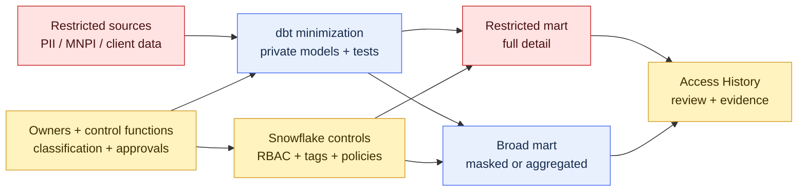

# Sensitive Data and Regulatory Boundaries

> [!abstract] Mental model
> dbt can label, minimize, transform, and test sensitive data; Snowflake must enforce who can see it; governance must prove that both layers remain aligned.

## Executive Summary

- **What it is:** A design approach that keeps PII, confidential client data, MNPI, and regulated reporting data inside explicit ownership, environment, access, and evidence boundaries.
- **Why it matters:** Transformation can spread sensitive columns into many downstream tables unless classification and policy follow the data deliberately.
- **Mental model:** **dbt draws the data routes and checkpoints; Snowflake supplies the locked doors and access log.**
- **Best used when:** dbt models sensitive domains, developers have different access levels, or clients need traceable controls over data use and publication.
- **Avoid or reconsider when:** Teams expect YAML metadata or dbt model access to replace enforceable warehouse security.

## What It Can Do

- Minimize sensitive columns before data reaches broad analytical marts.
- Keep sensitive staging and intermediate models private in the dbt graph.
- Attach classification, purpose, owner, and retention metadata to models and columns.
- Apply database grants to built relations through dbt's `grants` configuration.
- Test for unexpected nulls, values, joins, row counts, or reconciliation breaks at control points.
- Produce version-controlled transformation, test, and deployment evidence.
- Help security teams identify where Snowflake masking, row access, tags, or dedicated roles are required.
- Separate developer, CI, staging, production, and restricted-domain credentials.

## What It Cannot Do

- Make dbt `tags` become Snowflake object tags automatically.
- Make `meta.data_classification` enforce masking or row filtering.
- Make `access: private` prevent a Snowflake role from querying the physical relation directly.
- Replace Snowflake RBAC, masking policies, row access policies, network controls, or access history.
- Guarantee that copied, exported, cached, logged, or BI-extracted data remains protected.
- Determine whether a field is legally or contractually sensitive without business and control input.
- Prove compliance from code alone; operating evidence and access review are still required.

## Core Concepts

| Concept | Meaning | Why it matters |
|---|---|---|
| Data classification | Label describing sensitivity and handling need | Drives access, masking, retention, and monitoring |
| Data minimization | Excluding or reducing sensitive fields before wider use | Shrinks exposure and control scope |
| Purpose boundary | Approved reason and consumer population for using data | Prevents convenient reuse from becoming uncontrolled use |
| dbt model access | `private`, `protected`, or `public` reference boundary | Governs dbt DAG dependencies, not warehouse queries |
| dbt `meta` | Arbitrary descriptive metadata | Carries ownership and classification context into artifacts |
| dbt tag | Selector used to run or test resource subsets | Useful operational label, not a Snowflake security tag |
| Snowflake object tag | Schema-level governance metadata on Snowflake objects | Can support classification, discovery, and policy automation |
| Masking policy | Runtime transformation of protected column values | Enforces column-level visibility by context |
| Row access policy | Runtime filter over rows | Enforces tenant, region, desk, or jurisdiction boundaries |
| Access History | Snowflake evidence of object/column access and policies referenced | Supports investigation and control testing |
| Segregation of duties | Separation of build, approve, deploy, and access authority | Reduces self-approved or uncontrolled changes |

## How It Works (Simple Flow)

1. Business, privacy, security, and data owners define classifications, purposes, jurisdictions, and retention expectations.
2. Source columns are discovered and classified; unknown or high-risk fields default to restricted treatment until reviewed.
3. dbt staging models minimize columns and keep restricted logic inside explicit groups and schemas.
4. YAML records owners and classifications, while tests validate key assumptions and sensitive-data boundaries.
5. Snowflake roles, grants, tags, masking policies, and row access policies enforce access on physical objects.
6. CI and deployment credentials apply only approved code and cannot exceed required privileges.
7. Production runs retain code revision, artifacts, test results, job identity, and policy deployment evidence.
8. Governance reviews actual access, policy coverage, exports, incidents, exceptions, and classification drift.

## Visuals



The broad mart should expose only the detail its consumers need. Masking is useful, but not selecting or materializing an unnecessary sensitive column is often the stronger first control.

## Readable Snippets

### Carry governance context in dbt

```yaml
models:
  - name: int_client_identity
    config:
      group: client_data
      access: private
      meta:
        data_classification: restricted
        business_owner: Client Data Office
        approved_purpose: client_due_diligence
    columns:
      - name: tax_identifier
        config:
          meta:
            data_classification: pii_direct_identifier
```

This metadata is valuable for discovery and automation, but it is descriptive. It does not mask the column.

### Manage basic relation grants through dbt

```yaml
models:
  - name: mart_client_summary
    config:
      grants:
        select: [role_client_reporting]
```

Use Snowflake policy administration for masking and row access. Keep security ownership and deployment approvals separate from ordinary analytics changes where required.

### Apply a Snowflake classification tag

```sql
alter table analytics.restricted.int_client_identity
  modify column tax_identifier
  set tag governance.tags.data_classification = 'PII_DIRECT';
```

A classification tag only becomes enforcement when the security design attaches appropriate policies or processes. Verify the effective policy on the built object after deployment.

### Explicit boundary register

```yaml
boundary: client_identity
allowed_environments: [prod_restricted]
allowed_roles: [role_client_data_ops]
masked_projection: mart_client_summary
access_review: quarterly
evidence_owner: data_security
```

This is an operating example, not native dbt configuration.

## Consultant Talking Points

- **Client question this answers:** "How do we stop sensitive data from spreading through dbt while still serving legitimate analytical needs?"
- **Trade-offs to mention:** Central restricted models reduce exposure but may constrain self-service; copied masked marts improve usability but create more objects, tests, and lifecycle work.
- **Risk or governance angle:** Align classification, lineage, purpose, environment, Snowflake policy, access review, and evidence retention. No single control covers all of them.
- **Cost/performance angle:** Policy evaluation, duplicated secure projections, classification scans, audit queries, and isolated warehouses can add cost; uncontrolled sensitive copies usually cost more operationally and increase risk.

### Control boundary by layer

| Requirement | dbt contribution | Snowflake / governance contribution |
|---|---|---|
| Know where data flows | `ref()`, sources, docs, artifacts | Runtime and column lineage |
| Reduce exposure | Select only needed columns, aggregate, tokenize upstream | Enforced schemas and roles |
| Label sensitivity | `meta`, descriptions, dbt tags for selection | Object tags and classification |
| Restrict dbt dependencies | Groups and model access | Not applicable to direct SQL |
| Restrict query results | None by itself | RBAC, masking, row access policies |
| Prove actual access | Job artifacts show transformation | Access History and access reviews |
| Approve exceptions | Change record in code workflow | Named risk acceptance and expiry |

## Common Pitfalls

- Treating dbt `tags`, `meta`, or model access as warehouse security controls.
- Selecting every source column in staging and trying to remove sensitivity much later.
- Applying policies to base tables but failing to verify rebuilt, renamed, cloned, or downstream objects.
- Letting development or CI credentials query sensitive production data for convenience.
- Logging sensitive literals, sample data, compiled SQL, or test failure rows in broadly accessible systems.
- Granting one shared service role to all Semantic Layer or BI users and losing intended user-level separation.
- Ignoring exports, extracts, notebooks, files, and caches outside Snowflake policy enforcement.
- Assuming classification is permanent when schemas and data content change.
- Allowing expired exceptions or temporary broad grants to remain in place.
- Keeping evidence only in live metadata views when the required review period is longer or point-in-time reconstruction matters.

## When to Recommend What (Decision Table)

| Situation | Recommend | Why | Watch-outs |
|---|---|---|---|
| Consumer does not need the field | Omit it before the shared mart | Strongest minimization and simplest control | Confirm future use does not justify a governed alternative |
| Same rows, different column visibility | Snowflake masking policy | Central runtime enforcement | Role design, policy coverage, downstream copies |
| Users may see only specific desks, regions, or clients | Row access policy | Enforces row filtering centrally | Mapping-table quality and policy performance |
| Entire domain is restricted | Separate schema/database and least-privilege roles | Clear containment and ownership | More grants, environments, and operations |
| Classification must drive policy at scale | Snowflake tags plus approved tag-based controls | Consistent metadata-led enforcement | Feature status, inheritance, precedence, verification |
| Need dbt impact awareness | dbt `meta`, descriptions, groups, and lineage | Makes sensitive paths visible to developers | Descriptive, not enforcement |
| Need proof of who accessed data | Snowflake Access History plus retained reviews | Runtime evidence at object/column level | Edition, latency, retention, and query limitations |

## Related Topics

- [[02 dbt/06 Governance Semantic Layer and Mesh/Governance Semantic Layer and Mesh Overview|Governance Semantic Layer and Mesh Overview]]
- [[02 dbt/06 Governance Semantic Layer and Mesh/50 Groups and Ownership|Groups and Ownership]]
- [[02 dbt/06 Governance Semantic Layer and Mesh/51 Model Access|Model Access]]
- [[02 dbt/05 Deployment CI CD and Operations/47 Secrets Service Accounts and RBAC|Secrets, Service Accounts, and RBAC]]
- [[01 Snowflake/03 Security and Governance/13 Row Access Policies|Row Access Policies]]
- [[01 Snowflake/03 Security and Governance/14 Column-level Masking Policies|Column-level Masking Policies]]
- [[01 Snowflake/03 Security and Governance/15 Data Classification|Data Classification]]

## Related Decision Notes

- [[80 Comparisons and Decision Notes/Decision Notes/Snowflake/Decisions - Choosing a Row-Level Data Isolation Strategy|Decisions - Choosing a Row-Level Data Isolation Strategy]]
- [[80 Comparisons and Decision Notes/Decision Notes/dbt/Decisions - Choosing a dbt Environment and Credential Strategy|Decisions - Choosing a dbt Environment and Credential Strategy]]
- [[80 Comparisons and Decision Notes/Comparisons/dbt/Comparison - dbt Governance Controls vs Snowflake Security Controls|Comparison - dbt Governance Controls vs Snowflake Security Controls]]

## Questions

- Which data classes, purposes, jurisdictions, and retention rules apply?
- Where is sensitive detail removed, masked, aggregated, or tokenized?
- Which Snowflake role actually executes each dbt, BI, or Semantic Layer query?
- How are rebuilt objects checked for tags, grants, and policies?
- Which copies leave Snowflake enforcement through extracts, files, logs, or caches?
- What evidence and retention period are required for access and policy reviews?

## Sources To Revisit

- [dbt Developer Hub - Tags](https://docs.getdbt.com/reference/resource-configs/tags)
- [dbt Developer Hub - Meta](https://docs.getdbt.com/reference/resource-configs/meta)
- [dbt Developer Hub - Grants](https://docs.getdbt.com/reference/resource-configs/grants)
- [Snowflake Documentation - Sensitive data classification](https://docs.snowflake.com/en/user-guide/classify-intro)
- [Snowflake Documentation - Attribute-based access control using tag-based policies](https://docs.snowflake.com/en/user-guide/tag-based-policies)
- [Snowflake Documentation - Tag-based masking policies](https://docs.snowflake.com/en/user-guide/tag-based-masking-policies)
- [Snowflake Documentation - Access History](https://docs.snowflake.com/en/user-guide/access-history)
