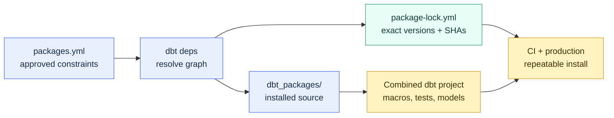

# Package Fundamentals

> [!abstract] Mental model
> A dbt package is a software library installed into your project: you receive its code, configuration surface, upgrades, and risks - not just one convenient macro.

## Executive Summary

- **What it is:** A reusable dbt project distributed through dbt Hub, Git, a local path, a tarball, or approved private-package mechanisms.
- **Why it matters:** Packages can standardize utility macros, tests, models, and materializations across projects without copying code by hand.
- **Mental model:** **A package is borrowed source code that joins your project at build time.**
- **Best used when:** A mature package solves a repeated, non-differentiating problem and the client can own approval, versioning, testing, and upgrades.
- **Avoid or reconsider when:** The need is small, client-specific, security-sensitive, poorly maintained, or easier to express as a short local macro or model.

## What It Can Do

- Reuse macros, generic tests, models, seeds, snapshots, and materializations across dbt projects.
- Provide established implementations for common SQL patterns and project checks.
- Reduce local maintenance when a package is actively maintained and broadly compatible.
- Standardize internal engineering practices through a private package.
- Namespace macros to reduce naming collisions and make their source visible.
- Resolve direct and transitive dependencies through `dbt deps`.
- Lock exact resolved versions and commit SHAs in `package-lock.yml` for repeatable installs.
- Allow packaged models or seeds to be configured, disabled, or overridden from the root project where supported.

## What It Cannot Do

- Guarantee correctness, security, maintenance, license suitability, or support.
- Know whether its generated SQL matches the client's business rules.
- Replace code review, compatibility testing, or an upgrade owner.
- Make all package code inert; packages may add models, tests, hooks, or materializations that affect runtime.
- Share a producer team's already-built data product; that is a dbt Mesh project-dependency use case.
- Ensure that a semantic-version range behaves compatibly in practice.
- Remove Snowflake cost: package models and tests execute queries like local resources.

## Core Concepts

| Concept | Meaning | Why it matters |
|---|---|---|
| Package | dbt project installed as a dependency | Adds reusable source code to the consumer project |
| Root project | Client project that declares and uses dependencies | Its configuration takes precedence over installed packages |
| Hub package | Versioned package published through dbt Hub | Convenient discovery and semantic-version resolution |
| Git package | Dependency fetched from a repository and revision | Supports private or non-Hub packages |
| Local package | Dependency referenced by a filesystem path | Useful for coordinated local development |
| `dbt deps` | Command that resolves and installs dependencies | Populates the package installation directory |
| `dbt_packages/` | Default generated installation directory | Normally ignored by Git because source is reproducible |
| `package-lock.yml` | Exact resolved dependency graph | Keeps development, CI, and production installs consistent |
| Package namespace | Prefix used to call a package macro | Makes ownership explicit and avoids accidental collisions |
| Transitive dependency | Package required by another package | Must be reviewed even if not declared directly |

## How It Works (Simple Flow)

1. A team identifies a repeated need and evaluates local code versus an external or internal package.
2. The package's owner, source, license, contents, maintenance, compatibility, privileges, and generated SQL are reviewed.
3. The approved dependency and version constraint are declared in `packages.yml` or, when appropriate, `dependencies.yml`.
4. `dbt deps` resolves direct and transitive versions and writes `package-lock.yml`.
5. Package source is installed under `dbt_packages/` by default and becomes part of the project parse context.
6. The root project calls package macros or enables/configures packaged resources.
7. CI compiles and tests the combined project, including Snowflake behavior, output, and cost-sensitive changes.
8. Production installs from the committed lock; upgrades happen intentionally in reviewed changes.

## Visuals



Commit the declaration and lock file, not the generated installation directory. This preserves reviewable intent and reproducibility without vendoring duplicate source.

## Readable Snippets

### Declare a Hub package with an upgrade boundary

```yaml
# packages.yml
packages:
  - package: dbt-labs/dbt_utils
    version: ">=1.3.0,<2.0.0"
```

The range states which releases may be resolved during an intentional dependency update. The lock file records the exact release selected for this commit.

### Install the reviewed dependency graph

```bash
dbt deps
```

Use `dbt deps --upgrade` only when intentionally resolving newer versions. Normal production installation should reproduce the committed lock.

### Call a namespaced package macro

```sql
select
    {{ dbt_utils.generate_surrogate_key([
        'account_id',
        'as_of_date'
    ]) }} as account_snapshot_key,
    account_id,
    as_of_date
from {{ ref('stg_account_positions') }}
```

The namespace shows where the macro comes from. Review the compiled SQL as well as the tidy Jinja call.

### Disable an unneeded packaged model

```yaml
# dbt_project.yml
models:
  some_package:
    +enabled: false
```

Only apply real package-specific configuration after reading its documentation. A package may contain useful macros and unwanted executable resources.

## Consultant Talking Points

- **Client question this answers:** "Should we install a package or write this small capability ourselves?"
- **Trade-offs to mention:** Packages reduce duplicated engineering but add external code, transitive dependencies, release management, and support boundaries.
- **Risk or governance angle:** Require a business need, technical owner, approved source, license/security review, version constraint, committed lock, CI coverage, and exit plan.
- **Cost/performance angle:** Macro-only packages may add little runtime cost; packages with many tests or models can materially increase Snowflake queries, DAG size, and job duration.

### Quick inspection checklist

| Inspect | Question |
|---|---|
| Contents | Does it add macros only, or models, tests, hooks, seeds, and materializations? |
| Ownership | Who approves, upgrades, supports, and removes it? |
| Maintenance | Are releases and compatibility claims current? |
| Security | What code runs and what credentials or privileges can it use? |
| License | Is use and modification approved? |
| Compatibility | Does it support the client's dbt engine, adapter, and Snowflake behavior? |
| Cost | How many resources and queries become enabled? |
| Exit | Can the client replace, fork, or remove it safely? |

## Common Pitfalls

- Installing a popular package without a defined requirement or owner.
- Reviewing only the macro being called and not the rest of the installed package.
- Depending on `main` or another mutable Git branch without a locked commit.
- Ignoring or not committing `package-lock.yml`, causing environment drift.
- Committing `dbt_packages/` and then editing installed files directly.
- Running `dbt deps --upgrade` automatically during every production deployment.
- Missing transitive dependencies in security, license, or compatibility review.
- Assuming a Hub listing is a dbt Labs security or support guarantee.
- Enabling package models and tests without measuring job duration and Snowflake cost.
- Hiding important client business logic inside a third-party abstraction nobody owns.
- Using a package dependency when the actual need is to consume another domain's built data product.

## When to Recommend What (Decision Table)

| Situation | Recommend | Why | Watch-outs |
|---|---|---|---|
| Mature utility solves a standard problem | Approved package with constraint and lock | Reuses established code | Maintenance, license, compatibility |
| Small client-specific requirement | Local macro or test | Lower dependency and support overhead | Local code still needs tests and ownership |
| Stable utilities shared by several internal projects | Versioned private package | Centralizes reusable engineering standards | Release process and coupling |
| Shared business logic changes frequently | Keep it in the owning dbt project | Change authority stays close to the business | Avoid uncontrolled copies |
| Another domain owns a built dataset | Project dependency to a public model | Producer retains execution and data ownership | Contracts, versions, availability, RBAC |
| Package is abandoned but essential | Replace or fork with explicit ownership | Removes uncertain external dependency | License and ongoing maintenance |
| Regulated environment restricts external downloads | Approved internal mirror or private source | Controls provenance and acquisition | Patch and update process |
| Package adds many unused resources | Disable selectively or avoid it | Controls DAG size and warehouse cost | Upgrade behavior and configuration burden |

## Related Topics

- [[02 dbt/07 Packages Macros and Advanced Reuse/Packages Macros and Advanced Reuse Overview|Packages Macros and Advanced Reuse Overview]]
- [[02 dbt/05 Deployment CI CD and Operations/46 Package Management and Dependency Governance|Package Management and Dependency Governance]]
- [[02 dbt/06 Governance Semantic Layer and Mesh/54 dbt Mesh and Project Dependencies|dbt Mesh and Project Dependencies]]
- [[02 dbt/07 Packages Macros and Advanced Reuse/61 packages.yml vs dependencies.yml|packages.yml vs dependencies.yml]]
- [[02 dbt/07 Packages Macros and Advanced Reuse/62 Must-Have Utility Packages|Must-Have Utility Packages]]
- [[02 dbt/07 Packages Macros and Advanced Reuse/66 Package Governance|Package Governance]]

## Related Decision Notes

- [[80 Comparisons and Decision Notes/Comparisons/dbt/Comparison - dbt Packages vs Project Dependencies|Comparison - dbt Packages vs Project Dependencies]]
- [[80 Comparisons and Decision Notes/Decision Notes/dbt/Decisions - Approving a dbt Package for Production|Decisions - Approving a dbt Package for Production]]

## Questions

- What repeated problem justifies adding this dependency?
- Which executable resources and transitive packages does it introduce?
- Who owns approval, upgrades, incidents, and replacement?
- Is the source, license, maintenance, and compatibility acceptable?
- What does the compiled SQL do on Snowflake?
- How will production reproduce the reviewed dependency graph?
- Would a local macro or a producer-owned project dependency fit better?

## Sources To Revisit

- [dbt Developer Hub - Packages](https://docs.getdbt.com/docs/build/packages)
- [dbt Developer Hub - About dbt deps](https://docs.getdbt.com/reference/commands/deps)
- [dbt Package Hub - Package disclaimer](https://hub.getdbt.com/disclaimer/)
- [dbt Developer Hub - Project dependencies](https://docs.getdbt.com/docs/mesh/govern/project-dependencies)
