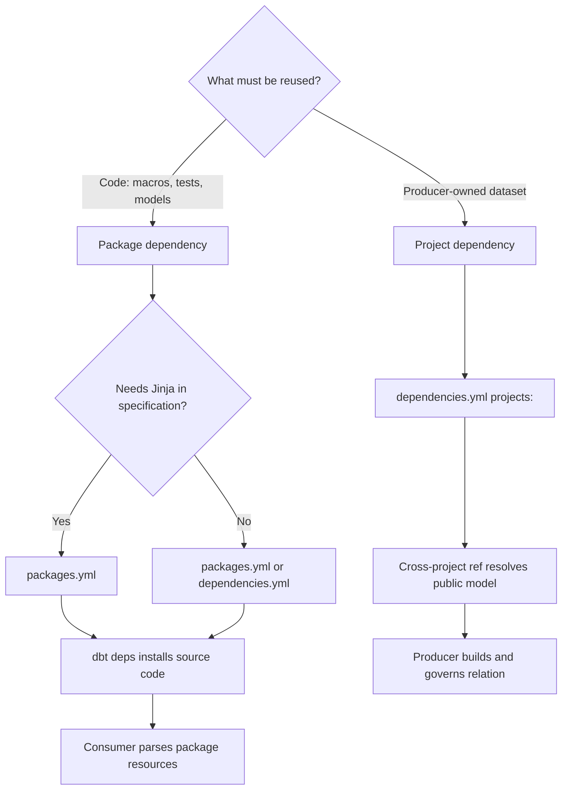

# packages.yml vs dependencies.yml

> [!abstract] Mental model
> `packages.yml` installs reusable source code into your project; `dependencies.yml` can also declare producer projects whose public models are consumed as governed data products.

## Executive Summary

- **What it is:** Two root-level files for declaring dbt dependencies. Both can declare ordinary packages, while `dependencies.yml` is required for cross-project dependencies in dbt Mesh.
- **Why it matters:** The choice determines whether dbt downloads another project's code or resolves a governed reference to data that another team builds and owns.
- **Mental model:** **Package dependency = import the library. Project dependency = call the producer's published data API.**
- **Best used when:** Use `packages.yml` for ordinary public/private packages and Jinja-dependent specifications; use `dependencies.yml` for Mesh project dependencies and optionally static public package declarations.
- **Avoid or reconsider when:** Do not use a package to copy another team's whole transformation project merely to consume its outputs, and do not assume renaming the file changes package behavior.

## What It Can Do

- Install Hub, Git, local, tarball, and supported private package dependencies with `dbt deps`.
- Make package macros, tests, models, sources, and other resources available to the consuming project.
- Let `dependencies.yml` combine static package declarations with `projects:` entries.
- Let an eligible dbt Mesh consumer use two-argument `ref()` for a producer's public model.
- Keep producer ownership and build responsibility on the producer side for project dependencies.
- Record resolved package versions in `package-lock.yml` for reproducible installation.

## What It Cannot Do

- Make a package dependency equivalent to a project dependency; downloaded code and a cross-project data contract solve different problems.
- Give dbt Core users the managed metadata service behind dbt platform project dependencies.
- Make a private or dynamic package specification work in `dependencies.yml` when it requires Jinja rendering.
- Guarantee package quality, security, compatibility, or support.
- Replace model access, contracts, versions, deployment jobs, or producer-consumer change management.
- Prevent package resources from adding models, tests, runtime, and warehouse cost.

## Core Concepts

| Concept | Meaning | Why it matters |
|---|---|---|
| Package dependency | Another dbt project's source code installed locally | Appropriate for reusable macros, tests, and packaged resources |
| Project dependency | Metadata-resolved dependency on public models in another dbt project | Preserves producer ownership and avoids rebuilding its project |
| `packages.yml` | Traditional declaration file for package dependencies | Supports Jinja rendering and broad package-installation patterns |
| `dependencies.yml` | Static declaration file supporting `packages:` and `projects:` | Required for cross-project references |
| `dbt deps` | Resolves and installs package dependencies | Does not build the consuming project's models |
| `package-lock.yml` | Exact resolved package dependency set | Makes installs repeatable across developer, CI, and production environments |
| Public model | Producer model configured for cross-project consumption | Forms the governed interface for a project dependency |
| Two-argument `ref()` | `ref('project_name', 'model_name')` | Makes the producer project explicit and surfaces cross-project lineage |

## How It Works (Simple Flow)

1. Identify whether the consumer needs reusable code or a dataset owned by another dbt project.
2. For reusable code, declare a reviewed package under `packages:` in `packages.yml` or a static `dependencies.yml`.
3. For a Mesh data product, declare the producer under `projects:` in `dependencies.yml`; the producer publishes public models through successful production metadata.
4. Run `dbt deps`; dbt installs packages and maintains the package lock.
5. Call package macros normally, or use a two-argument `ref()` for a producer project's public model.
6. CI validates dependency resolution, compilation, compatibility, and representative behavior.
7. Deploy the same locked package set while the project dependency continues to resolve to producer-owned relations.

## Visuals



## Readable Snippets

### Ordinary packages

```yaml
# packages.yml
packages:
  - package: dbt-labs/dbt_utils
    version: [">=1.3.0", "<2.0.0"]
```

Use `packages.yml` when the project only needs libraries or when a package specification depends on Jinja, such as an environment variable for a legacy private Git authentication pattern.

### Packages and a project dependency together

```yaml
# dependencies.yml
packages:
  - package: dbt-labs/dbt_utils
    version: [">=1.3.0", "<2.0.0"]

projects:
  - name: finance_data_products
```

```sql
select *
from {{ ref('finance_data_products', 'fct_posted_transactions') }}
```

The utility package is downloaded as code. The finance relation remains built and owned by the finance producer project.

### Install and review

```bash
dbt deps
dbt compile
```

Commit the dependency declaration and `package-lock.yml`; normally do not commit the generated `dbt_packages/` directory.

## Consultant Talking Points

- **Client question this answers:** "Should we import that project's code, or depend on a stable model it publishes?"
- **Trade-offs to mention:** Packages are portable and work broadly, but bring source code and resources into the consumer. Project dependencies improve team boundaries but require managed dbt Mesh capabilities and disciplined public interfaces.
- **Risk or governance angle:** A package creates software supply-chain risk; a project dependency creates a producer-consumer contract and availability dependency. Govern each differently.
- **Cost/performance angle:** Package models and tests may run in every consuming project. Project dependencies avoid duplicate builds, although consumers still pay for their downstream queries.

### File choice is secondary to dependency type

| Question | Package dependency | Project dependency |
|---|---|---|
| What is reused? | Source code and dbt resources | An already-built public dataset |
| Who builds upstream logic? | Each consuming project | Producer project |
| Main declaration | `packages.yml` or static `dependencies.yml` | `dependencies.yml` |
| Main governance | Version, lock, license, compatibility | Access, contract, version, producer SLA |
| Typical use | Utilities, tests, packaged models | Cross-team governed data products |

## Common Pitfalls

- Renaming `packages.yml` to `dependencies.yml` and expecting packages to become Mesh dependencies.
- Declaring another team's transformation repository as a package, then rebuilding and diverging from its outputs in multiple projects.
- Putting Jinja-based package specifications in `dependencies.yml`, which is intentionally static.
- Assuming all private-package forms behave identically across dbt Core, Fusion, and the dbt platform; verify the approved runtime and authentication method.
- Forgetting that installed package models may be selected by `dbt run` and add Snowflake work.
- Omitting `package-lock.yml`, allowing developers and jobs to resolve different transitive versions.
- Treating a project dependency as available before the producer has a qualifying successful deployment and public model metadata.
- Publishing a cross-project model without contract, version, access, ownership, or deprecation discipline.

## When to Recommend What (Decision Table)

| Situation | Recommend | Why | Watch-outs |
|---|---|---|---|
| Only Hub utility packages | Keep `packages.yml` | Simple, familiar package workflow | Pin and lock versions |
| Static public packages plus Mesh producers | Consolidate in `dependencies.yml` | One dependency inventory | No Jinja rendering |
| Package spec requires Jinja | Keep packages in `packages.yml`; add `dependencies.yml` separately if needed | Preserves dynamic package configuration | Prefer safer native private authentication where supported |
| Consumer needs another team's certified model | Project dependency | Keeps build and quality ownership with producer | Enterprise eligibility and producer deployment prerequisites |
| Consumer needs reusable macros/tests | Package dependency | Source-code reuse is the intended pattern | Compatibility and support ownership |
| Small organization with one project | Local code or ordinary packages | Mesh boundaries may add little value | Revisit when ownership genuinely splits |
| Cross-team data product without Mesh capability | Governed Snowflake relation/source as an interim pattern | Preserves a data boundary without copying code | Lineage and contract experience is less integrated |

## Related Topics

- [[02 dbt/07 Packages Macros and Advanced Reuse/Packages Macros and Advanced Reuse Overview|Packages Macros and Advanced Reuse Overview]]
- [[02 dbt/07 Packages Macros and Advanced Reuse/60 Package Fundamentals|Package Fundamentals]]
- [[02 dbt/07 Packages Macros and Advanced Reuse/66 Package Governance|Package Governance]]
- [[02 dbt/06 Governance Semantic Layer and Mesh/54 dbt Mesh and Project Dependencies|dbt Mesh and Project Dependencies]]
- [[02 dbt/06 Governance Semantic Layer and Mesh/51 Model Access|Model Access]]

## Related Decision Notes

- [[80 Comparisons and Decision Notes/Comparisons/dbt/Comparison - dbt Packages vs Project Dependencies|Comparison - dbt Packages vs Project Dependencies]]

## Questions

- Are we reusing code or consuming producer-owned data?
- Does the dependency specification require Jinja or private authentication?
- Is the account eligible for project dependencies, and has the producer published successful deployment metadata?
- Who owns compatibility for packages and stability for public models?
- Would a package cause duplicated builds or warehouse cost across consumers?

## Sources To Revisit

- [dbt Developer Hub - Packages](https://docs.getdbt.com/docs/build/packages)
- [dbt Developer Hub - Project dependencies](https://docs.getdbt.com/docs/mesh/govern/project-dependencies)
- [dbt Developer Hub - Cross-project ref](https://docs.getdbt.com/reference/dbt-jinja-functions/ref#ref-project-specific-models)
- [dbt Developer Hub - Package-lock file](https://docs.getdbt.com/reference/commands/deps#predictable-package-installs)
