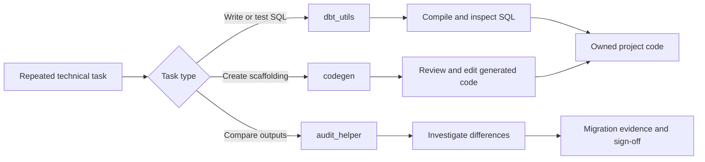

# Must-Have Utility Packages

> [!abstract] Mental model
> `dbt_utils`, `codegen`, and `audit_helper` are a practical utility toolkit to understand—not a mandatory bundle to install in every project.

## Executive Summary

- **What it is:** Three widely used dbt Labs packages for reusable SQL/test patterns, code generation, and old-versus-new data comparison.
- **Why it matters:** They remove repetitive plumbing and make common migration and development tasks recognizable across client projects.
- **Mental model:** **`dbt_utils` helps write and test; `codegen` helps scaffold; `audit_helper` helps prove a migration or refactor did not change results unexpectedly.**
- **Best used when:** A reviewed macro replaces repeated technical SQL, generated scaffolding will be edited and owned, or a controlled relation comparison supports migration evidence.
- **Avoid or reconsider when:** A native dbt/Snowflake feature is clearer, the requirement is tiny, generated code would be accepted blindly, or large comparison queries create disproportionate cost.

## What It Can Do

- `dbt_utils`: provide reusable generic tests, SQL generators, introspective macros, and cross-database patterns.
- Build surrogate keys, union relations with aligned columns, generate date spines, pivot/unpivot data, and express common assertions.
- `codegen`: generate source YAML, model YAML, base-model SQL, import CTEs, and unit-test templates from metadata.
- `audit_helper`: compare relations or queries by rows, columns, row counts, and classified matches/differences.
- Speed initial project setup and legacy-SQL migration while keeping outputs in normal dbt code.
- Turn one-off comparison work into reviewable, repeatable migration evidence.

## What It Cannot Do

- Decide the correct grain, business definition, naming convention, or model architecture.
- Guarantee that a generated source/model definition is complete or approved.
- Make a surrogate key stable if inputs, null handling, ordering, or business grain are wrong.
- Prove semantic equivalence when two outputs match only for today's data.
- Replace core tests, unit tests, reconciliation controls, or stakeholder sign-off.
- Eliminate compatibility, licensing, versioning, and upgrade responsibilities.
- Make full-table comparisons cheap on large Snowflake relations.

## Core Concepts

| Package / concept | Meaning | Why it matters |
|---|---|---|
| `dbt_utils` | General-purpose macros and generic tests | Common vocabulary across many dbt projects |
| SQL generator | Macro that compiles into a SQL fragment or query | Reduces repetition while leaving compiled SQL inspectable |
| Introspective macro | Macro that queries relation metadata or values | Powerful, but may require execution context and warehouse access |
| `codegen` | Macros that print scaffold dbt code | Accelerates setup; output becomes code the team must review |
| `run-operation` | Command used to invoke an operational macro | Typical way to call code-generation and audit helpers |
| `audit_helper` | Macros for comparing relations and queries | Useful during migration, refactoring, and parallel-run validation |
| Reconciliation grain | Key or aggregation level at which outputs are compared | Determines whether an audit is meaningful |
| Compiled SQL | Warehouse SQL produced by Jinja/macros | Final place to assess correctness and performance |

## How It Works (Simple Flow)

1. Define a specific repetitive task: SQL utility, scaffold generation, or output comparison.
2. Confirm the package has a maintained macro that fits the approved dbt runtime and Snowflake adapter.
3. Add a constrained package version, run `dbt deps`, and review the lock-file change.
4. Call a `dbt_utils` macro in model/test code, or invoke `codegen`/`audit_helper` through `dbt run-operation` or a controlled analysis.
5. Review generated YAML/SQL or comparison logic rather than accepting it automatically.
6. Compile and test against representative data, including nulls, duplicates, decimal precision, and changed schemas.
7. Keep the package only while its recurring value exceeds upgrade, support, and Snowflake execution cost.

## Visuals



## Readable Snippets

### Reusable surrogate key

```sql
select
    {{ dbt_utils.generate_surrogate_key([
        'account_id',
        'posting_date',
        'transaction_sequence'
    ]) }} as transaction_key,
    amount
from {{ ref('stg_transactions') }}
```

The macro standardizes hashing mechanics; the team still owns the grain and selected inputs.

### Generate source YAML

```bash
dbt run-operation generate_source \
  --args '{"schema_name": "RAW_BANKING", "generate_columns": true}'
```

Copy the printed YAML into the project, then review names, data types, descriptions, freshness, loaded-at fields, and sensitive-data metadata.

### Compare legacy and refactored outputs

```sql



{{ audit_helper.compare_and_classify_relation_rows(
    a_relation=old_relation,
    b_relation=new_relation,
    primary_key_columns=['customer_id'],
    columns=['customer_id', 'balance_date', 'closing_balance']
) }}
```

Run comparisons in a controlled environment and select an appropriate key. For very large tables, compare partitions, aggregates, or sampled/exception-focused slices first.

## Consultant Talking Points

- **Client question this answers:** "Which dbt packages save time on common engineering and migration work without taking over our design?"
- **Trade-offs to mention:** Utilities shorten implementation but add dependencies and can hide behavior behind macros. Generated code saves typing, not review.
- **Risk or governance angle:** Pin and lock versions; review compiled SQL; retain audit definitions and results where they form migration evidence.
- **Cost/performance angle:** Most compilation helpers are cheap, but introspection and relation comparisons can scan metadata or large datasets. Design the audit grain and cadence deliberately.

### A practical learning priority, not an installation baseline

| Package | Learn first because | Install when |
|---|---|---|
| `dbt_utils` | Its macros/tests appear in many projects | Several approved utilities remove real repetition |
| `codegen` | It teaches metadata-driven scaffolding | Initial setup or repetitive YAML/model scaffolding is substantial |
| `audit_helper` | It provides a migration comparison vocabulary | Refactor or migration needs repeatable old-versus-new evidence |

## Common Pitfalls

- Installing all three because they are popular without identifying a recurring use case and owner.
- Using `dbt_utils.generate_surrogate_key` with the wrong grain or assuming a hash resolves duplicate business keys.
- Using macros such as `star` in stable public models and allowing upstream schema drift to change the output unexpectedly.
- Committing generated YAML without correcting names, descriptions, types, freshness, and sensitive-data classification.
- Treating matching row counts as proof that values match.
- Running unrestricted full-row comparisons across large Snowflake tables and causing long runtimes or high credit use.
- Ignoring rounding, timestamp precision, null semantics, duplicate keys, and non-deterministic values during audits.
- Leaving temporary audit or generation code wired into production jobs.
- Depending on a macro after dbt has gained a clearer native equivalent without reassessing the dependency.

## When to Recommend What (Decision Table)

| Situation | Recommend | Why | Watch-outs |
|---|---|---|---|
| Repeated cross-database SQL pattern | Review `dbt_utils` first | Mature shared implementation may beat local duplication | Inspect compiled SQL and adapter behavior |
| One tiny Snowflake-specific expression | Plain SQL | Keeps intent visible | Avoid needless abstraction |
| Many raw tables need initial source YAML | `codegen`, then human review | Saves mechanical typing | Generated metadata is not documentation quality |
| Stable model requires explicit column contract | Hand-maintained YAML after optional scaffolding | Schema promise needs deliberate ownership | Keep generated baseline current manually |
| Legacy-to-dbt migration | `audit_helper` plus business reconciliation | Gives repeatable technical comparison | Matching data today does not prove all future semantics |
| Very large historical relations | Partitioned/aggregate comparison first | Controls scan cost and isolates differences | Define tolerances and coverage |
| Critical finance output | Audit helper plus independent control totals and approvals | Adds technical evidence without replacing controls | Retain evidence and exception resolution |
| Package provides only one trivial macro | Local tested macro or SQL | Smaller support surface | Revisit if repetition grows |

## Related Topics

- [[02 dbt/07 Packages Macros and Advanced Reuse/Packages Macros and Advanced Reuse Overview|Packages Macros and Advanced Reuse Overview]]
- [[02 dbt/07 Packages Macros and Advanced Reuse/60 Package Fundamentals|Package Fundamentals]]
- [[02 dbt/07 Packages Macros and Advanced Reuse/66 Package Governance|Package Governance]]
- [[02 dbt/07 Packages Macros and Advanced Reuse/68 Macros as Reusable SQL Functions|Macros as Reusable SQL Functions]]
- [[02 dbt/03 Testing Documentation and Data Quality/29 Data Quality Strategy in Regulated Environments|Data Quality Strategy in Regulated Environments]]

## Related Decision Notes

- [[80 Comparisons and Decision Notes/Decision Notes/dbt/Decisions - Choosing a Legacy SQL-to-dbt Migration Strategy|Decisions - Choosing a Legacy SQL-to-dbt Migration Strategy]]
- [[80 Comparisons and Decision Notes/Decision Notes/dbt/Decisions - Choosing the Right dbt Quality Control|Decisions - Choosing the Right dbt Quality Control]]
- [[80 Comparisons and Decision Notes/Decision Notes/dbt/Decisions - Approving a dbt Package for Production|Decisions - Approving a dbt Package for Production]]

## Questions

- Which repeated task justifies each package?
- Does the project already have an equivalent native or local pattern?
- Who reviews generated code and compiled SQL?
- What grain, tolerance, and retention make a migration audit meaningful?
- How large are the Snowflake scans created by comparison macros?
- What is the removal plan if a package becomes incompatible or unsupported?

## Sources To Revisit

- [dbt Labs - dbt_utils repository](https://github.com/dbt-labs/dbt-utils)
- [dbt Labs - codegen repository](https://github.com/dbt-labs/dbt-codegen)
- [dbt Labs - audit_helper repository](https://github.com/dbt-labs/dbt-audit-helper)
- [dbt Developer Hub - Packages](https://docs.getdbt.com/docs/build/packages)
- [dbt Developer Hub - run-operation](https://docs.getdbt.com/reference/commands/run-operation)
