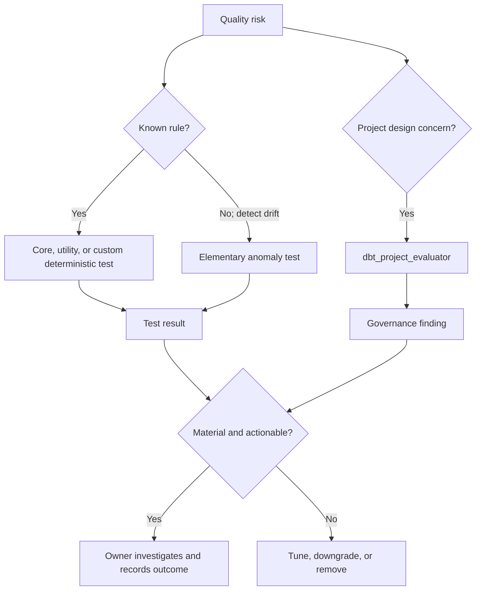

# Data Quality Packages

> [!abstract] Mental model
> Data-quality packages expand the toolbox, but quality comes from a small set of risk-based controls with owners—not from maximizing the test count.

## Executive Summary

- **What it is:** Packages that add generic tests, anomaly detection, artifact-backed observability, or checks of the dbt project's structure and governance.
- **Why it matters:** They can accelerate coverage and monitoring, but each solves a different layer of quality and can create noisy failures, warehouse queries, metadata storage, and support obligations.
- **Mental model:** **`dbt_expectations` checks data patterns; Elementary adds anomaly tests and observability metadata; `dbt_project_evaluator` checks whether the dbt project follows chosen engineering conventions.**
- **Best used when:** The control objective is explicit, the package is supported for the runtime, failures have owners, and the resulting query/storage/alert cost is acceptable.
- **Avoid or reconsider when:** Tests are added to satisfy a coverage percentage, a package is no longer maintained, or adaptive monitoring is presented as a substitute for deterministic finance controls.

## What It Can Do

- Provide reusable tests for ranges, sets, distributions, row counts, uniqueness combinations, and other data assertions.
- Run anomaly tests for volume, freshness, column behavior, and schema changes.
- Persist dbt artifacts, invocation results, test results, sources, models, and related metadata into warehouse tables.
- Highlight DAG, documentation, testing, structure, performance, and governance patterns that diverge from dbt Labs recommendations.
- Standardize common controls across projects and reduce repeated test-macro implementation.
- Support operational reporting and alerting when paired with a clear incident process.

## What It Cannot Do

- Determine which business rules are material for the client.
- Prove regulatory totals, accounting balance, or end-to-end completeness without explicit reconciliation logic.
- Make every anomaly a defect; seasonality, late arrivals, backfills, and business events create legitimate changes.
- Replace source freshness, contracts, unit tests, reconciliation, access control, and ownership.
- Guarantee that a package remains maintained or compatible.
- Make hundreds of test queries free on Snowflake.
- Turn project-style recommendations into universal rules; evaluator findings require contextual triage.

## Core Concepts

| Package / concept | Meaning | Why it matters |
|---|---|---|
| `dbt_expectations` | Great Expectations-inspired dbt test macros | Broad test vocabulary, but its repository states it is no longer actively supported |
| Elementary package | Metadata tables plus anomaly/data-quality tests | Adds observability context and can integrate with Elementary OSS or Cloud |
| `dbt_project_evaluator` | Models and tests that inspect dbt project metadata and DAG patterns | Governs project design rather than validating business row values |
| Deterministic test | Fixed rule with an explainable expected result | Best for known invariants and regulated controls |
| Anomaly test | Flags behavior outside a learned or configured baseline | Useful for unknown operational drift; needs tuning and interpretation |
| Test sprawl | Large test estate without prioritization or response ownership | Creates cost and alert fatigue without proportional trust |
| Severity | Failure behavior such as warning versus error | Aligns test response with materiality |
| Observability metadata | Stored run, test, model, source, and invocation history | Enables trends and incident analysis but adds data retention concerns |

## How It Works (Simple Flow)

1. Start with a control objective: validity, uniqueness, reconciliation, freshness, anomaly detection, or project governance.
2. Prefer a core test or small local test when it fully expresses the rule; evaluate a package when it materially improves reuse or monitoring.
3. Review maintenance, license, version, adapter/Fusion compatibility, package models/hooks, permissions, and transitive dependencies.
4. Configure a narrow pilot on important models with realistic thresholds, windows, severity, and tags.
5. Run tests on Snowflake and measure runtime, scan volume, metadata growth, and false-positive behavior.
6. Route failures to named owners with evidence and documented warning/error response.
7. Expand only controls that catch meaningful defects; remove redundant or noisy tests.

## Visuals



## Readable Snippets

### A deterministic expectation-style test

```yaml
models:
  - name: fct_payments
    columns:
      - name: payment_amount
        tests:
          - dbt_expectations.expect_column_values_to_be_between:
              arguments:
                min_value: 0
                max_value: 1000000
```

This syntax is useful to recognize in existing projects. For new adoption, note that the official repository says `dbt_expectations` is no longer actively supported; assess a maintained alternative, core/dbt-utils test, or a small custom generic test.

### Run a governed subset

```bash
dbt test --select tag:critical_control
dbt build --select tag:finance_reporting
```

Tagging by control purpose is more operationally useful than running every possible test at the same cadence.

### Evaluator exception with intent

```yaml
vars:
  dbt_project_evaluator:
    exclude_packages:
      - dbt_project_evaluator
```

Treat package configuration and exceptions as governed code. Record why a rule is excluded rather than suppressing findings until the job turns green.

## Consultant Talking Points

- **Client question this answers:** "Should we add a data-quality package, and which quality problem would it actually solve?"
- **Trade-offs to mention:** Packages accelerate breadth and standardization but add queries, configuration, metadata, alerts, and dependency ownership.
- **Risk or governance angle:** Critical controls should be deterministic, traceable, and owned. Adaptive anomaly tests are supporting detection, not silent approval of regulatory output.
- **Cost/performance angle:** Generic tests usually execute warehouse queries; observability packages can also materialize metadata models. Select columns/windows carefully and schedule by risk.

### Different packages, different layers

| Need | Best starting point | Important boundary |
|---|---|---|
| Known row-level invariant | Core, `dbt_utils`, maintained package, or custom test | Must express the actual business rule |
| Unknown volume/freshness/distribution drift | Elementary-style anomaly test | Requires history, tuning, and response ownership |
| DAG/documentation/governance convention | `dbt_project_evaluator` | Finding is not proof of bad data |
| Financial totals between systems | Reconciliation/audit logic | Do not replace with a generic anomaly threshold |

## Common Pitfalls

- Starting a new dependency on `dbt_expectations` without noticing its official repository says it is no longer actively supported.
- Assuming `dbt_project_evaluator` checks row-level data accuracy; it evaluates project/DAG practices.
- Turning every available test into a project standard and creating test sprawl.
- Using warnings with no review process, or errors that block production for immaterial deviations.
- Training anomaly baselines across backfills, migrations, or known business events without interpretation.
- Running full-column distribution and relationship tests at high frequency on large Snowflake tables.
- Persisting detailed observability metadata without retention, access, and sensitive-metadata review.
- Adding Elementary Cloud/OSS expectations without defining which components are operated, secured, and supported.
- Counting test coverage instead of asking whether material risks are controlled.

## When to Recommend What (Decision Table)

| Situation | Recommend | Why | Watch-outs |
|---|---|---|---|
| Simple uniqueness/null/relationship rule | dbt built-in generic test | Minimal dependency surface | Still configure severity and ownership |
| Repeated complex deterministic rule | Maintained package or custom generic test | Standardizes logic | Validate adapter behavior and compiled SQL |
| Existing project already uses `dbt_expectations` | Inventory usage and plan support/exit | Avoids abrupt removal while acknowledging maintenance status | Pin version; test runtime upgrades; consider replacement |
| New project wants GE-like dbt tests | Evaluate maintained alternatives or local tests | Avoids starting on an unsupported package | Migration effort and feature gaps |
| Unknown operational drift | Pilot Elementary anomaly tests | Adds history-based detection | False positives, metadata footprint, optional platform components |
| Weak project conventions | `dbt_project_evaluator` in CI/advisory mode first | Makes structural debt visible | Tailor rules; do not blindly enforce every recommendation |
| Regulatory balance/control total | Explicit reconciliation with retained evidence | Deterministic and auditable | Define tolerance, timing, owner, and exception process |
| Cost-sensitive large tables | Risk-tiered cadence and filtered tests | Controls Snowflake scans | Reduced coverage must be explicit |

## Related Topics

- [[02 dbt/07 Packages Macros and Advanced Reuse/Packages Macros and Advanced Reuse Overview|Packages Macros and Advanced Reuse Overview]]
- [[02 dbt/07 Packages Macros and Advanced Reuse/66 Package Governance|Package Governance]]
- [[02 dbt/07 Packages Macros and Advanced Reuse/69 Custom Generic Tests|Custom Generic Tests]]
- [[02 dbt/03 Testing Documentation and Data Quality/21 Generic Singular and Custom Data Tests|Generic, Singular, and Custom Data Tests]]
- [[02 dbt/03 Testing Documentation and Data Quality/29 Data Quality Strategy in Regulated Environments|Data Quality Strategy in Regulated Environments]]
- [[02 dbt/05 Deployment CI CD and Operations/49 Observability with dbt and Snowflake Metadata|Observability with dbt and Snowflake Metadata]]

## Related Decision Notes

- [[80 Comparisons and Decision Notes/Decision Notes/dbt/Decisions - Choosing the Right dbt Quality Control|Decisions - Choosing the Right dbt Quality Control]]
- [[80 Comparisons and Decision Notes/Comparisons/dbt/Comparison - Freshness vs Completeness vs Validity vs Reconciliation|Comparison - Freshness vs Completeness vs Validity vs Reconciliation]]
- [[80 Comparisons and Decision Notes/Decision Notes/dbt/Decisions - Designing dbt Observability and Incident Evidence|Decisions - Designing dbt Observability and Incident Evidence]]

## Questions

- Which failure mode is each proposed test intended to catch?
- Is the package actively maintained for the approved dbt engine and Snowflake adapter?
- What queries, models, hooks, and metadata tables does it add?
- Who receives a warning or error, and what action follows?
- Which controls are deterministic requirements versus anomaly signals?
- What is the measured Snowflake cost and false-positive rate?

## Sources To Revisit

- [dbt-expectations repository - maintenance notice and test catalog](https://github.com/calogica/dbt-expectations)
- [Elementary - dbt-data-reliability package repository](https://github.com/elementary-data/dbt-data-reliability)
- [dbt Labs - dbt_project_evaluator repository](https://github.com/dbt-labs/dbt-project-evaluator)
- [dbt Developer Hub - Data tests](https://docs.getdbt.com/docs/build/data-tests)
- [dbt Developer Hub - Test configurations](https://docs.getdbt.com/reference/data-test-configs)
