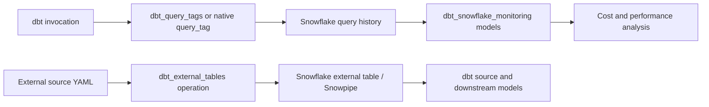

# Snowflake and Operations Packages

> [!abstract] Mental model
> Snowflake operations packages either label dbt work, model Snowflake telemetry, or manage external objects; each needs different permissions, costs, and ownership.

## Executive Summary

- **What it is:** Situational packages such as `dbt_query_tags`, `dbt_snowflake_monitoring`, and `dbt_external_tables` that connect dbt code with Snowflake query attribution, account-usage models, or external-table operations.
- **Why it matters:** They can accelerate cost visibility and operational automation, but they execute against Snowflake-specific metadata and objects rather than acting as passive documentation.
- **Mental model:** **Tag the work, model the telemetry, operate the external object—do not confuse any one of these with complete cost governance or ingestion orchestration.**
- **Best used when:** A client has a defined attribution model, needs reusable Snowflake usage marts, or deliberately manages external sources through dbt operations.
- **Avoid or reconsider when:** Native query tags/views already satisfy the need, privileges are too broad, Account Usage latency is unsuitable, or an ingestion platform owns the external-object lifecycle.

## What It Can Do

- Add dbt model, project, target, invocation, and other metadata to Snowflake queries through comments and query tags.
- Improve attribution of Snowflake query history to dbt nodes, jobs, teams, or environments.
- Materialize curated models over Snowflake `ACCOUNT_USAGE` and `ORGANIZATION_USAGE` for performance and cost analysis.
- Standardize common analysis of warehouse use, query behavior, storage, and related Snowflake consumption signals.
- Create/replace and refresh external tables from dbt source YAML.
- On Snowflake, create, backfill, and refresh Snowpipes through `dbt_external_tables` where configured.
- Keep operational configuration version-controlled and reviewable with the dbt project.

## What It Cannot Do

- Allocate every Snowflake charge perfectly; cloud services, storage, serverless features, idle warehouse time, and shared queries need careful allocation logic.
- Make `ACCOUNT_USAGE` real-time or remove its role/privilege requirements and documented latency.
- Replace Snowflake budgets, resource monitors, RBAC, query history, or finance-approved chargeback rules.
- Guarantee that comments/tags never contain sensitive metadata.
- Turn external tables into an ingestion pipeline with full file delivery, retry, schema-evolution, and incident management.
- Create missing stages, credentials, file formats, buckets, schemas, or all platform scaffolding automatically.
- Remove the need to test package compatibility with the current dbt engine and Snowflake adapter.

## Core Concepts

| Package / concept | Meaning | Why it matters |
|---|---|---|
| `dbt_query_tags` | SELECT package adding rich dbt query comments and query-tag metadata | Improves node/job attribution in Snowflake history |
| Native `query_tag` | Snowflake adapter config that sets a session query tag around model materialization | Simpler choice when a small stable label is sufficient |
| `dbt_snowflake_monitoring` | SELECT package of models over Snowflake usage metadata | Accelerates cost/performance marts, but adds package models and processing |
| `ACCOUNT_USAGE` | Snowflake historical account-level usage views | Broad visibility with documented latency and access requirements |
| `ORGANIZATION_USAGE` | Cross-account organization-level views | Useful for centralized analysis when the role/account context permits it |
| `dbt_external_tables` | dbt Labs macros for staging external sources | Executes DDL/refresh operations from source metadata |
| `run-operation` | Explicit command invoking operational macros | Keeps external-object changes separate from ordinary model selection |
| Dispatch | Macro resolution mechanism used to override adapter behavior | Powerful integration point; upgrades can affect it |

## How It Works (Simple Flow)

1. Define the operational outcome: query attribution, usage marts, or external-source management.
2. Check whether native dbt/Snowflake configuration already solves the requirement with less dependency surface.
3. Review the package version, compatibility, models/macros/hooks, required Snowflake roles, and sensitive metadata exposure.
4. Install a pinned and locked version, then configure only required resources and variables.
5. Pilot in a non-production account/schema using least privilege.
6. Inspect generated SQL, query history, created objects, model runtime, and attribution accuracy.
7. Assign an owner for monitoring, upgrades, cost, retention, and rollback before production use.

## Visuals



## Readable Snippets

### Lightweight native query tag

```yaml
# dbt_project.yml
models:
  bank_analytics:
    +query_tag: "dbt_bank_analytics"
```

Prefer native configuration when a simple stable value answers the attribution question.

### Rich package-based query metadata

```yaml
# dbt_project.yml
dispatch:
  - macro_namespace: dbt
    search_order:
      - bank_analytics
      - dbt_query_tags
      - dbt

query-comment:
  comment: "{{ dbt_query_tags.get_query_comment(node) }}"
  append: true
```

The current SELECT package was renamed from `dbt_snowflake_query_tags` to `dbt_query_tags`. Treat the migration as a dependency/configuration change and test it.

### Stage selected external sources

```bash
dbt run-operation stage_external_sources \
  --args "select: payments.transaction_files"
```

The operation can create or refresh external objects from YAML metadata. It requires existing Snowflake scaffolding and suitable DDL privileges.

## Consultant Talking Points

- **Client question this answers:** "How can we attribute dbt workload, analyze Snowflake usage, or manage external sources without writing every macro/model ourselves?"
- **Trade-offs to mention:** Packages accelerate implementation and standardize metadata, but couple operations to package behavior and may introduce models, hooks, dispatch overrides, or privileged DDL.
- **Risk or governance angle:** Query metadata must not leak PII, secrets, branch names, or sensitive business context. Operational packages need named owners and least-privilege roles.
- **Cost/performance angle:** Query tagging is lightweight; monitoring models consume warehouse compute and storage; external-table queries and refresh operations have their own Snowflake performance/cost profile.

### Start with the problem, not the catalog

| Need | Smallest useful solution | Expand when |
|---|---|---|
| Identify all dbt queries | Native static `query_tag` | Per-node/job/team metadata is required |
| Attribute node-level dbt cost | Rich query-tag/comment package | Governance accepts metadata content and dispatch complexity |
| One usage dashboard | Direct governed `ACCOUNT_USAGE` models | Repeated analyses justify a maintained package mart |
| Multi-dimensional Snowflake monitoring | `dbt_snowflake_monitoring` pilot | Model coverage, latency, and cost are validated |
| External object lifecycle | `dbt_external_tables` operation | dbt is the approved control plane and privileges are bounded |
| Managed connector owns ingestion | Keep object lifecycle with connector/platform | Avoid competing controllers |

## Common Pitfalls

- Installing a monitoring package before defining allocation rules, owners, and the decisions its marts should support.
- Assuming `ACCOUNT_USAGE` is immediate and using delayed data for real-time incident detection.
- Giving the dbt execution role broad `ACCOUNTADMIN`-like privileges instead of granting only required metadata/object access.
- Putting personal data, credentials, customer identifiers, or sensitive project metadata into query comments/tags.
- Forgetting package models add build time, Snowflake queries, storage, and maintenance.
- Treating query-level compute as a perfect allocation of warehouse credits when idle and concurrency effects exist.
- Using both old `dbt_snowflake_query_tags` and renamed `dbt_query_tags` configuration during migration.
- Running `stage_external_sources` with full-refresh behavior casually; it can replace external objects.
- Letting dbt and another ingestion/orchestration tool both manage the same external table or Snowpipe.
- Assuming the package creates external stages, credentials, file formats, storage integration, and access controls for you.

## When to Recommend What (Decision Table)

| Situation | Recommend | Why | Watch-outs |
|---|---|---|---|
| Basic environment/team attribution | Native Snowflake `query_tag` | Lowest complexity | Limited metadata richness |
| Node/job-level attribution | `dbt_query_tags` pilot | Adds structured dbt context | Dispatch behavior, metadata sensitivity, package upgrades |
| Ad hoc cost investigation | Query `ACCOUNT_USAGE` directly | Fastest path to validate questions | View latency and attribution limitations |
| Recurring governed cost/performance marts | `dbt_snowflake_monitoring` | Reuses curated models | Disable unused resources and measure runtime/storage |
| External tables defined as dbt sources | `dbt_external_tables` with explicit operations | YAML and operations stay aligned | DDL privileges, scaffolding, schema evolution |
| Near-real-time external-file pipeline | Snowpipe/ingestion platform as primary controller | Better operational ownership | dbt may still document/use resulting sources |
| Strict regulated production | Approved internal package set and least-privilege service role | Reduces supply-chain and access risk | Evidence, compatibility, and rollback process |

## Related Topics

- [[02 dbt/07 Packages Macros and Advanced Reuse/Packages Macros and Advanced Reuse Overview|Packages Macros and Advanced Reuse Overview]]
- [[02 dbt/07 Packages Macros and Advanced Reuse/66 Package Governance|Package Governance]]
- [[02 dbt/07 Packages Macros and Advanced Reuse/71 Hooks and Operations|Hooks and Operations]]
- [[02 dbt/05 Deployment CI CD and Operations/49 Observability with dbt and Snowflake Metadata|Observability with dbt and Snowflake Metadata]]
- [[01 Snowflake/06 Cost Management and Operations/45 Account Usage Views|Account Usage Views]]
- [[01 Snowflake/04 Data Engineering/24 External Tables and Iceberg|External Tables and Iceberg]]

## Related Decision Notes

- [[80 Comparisons and Decision Notes/Decision Notes/Snowflake/Decisions - Diagnosing Snowflake Spend Increases|Decisions - Diagnosing Snowflake Spend Increases]]
- [[80 Comparisons and Decision Notes/Comparisons/Snowflake/Comparison - Account Usage Views vs Information Schema|Comparison - Account Usage Views vs Information Schema]]
- [[80 Comparisons and Decision Notes/Decision Notes/dbt/Decisions - Approving a dbt Package for Production|Decisions - Approving a dbt Package for Production]]

## Questions

- Is the problem attribution, monitoring, or object management?
- Can native dbt/Snowflake behavior satisfy it with less complexity?
- Which Snowflake views, objects, and privileges does the package require?
- What metadata will appear in query history, and who may read it?
- What are the view-latency and cost-allocation limitations?
- Who owns external objects if another ingestion platform is present?
- What package models or operations will run, at what cadence and cost?

## Sources To Revisit

- [SELECT - dbt_query_tags repository](https://github.com/get-select/dbt-query-tags)
- [dbt Package Hub - dbt_query_tags](https://hub.getdbt.com/get-select/dbt_query_tags/latest/)
- [SELECT - dbt_snowflake_monitoring repository](https://github.com/get-select/dbt-snowflake-monitoring)
- [dbt Package Hub - dbt_snowflake_monitoring](https://hub.getdbt.com/get-select/dbt_snowflake_monitoring/latest/)
- [dbt Labs - dbt_external_tables repository](https://github.com/dbt-labs/dbt-external-tables)
- [dbt Developer Hub - Snowflake query tags](https://docs.getdbt.com/reference/resource-configs/snowflake-configs#query-tags)
- [Snowflake Documentation - ACCOUNT_USAGE QUERY_HISTORY](https://docs.snowflake.com/en/sql-reference/account-usage/query_history)
