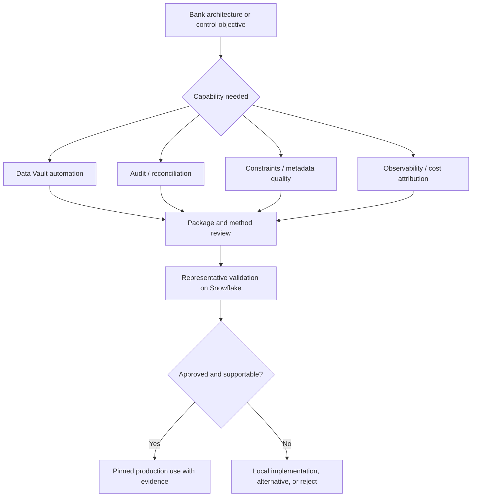

# Finance and Bank-Relevant Packages

> [!abstract] Mental model
> No package is "bank-grade" by name; it becomes suitable only when it supports the bank's chosen architecture and survives control, compatibility, evidence, and ownership review.

## Executive Summary

- **What it is:** Package categories with situational finance value: Data Vault automation, audit/reconciliation helpers, constraints, observability, metadata-quality checks, and Snowflake cost attribution.
- **Why it matters:** Banks repeatedly need historized integration, controlled migrations, traceable quality evidence, and accountable cost—but package-generated code can also concentrate operational and model risk.
- **Mental model:** **A package may implement a mechanism; the bank still owns the method, control objective, validation, and evidence.**
- **Best used when:** The client has deliberately selected the pattern, the package reduces repeated non-differentiating work, and a named team can approve, test, support, and replace it.
- **Avoid or reconsider when:** The package dictates an unchosen architecture, embeds opaque business rules, lacks active support, or cannot meet security, licensing, Fusion/Snowflake, and change-control requirements.

## What It Can Do

- Generate repeatable Data Vault 2.0 staging, hub, link, satellite, PIT, and related patterns from metadata.
- Compare legacy and refactored relations during controlled migration and reconciliation.
- Generate supported database constraints from dbt tests and declared relationships.
- Persist dbt execution/test metadata and detect operational anomalies.
- Check documentation, ownership, testing, DAG, and governance conventions.
- Add query attribution and Snowflake consumption marts for chargeback/showback analysis.
- Standardize approved technical controls across several finance projects.

## What It Cannot Do

- Decide whether Data Vault, dimensional modeling, snapshots, or another history pattern fits the client.
- Prove that regulatory, accounting, capital, liquidity, AML, or risk logic is correct.
- Turn informational Snowflake primary/foreign keys into enforced integrity.
- Make a model compliant solely because it is historized or generated from metadata.
- Replace source-to-report reconciliation, maker-checker approval, segregation of duties, retention, lineage, and exception management.
- Certify a third-party package's security, maintenance, license, or suitability.
- Remove the need to inspect generated SQL and warehouse performance.

## Core Concepts

| Package / category | Meaning | Why it matters in finance |
|---|---|---|
| `automate_dv` | Macros generating Data Vault 2.0 load SQL from metadata | Accelerates a deliberately chosen Data Vault implementation |
| `datavault4dbt` | Data Vault package covering staging, hubs, links, satellites, PITs, snapshots, and related patterns | Alternative implementation with its own conventions and compatibility path |
| `audit_helper` | Relation/query comparison macros | Supports migration and parallel-run evidence |
| `dbt_constraints` | Generates warehouse constraints based on dbt tests | Improves metadata and may support Snowflake join optimization when assumptions are valid |
| Observability package | Captures run/test metadata and detects anomalies | Helps identify pipeline and data drift |
| Metadata/governance checks | Tests documentation, ownership, test coverage, or DAG conventions | Supports control hygiene, not value-level correctness |
| Query attribution package | Links Snowflake queries to dbt context | Supports showback, chargeback, and cost investigation |
| Control evidence | Retained proof of execution, result, approval, and exception handling | Necessary when a control must be auditable |

## How It Works (Simple Flow)

1. Start with an approved architecture or control objective, not a package shortlist.
2. Map the package capability to a specific need such as Data Vault loading, migration comparison, constraint metadata, observability, or cost attribution.
3. Review maintainer, license, release history, support model, code, transitive dependencies, privileges, data/metadata exposure, and dbt/Fusion/Snowflake compatibility.
4. Build a representative pilot with difficult cases: late-arriving records, corrections, duplicates, null keys, backfills, decimal precision, and high volume.
5. Inspect compiled SQL, outputs, lineage, failure modes, Snowflake plans, runtime, and cost.
6. Document ownership, version pin, approval, evidence retention, exception process, rollback, and replacement/fork strategy.
7. Promote the locked package and validated configuration through normal CI/CD; monitor it like other production code.

## Visuals



## Readable Snippets

### Metadata-driven Data Vault model shape

```sql




{{ automate_dv.hub(
    src_pk=src_pk,
    src_nk=src_nk,
    src_ldts='LOAD_TS',
    src_source='RECORD_SOURCE',
    source_model=source_model
) }}
```

This reduces repeated SQL only after the team has standardized hashing, load timestamps, record sources, late-arrival handling, and Data Vault conventions.

### Constraint intent remains separate from proof

```yaml
models:
  - name: dim_customer
    columns:
      - name: customer_key
        tests:
          - not_null
          - unique
```

`dbt_constraints` can derive supported warehouse metadata from tests. On Snowflake standard tables, key constraints are generally informational; keep tests and reconciliation where proof is required.

### Migration comparison is evidence, not approval

```text
Technical comparison: row counts and values match by account/date.
Business reconciliation: balances tie to the approved control total.
Approval: finance owner accepts explained exceptions.
```

## Consultant Talking Points

- **Client question this answers:** "Which dbt packages can help a bank, and what must we validate before recommending one?"
- **Trade-offs to mention:** Metadata-driven packages improve consistency and speed, but they can create wide blast radius, upgrade coupling, and skills dependency on package conventions.
- **Risk or governance angle:** Classify packages as third-party executable code. Require product ownership, legal/security review, least privilege, segregation of duties, change evidence, and an exit path.
- **Cost/performance angle:** Generated Data Vault estates can create many relations and joins; reconciliation and observability can scan large histories; monitoring models consume compute/storage. Benchmark representative volumes.

### Package relevance by control objective

| Objective | Package candidate | Still required outside package |
|---|---|---|
| Standardized Data Vault loads | `automate_dv` or `datavault4dbt` | Architecture choice, modeling standards, performance design, validation |
| Legacy migration evidence | `audit_helper` | Business control totals, tolerance, exception approval |
| Constraint metadata | `dbt_constraints` | Tests, contracts, correct Snowflake enforcement interpretation |
| Pipeline/data anomaly detection | Elementary-style package | Incident owner, deterministic critical controls, retention |
| Project governance hygiene | `dbt_project_evaluator` or approved metadata checks | Client-specific policy and justified exceptions |
| Snowflake chargeback/showback | Query tags and monitoring marts | Finance-approved allocation method and residual-cost treatment |

## Common Pitfalls

- Choosing Data Vault because an automation package exists rather than because the enterprise integration/history problem warrants it.
- Assuming `automate_dv` and `datavault4dbt` are interchangeable; their macro interfaces, supported patterns, conventions, and migration paths differ.
- Generating hundreds of vault objects without validating Snowflake query patterns, warehouse sizing, pruning, and downstream usability.
- Treating hash keys as proof of source uniqueness or using inconsistent null/case/delimiter rules across systems.
- Treating informational Snowflake keys as enforced integrity, or setting `RELY` when the data does not actually satisfy the relationship.
- Calling a package-generated comparison a complete reconciliation without approved control totals and exception sign-off.
- Sending sensitive model names, metadata, query comments, or test failures to an observability service without data-governance review.
- Allowing a consultant or single employee to be the only person who understands package configuration and upgrade behavior.
- Approving a package once and never reassessing maintenance, Fusion compatibility, Snowflake behavior, or transitive dependencies.

## When to Recommend What (Decision Table)

| Situation | Recommend | Why | Watch-outs |
|---|---|---|---|
| Enterprise has approved Data Vault 2.0 | Evaluate `automate_dv` and `datavault4dbt` against a scorecard/pilot | Automation can improve consistency and delivery speed | Do not mix macro conventions casually; benchmark Snowflake |
| Team only needs a few historized dimensions | Snapshots/incremental models may be simpler | Avoids adopting an enterprise pattern unnecessarily | History semantics and correction rules still need design |
| Regulated legacy migration | `audit_helper` plus independent reconciliation and approvals | Combines repeatable technical evidence with business control | Retain outputs and explained exceptions |
| BI/catalog benefits from key metadata | `dbt_constraints` pilot | Can project test intent into warehouse metadata | Snowflake enforcement and `RELY` assumptions |
| Critical financial integrity | Contracts, deterministic tests, and reconciliation | Explicit controls are auditable | Package helpers may assist but cannot own the rule |
| Broad operational drift detection | Approved observability package | Adds cross-run context | Service/data boundary, noise, storage and cost |
| Weakly maintained niche package | Reject, replace, or fork with funded ownership | Avoids unmanaged production dependency | License and internal maintenance burden |
| Multiple projects need the same approved control | Narrow internal package | Centralizes stable implementation | Versioning, consumer coordination, blast radius |

## Related Topics

- [[02 dbt/07 Packages Macros and Advanced Reuse/Packages Macros and Advanced Reuse Overview|Packages Macros and Advanced Reuse Overview]]
- [[02 dbt/07 Packages Macros and Advanced Reuse/62 Must-Have Utility Packages|Must-Have Utility Packages]]
- [[02 dbt/07 Packages Macros and Advanced Reuse/63 Data Quality Packages|Data Quality Packages]]
- [[02 dbt/07 Packages Macros and Advanced Reuse/64 Snowflake and Operations Packages|Snowflake and Operations Packages]]
- [[02 dbt/07 Packages Macros and Advanced Reuse/66 Package Governance|Package Governance]]
- [[02 dbt/08 dbt on Snowflake and Finance Patterns/80 Regulatory Evidence and Auditability|Regulatory Evidence and Auditability]]

## Related Decision Notes

- [[80 Comparisons and Decision Notes/Decision Notes/dbt/Decisions - Approving a dbt Package for Production|Decisions - Approving a dbt Package for Production]]
- [[80 Comparisons and Decision Notes/Decision Notes/dbt/Decisions - Choosing the Right dbt Quality Control|Decisions - Choosing the Right dbt Quality Control]]
- [[80 Comparisons and Decision Notes/Comparisons/dbt/Comparison - Model Contracts vs Data Tests vs Warehouse Constraints|Comparison - Model Contracts vs Data Tests vs Warehouse Constraints]]

## Questions

- What approved architecture or control objective justifies the package?
- Who owns the method, configuration, package, evidence, and exceptions?
- Does the pilot cover corrections, late data, duplicates, precision, backfills, and scale?
- Which Snowflake constraints are enforced versus informational?
- What metadata or data crosses a service boundary?
- Can the bank support, fork, replace, and remove the package?
- What is the measured object count, runtime, storage, and credit impact?

## Sources To Revisit

- [AutomateDV - official repository](https://github.com/Datavault-UK/automate-dv)
- [datavault4dbt - official repository](https://github.com/ScalefreeCOM/datavault4dbt)
- [Snowflake Labs - dbt_constraints repository](https://github.com/Snowflake-Labs/dbt_constraints)
- [dbt Labs - audit_helper repository](https://github.com/dbt-labs/dbt-audit-helper)
- [Elementary - dbt-data-reliability repository](https://github.com/elementary-data/dbt-data-reliability)
- [dbt Labs - dbt_project_evaluator repository](https://github.com/dbt-labs/dbt-project-evaluator)
- [Snowflake Documentation - Constraints overview](https://docs.snowflake.com/en/sql-reference/constraints-overview)
