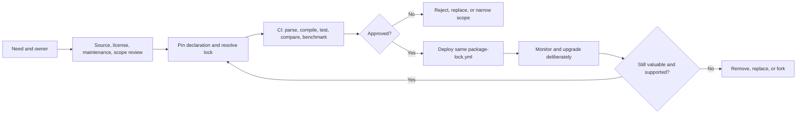

# Package Governance

> [!abstract] Mental model
> A dbt package is executable third-party or shared internal code: approve the need, lock the version, test the behavior, name the owner, and plan the exit.

## Executive Summary

- **What it is:** The policy and lifecycle for selecting, approving, installing, upgrading, monitoring, forking, and removing dbt packages.
- **Why it matters:** Packages can introduce macros, models, tests, hooks, dependencies, generated SQL, Snowflake queries, permissions, and production behavior into every consuming project.
- **Mental model:** **The declaration defines the allowed dependency; `package-lock.yml` records the resolved dependency; CI proves acceptable behavior; ownership keeps it supportable.**
- **Best used when:** A package solves a repeated non-differentiating need, has acceptable provenance/maintenance, and is cheaper to govern than recreating and supporting the capability locally.
- **Avoid or reconsider when:** It adds a large dependency for a small use case, embeds client-specific business logic, relies on mutable code, or lacks a credible maintainer/owner/exit plan.

## What It Can Do

- Establish an approved package inventory with purpose, owner, license, version, and consumers.
- Pin compatible version ranges and lock exact direct/transitive resolutions.
- Make dependency changes visible in pull requests and repeatable across environments.
- Check dbt Core/Fusion, adapter, Snowflake, and package-to-package compatibility before release.
- Control private-package authentication and acquisition paths.
- Require representative compilation, tests, output comparisons, and performance checks.
- Define upgrade cadence, breaking-change handling, rollback, fork, replacement, and removal paths.
- Reduce duplicated utilities through a versioned internal package with explicit support boundaries.

## What It Cannot Do

- Make a Hub-listed package certified, secure, effective, or suitable; dbt Labs explicitly disclaims that assurance.
- Guarantee runtime behavior from a Fusion badge or parse test alone.
- Prove semantic compatibility because a version fits a semantic-version range.
- Detect every supply-chain, license, security, or maintainer risk automatically.
- Prevent package models/tests/hooks from increasing Snowflake workload.
- Make rollback repair data already changed by a problematic package release.
- Replace client security, legal, architecture, data-governance, and change-management decisions.

## Core Concepts

| Concept | Meaning | Why it matters |
|---|---|---|
| Direct dependency | Package explicitly declared by the project | Visible reason and owner should exist |
| Transitive dependency | Package required by another package | Can change compatibility and behavior without being directly selected |
| Version constraint | Allowed release range in the declaration | Defines upgrade boundary, not exact deployed resolution |
| `package-lock.yml` | Resolved package versions and integrity details | Enables predictable installs across environments |
| Immutable revision | Release tag or full commit SHA controlled as an approved input | Safer than a mutable branch for production |
| Fusion compatibility | Declared/version-based and/or parse-tested compatibility signal | Useful screening evidence, not complete runtime certification |
| Package surface | Macros, models, tests, hooks, operations, vars, permissions, and data access added | Determines risk, cost, and blast radius |
| Internal package | Organization-owned reusable dbt project | Needs product-like releases and consumer support |
| Exit strategy | Plan to remove, replace, or fork a dependency | Prevents abandoned code from becoming permanent risk |

## How It Works (Simple Flow)

1. A requester states the problem, alternatives, expected benefit, data/warehouse impact, and proposed owner.
2. Review source, maintainer, releases, license, security process, transitive dependencies, package contents, privileges, and external service boundaries.
3. Validate compatibility with the approved dbt engine/release track, Snowflake adapter, other packages, and client configuration.
4. Declare a constrained version or immutable revision; run `dbt deps` and review `package-lock.yml`.
5. CI compiles and runs representative tests/builds, inspects generated SQL/DAG changes, and measures Snowflake cost/performance where relevant.
6. An authorized owner approves production use and deploys the same lock through environments.
7. Monitor release/security/compatibility changes, upgrade deliberately, and remove or fork when value or support declines.

## Visuals



## Readable Snippets

### Constraint plus lock

```yaml
# packages.yml
packages:
  - package: dbt-labs/dbt_utils
    version: [">=1.3.0", "<2.0.0"]
```

```bash
dbt deps
git diff -- packages.yml package-lock.yml
dbt compile
```

The range describes allowed releases; the committed lock records what this project actually resolved.

### Controlled upgrade

```bash
dbt deps --upgrade
dbt parse
dbt build --select state:modified+
```

Run the upgrade in a dedicated change, review transitive changes and release notes, then add representative full-path tests where macro behavior can affect unchanged downstream nodes.

### Immutable Git dependency

```yaml
packages:
  - git: "https://github.com/example/dbt-controls.git"
    revision: "4e28d6da126e2940d17f697de783a717f2503188"
```

A full commit SHA avoids a mutable `main` reference. Repository provenance and license still need review.

## Consultant Talking Points

- **Client question this answers:** "What must we control before allowing a dbt package into production?"
- **Trade-offs to mention:** A package reduces duplicated development but creates upgrade coupling, dependency risk, support work, and potential warehouse execution.
- **Risk or governance angle:** Treat public and private packages as software supply-chain inputs. Retain the request, review, lock diff, tests, approval, deployment, and exception evidence.
- **Cost/performance angle:** Inventory models, tests, hooks, and operations—not just macros. Benchmark added DAG nodes, test queries, metadata tables, runtime, and Snowflake credits.

### Minimum approval record

| Area | Evidence to retain |
|---|---|
| Purpose | Defined problem, expected benefit, alternatives considered |
| Ownership | Approver, technical owner, incident/upgrade responsibility |
| Provenance | Repository/Hub identity, maintainer, license, release reviewed |
| Scope | Resources, hooks, operations, permissions, external services, data touched |
| Integrity | Declaration, exact lock, immutable Git revision where used |
| Compatibility | dbt engine/release, Fusion, adapter, Snowflake, transitive package results |
| Validation | Compile/build/test evidence, output comparisons, performance/cost checks |
| Lifecycle | Upgrade cadence, monitoring source, rollback, removal/fork plan |

### Fusion evidence hierarchy

1. Package declares a dbt version range that includes the approved Fusion version.
2. Hub/maintainer compatibility status and automated parse result are checked.
3. The consuming project parses and compiles with its real configuration.
4. Representative macros, tests, models, hooks, and operations run against Snowflake.
5. Outputs, permissions, runtime, and cost are validated.

Earlier steps screen candidates; later steps provide stronger project-specific evidence.

## Common Pitfalls

- Treating popularity, a Hub listing, or a Fusion badge as security and suitability approval.
- Ignoring `package-lock.yml`, or regenerating it during every production deployment.
- Pinning a direct package while overlooking transitive dependency changes.
- Depending on `main`, an employee fork, or a prerelease without deliberate risk acceptance.
- Testing only `dbt parse` and missing runtime macro, hook, materialization, or adapter behavior.
- Upgrading dbt, adapter, several packages, and business logic in one hard-to-diagnose release.
- Installing a macros package that also enables unexpected models or tests.
- Using personal credentials for private package installation.
- Editing files in `dbt_packages/`, which a later `dbt deps` can overwrite.
- Keeping an abandoned package because no one owns replacement or a fork.
- Assuming code rollback reverses already-published data or external-object changes.

## When to Recommend What (Decision Table)

| Situation | Recommend | Why | Watch-outs |
|---|---|---|---|
| Mature package solves repeated utility need | Approve pinned/locked package | Reuse exceeds governance cost | Maintainer, compatibility, transitive dependencies |
| One trivial capability | Local SQL or tested macro | Smaller dependency surface | Local ownership still required |
| Stable utilities shared across projects | Versioned internal package | Central standards and fixes | Release discipline and consumer coordination |
| Client-specific business definition | Keep in governed domain project | Ownership stays close to the business | Avoid uncontrolled duplication |
| Package lacks clear Fusion support | Pilot and full runtime validation, or defer | Avoids assuming parse equals behavior | Budget for replacement/fork |
| Weakly maintained critical dependency | Replace or fork with explicit funding | Restores support accountability | License and long-term maintenance |
| Restricted regulated environment | Approved internal mirror/private source | Controls acquisition and provenance | Secure update and integrity process |
| Production dependency upgrade | Dedicated PR using `dbt deps --upgrade` | Makes lock and behavior changes reviewable | Test transitive and compiled-SQL impact |

## Related Topics

- [[02 dbt/07 Packages Macros and Advanced Reuse/Packages Macros and Advanced Reuse Overview|Packages Macros and Advanced Reuse Overview]]
- [[02 dbt/07 Packages Macros and Advanced Reuse/60 Package Fundamentals|Package Fundamentals]]
- [[02 dbt/07 Packages Macros and Advanced Reuse/61 packages.yml vs dependencies.yml|packages.yml vs dependencies.yml]]
- [[02 dbt/07 Packages Macros and Advanced Reuse/62 Must-Have Utility Packages|Must-Have Utility Packages]]
- [[02 dbt/05 Deployment CI CD and Operations/46 Package Management and Dependency Governance|Package Management and Dependency Governance]]
- [[02 dbt/05 Deployment CI CD and Operations/40 Git Workflow and Pull Requests|Git Workflow and Pull Requests]]

## Related Decision Notes

- [[80 Comparisons and Decision Notes/Comparisons/dbt/Comparison - dbt Packages vs Project Dependencies|Comparison - dbt Packages vs Project Dependencies]]
- [[80 Comparisons and Decision Notes/Decision Notes/dbt/Decisions - Choosing a dbt Production Deployment Pattern|Decisions - Choosing a dbt Production Deployment Pattern]]
- [[80 Comparisons and Decision Notes/Decision Notes/dbt/Decisions - Approving a dbt Package for Production|Decisions - Approving a dbt Package for Production]]

## Questions

- What repeated problem justifies this dependency?
- Which macros, models, tests, hooks, operations, permissions, and services does it add?
- What direct and transitive versions are locked?
- What evidence exists beyond parse compatibility?
- Who owns incidents, upgrades, credentials, and replacement?
- How much Snowflake workload and metadata storage does it add?
- Can the project remove or fork it without unacceptable disruption?

## Sources To Revisit

- [dbt Developer Hub - Packages](https://docs.getdbt.com/docs/build/packages)
- [dbt Developer Hub - dbt deps](https://docs.getdbt.com/reference/commands/deps)
- [dbt Developer Hub - Fusion package compatibility](https://docs.getdbt.com/docs/build/packages#fusion-package-compatibility)
- [dbt Developer Hub - require-dbt-version](https://docs.getdbt.com/reference/project-configs/require-dbt-version)
- [dbt Package Hub - Package disclaimer](https://hub.getdbt.com/package-disclaimer/)
- [dbt Package Hub](https://hub.getdbt.com/)
