# Jinja Fundamentals

> [!abstract] Mental model
> Jinja writes SQL before the warehouse runs SQL: dbt renders the template, and the database sees only the compiled result.

## Executive Summary

- **What it is:** Jinja is the templating language dbt embeds in SQL and configuration files to insert values, call dbt functions, and generate repeated SQL.
- **Why it matters:** It enables `ref()`, environment-aware configuration, loops, conditionals, and macros while keeping the final workload as warehouse SQL.
- **Mental model:** **Jinja is the code generator; compiled SQL is the product that must remain readable and correct.**
- **Best used when:** A small amount of templating makes dependencies explicit, removes mechanical repetition, or safely varies behavior by target.
- **Avoid or reconsider when:** The template hides business logic, queries the warehouse during compilation without a clear need, or produces SQL reviewers cannot easily inspect.

## What It Can Do

- Insert relations from `ref()` and `source()` so dbt can build lineage.
- Set variables and use lists or dictionaries during compilation.
- Generate repetitive SQL with `for` loops.
- Choose compile-time branches with `if` statements.
- Transform template values with filters such as `join` and `lower`.
- Call macros and dbt-specific context functions.
- Control whitespace in the generated SQL.

## What It Cannot Do

- Execute row-by-row business logic after the query reaches Snowflake.
- Make invalid generated SQL valid.
- Replace explicit model dependencies, tests, or documentation.
- Guarantee portability when generated SQL uses warehouse-specific syntax.
- Make a highly abstract model easy to debug merely because its source file is short.
- Recover information that is unavailable at parse or compile time.

## Core Concepts

| Concept | Meaning | Why it matters |
|---|---|---|
| Expression `{{ ... }}` | Renders a value into the output | Used for `ref()`, macro calls, identifiers, and SQL fragments |
| Statement `` | Controls templating without directly printing | Used for `set`, `if`, `for`, and macro definitions |
| Jinja comment `{# ... #}` | Prevents its content from rendering | A SQL comment may still contain Jinja that gets evaluated |
| Context | Variables and functions dbt exposes to Jinja | Availability can differ by file type and lifecycle stage |
| Compile time | Phase when dbt renders Jinja into SQL | Template logic happens before warehouse query execution |
| Compiled SQL | Final SQL produced by rendering | This is the most important debugging and review artifact |
| Filter | `|` transformation applied to a Jinja value | Helps format lists and values compactly |
| Whitespace control | `-` near a delimiter strips adjacent whitespace | Useful sparingly; aggressive stripping harms readability |

## How It Works (Simple Flow)

1. dbt reads the model and makes its Jinja context available.
2. Expressions resolve values such as relations, variables, and macro outputs.
3. Statements evaluate loops, conditionals, and assignments.
4. Jinja renders one SQL string for the selected target and configuration.
5. dbt records dependencies it can identify from functions such as `ref()`.
6. The compiled SQL is written under `target/compiled` and, for an executing command, sent to the warehouse.
7. Developers inspect compiled SQL and logs when the template or query behaves unexpectedly.

## Visuals

```mermaid
flowchart LR
    A[Model SQL plus Jinja] --> B[dbt context]
    B --> C[Jinja rendering]
    C --> D[Readable compiled SQL]
    D --> E[Snowflake execution]
    E --> F[Relation or test result]

    classDef input fill:#E8F0FE,stroke:#4C6EF5,color:#172B4D
    classDef dbt fill:#E6FCF5,stroke:#2F9E7B,color:#123C34
    classDef platform fill:#F1F3F5,stroke:#868E96,color:#212529
    classDef output fill:#F3E8FF,stroke:#805AD5,color:#2D1B4E
    class A,B input
    class C,D dbt
    class E platform
    class F output
```



## Readable Snippets

### Expressions and dependencies

```sql
select *
from {{ ref('stg_payments') }}
```

dbt replaces `ref()` with the target relation name and records a DAG dependency. Hardcoding the relation loses that project-level relationship.

### Variables, loops, and commas

```sql


select
    order_id,
    
    sum(case when payment_method = '{{ method }}' then amount end)
        as {{ method }}_amount,
    
from {{ ref('stg_payments') }}
group by order_id
```

The loop executes while dbt compiles. Snowflake receives three explicit expressions, not a loop.

### A restrained target branch

```sql
select *
from {{ ref('stg_transactions') }}

where loaded_at >= dateadd(day, -7, current_timestamp)

```

Environment branches should be deliberate. If development and production calculate different business logic, CI may not validate what production will run.

### Comments and whitespace

```sql
{# This Jinja expression is not evaluated: {{ ref('old_model') }} #}


    {{ column }}, 

```

Use Jinja comments to disable template code. Use whitespace control only where the normal output is genuinely noisy.

## Consultant Talking Points

- **Client question this answers:** "Why does this dbt model contain programming syntax, and what actually reaches Snowflake?"
- **Trade-offs to mention:** Jinja reduces mechanical repetition and enables dbt lineage, but every branch and loop increases the distance between source code and executed SQL.
- **Risk or governance angle:** Review both the template and compiled SQL. Keep environment behavior, dynamic identifiers, and any warehouse introspection explicit and controlled.
- **Cost/performance angle:** Rendering itself is usually not the material cost; the generated SQL and any compile-time warehouse queries determine warehouse consumption.

A useful review rule is: **if a reviewer cannot predict the compiled SQL without mentally executing a small program, the template is probably doing too much.**

## Common Pitfalls

- Nesting curlies, for example `{{ ref({{ model_name }}) }}`, instead of passing the variable directly.
- Forgetting quotes around a string argument inside Jinja and accidentally referencing an undefined variable.
- Leaving a trailing comma after a generated expression.
- Using `--` to comment out Jinja and discovering that the Jinja still renders; use `{# ... #}`.
- Branching on targets so development and production implement materially different transformations.
- Generating hardcoded relation names instead of using `ref()` or `source()`, which hides lineage and breaks environment routing.
- Overusing whitespace control until compiled SQL becomes cramped and difficult to diagnose.
- Using warehouse-querying Jinja casually; compilation can require a live connection and may add latency or side effects depending on the macro.

## When to Recommend What (Decision Table)

| Situation | Recommend | Why | Watch-outs |
|---|---|---|---|
| Reference another dbt model | `ref()` | Resolves the relation and records lineage | Do not build relation names manually |
| Three or more mechanical SQL repetitions | Small loop or macro | Reduces copy-paste errors | Inspect the expanded SQL |
| One clear environment difference | Short `if` using `target` or `var()` | Makes intentional variation visible | Keep business semantics consistent |
| One-off business calculation | Plain SQL | Easier to review and tune | Some repetition is acceptable |
| Values must come from warehouse metadata | Carefully scoped introspective macro | Can generate SQL from actual metadata | Compilation connection, latency, determinism, and command scope |
| Many nested loops and branches | Redesign into explicit models or simpler macros | Restores traceability | Short template source may conceal a large SQL surface |

## Related Topics

- [[02 dbt/07 Packages Macros and Advanced Reuse/Packages Macros and Advanced Reuse Overview|Packages Macros and Advanced Reuse Overview]]
- [[02 dbt/07 Packages Macros and Advanced Reuse/68 Macros as Reusable SQL Functions|Macros as Reusable SQL Functions]]
- [[02 dbt/07 Packages Macros and Advanced Reuse/72 Advanced Macro Boundaries|Advanced Macro Boundaries]]
- [[02 dbt/01 Core Concepts and Project Structure/05 Models ref source and the DAG|Models, ref, source, and the DAG]]

## Related Decision Notes

- [[80 Comparisons and Decision Notes/Decision Notes/dbt/Decisions - When to Abstract dbt SQL into Macros|Decisions - When to Abstract dbt SQL into Macros]]

## Questions

- Can a reviewer understand the compiled SQL quickly?
- Is each branch configuration logic or hidden business logic?
- Are all relation dependencies expressed through `ref()` or `source()`?
- Does any Jinja query the warehouse, and under which commands can it run?
- Would a few repeated SQL lines be clearer than this abstraction?

## Sources To Revisit

- [dbt Developer Hub - Jinja and macros](https://docs.getdbt.com/docs/build/jinja-macros)
- [dbt Developer Hub - dbt Jinja functions](https://docs.getdbt.com/reference/dbt-jinja-functions)
- [Jinja Documentation - Template Designer Documentation](https://jinja.palletsprojects.com/en/stable/templates/)
