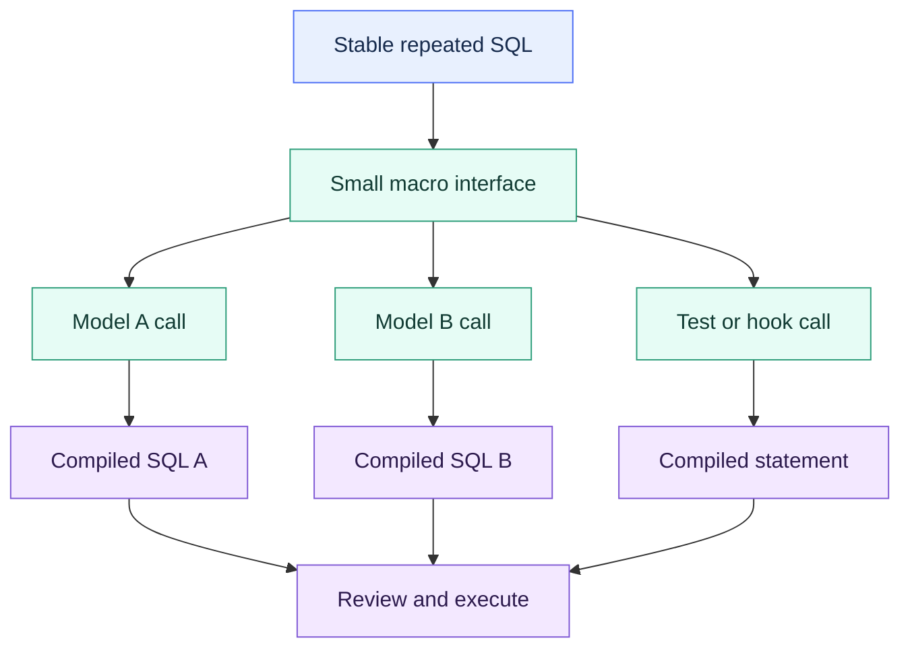

# Macros as Reusable SQL Functions

> [!abstract] Mental model
> A macro is a compile-time SQL factory: give it clear inputs, and it should return a small, predictable SQL fragment.

## Executive Summary

- **What it is:** A dbt macro is reusable Jinja code, normally stored in the `macros/` directory, that generates SQL or returns a Jinja value.
- **Why it matters:** Macros centralize stable technical patterns and prevent the same fragile SQL from being copied across many models.
- **Mental model:** **Use macros like a small standard library for SQL, not as a place to hide the data model.**
- **Best used when:** A well-understood technical expression or operation repeats across models and has a stable interface.
- **Avoid or reconsider when:** The abstraction represents one model's core business logic, has many mode flags, or makes compiled SQL harder to understand than the repeated SQL.

## What It Can Do

- Generate reusable expressions, column lists, predicates, or complete operational statements.
- Accept named arguments and sensible defaults.
- Return SQL text or native Jinja objects using `return()`.
- Standardize quoting, casting, date logic, naming, and defensive handling.
- Expose package functionality through a qualified namespace.
- Document a reusable interface and its arguments in YAML.

## What It Cannot Do

- Behave like a Snowflake function executed once per row; it expands before execution.
- Automatically validate that its arguments are safe identifiers or SQL fragments.
- Create dbt lineage unless rendered logic contains visible `ref()` or `source()` calls that dbt can discover.
- Guarantee cross-database behavior without adapter-specific implementations.
- Replace a model when the transformation deserves its own named, tested DAG node.
- Make changing logic safe for every caller without impact analysis.

## Core Concepts

| Concept | Meaning | Why it matters |
|---|---|---|
| Macro definition | `...` | Declares the reusable interface |
| Call site | `{{ macro_name(...) }}` | Expands the macro in a model, test, hook, or another macro |
| Argument | Input value, identifier, relation, or SQL fragment | Ambiguous input types are a common source of invalid SQL |
| Default argument | Optional input with a declared fallback | Keeps common calls concise without mode-flag sprawl |
| `return()` | Returns a string or native object to the caller | Useful when a macro is more than direct SQL rendering |
| Namespace | Package prefix such as `dbt_utils.` | Prevents collisions and makes ownership clear |
| Macro properties | YAML descriptions and argument metadata | Makes shared code discoverable and reviewable |
| Compiled contract | Expected shape of generated SQL | Macro quality is judged at the expanded call sites |

## How It Works (Simple Flow)

1. The team identifies genuinely repeated, stable SQL behavior.
2. A macro defines a narrow name, arguments, defaults, and output shape.
3. Models call the macro with explicit values, columns, or relations.
4. dbt renders the macro during compilation.
5. The generated fragment becomes part of each model's compiled SQL.
6. Reviewers inspect representative compiled call sites and test edge cases.
7. Changes to a shared macro are treated as changes to every caller.

## Visuals



## Readable Snippets

### Small expression macro

```sql
-- macros/safe_ratio.sql

    round(
        {{ numerator }} / nullif({{ denominator }}, 0),
        {{ scale }}
    )

```

```sql
-- models/marts/finance/fct_portfolio.sql
select
    portfolio_id,
    {{ safe_ratio('loss_amount', 'exposure_amount') }} as loss_rate
from {{ ref('int_portfolio_exposure') }}
```

Compiled SQL should still read naturally: an explicit `round(... / nullif(...))` expression appears where the call was made.

### Document the interface

```yaml
macros:
  - name: safe_ratio
    description: Returns a rounded ratio and avoids division by zero.
    arguments:
      - name: numerator
        type: column
        description: SQL expression used as the numerator.
      - name: denominator
        type: column
        description: SQL expression used as the denominator.
      - name: scale
        type: integer
        description: Decimal places; defaults to 4.
```

Current dbt versions can validate documented macro argument names and types when the relevant behavior-change setting is enabled. Treat that as interface hygiene, not proof that generated SQL is correct.

### Package calls should be qualified

```sql
select *
from (
    {{ dbt_utils.union_relations(
        relations=[ref('payments_current'), ref('payments_archive')]
    ) }}
)
```

Qualification makes the source of shared behavior explicit. Before writing a new utility, check approved packages and local macros for an existing implementation.

## Consultant Talking Points

- **Client question this answers:** "When should repeated SQL become shared dbt code?"
- **Trade-offs to mention:** Centralization reduces inconsistent copies, but one macro change can alter many models and create a broad regression surface.
- **Risk or governance angle:** Assign ownership, document arguments and output, qualify package macros, and require impact-aware review for widely used macros.
- **Cost/performance angle:** A macro does not make generated SQL cheaper. A convenient macro can reproduce an expensive expression or metadata query across many nodes.

Prefer macros for **technical policy**—for example safe division, surrogate key formatting, or standard grants. Prefer models for **business transformations** that deserve lineage, documentation, tests, and independent materialization choices.

## Common Pitfalls

- Abstracting after the first occurrence instead of waiting for a stable repeated pattern.
- Passing untrusted or poorly validated strings as identifiers or raw SQL.
- Building a macro with many Boolean flags that selects unrelated behaviors.
- Hiding important `ref()` calls or relation logic inside layers of macros, making dependencies hard to see.
- Returning different SQL shapes for different arguments without documenting the contract.
- Changing a widely used macro without compiling and testing representative callers.
- Calling a package macro without its namespace and creating ambiguous resolution or collisions.
- Treating fewer source lines as proof of simpler or faster warehouse SQL.

## When to Recommend What (Decision Table)

| Situation | Recommend | Why | Watch-outs |
|---|---|---|---|
| Repeated stable expression | Small expression macro | One maintained technical rule | Keep call and output obvious |
| Repeated multi-step business transformation | Named intermediate model | Gives lineage, tests, docs, and clear grain | Adds a DAG node and possible materialization cost |
| Common utility exists in approved package | Qualified package macro | Avoids maintaining another implementation | Version, compatibility, and ownership review |
| Logic occurs only once | Plain SQL | Lowest cognitive overhead | Reassess if stable repetition appears |
| Platform syntax differs | Dispatching macro | Preserves one public interface | Test each supported adapter |
| Macro needs many switches | Split or redesign | Each interface stays coherent | Avoid a hidden mini-framework |

## Related Topics

- [[02 dbt/07 Packages Macros and Advanced Reuse/Packages Macros and Advanced Reuse Overview|Packages Macros and Advanced Reuse Overview]]
- [[02 dbt/07 Packages Macros and Advanced Reuse/67 Jinja Fundamentals|Jinja Fundamentals]]
- [[02 dbt/07 Packages Macros and Advanced Reuse/70 Adapter Dispatch|Adapter Dispatch]]
- [[02 dbt/07 Packages Macros and Advanced Reuse/72 Advanced Macro Boundaries|Advanced Macro Boundaries]]
- [[02 dbt/07 Packages Macros and Advanced Reuse/62 Must-Have Utility Packages|Must-Have Utility Packages]]

## Related Decision Notes

- [[80 Comparisons and Decision Notes/Decision Notes/dbt/Decisions - Choosing the Right dbt Modeling Layer|Decisions - Choosing the Right dbt Modeling Layer]]
- [[80 Comparisons and Decision Notes/Decision Notes/dbt/Decisions - When to Abstract dbt SQL into Macros|Decisions - When to Abstract dbt SQL into Macros]]

## Questions

- Is this behavior repeated and stable enough to justify a shared interface?
- Is the macro technical plumbing or hidden business logic?
- What argument types and output shape does the caller rely on?
- Which models change if the macro changes?
- Would a named model make lineage and testing clearer?
- Is an approved package implementation already available?

## Sources To Revisit

- [dbt Developer Hub - Jinja and macros](https://docs.getdbt.com/docs/build/jinja-macros)
- [dbt Developer Hub - Macro properties](https://docs.getdbt.com/reference/resource-properties/macros)
- [dbt Developer Hub - Behavior changes, including macro argument validation](https://docs.getdbt.com/reference/global-configs/behavior-changes)
