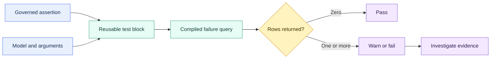

# Custom Generic Tests

> [!abstract] Mental model
> A custom generic test is a reusable query for finding bad rows: zero returned rows means the assertion passed.

## Executive Summary

- **What it is:** A custom generic data test is a parameterized Jinja `test` block that dbt can apply repeatedly to models, columns, sources, seeds, or snapshots.
- **Why it matters:** It turns a recurring organizational data rule into one maintained implementation and a consistent failure signal.
- **Mental model:** **Write the SQL that returns evidence against the rule, then parameterize only the parts that truly vary.**
- **Best used when:** The same clearly defined assertion is needed across several resources and its failure rows are useful to diagnose.
- **Avoid or reconsider when:** The rule is one-off, depends on several business-specific relations, scans excessive data, or would be clearer as a singular test, unit test, or reconciliation model.

## What It Can Do

- Reuse an assertion across many models or columns.
- Accept the standard `model` and optional `column_name` arguments plus custom arguments.
- Return row-level evidence that violates the rule.
- Set default severity and other data-test configurations.
- Document the test logic and arguments as macro properties.
- Apply organizational conventions not covered by dbt's built-in tests.

## What It Cannot Do

- Prove that untested rows, periods, or dimensions are correct.
- Replace unit tests for transformation behavior on controlled inputs.
- Replace reconciliation when totals must agree across systems or ledgers.
- Prevent invalid rows from being written; a data test normally detects them after query execution.
- Guarantee low cost when applied broadly to large relations.
- Make a vague business rule governable merely by packaging it as a test.

## Core Concepts

| Concept | Meaning | Why it matters |
|---|---|---|
| `test` block | Jinja block defining a generic data test | Compiles into a selectable test query |
| `model` | Relation on which the test is declared | Standard argument name even for sources, seeds, or snapshots |
| `column_name` | Column supplied by a column-level declaration | Omit for relation-level assertions |
| Additional argument | Rule parameter such as minimum, maximum, or date column | Lets one implementation serve controlled variations |
| Failure rows | Records returned by the test query | Zero rows pass; returned rows explain the violation |
| Configuration | Severity, thresholds, tags, storage, and filters | Determines operational handling, not the business definition alone |
| Test name | Generated node identity from test and arguments | Clear arguments and optional names improve observability |

## How It Works (Simple Flow)

1. The team defines an assertion and the rows that disprove it.
2. A `test` block accepts `model`, optionally `column_name`, and a small set of rule arguments.
3. YAML applies the test to selected resources with explicit argument values.
4. dbt compiles one test node for each declaration and adds it to the DAG.
5. `dbt test` or `dbt build` runs the compiled failure query.
6. Zero failure rows pass; one or more failure rows warn or fail according to configuration.
7. Owners use the returned records and run artifacts to investigate, fix, or formally accept the exception.

## Visuals



## Readable Snippets

### Define one reusable range assertion

```sql
-- tests/generic/test_between_values.sql


select
    {{ column_name }} as invalid_value
from {{ model }}
where {{ column_name }} is not null
  and {{ column_name }} not between {{ minimum }} and {{ maximum }}


```

The SQL intentionally returns offending values. Null handling is explicit rather than accidentally making this test duplicate `not_null`.

### Apply it with current argument syntax

```yaml
models:
  - name: fct_credit_exposure
    columns:
      - name: probability_of_default
        data_tests:
          - between_values:
              arguments:
                minimum: 0
                maximum: 1
              config:
                severity: error
```

The `arguments:` nesting is the current syntax in dbt documentation. Confirm supported syntax against the project's dbt version before migrating older YAML.

### Document the test interface

```yaml
macros:
  - name: test_between_values
    description: Returns non-null values outside an inclusive range.
    arguments:
      - name: model
        type: relation
        description: Resource being tested.
      - name: column_name
        type: column
        description: Numeric column to check.
      - name: minimum
        type: number
        description: Inclusive lower bound.
      - name: maximum
        type: number
        description: Inclusive upper bound.
```

The documented macro name uses the `test_` prefix even though YAML calls `between_values`.

## Consultant Talking Points

- **Client question this answers:** "How do we enforce the same organization-specific data rule across many dbt resources?"
- **Trade-offs to mention:** Reuse improves consistency, but a broadly applied test can create a large warehouse scan and a shared maintenance dependency.
- **Risk or governance angle:** Define the rule owner, null behavior, severity, evidence retention, exceptions, and response procedure. A failing regulated control without ownership is just noise.
- **Cost/performance angle:** Each declaration becomes a query. Filter only when the filter preserves the required control scope, and measure expensive tests on large models.

Use built-ins first for `unique`, `not_null`, `accepted_values`, and `relationships`. A custom test earns its place when it expresses a durable rule that is not already covered cleanly.

## Common Pitfalls

- Writing the passing rows instead of the failing rows and reversing the assertion.
- Combining null, uniqueness, and range behavior into one opaque test instead of composing clear tests.
- Reusing a test whose business meaning differs across models even though its SQL shape looks similar.
- Applying full-table tests to large incremental facts on every run without a cost or coverage design.
- Downgrading important control failures to warnings until warnings are routinely ignored.
- Returning only a count and losing useful offending-row evidence.
- Overriding a built-in test name unintentionally and changing behavior project-wide.
- Using an open-source package test without reviewing semantics, version compatibility, and support ownership.

## When to Recommend What (Decision Table)

| Situation | Recommend | Why | Watch-outs |
|---|---|---|---|
| Standard null, uniqueness, value-list, or relationship rule | Built-in generic test | Familiar and maintained | Confirm null and relationship semantics |
| Repeated organization-specific row rule | Custom generic test | One governed implementation | Keep arguments and failure evidence clear |
| One model-specific cross-table assertion | Singular data test | Direct SQL is easier to understand | Avoid copying it repeatedly |
| Transformation branch needs controlled examples | Unit test | Tests SQL behavior before production data validation | Not a substitute for live-data checks |
| Financial totals must agree across systems | Reconciliation model or test plus evidence process | Makes scope, tolerance, and differences explicit | Period completeness and accepted breaks |
| Package already provides the needed rule | Reviewed package test | Avoids local reinvention | Pin version and validate semantics |

## Related Topics

- [[02 dbt/07 Packages Macros and Advanced Reuse/Packages Macros and Advanced Reuse Overview|Packages Macros and Advanced Reuse Overview]]
- [[02 dbt/03 Testing Documentation and Data Quality/21 Generic Singular and Custom Data Tests|Generic, Singular, and Custom Data Tests]]
- [[02 dbt/03 Testing Documentation and Data Quality/22 Unit Tests for SQL Logic|Unit Tests for SQL Logic]]
- [[02 dbt/03 Testing Documentation and Data Quality/29 Data Quality Strategy in Regulated Environments|Data Quality Strategy in Regulated Environments]]
- [[02 dbt/07 Packages Macros and Advanced Reuse/63 Data Quality Packages|Data Quality Packages]]

## Related Decision Notes

- [[80 Comparisons and Decision Notes/Decision Notes/dbt/Decisions - Choosing the Right dbt Quality Control|Decisions - Choosing the Right dbt Quality Control]]
- [[80 Comparisons and Decision Notes/Comparisons/dbt/Comparison - Freshness vs Completeness vs Validity vs Reconciliation|Comparison - Freshness vs Completeness vs Validity vs Reconciliation]]
- [[80 Comparisons and Decision Notes/Comparisons/dbt/Comparison - Hooks vs Models Tests and Operations|Comparison - Hooks vs Models Tests and Operations]]

## Questions

- What exact records disprove the assertion?
- Is the rule reusable in meaning, not just in SQL shape?
- How should nulls, thresholds, and accepted exceptions behave?
- Who owns failures and how quickly must they respond?
- What does each test scan, and is its coverage still complete?
- Would a singular test, unit test, or reconciliation control communicate the requirement better?

## Sources To Revisit

- [dbt Developer Hub - Add data tests to your DAG](https://docs.getdbt.com/docs/build/data-tests)
- [dbt Developer Hub - Writing custom generic data tests](https://docs.getdbt.com/best-practices/writing-custom-generic-tests)
- [dbt Developer Hub - Data test configurations](https://docs.getdbt.com/reference/data-test-configs)
