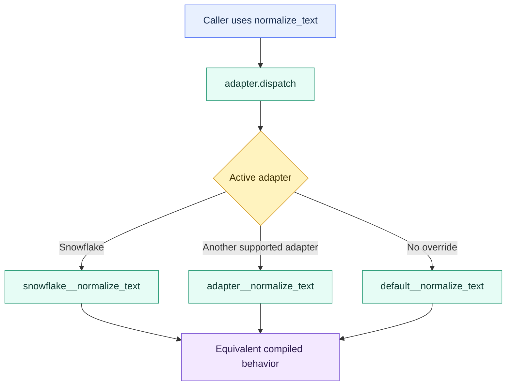

# Adapter Dispatch

> [!abstract] Mental model
> Dispatch is a routing table: callers use one macro name, while dbt selects the implementation for the active warehouse adapter.

## Executive Summary

- **What it is:** Adapter dispatch is dbt's multiple-dispatch mechanism for resolving a common macro call to an adapter-specific implementation such as `snowflake__...` or a `default__...` fallback.
- **Why it matters:** It lets packages and multi-platform projects isolate SQL dialect differences behind one stable interface.
- **Mental model:** **Keep the public macro portable; put unavoidable warehouse syntax behind named adapter implementations.**
- **Best used when:** The same semantic operation must work on several supported adapters whose SQL syntax or behavior differs.
- **Avoid or reconsider when:** The project supports only Snowflake, portability is hypothetical, or the implementations cannot honestly promise the same result.

## What It Can Do

- Route a macro call according to the active adapter type.
- Provide a `default__` implementation and targeted warehouse overrides.
- Keep calling models free of repeated `if target.type` branches.
- Allow a root project to override dispatchable package behavior through configured search order.
- Give packages a stable cross-database interface while preserving platform optimizations.

## What It Cannot Do

- Make fundamentally different warehouse capabilities equivalent.
- Verify that every adapter implementation has identical semantics.
- Remove the need to test compiled SQL and outcomes on each supported adapter.
- Improve portability when warehouse-specific logic remains scattered elsewhere.
- Justify cross-platform complexity for a deliberately single-platform project.
- Safely override package behavior without understanding namespace and search order.

## Core Concepts

| Concept | Meaning | Why it matters |
|---|---|---|
| Public macro | Stable function called by models or downstream packages | Keeps callers independent of adapter prefixes |
| `adapter.dispatch()` | Resolves and returns the best implementation macro | Central routing mechanism |
| Adapter prefix | Lowercase adapter name plus `__`, such as `snowflake__` | Identifies a platform-specific candidate |
| `default__` | Fallback implementation when no adapter match exists | Defines baseline behavior or raises a clear unsupported error |
| Macro namespace | Package namespace in which candidates are searched | Required for dispatching package macros |
| Search order | Ordered packages dbt examines for implementations | Enables controlled override behavior |
| Semantic parity | Same intended result across implementations | More important than merely compiling on every platform |

## How It Works (Simple Flow)

1. A caller invokes the public macro without choosing a warehouse branch.
2. The public macro calls `adapter.dispatch()` with a literal macro name and, for package code, its namespace.
3. dbt identifies the active adapter, such as Snowflake.
4. dbt searches the configured namespaces for `snowflake__macro_name`.
5. If no adapter-specific candidate is found, dbt searches for `default__macro_name`.
6. The selected implementation renders SQL back into the caller.
7. CI compiles and behavior-tests each officially supported adapter implementation.

## Visuals



## Readable Snippets

### One public interface, two implementations

```sql
-- macros/normalize_text.sql

    {{ return(adapter.dispatch('normalize_text', 'risk_utils')(expression)) }}



    lower(trim({{ expression }}))



    lower(trim({{ expression }}))

```

```sql
select
    {{ normalize_text('counterparty_name') }} as counterparty_name_normalized
from {{ ref('stg_counterparties') }}
```

For a local single-project macro, the namespace can be omitted. Package maintainers should supply their package namespace so candidate lookup is intentional.

### Controlled package override

```yaml
# dbt_project.yml
dispatch:
  - macro_namespace: risk_utils
    search_order:
      - bank_analytics
      - risk_utils
```

This allows `bank_analytics` to provide an approved override before falling back to `risk_utils`. It is powerful and should be treated as dependency behavior, not a casual configuration tweak.

### Make unsupported behavior explicit

```sql

    {{ exceptions.raise_compiler_error(
        'apply_masking_policy is not implemented for this adapter'
    ) }}

```

A clear failure is safer than a fallback that compiles but provides weaker governance semantics.

## Consultant Talking Points

- **Client question this answers:** "How can a shared dbt package support Snowflake and other warehouses without filling models with dialect checks?"
- **Trade-offs to mention:** Dispatch cleans up callers but multiplies the implementations and test matrix maintained by the owning team.
- **Risk or governance angle:** Document supported adapters, semantic guarantees, override ownership, and fallback behavior. Never silently weaken a security or control operation on an unsupported adapter.
- **Cost/performance angle:** Equivalent results may have very different query plans and costs. Optimize per adapter while preserving the public contract.

Dispatch is most valuable in packages. In a Snowflake-only client project, a direct, clearly named Snowflake macro is often easier to own than speculative portability.

## Common Pitfalls

- Adding dispatch for a single-platform project with no realistic portability requirement.
- Forgetting the `default__` fallback or using a fallback with materially different semantics.
- Omitting the macro namespace in package code and resolving an unexpected candidate.
- Configuring search order that silently overrides package behavior across the project.
- Testing that every implementation compiles but not that results, null behavior, types, and edge cases match.
- Hiding governance differences, such as an enforced Snowflake control versus a no-op fallback.
- Copying the same implementation under many adapter prefixes without defining who maintains them.
- Assuming portability guarantees equal cost or performance across warehouses.

## When to Recommend What (Decision Table)

| Situation | Recommend | Why | Watch-outs |
|---|---|---|---|
| Public package supports multiple adapters | Adapter dispatch | Stable interface with platform implementations | Test semantic parity per adapter |
| Snowflake-only project and Snowflake-specific requirement | Direct Snowflake macro | Honest and simpler ownership | Name the platform dependency clearly |
| Mostly portable SQL with one syntax difference | `default__` plus narrow override | Minimizes duplicated logic | Confirm types and null behavior |
| Platform lacks equivalent capability | Explicit unsupported error or separate feature | Avoids false portability | Document migration implications |
| Root project must change package behavior | Governed dispatch search-order override | Keeps change local and version-controlled | Package upgrades may alter interaction |
| Models contain many `target.type` branches | Refactor to dispatch | Centralizes dialect routing | Do not move unrelated business branches into it |

## Related Topics

- [[02 dbt/07 Packages Macros and Advanced Reuse/Packages Macros and Advanced Reuse Overview|Packages Macros and Advanced Reuse Overview]]
- [[02 dbt/07 Packages Macros and Advanced Reuse/68 Macros as Reusable SQL Functions|Macros as Reusable SQL Functions]]
- [[02 dbt/07 Packages Macros and Advanced Reuse/66 Package Governance|Package Governance]]
- [[02 dbt/07 Packages Macros and Advanced Reuse/72 Advanced Macro Boundaries|Advanced Macro Boundaries]]

## Related Decision Notes

- [[80 Comparisons and Decision Notes/Decision Notes/dbt/Decisions - When to Abstract dbt SQL into Macros|Decisions - When to Abstract dbt SQL into Macros]]

## Questions

- Which adapters are genuinely supported and contractually important?
- What behavior must be identical across implementations?
- Should the default compile, or fail because no safe equivalent exists?
- Who owns the root-project override and its regression tests?
- Are cost and performance acceptable on each adapter?
- Would direct Snowflake SQL be more honest for this client project?

## Sources To Revisit

- [dbt Developer Hub - About dispatch](https://docs.getdbt.com/reference/dbt-jinja-functions/dispatch)
- [dbt Developer Hub - Dispatch project configuration](https://docs.getdbt.com/reference/project-configs/dispatch-config)
- [dbt Developer Hub - Cross-database macros](https://docs.getdbt.com/reference/dbt-jinja-functions/cross-database-macros)
