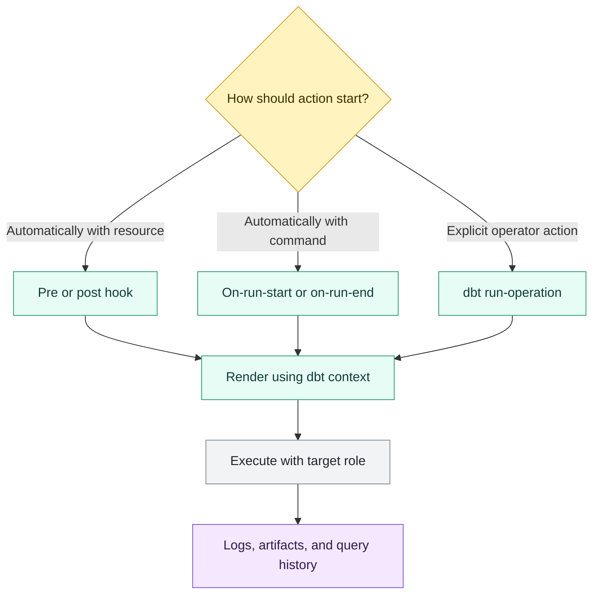

# Hooks and Operations

> [!abstract] Mental model
> Hooks attach side effects to dbt's lifecycle; operations are explicit operator-triggered macros. Both need stricter controls than ordinary model SQL.

## Executive Summary

- **What it is:** Hooks run SQL before or after dbt resources or commands; `dbt run-operation` invokes a macro explicitly against the configured target.
- **Why it matters:** They cover operational gaps such as platform-specific setup, audit events, maintenance, or controlled administrative tasks.
- **Mental model:** **A hook is automatic lifecycle plumbing; an operation is a version-controlled runbook action.**
- **Best used when:** dbt has no clearer built-in configuration, the side effect is narrow and idempotent, and ownership, privileges, failure behavior, and audit evidence are defined.
- **Avoid or reconsider when:** Built-in grants or configurations solve the requirement, the action is destructive, or a proper orchestrator, migration tool, or warehouse administration process should own it.

## What It Can Do

- Run `pre-hook` or `post-hook` SQL around a model, seed, or snapshot.
- Run `on-run-start` or `on-run-end` SQL around supported dbt commands.
- Call macros that return operational SQL.
- Use execution context such as `this`, and end-of-run context such as results or schemas where available.
- Invoke a reusable administrative macro with `dbt run-operation` and YAML arguments.
- Support controlled logging, maintenance, one-time setup, or data fixes when properly governed.

## What It Cannot Do

- Provide full workflow orchestration, scheduling, alerting, approvals, or compensation logic.
- Guarantee rollback across Snowflake statements; Snowflake is among adapters where dbt does not support hook transactions.
- Make a destructive command safe because it lives in source control.
- Replace built-in `grants` configuration where that feature covers the requirement cleanly.
- Automatically make retries idempotent or prevent duplicate audit records.
- Ensure an end hook means the run succeeded; status must be interpreted explicitly.

## Core Concepts

| Concept | Meaning | Why it matters |
|---|---|---|
| Resource hook | SQL before or after a model, seed, or snapshot | Couples a side effect to one resource lifecycle |
| Invocation hook | `on-run-start` or `on-run-end` SQL | Applies at command scope, not just model scope |
| Operation | Explicit macro invoked by `dbt run-operation` | Useful for controlled administrative procedures |
| `this` | Current resource relation | Helps target a resource hook without hardcoding names |
| `results` context | End-of-run information about executed nodes | Can support run summaries or audit records |
| Idempotency | Safe outcome if an action is repeated | Essential because jobs and operations are retried |
| Least privilege | Execution role has only required rights | Limits blast radius of operational SQL |
| Dry run | Preview of intended changes without applying them | Important for cleanup and bulk administration |

## How It Works (Simple Flow)

1. The team identifies an operational requirement not cleanly handled by a built-in dbt feature.
2. It chooses lifecycle automation for a hook or an explicit operator action for an operation.
3. SQL is wrapped in a small macro with explicit arguments, validation, logging, and preferably idempotent behavior.
4. The hook is configured at the narrowest useful scope, or the operation is invoked with a reviewed target and arguments.
5. dbt renders the Jinja and executes the statement using the active target credentials.
6. Failures affect the resource or invocation according to their execution point and adapter behavior.
7. Run artifacts, warehouse query history, and dedicated audit records provide evidence for review and recovery.

## Visuals



## Readable Snippets

### Narrow resource post-hook

```sql
{{ config(
    materialized='table',
    post_hook="alter table {{ this }} set tag governance.data_product = 'finance'"
) }}

select *
from {{ ref('int_daily_positions') }}
```

This example is Snowflake-specific and requires privileges on the target and tag. Prefer a built-in dbt configuration when one exists; use a hook for the actual platform gap.

### Invocation hooks should remain unsurprising

```yaml
# dbt_project.yml
on-run-start:
  - "{{ log('Starting dbt invocation ' ~ invocation_id, info=true) }}"

on-run-end:
  - "{{ record_run_result(results) }}"
```

Official dbt documentation lists `dbt compile` and `dbt docs generate` among commands that trigger on-run hooks. Do not assume these hooks run only for production builds.

### Explicit operation with a safe default

```sql
-- macros/cleanup_scratch_schema.sql

    
        drop schema if exists {{ adapter.quote(schema_name) }} cascade
    

    
        {{ log('DRY RUN: ' ~ statement, info=true) }}
    
        
    

```

```text
dbt run-operation cleanup_scratch_schema \
  --args '{schema_name: DBT_DEV_SHONN, dry_run: true}' \
  --target admin
```

For destructive operations, also validate an allowed schema prefix or allowlist; quoting alone does not establish authorization.

## Consultant Talking Points

- **Client question this answers:** "Where should dbt-related grants, audit events, cleanup, and maintenance actions live?"
- **Trade-offs to mention:** Hooks are convenient and contextual but implicit; operations are explicit and reusable but rely on operator discipline and target selection.
- **Risk or governance angle:** Apply least privilege, environment guards, dry runs, idempotency, approvals, and evidence retention. Operational macros should have named owners and runbooks.
- **Cost/performance angle:** Hooks add statements to every affected resource or invocation. Broad metadata loops and maintenance SQL can extend runtime and consume warehouse capacity.

For ordinary relation privileges, start with dbt's `grants` configuration. It communicates intent more clearly than a custom grant hook and participates in dbt's built-in behavior.

## Common Pitfalls

- Using post-hooks for grants that built-in `grants` configuration could manage.
- Forgetting hooks are cumulative across packages, project paths, and resource configuration, causing duplicate or surprising execution.
- Assuming `on-run-end` means every selected node succeeded.
- Writing non-idempotent inserts that duplicate audit rows on retries.
- Assuming Snowflake hook statements share a rollback boundary with model creation.
- Attaching side-effecting invocation hooks that also run during compile or documentation workflows.
- Running an operation against the wrong target, role, database, or schema.
- Building destructive operations without a dry run, allowlist, explicit arguments, and retained evidence.
- Using `run_query()` for side effects in broadly evaluated macros; current dbt compilation workflows can execute reached `run_query()` calls with a live connection.

## When to Recommend What (Decision Table)

| Situation | Recommend | Why | Watch-outs |
|---|---|---|---|
| Standard grants on built relations | dbt `grants` config | Declarative and purpose-built | Platform support and future-grant strategy |
| Platform action tied to one model build | Narrow pre/post hook | Has resource context and timing | Retry, failure, privilege, and transaction behavior |
| Lightweight run summary or invocation setup | On-run hook | Applies once per supported command | Command coverage and partial failures |
| Reusable manual administrative action | Version-controlled operation | Explicit invocation and arguments | Wrong target and excessive privileges |
| One-off ad hoc action | Approved warehouse process or version-supported inline operation | Avoids permanent abstraction | Evidence, review, and environment safety |
| Multi-step workflow with dependencies and compensation | External orchestrator or runbook | Better state and operational control | Keep dbt artifacts linked to workflow evidence |

## Related Topics

- [[02 dbt/07 Packages Macros and Advanced Reuse/Packages Macros and Advanced Reuse Overview|Packages Macros and Advanced Reuse Overview]]
- [[02 dbt/07 Packages Macros and Advanced Reuse/68 Macros as Reusable SQL Functions|Macros as Reusable SQL Functions]]
- [[02 dbt/05 Deployment CI CD and Operations/44 Scheduling and Orchestration|Scheduling and Orchestration]]
- [[02 dbt/05 Deployment CI CD and Operations/45 Artifacts Logs and Run Results|Artifacts, Logs, and Run Results]]
- [[02 dbt/05 Deployment CI CD and Operations/49 Observability with dbt and Snowflake Metadata|Observability with dbt and Snowflake Metadata]]
- [[01 Snowflake/03 Security and Governance/18 Object Tagging|Object Tagging]]

## Related Decision Notes

- [[80 Comparisons and Decision Notes/Decision Notes/dbt/Decisions - Choosing a dbt Scheduling and Orchestration Pattern|Decisions - Choosing a dbt Scheduling and Orchestration Pattern]]
- [[80 Comparisons and Decision Notes/Decision Notes/dbt/Decisions - Designing dbt Observability and Incident Evidence|Decisions - Designing dbt Observability and Incident Evidence]]
- [[80 Comparisons and Decision Notes/Comparisons/dbt/Comparison - Hooks vs Models Tests and Operations|Comparison - Hooks vs Models Tests and Operations]]

## Questions

- Why is this not a built-in dbt config or external operational workflow?
- Which dbt commands trigger the hook?
- Can the action be repeated safely after partial failure?
- Which target and role execute it, and what is the blast radius?
- How will an operator preview, approve, audit, and recover the change?
- What happens when the model succeeds but its post-hook fails, or vice versa?

## Sources To Revisit

- [dbt Developer Hub - on-run-start and on-run-end](https://docs.getdbt.com/reference/project-configs/on-run-start-on-run-end)
- [dbt Developer Hub - pre-hook and post-hook](https://docs.getdbt.com/reference/resource-configs/pre-hook-post-hook)
- [dbt Developer Hub - run-operation command](https://docs.getdbt.com/reference/commands/run-operation)
- [dbt Developer Hub - Grants configuration](https://docs.getdbt.com/reference/resource-configs/grants)
- [dbt Developer Hub - run_query](https://docs.getdbt.com/reference/dbt-jinja-functions/run_query)
