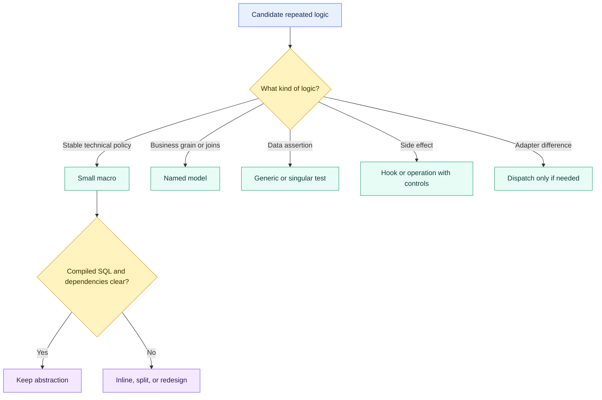

# Advanced Macro Boundaries

> [!abstract] Mental model
> A macro is healthy when it removes repetition without removing evidence: callers, dependencies, compiled SQL, and side effects should stay obvious.

## Executive Summary

- **What it is:** Macro boundaries are design rules for deciding which logic belongs in reusable Jinja and which should remain explicit SQL, a model, a test, or an operational workflow.
- **Why it matters:** Excess abstraction can make a dbt project shorter while making lineage, review, debugging, performance, and change impact much harder.
- **Mental model:** **Optimize for readable compiled SQL and explicit dependencies, not the fewest lines in the model file.**
- **Best used when:** A narrow macro implements stable technical policy with clear inputs, predictable output, representative tests, and an accountable owner.
- **Avoid or reconsider when:** The macro behaves like a mini-framework, hides business grain or relations, queries the warehouse unexpectedly, or has a larger regression surface than the duplication it removes.

## What It Can Do

- Establish consistent project conventions for macro size, naming, ownership, and documentation.
- Separate reusable technical policy from business-specific transformations.
- Keep relation dependencies visible at model call sites.
- Require representative compiled-SQL review for shared macros.
- Limit side effects and warehouse introspection to explicit operational interfaces.
- Make abstraction decisions based on maintenance risk rather than DRYness alone.

## What It Cannot Do

- Define one universal line-count threshold for a good macro.
- Eliminate judgment about readability and business meaning.
- Make hidden lineage visible automatically when references are built dynamically.
- Fully unit-test arbitrary generated SQL without representative callers and warehouse behavior.
- Prevent a shared macro change from affecting many nodes.
- Turn every warehouse-specific feature into a clean portable abstraction.

## Core Concepts

| Concept | Meaning | Why it matters |
|---|---|---|
| Abstraction boundary | Point where repeated details are hidden behind an interface | A good boundary preserves the concepts callers need to reason about |
| Technical policy | Stable convention such as quoting, safe division, or standardized DDL | Strong macro candidate |
| Business transformation | Grain, joins, filters, allocations, and semantic rules | Usually clearer as named model SQL |
| Compiled readability | How easily reviewers understand generated SQL | Primary quality test for SQL-generating macros |
| Dependency visibility | Whether upstream relations are clear to dbt and humans | Essential for lineage, selection, CI, and impact analysis |
| Side effect | Warehouse change beyond returning compiled model SQL | Needs explicit lifecycle, privilege, and audit controls |
| Fan-out | Number and importance of macro callers | Determines regression and release risk |
| Introspection | Querying warehouse metadata while generating code | Powerful but can add connection, latency, determinism, and side-effect concerns |

## How It Works (Simple Flow)

1. Identify repeated logic and classify it as technical policy, business transformation, platform behavior, test, or operation.
2. Keep business grain, core relations, and major decisions explicit in named models.
3. If a macro is justified, define one narrow responsibility and a small documented interface.
4. Make dependencies explicit through visible `ref()` or `source()` calls and avoid dynamic relation construction.
5. Compile representative callers and review the expanded SQL for readability, correctness, and cost.
6. Test edge cases and every supported adapter or execution context.
7. Assess fan-out before changing the macro and monitor results after release.
8. Split, inline, or replace the abstraction when it no longer reduces total cognitive load.

## Visuals



## Readable Snippets

### Healthy: narrow technical policy

```sql

    ({{ numerator }}) / nullif(({{ denominator }}), 0)

```

```sql
select
    desk_id,
    {{ safe_divide('loss_amount', 'exposure_amount') }} as loss_rate
from {{ ref('int_desk_exposure') }}
```

The relation, grain, and business output remain visible. The macro removes only a stable defensive expression.

### Unhealthy: a model hidden behind switches

```sql
{{ build_finance_model(
    mode='regulatory',
    include_adjustments=true,
    join_customer=true,
    use_latest_rates=false,
    output_grain='desk_day'
) }}
```

This call hides relations, join behavior, grain, and key regulatory choices. Prefer explicit CTEs and named intermediate models, with small macros only for genuinely repeated expressions.

### Keep dependencies at the point of use

```sql



{{ convert_positions_to_reporting_currency(
    positions_relation=positions,
    rates_relation=rates
) }}
```

Passing relation objects makes the caller's dependencies visible. A macro that constructs model names from strings or conditionally hides `ref()` calls is harder for dbt parsing and human review.

### Guard side effects by command, not only `execute`

Current dbt documentation warns that reached `run_query()` calls can run during compilation workflows with a live connection, and `execute` may be true there. Side-effecting SQL belongs in an explicit hook or operation, or needs deliberate command scoping—not merely an `` wrapper.

## Consultant Talking Points

- **Client question this answers:** "How much Jinja and macro abstraction is too much in a governed dbt project?"
- **Trade-offs to mention:** Duplication creates inconsistent copies; abstraction creates indirection and shared blast radius. Choose the design with lower total maintenance and review cost.
- **Risk or governance angle:** High-fan-out macros need owners, change review, representative regression coverage, and explicit side-effect rules. Regulatory calculations should not disappear into opaque macro frameworks.
- **Cost/performance angle:** Macro source length does not predict warehouse cost. Review the generated SQL, query plans, repeated metadata queries, and how many nodes receive the expansion.

Useful boundary test: **could a new team member explain the model's grain, upstream relations, and major business rules from the model file without opening five macros?** If not, move some logic back into explicit models.

## Common Pitfalls

- Treating DRY as the primary goal and abstracting every repeated line.
- Hiding `ref()` and `source()` calls behind dynamic names or deep macro layers.
- Building generic model generators whose flags encode unrelated business behaviors.
- Reviewing only the macro definition rather than representative compiled callers.
- Changing a high-fan-out macro without impact analysis or broad CI selection.
- Mixing SQL generation, warehouse introspection, and side effects in one macro.
- Using `run_query()` under `if execute` and assuming it cannot run during compile or docs generation.
- Creating adapter dispatch when only one warehouse is supported.
- Returning different column shapes or data types depending on undocumented arguments.
- Keeping a clever abstraction after its original reuse case has disappeared.

## When to Recommend What (Decision Table)

| Situation | Recommend | Why | Watch-outs |
|---|---|---|---|
| Stable expression repeated broadly | Small documented macro | Consistent technical policy | Compile representative callers |
| Core business joins, grain, or allocation | Explicit model SQL | Preserves lineage and reviewability | Accept some repetition |
| Repeated multi-step transformation with useful output | Named intermediate model | Testable DAG node and reusable relation | Materialization and access choices |
| Warehouse-specific implementation in a multi-adapter package | Dispatch | Isolates real syntax differences | Semantic parity and test matrix |
| Metadata-driven generation | Narrow introspective macro | Useful for controlled code generation | Connection, determinism, latency, and command scope |
| Destructive or privileged behavior | Explicit operation or external process | Makes execution intentional | Dry run, allowlist, approval, and evidence |
| Macro requires many flags or nested calls | Split, inline, or redesign | Restores coherent interfaces | Assess all callers before change |

## Related Topics

- [[02 dbt/07 Packages Macros and Advanced Reuse/Packages Macros and Advanced Reuse Overview|Packages Macros and Advanced Reuse Overview]]
- [[02 dbt/07 Packages Macros and Advanced Reuse/67 Jinja Fundamentals|Jinja Fundamentals]]
- [[02 dbt/07 Packages Macros and Advanced Reuse/68 Macros as Reusable SQL Functions|Macros as Reusable SQL Functions]]
- [[02 dbt/07 Packages Macros and Advanced Reuse/70 Adapter Dispatch|Adapter Dispatch]]
- [[02 dbt/07 Packages Macros and Advanced Reuse/71 Hooks and Operations|Hooks and Operations]]
- [[02 dbt/01 Core Concepts and Project Structure/05 Models ref source and the DAG|Models, ref, source, and the DAG]]

## Related Decision Notes

- [[80 Comparisons and Decision Notes/Decision Notes/dbt/Decisions - Choosing the Right dbt Modeling Layer|Decisions - Choosing the Right dbt Modeling Layer]]
- [[80 Comparisons and Decision Notes/Decision Notes/dbt/Decisions - When to Abstract dbt SQL into Macros|Decisions - When to Abstract dbt SQL into Macros]]

## Questions

- Does the abstraction hide technical repetition or important business meaning?
- Are upstream relations and model grain obvious at the call site?
- What does representative compiled SQL look like?
- How many important nodes can one macro change affect?
- Does the macro query or mutate the warehouse, and during which commands?
- Would a model, test, dispatch implementation, or operation provide a clearer boundary?
- Who owns the interface and its regression coverage?

## Sources To Revisit

- [dbt Developer Hub - Jinja and macros](https://docs.getdbt.com/docs/build/jinja-macros)
- [dbt Developer Hub - About dispatch](https://docs.getdbt.com/reference/dbt-jinja-functions/dispatch)
- [dbt Developer Hub - run_query](https://docs.getdbt.com/reference/dbt-jinja-functions/run_query)
- [dbt Developer Hub - ref](https://docs.getdbt.com/reference/dbt-jinja-functions/ref)
- [dbt Developer Hub - Macro properties](https://docs.getdbt.com/reference/resource-properties/macros)
