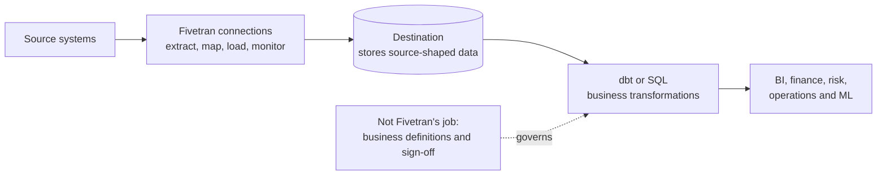

# What Fivetran Is and Is Not

> [!abstract] Mental model
> Fivetran is the managed data-movement layer: it copies source-shaped data into a destination and keeps it synchronized, while the destination stores it and downstream tools give it business meaning.

## Executive Summary

- **What it is:** A managed ELT platform whose connectors extract data from applications, databases, files, events, and other sources and load it into supported warehouses, databases, and lakes.
- **Why it matters:** It replaces much of the repetitive engineering required to build and maintain source-specific ingestion pipelines.
- **Mental model:** Fivetran is a managed conveyor belt between a source and a destination, not the warehouse or the analytics factory built on top.
- **Recommend when:** A supported connector meets the required coverage, latency, security, and operational needs, and the client values low maintenance over detailed pipeline control.
- **Reconsider when:** The source is unsupported, in-flight custom processing is essential, true streaming latency is mandatory, or managed-platform boundaries conflict with security or commercial requirements.

## What It Can Do

- Create managed pipelines called connections from supported sources to destinations.
- Perform historical loads and then maintain data through incremental or source-specific sync strategies.
- Map source types and schemas into destination-compatible structures and propagate supported schema changes.
- Schedule, monitor, retry, and expose operational information about syncs.
- Orchestrate optional post-load transformations and reverse-ETL Activations as adjacent capabilities.

## What It Cannot Do

- Store the analytical data as a warehouse; the configured destination owns storage and query execution.
- Define correct business metrics, reconcile financial balances, or validate the business meaning of replicated fields.
- Provide arbitrary user-defined transformations before loading, apart from supported controls such as row filtering.
- Guarantee that every source feature, historical record, delete, or schema change is available; connector behavior is constrained by the source and the individual connector.
- Replace enterprise orchestration, governance, incident ownership, or downstream data-quality controls by itself.

## Core Concepts

| Concept | Plain-language meaning | Why it matters |
|---|---|---|
| Connector | Fivetran's reusable integration for a source type, such as Salesforce or PostgreSQL | Catalog availability is only the start; supported objects and behaviors still need assessment |
| Connection | One configured pipeline from a particular source instance to a destination | Configuration, status, usage, and ownership are managed per connection |
| Destination | The warehouse, database, or lake where replicated data is loaded | Storage, access control, compute, and downstream use remain destination responsibilities |
| ELT | Extract and load first, then transform in the destination | Keeps source-shaped data available and uses destination compute for modeling |
| Managed service | Fivetran operates connector code, source API adaptations, scheduling, and retries | Reduces engineering effort but introduces vendor, cost, and control-plane dependencies |

## How It Works (Simple Flow)

1. A team selects a connector that supports its source and configures authorized source access.
2. The team selects a destination and grants Fivetran a scoped destination identity.
3. Fivetran discovers the selected source structure and runs an initial historical sync.
4. It maps supported source types and objects into destination tables and columns.
5. Scheduled incremental syncs load new or changed data using connector-specific methods.
6. Downstream tools such as dbt transform, test, document, and publish business-ready datasets.
7. Operators monitor freshness, integrity, usage, failures, and schema changes across the complete pipeline.

## Visuals

## Readable Snippets

A simple responsibility test helps prevent product overlap:

| Question | Primary owner |
|---|---|
| How do Salesforce records reach Snowflake? | Fivetran connection |
| Where are the replicated rows stored and secured? | Snowflake |
| How is approved net revenue calculated and tested? | dbt plus business ownership |
| How is a trusted customer segment sent back to a CRM? | Fivetran Activations or another reverse-ETL tool |

## Consultant Talking Points

- **Client question this answers:** "If we buy Fivetran, which parts of our data platform does it replace?"
- **Trade-offs to mention:** Managed connectors reduce build and maintenance work, but offer less control than custom pipelines and require accepting connector-specific models and vendor operations.
- **Risk or governance angle:** Least-privilege identities, approved data scope, regional processing, auditability, schema-change policy, and downstream validation remain client responsibilities.
- **Cost or operational angle:** Fivetran usage, destination compute/storage, source API or database impact, and downstream transformation cost all contribute to total cost.

## Common Pitfalls

- Treating catalog presence as proof of fit can expose missing endpoints, history, deletes, or required fields only after implementation.
- Assuming a successful sync proves business correctness can allow stale, incomplete, or semantically wrong data into reporting.
- Putting business logic into ingestion expectations blurs ownership and makes changes harder to review, test, and govern.
- Granting broad source or destination privileges increases the blast radius of credential misuse or configuration error.
- Comparing only subscription price ignores engineering savings as well as destination, networking, and operating costs.

## When to Recommend What (Decision Table)

| Situation | Recommend | Why | Watch-outs |
|---|---|---|---|
| Common SaaS or database source with standard analytical needs | Fivetran native connection | Fast setup and managed maintenance | Verify exact objects, history, deletes, latency, and plan requirements |
| Unsupported private API with stable requirements | Connector SDK or a custom pipeline | Allows source-specific extraction logic | Customer owns connector code, tests, schema behavior, and support |
| Complex transformation after data lands | Fivetran plus dbt or destination-native SQL | Preserves clear ingestion and modeling boundaries | Coordinate scheduling, freshness, tests, and failure ownership |
| Sub-minute event processing or transactional integration | Streaming or application-integration platform | Better fit for event-driven and operational semantics | More engineering and operating complexity |
| One-time production migration | Dedicated migration tooling | Fivetran database docs explicitly position connections for ongoing replication | Plan validation, cutover, and rollback separately |

## Related Topics

- [[03 Fivetran/01 Foundations and Platform Mental Model/Foundations and Platform Mental Model Overview|Foundations and Platform Mental Model Overview]]
- [[03 Fivetran/01 Foundations and Platform Mental Model/02 Platform Anatomy and End-to-End Data Flow|Platform Anatomy and End-to-End Data Flow]]
- [[03 Fivetran/01 Foundations and Platform Mental Model/05 When to Recommend Fivetran|When to Recommend Fivetran]]
- [[03 Fivetran/04 Fivetran with Snowflake and dbt/19 Fivetran to Snowflake to dbt Ownership Boundaries|Fivetran to Snowflake to dbt Ownership Boundaries]]

## Related Decision Notes

- [[80 Comparisons and Decision Notes/Comparisons/Fivetran/Comparison - Fivetran vs Custom Ingestion|Fivetran vs Custom Ingestion]]

## Questions

- **Explain:** Which responsibilities belong to Fivetran, the destination, and dbt?
- **Apply:** Would you recommend Fivetran for five standard SaaS sources feeding Snowflake, and what would you verify first?
- **Challenge:** Which latency, coverage, security, or customization requirement would make a managed connection a poor fit?

## Sources To Revisit

- [Fivetran Docs: Core Concepts](https://fivetran.com/docs/core-concepts)
- [Fivetran Docs: Connectors](https://fivetran.com/docs/connectors)
- [Fivetran Docs: Transformations](https://fivetran.com/docs/transformations)
- [Fivetran Docs: Activations Overview](https://fivetran.com/docs/activations/overview)
