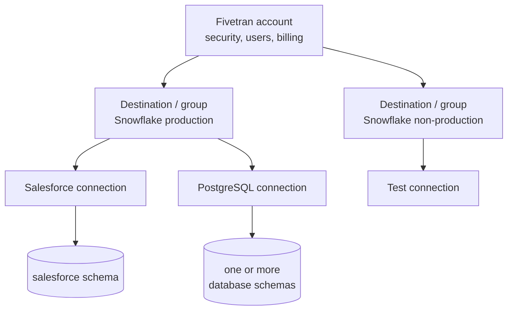

# Platform Anatomy and End-to-End Data Flow

> [!abstract] Mental model
> The account governs access; a destination is the landing environment; each connection is one managed source-to-destination pipeline that creates one or more destination schemas.

## Executive Summary

- **What it is:** The hierarchy and data path linking a Fivetran account, destination or group, configured connections, and destination schemas.
- **Why it matters:** Clear resource boundaries make access, ownership, environment separation, cost attribution, and troubleshooting easier.
- **Mental model:** **Account → destination/group → connections → schemas/tables**, while data itself flows **source → connection → destination**.
- **Recommend when:** Designing account structure, separating production from non-production, assigning teams, or deciding where raw schemas should land.
- **Reconsider when:** A proposed structure mixes environments, duplicates the same source unnecessarily, or assumes one application connection can combine unrelated source accounts or APIs into one schema.

## What It Can Do

- Organize multiple destinations and connections in one Fivetran account.
- Scope users and teams at account, destination, and connection levels through RBAC.
- Associate connections with a destination and surface their status, schema, and usage.
- Create destination schemas and tables based on connector-specific source mappings.
- Support several connections using the same connector type for different source instances or destinations.

## What It Cannot Do

- Merge unrelated application APIs into one connection or one application schema.
- Replace destination-side RBAC, database design, environment controls, or naming governance.
- Guarantee one schema per connection for every source; database connections can create multiple schemas.
- Rename every object freely after sync begins; some naming choices and connection schema names are constrained.

## Core Concepts

| Concept | Plain-language meaning | Why it matters |
|---|---|---|
| Account | Top administrative boundary for users, billing, security, and resources | Sets the broad governance and commercial boundary |
| Group | API-level container mapped one-to-one to a destination | Connections and related resources are created within this scope |
| Destination | The target data platform linked to a group | Common environment, networking, credentials, and destination policies are managed here |
| Connector type | The reusable Fivetran integration, such as `salesforce` | Defines supported source behavior and required configuration |
| Connection | A configured instance of a connector type | Has its own credentials, schedule, schema selection, status, and usage |
| Destination schema | The objects created from the selected source structures | Becomes the raw/source-aligned contract for downstream consumers |

## How It Works (Simple Flow)

1. An account administrator establishes account-wide security, billing, and access settings.
2. A destination/group is created for a target environment such as production Snowflake.
3. Fivetran validates destination connectivity and its scoped loading identity.
4. A connection is configured inside that destination/group for a specific source instance.
5. The connector discovers selectable source objects and the team approves the ingestion scope.
6. Fivetran creates the mapped schema or schemas and loads data into the destination.
7. Destination controls and downstream models govern how the landed data is accessed and used.

## Visuals



## Readable Snippets

A practical naming and ownership inventory:

```yaml
account: bank-analytics
destination_group: snowflake-prod
connection: crm-emea
connector_type: salesforce
destination_schema: crm_emea
owners:
  source: sales-operations
  pipeline: data-platform
  downstream-models: analytics-engineering
```

These names are illustrative; connector-specific API identifiers and naming rules must be checked before provisioning.

## Consultant Talking Points

- **Client question this answers:** "How should we organize Fivetran across teams and environments?"
- **Trade-offs to mention:** Centralized destinations simplify governance and reuse; stronger separation can improve isolation but may duplicate connections, identities, and usage.
- **Risk or governance angle:** Fivetran RBAC does not replace destination RBAC. Map owners and least-privilege access at both control and data planes.
- **Cost or operational angle:** Replicating the same source through several connections can count usage separately and multiplies monitoring and incident work.

## Common Pitfalls

- Treating connector and connection as synonyms causes confusion between a product capability and a configured production pipeline.
- Mirroring one source into multiple destinations without a business reason can duplicate MAR and reconciliation effort.
- Mixing development and production under unclear destination boundaries can expose sensitive data and make change ownership ambiguous.
- Assuming every connection produces exactly one schema can break naming and access plans for database sources that map multiple schemas.
- Leaving ownership only in people's heads delays response when credentials, schemas, or source behavior change.

## When to Recommend What (Decision Table)

| Situation | Recommend | Why | Watch-outs |
|---|---|---|---|
| One governed production warehouse serving several sources | One production destination/group with scoped connections | Centralizes destination settings and oversight | Use connection-level access and clear schema ownership |
| Production and non-production must be isolated | Separate destinations/groups | Clear credentials, data, roles, and operational boundaries | Duplicated connections may increase usage and maintenance |
| Same source data needed by many consumers | Land once and share through destination models | Reduces duplicate ingestion and establishes one raw copy | Enforce downstream access and workload isolation |
| Different subsidiaries own separate source accounts | Separate connections with consistent naming | Preserves credential, schedule, and usage boundaries | Align schemas and downstream union logic |
| Highly autonomous domains with distinct compliance boundaries | Separate destinations or accounts after governance review | Stronger administrative and commercial isolation | More fragmented monitoring, billing, and standards |

## Related Topics

- [[03 Fivetran/01 Foundations and Platform Mental Model/Foundations and Platform Mental Model Overview|Foundations and Platform Mental Model Overview]]
- [[03 Fivetran/01 Foundations and Platform Mental Model/03 The Connection Lifecycle|The Connection Lifecycle]]
- [[03 Fivetran/04 Fivetran with Snowflake and dbt/17 Setting Up Snowflake as a Destination|Setting Up Snowflake as a Destination]]
- [[03 Fivetran/05 Security Governance and Production Operations/24 Credentials RBAC SSO SCIM and Service Access|Credentials, RBAC, SSO, SCIM, and Service Access]]

## Related Decision Notes

- [[80 Comparisons and Decision Notes/Decision Notes/Fivetran/Decisions - Designing a Fivetran Production Operating Model|Designing a Fivetran Production Operating Model]]

## Questions

- **Explain:** How do accounts, destination/groups, connections, connector types, and schemas differ?
- **Apply:** How would you separate production and non-production connections for one Snowflake client?
- **Challenge:** When could a second destination justify duplicated connections and usage?

## Sources To Revisit

- [Fivetran Docs: REST API Getting Started](https://fivetran.com/docs/rest-api/getting-started)
- [Fivetran Docs: Destinations](https://fivetran.com/docs/getting-started/fivetran-dashboard/destination)
- [Fivetran Docs: Connections](https://fivetran.com/docs/getting-started/fivetran-dashboard/connectors)
- [Fivetran Docs: Connection Schemas](https://fivetran.com/docs/using-fivetran/fivetran-dashboard/connectors/schema)
