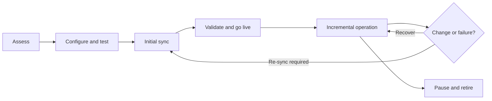

# The Connection Lifecycle

> [!abstract] Mental model
> A connection is a production service with a beginning, steady state, changes, incidents, and retirement—not a one-time setup wizard.

## Executive Summary

- **What it is:** The operating lifecycle from connector assessment and setup through initial sync, incremental operation, maintenance, recovery, and controlled decommissioning.
- **Why it matters:** Most risk appears after setup: expired credentials, source changes, delayed syncs, lost logs, re-syncs, and unmanaged retirement.
- **Mental model:** **Assess → authorize → test → backfill → operate → change/recover → retire.**
- **Recommend when:** Assigning production ownership, defining acceptance criteria, or planning a new connection beyond the technical setup form.
- **Reconsider when:** No team owns source permissions, destination readiness, freshness monitoring, incident response, usage review, or downstream decommissioning.

## What It Can Do

- Test source and destination prerequisites before data movement begins.
- Run a mandatory initial historical sync and transition to incremental operation.
- Track connection status, sync history, alerts, schema, and usage in the dashboard.
- Pause, resume, retry, and re-sync connections or supported tables when required.
- Retain progress with connector-specific cursors and checkpoints so many interruptions can resume safely.

## What It Cannot Do

- Guarantee an initial-sync completion date for every source and data volume.
- Recover changes that the source no longer exposes, such as expired database logs or API history.
- Know whether downstream users are ready for schema changes, re-syncs, or connection deletion.
- Make source credential rotation, incident escalation, data reconciliation, and retirement decisions for the client.

## Core Concepts

| Concept | Plain-language meaning | Why it matters |
|---|---|---|
| Setup tests | Connector-specific checks of credentials, permissions, network, and source settings | Catch many blockers before the initial sync |
| Initial sync | First historical extraction and load | Establishes the destination baseline before incremental operation |
| Incremental sync | Scheduled loading of new or changed data | Normal steady-state service |
| Checkpoint/cursor | Retained progress showing what was safely processed | Allows recovery without blindly starting over |
| Re-sync | A new historical reconstruction of a connection or table | Can repair integrity but affects availability, destination workload, and downstream consumers |
| Retirement | Controlled pause, validation, dependency removal, and deletion | Prevents orphaned access, cost, and unexplained data loss |

## How It Works (Simple Flow)

1. Assess connector coverage, source behavior, required history, latency, security, and cost.
2. Create scoped source and destination identities, configure connectivity, select data, and pass setup tests.
3. Start the initial sync and monitor duration, source impact, destination loading, and prioritized data behavior.
4. Validate counts, key fields, deletes, timestamps, and downstream readiness before declaring go-live.
5. Operate scheduled incremental syncs with alerts, freshness checks, usage review, and credential ownership.
6. Manage source/API/schema changes and use automatic recovery or a controlled re-sync only when justified.
7. Retire by confirming consumers and retention needs, pausing the connection, revoking credentials, and deleting only after approval.

## Visuals



## Readable Snippets

A concise go-live gate:

```text
[ ] Connector coverage and source limits reviewed
[ ] Least-privilege credentials and network path tested
[ ] Selected tables/columns approved by data owner
[ ] Initial sync completed and reconciled
[ ] Freshness, failure, and cost monitoring assigned
[ ] Re-sync and escalation runbook documented
[ ] Downstream owner accepts the raw schema contract
```

## Consultant Talking Points

- **Client question this answers:** "Who looks after a Fivetran connection once the setup test passes?"
- **Trade-offs to mention:** Automation removes routine pipeline work but not service ownership; tighter controls improve safety while adding approvals and lead time.
- **Risk or governance angle:** Define source owner, platform owner, data owner, and downstream owner, including credential rotation and re-sync approval.
- **Cost or operational angle:** Initial syncs, backlogs, re-syncs, and schema changes can drive source load and destination compute even when some historical MAR is free.

## Common Pitfalls

- Declaring go-live after the setup test, without reconciling the initial data, can establish an incomplete baseline.
- Restricting long initial syncs to short operating windows can repeatedly interrupt progress and delay delivery.
- Pausing a connection without checking source log or API retention can make normal catch-up impossible and force a re-sync.
- Triggering a re-sync as the first troubleshooting step can create unnecessary load, disruption, and downstream confusion.
- Deleting a connection before documenting consumers and retention requirements can remove recovery options and leave stale reports unexplained.

## When to Recommend What (Decision Table)

| Situation | Recommend | Why | Watch-outs |
|---|---|---|---|
| New production source | Formal lifecycle with acceptance and named owners | Makes operational responsibilities explicit | Do not skip reconciliation because the connector is managed |
| Short destination outage with source history retained | Let the connection resume from progress state | Usually least disruptive | Verify source API/log retention and backlog latency |
| Confirmed destination integrity defect | Investigate scope, then targeted table or connection re-sync | Reconstructs affected historical data | Coordinate downstream access and destination workload |
| Planned long pause | Check retention and document restart plan first | Prevents lost incremental history | First resumed sync may be large; monitor MAR and compute |
| Source is being retired | Pause, validate dependencies and retention, then delete | Controlled decommissioning preserves evidence | Revoke both source and destination credentials after approval |

## Related Topics

- [[03 Fivetran/01 Foundations and Platform Mental Model/Foundations and Platform Mental Model Overview|Foundations and Platform Mental Model Overview]]
- [[03 Fivetran/02 Connectors and Sync Behavior/10 Initial Incremental Re-import and Re-sync Strategies|Initial, Incremental, Re-import, and Re-sync Strategies]]
- [[03 Fivetran/02 Connectors and Sync Behavior/11 Scheduling Latency Checkpoints and Recovery|Scheduling, Latency, Checkpoints, and Recovery]]
- [[03 Fivetran/05 Security Governance and Production Operations/27 Incident Response Re-syncs and Recovery Runbooks|Incident Response, Re-syncs, and Recovery Runbooks]]

## Related Decision Notes

- [[80 Comparisons and Decision Notes/Decision Notes/Fivetran/Decisions - Designing a Fivetran Production Operating Model|Designing a Fivetran Production Operating Model]]

## Questions

- **Explain:** Why is a connection an operated service rather than a completed setup task?
- **Apply:** Which acceptance checks would you require before a finance source goes live?
- **Challenge:** What source-retention condition could turn a routine resume into a full re-sync?

## Sources To Revisit

- [Fivetran Docs: Quickstart](https://fivetran.com/docs/getting-started/quickstart)
- [Fivetran Docs: Connections](https://fivetran.com/docs/getting-started/fivetran-dashboard/connectors)
- [Fivetran Docs: Sync Overview](https://fivetran.com/docs/core-concepts/syncoverview)
- [Fivetran Docs: Database Connectors](https://fivetran.com/docs/connectors/databases)
