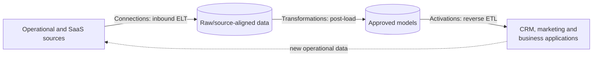

# Connections, Transformations, and Activations

> [!abstract] Mental model
> Connections move data into the analytical platform, Transformations reshape it there, and Activations move approved data back into operational tools.

## Executive Summary

- **What it is:** Three related Fivetran product surfaces for inbound ELT, post-load transformation orchestration, and outbound reverse ETL.
- **Why it matters:** Their directions, trust boundaries, pricing units, and owners differ; treating them as one pipeline hides important controls.
- **Mental model:** **Connections bring in → Transformations refine → Activations send out.**
- **Recommend when:** A client wants managed coordination across ingestion, in-destination modeling, and operational delivery with clear ownership at each boundary.
- **Reconsider when:** Existing dbt/orchestration or reverse-ETL platforms already meet requirements, or sending warehouse data back to business systems creates unacceptable operational risk.

## What It Can Do

- Use connections to replicate source data into supported warehouses, databases, and lakes.
- Run pre-built or custom post-load transformations in the destination after connection syncs or on schedules.
- Integrate transformation workflows with Fivetran-hosted dbt Core and supported third-party tools.
- Use Activations to sync selected warehouse or lake data into operational SaaS destinations.
- Coordinate an end-to-end flow while preserving source-shaped and transformed data in the destination.

## What It Cannot Do

- Make ingestion data business-ready without modeling, tests, documentation, and data-owner agreement.
- Perform arbitrary transformations inside a normal connection before load.
- Make outbound operational writes risk-free; Activations can change customer-facing or regulated systems.
- Guarantee that one Fivetran control plane is preferable to an existing enterprise orchestrator or dbt platform.

## Core Concepts

| Concept | Plain-language meaning | Why it matters |
|---|---|---|
| Connection | Managed inbound pipeline from a source to a destination | Establishes the raw/source-aligned data layer |
| Transformation | Post-load logic executed in the destination | Converts landed data into useful datasets without hiding the raw copy |
| Quickstart data model | Pre-built model added from the Fivetran dashboard | Speeds common use cases but still needs fit, version, and ownership review |
| Activation | Managed reverse-ETL pipeline from an analytical store to a business application | Makes governed data operational but creates write-back risk |
| Dataset/segment | Selected rows and columns exposed to an activation | Defines the approved outbound data contract |
| Orchestration | Rules that start work after syncs or on a schedule | Determines end-to-end freshness and failure behavior |

## How It Works (Simple Flow)

1. Connections extract and load source-shaped data into the analytical destination.
2. Operators confirm that the inbound sync completed and the expected data is available.
3. Transformation jobs run in the destination, using destination compute to build tested, business-ready datasets.
4. Data owners approve the modeled datasets and define which fields are safe for operational use.
5. Activations read an approved dataset or segment from the warehouse or lake.
6. Each activation maps records and fields to a target business application and incrementally updates it.
7. Teams monitor inbound freshness, model quality, and outbound effects as separate service levels.

## Visuals

## Readable Snippets

An ownership contract for one customer-data flow:

| Stage | Example output | Owner and control |
|---|---|---|
| Connection | `raw_salesforce.contact` | Platform team; source coverage and sync freshness |
| Transformation | `customer_360.eligible_customer` | Analytics engineering + business owner; tests and approval |
| Activation | CRM field `analytics_segment` | CRM owner; mapping, write policy, rate limits, rollback |

## Consultant Talking Points

- **Client question this answers:** "Can Fivetran run the full loop from source ingestion to operational action?"
- **Trade-offs to mention:** One vendor can simplify integration, but existing dbt and orchestration standards may offer richer workflow, portability, or team familiarity.
- **Risk or governance angle:** Inbound replication is generally read-oriented; Activations write into operational systems and require stronger approvals, field ownership, and rollback planning.
- **Cost or operational angle:** Connections use MAR, Transformations use monthly model runs, Activations have separate MAR usage, and destination compute still applies.

## Common Pitfalls

- Calling all three surfaces “connectors” obscures direction, privileges, pricing, and incident ownership.
- Triggering transformations only on time schedules can produce stale models when an upstream sync runs late.
- Activating untested raw tables can propagate duplicates, deleted records, or wrong business definitions into customer-facing tools.
- Letting an Activation overwrite system-owned fields can create feedback loops or operational data loss.
- Adopting Fivetran-hosted transformations without comparing the existing dbt control plane can duplicate schedules and support responsibilities.

## When to Recommend What (Decision Table)

| Situation | Recommend | Why | Watch-outs |
|---|---|---|---|
| Need managed inbound replication only | Connections plus existing downstream stack | Keeps scope narrow and respects existing modeling ownership | Establish sync-to-model orchestration |
| Small team wants common connector models quickly | Evaluate Quickstart data models | Faster time to a usable analytical shape | Validate assumptions, package versions, tests, and customization needs |
| Mature dbt platform already operates production models | Integrate Fivetran sync completion with existing dbt jobs | Preserves one transformation control plane | Avoid duplicate jobs in Fivetran and dbt |
| Approved customer segments must reach a CRM | Activations over governed models | Managed reverse ETL avoids bespoke API jobs | Limit fields, service-account rights, and write behavior |
| Operational system needs transactional, bidirectional logic | Application integration or workflow platform | Better fit for business-process semantics | More engineering; do not treat reverse ETL as transaction orchestration |

## Related Topics

- [[03 Fivetran/01 Foundations and Platform Mental Model/Foundations and Platform Mental Model Overview|Foundations and Platform Mental Model Overview]]
- [[03 Fivetran/04 Fivetran with Snowflake and dbt/19 Fivetran to Snowflake to dbt Ownership Boundaries|Fivetran to Snowflake to dbt Ownership Boundaries]]
- [[03 Fivetran/04 Fivetran with Snowflake and dbt/20 Transformation and Orchestration Options|Transformation and Orchestration Options]]
- [[02 dbt/08 dbt on Snowflake and Finance Patterns/81 Fivetran to Snowflake to dbt Flow|Fivetran to Snowflake to dbt Flow]]

## Related Decision Notes

- No related decision note yet.

## Questions

- **Explain:** What direction does data move in for Connections, Transformations, and Activations?
- **Apply:** Where would you put ownership and validation in a warehouse-to-CRM activation?
- **Challenge:** When should an existing dbt or integration control plane remain authoritative?

## Sources To Revisit

- [Fivetran Docs: Core Concepts](https://fivetran.com/docs/core-concepts)
- [Fivetran Docs: Transformations](https://fivetran.com/docs/transformations)
- [Fivetran Docs: Activations Overview](https://fivetran.com/docs/activations/overview)
- [Fivetran Docs: Usage-Based Pricing](https://fivetran.com/docs/getting-started/pricing)
