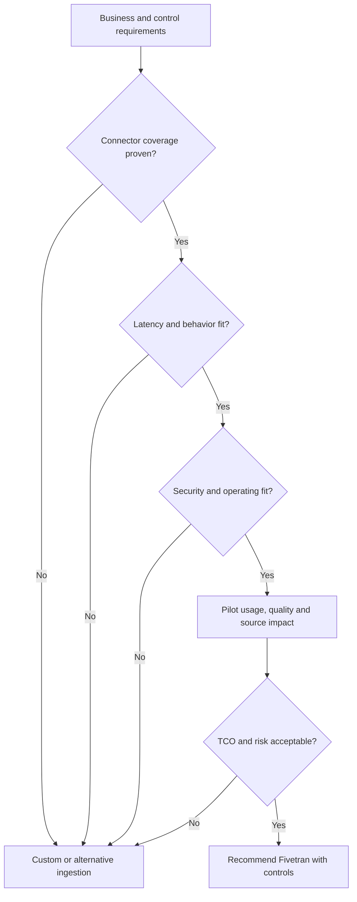

# When to Recommend Fivetran

> [!abstract] Mental model
> Recommend Fivetran when the value of standardized, managed ingestion exceeds the value of bespoke control—and only after connector fit is proven.

## Executive Summary

- **What it is:** A decision framework for judging whether Fivetran is a good technical, operational, governance, and commercial fit.
- **Why it matters:** “There is a connector” is not a recommendation; coverage, freshness, security, ownership, and total cost determine success.
- **Mental model:** Score six gates: **source coverage, data behavior, latency, security, operating model, economics**.
- **Recommend when:** Requirements are conventional, connector coverage is verified, a managed service is acceptable, and reduced pipeline maintenance has clear value.
- **Reconsider when:** Critical requirements depend on unsupported data, bespoke in-flight logic, hard real-time delivery, unusual recovery semantics, or vendor boundaries the client cannot accept.

## What It Can Do

- Shorten delivery time for supported sources and common destinations.
- Transfer API and schema-maintenance work from the client to a managed connector service.
- Standardize monitoring, scheduling, incremental sync, and operational metadata across many sources.
- Scale an ingestion portfolio without building a separate framework for every source.
- Provide usage visibility that can be piloted against representative source-change patterns.

## What It Cannot Do

- Remove the need for a connector-by-connector fit assessment.
- Promise source behavior that the provider API or database configuration does not expose.
- Guarantee lower total cost than custom engineering at every scale and workload profile.
- Resolve client constraints around data residency, network access, vendor approval, or source-system change control.

## Core Concepts

| Concept | Plain-language meaning | Why it matters |
|---|---|---|
| Coverage fit | Required objects, fields, history, deletes, and filters are supported | Missing a critical field can invalidate the entire option |
| Behavioral fit | Sync semantics match correctness and recovery needs | “Data arrives” is insufficient if keys, history, or deletes behave incorrectly |
| Freshness fit | Achievable end-to-end latency meets the business SLA | Configured frequency is not the same as delivered freshness |
| Control fit | Deployment, networking, access, and audit model are acceptable | Managed convenience must pass security and regulatory review |
| Operating fit | Named teams can own both platform and source-specific responsibilities | Fivetran manages software, not the client's service ownership |
| Economic fit | MAR plus destination and operating cost compare favorably with alternatives | Total cost depends on data change patterns and duplicated pipelines |

## How It Works (Simple Flow)

1. Define the business outcome, critical datasets, freshness target, recovery objective, and control requirements.
2. Verify the exact connector's supported objects, history, keys, deletes, schema behavior, release phase, and plan requirements.
3. Assess source prerequisites, quotas or logs, production impact, network path, and credential ownership.
4. Design the destination, raw-schema contract, downstream transformation, reconciliation, and monitoring responsibilities.
5. Pilot representative data and change patterns; measure completeness, latency, source load, destination load, and MAR.
6. Compare total cost, delivery time, operating burden, vendor risk, and exit options against custom or alternative services.
7. Recommend with explicit assumptions, gaps, mitigations, and review points.

## Visuals



## Readable Snippets

Use a one-page assessment before making a recommendation:

```text
Required objects/fields/history/deletes: __________
Maximum acceptable end-to-end latency: __________
Source prerequisites and retention: ______________
Security/deployment/network constraints: __________
Production owners and escalation path: ___________
Expected changed rows per month (pilot): __________
Destination compute/storage/network impact: _______
Known gaps and mitigations: _______________________
```

## Consultant Talking Points

- **Client question this answers:** "Should we buy Fivetran or build and operate ingestion ourselves?"
- **Trade-offs to mention:** Fivetran favors speed, standardization, and reduced maintenance; custom pipelines favor tailored logic, portability, and low-level control.
- **Risk or governance angle:** Validate deployment model, data path, credentials, sensitive-field scope, audit evidence, vendor support, and exit/rebuild strategy.
- **Cost or operational angle:** Pilot MAR using real change patterns and add warehouse, storage, network, support, and migration costs to the comparison.

## Common Pitfalls

- Choosing from a connector logo without testing required objects and edge cases can produce a late project blocker.
- Using total source row count as the only cost estimate can misrepresent MAR, which is driven by distinct changed keys and connector behavior.
- Treating a short trial as representative despite month-end, backfill, seasonal, or high-update workloads can understate cost and latency.
- Ignoring source-owner effort for permissions, API changes, log retention, and incident response creates an incomplete operating model.
- Forcing Fivetran into transactional or real-time integration can create unreliable business processes around an analytical replication tool.

## When to Recommend What (Decision Table)

| Situation | Recommend | Why | Watch-outs |
|---|---|---|---|
| Many standard SaaS sources, small platform team | Fivetran native connections | Strong reuse of managed connector operations | Check endpoint coverage and API limitations individually |
| High-volume supported database with low-latency needs | Evaluate CDC and HVA options | Managed log-based replication may fit enterprise volume | Agent, logs, source resources, plan, and network ownership |
| Unsupported stable private API | Connector SDK or custom ingestion | Tailors extraction to the source | Customer owns code quality, compatibility, and support |
| Hard real-time stream with ordering and transactional guarantees | Streaming platform | Better delivery semantics | Greater engineering and operating burden |
| One stable source and strong internal ingestion platform | Compare build versus buy with actual TCO | Existing capability may reduce incremental benefit | Include maintenance, on-call, API drift, and opportunity cost |
| Regulated workload requiring local processing | Evaluate Hybrid Deployment and connector support | Can retain managed control plane with local data processing | Feature, plan, agent, destination, and compliance validation |

## Related Topics

- [[03 Fivetran/01 Foundations and Platform Mental Model/Foundations and Platform Mental Model Overview|Foundations and Platform Mental Model Overview]]
- [[03 Fivetran/02 Connectors and Sync Behavior/06 Connector Types Coverage and Maturity|Connector Types, Coverage, and Maturity]]
- [[03 Fivetran/05 Security Governance and Production Operations/23 SaaS Hybrid and Private Connectivity Patterns|SaaS, Hybrid, and Private Connectivity Patterns]]
- [[03 Fivetran/06 Cost and Consultant Decision-Making/32 Fivetran Recommendation and Enterprise Adoption Framework|Fivetran Recommendation and Enterprise Adoption Framework]]

## Related Decision Notes

- [[80 Comparisons and Decision Notes/Comparisons/Fivetran/Comparison - Fivetran vs Custom Ingestion|Fivetran vs Custom Ingestion]]
- [[80 Comparisons and Decision Notes/Decision Notes/Fivetran/Decisions - Evaluating Fivetran Connector Fit|Evaluating Fivetran Connector Fit]]

## Questions

- **Explain:** Which six gates should a Fivetran recommendation pass?
- **Apply:** How would you pilot a Salesforce-to-Snowflake connection before committing commercially?
- **Challenge:** Which apparently small connector gap could invalidate a managed-ingestion recommendation?

## Sources To Revisit

- [Fivetran Docs: Core Concepts](https://fivetran.com/docs/core-concepts)
- [Fivetran Docs: Connectors](https://fivetran.com/docs/connectors)
- [Fivetran Docs: Deployment Models](https://fivetran.com/docs/core-concepts/deployment-models)
- [Fivetran Docs: Usage-Based Pricing](https://fivetran.com/docs/getting-started/pricing)
