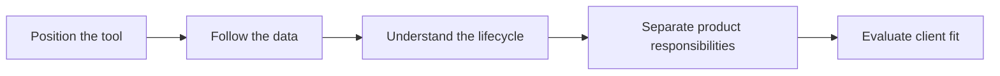

# Foundations and Platform Mental Model Overview

> Position Fivetran correctly, follow data through the platform, and recognize when managed ELT is the right client choice.

> [!abstract] Chapter outcome
> You should be able to explain what Fivetran owns, how a connection operates from setup to retirement, and when its managed approach is a good or poor fit.

## Topics

- [[03 Fivetran/01 Foundations and Platform Mental Model/01 What Fivetran Is and Is Not|01 - What Fivetran Is and Is Not]]
- [[03 Fivetran/01 Foundations and Platform Mental Model/02 Platform Anatomy and End-to-End Data Flow|02 - Platform Anatomy and End-to-End Data Flow]]
- [[03 Fivetran/01 Foundations and Platform Mental Model/03 The Connection Lifecycle|03 - The Connection Lifecycle]]
- [[03 Fivetran/01 Foundations and Platform Mental Model/04 Connections Transformations and Activations|04 - Connections, Transformations, and Activations]]
- [[03 Fivetran/01 Foundations and Platform Mental Model/05 When to Recommend Fivetran|05 - When to Recommend Fivetran]]

## Chapter Map

## How To Use This Area

Follow the topics in order for a first pass. Return to Topics 01 and 05 when framing a client recommendation.

## Related Areas

- [[03 Fivetran/Fivetran Learning Map|Fivetran Learning Map]]
- [[03 Fivetran/02 Connectors and Sync Behavior/Connectors and Sync Behavior Overview|Next: Connectors and Sync Behavior]]
- [[80 Comparisons and Decision Notes/Modern Data Stack Overview|Modern Data Stack Overview]]
